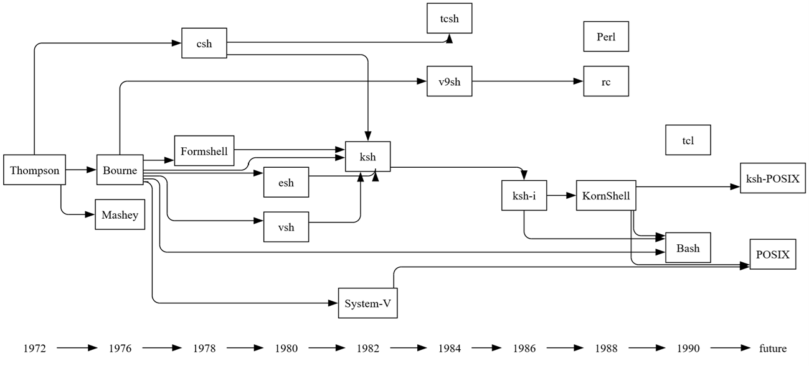
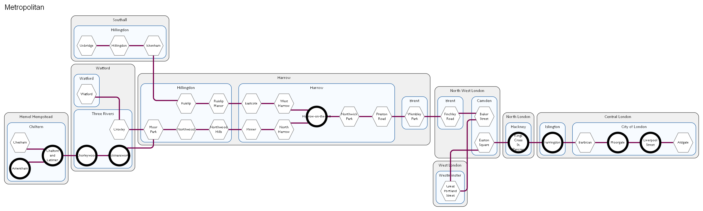
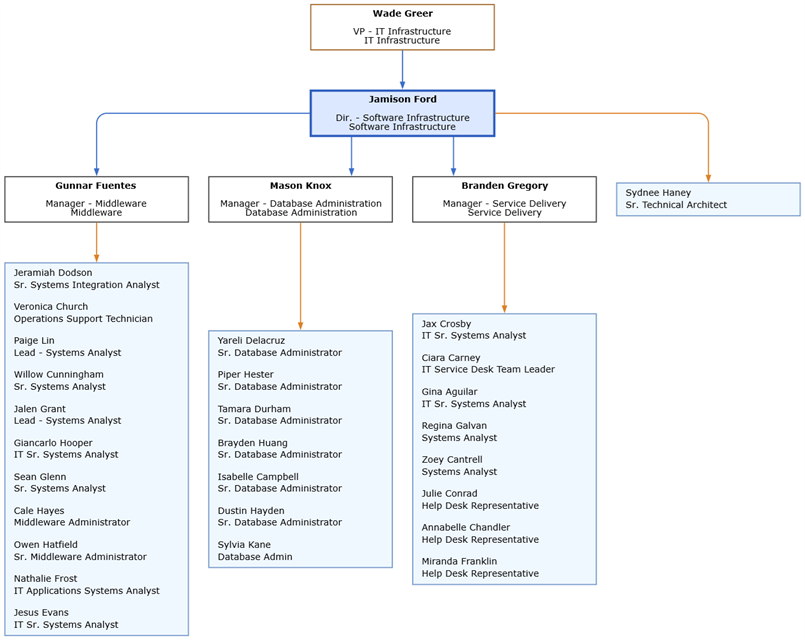
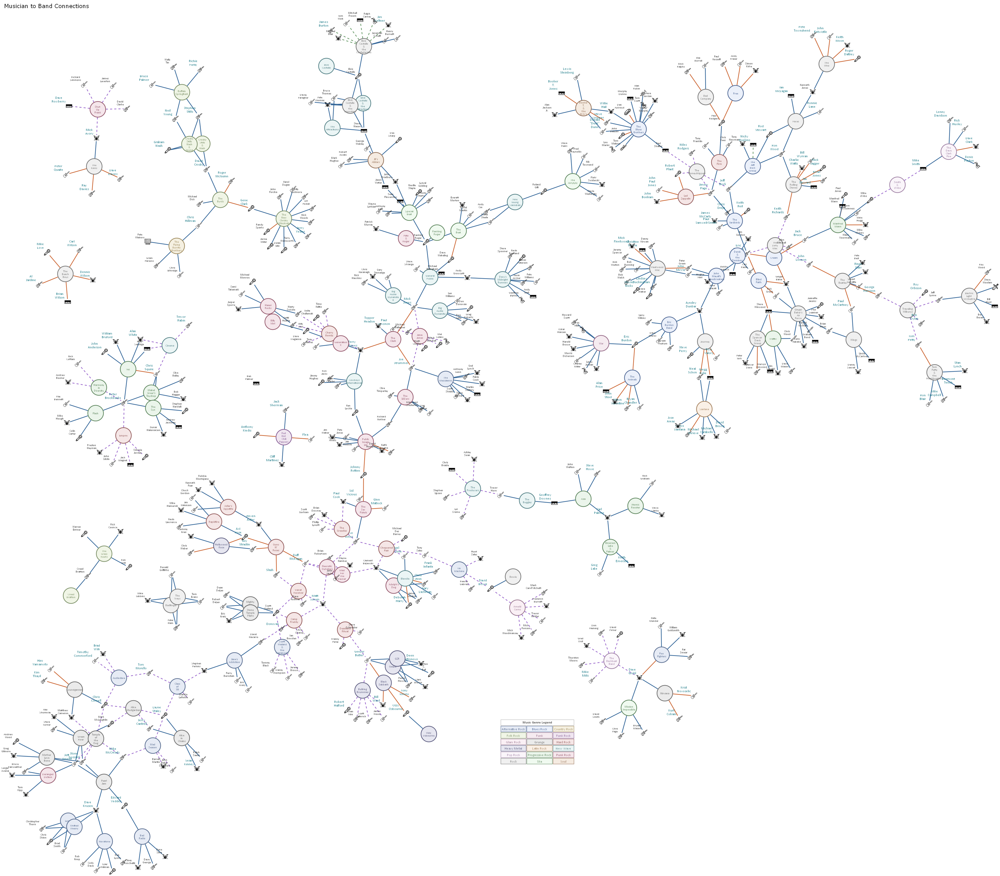
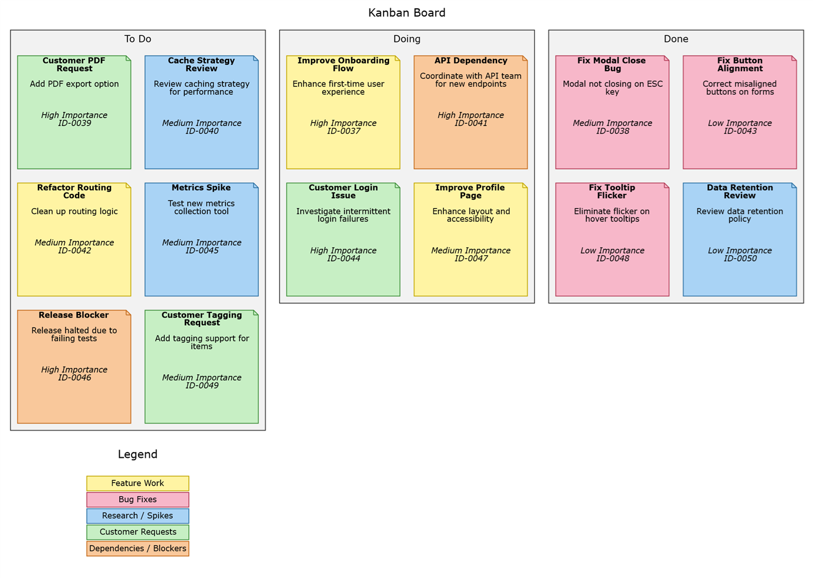
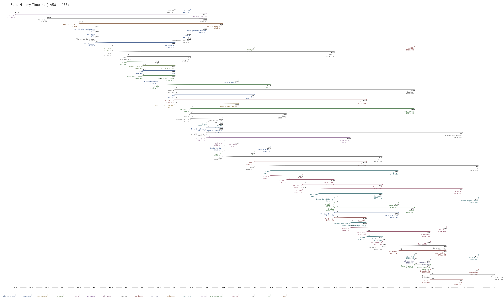
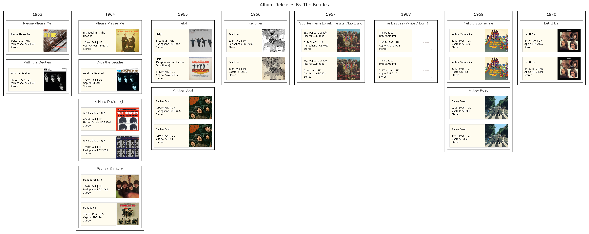

# Excel to Graphviz

**Transform Excel tabular data into professional Graphviz diagrams — directly in a spreadsheet.**

The **Relationship Visualizer** is a powerful, free Excel tool that turns row-based data (org structures, dependencies, networks, processes) into stunning Graphviz visualizations using custom styles, and every major layout engine.

Supports Windows and macOS, with a multilingual tabbed ribbon interface.

[-brightgreen)](https://github.com/jjlong150/ExcelToGraphviz/releases/latest)
[](https://sourceforge.net/projects/relationship-visualizer/files/latest/download)
[](./LICENSE)
[](https://www.buymeacoffee.com/exceltographviz)
[](https://deepwiki.com/jjlong150/ExcelToGraphviz)

## Quick Links

- 🌐 **Website & Full Documentation**: [exceltographviz.com](https://exceltographviz.com/) — tutorials, overviews, and guides
- 📥 **Latest Release (v10.3.0 — 4 Apr 2026)**: [GitHub Releases](https://github.com/jjlong150/ExcelToGraphviz/releases/latest) — release notes & assets
- ⬇️ **Download Relationship Visualizer**: [SourceForge ZIP (~81 MB)](https://sourceforge.net/projects/relationship-visualizer/files/latest/download) — free & virus-scanned
- 📜 **Changelog**: [exceltographviz.com/changelog](https://exceltographviz.com/changelog) — version history
- 🔧 **Examples Repository**: [github.com/jjlong150/excel-to-graphviz-examples](https://github.com/jjlong150/excel-to-graphviz-examples) — ready-to-use workbooks & patterns
- 🧩 **Project Architecture**: [deepwiki.com/jjlong150/ExcelToGraphviz](https://deepwiki.com/jjlong150/ExcelToGraphviz) — insights into the tool's internal mechanisms
- ☕ **Support the Project**: [Buy Me a Coffee](https://www.buymeacoffee.com/exceltographviz) — optional thanks for ongoing development!

## Quick Start

Get diagramming in minutes — no coding required!

1. **Download & Open** — Extract **Relationship Visualizer.zip** and open the main spreadsheet (enable macros if prompted).
  
   *Windows tip: If Excel opens in Protected View or macros don't load, right-click the extracted .xlsm file → Properties → General tab → check "Unblock" if present. This is a standard Windows security step for internet-downloaded files. Full details in the [Windows Install Guide](./docs/install-win/README.md).*

2. **Enter Data Manually** (easiest way, works on Windows & macOS):
   - Go to the **data** worksheet.
   - Fill in columns like **Item** (node name), **Related Item** (for edges), **Label**, **Style**, etc. — think of it as listing nodes and connections.
   - Check the **Automatic** box in the ribbon (under Graphviz tab) if it's not already on.
   - As you type or edit cells, the graph renders/refreshes instantly to the right (or in a separate graph worksheet if selected)!

3. **Customize & Render**:
   - Adjust layout engine (dot, neato, etc.), styles, colors via the ribbon.
   - Press **Refresh Graph** (or let Automatic handle it) for updates.
   - View/save the output as SVG/PNG.

4. **Optional: Use SQL for Advanced Data** (Windows only):
   - On the **sql** worksheet, write queries to pull/transform data from other sheets/workbooks.
   - Run them to populate the **data** worksheet automatically.
   - macOS users: Skip this — manual entry works great and covers most needs!

For ready-to-use templates, check the [Examples Repository](https://github.com/jjlong150/excel-to-graphviz-examples) and the `samples` directory in the download zip file.

See platform guides: [Windows Install](./docs/install-win/README.md) | [macOS Install](./docs/install-mac/README.md)

## Example Previews

Here are real diagrams generated directly from Excel data using the Relationship Visualizer:

  
*Time-oriented dependency timeline showing the evolution of Unix shells (dot engine)*

  
*Styled logical map of the London Underground Metropolitan Line (dot engine)*

  
*Hierarchical org chart built from an Excel table (dot engine)*

  
*Force-directed network of musicians and bands with custom styling and embedded images (neato engine)*


*Kanban board made from clustered nodes (osage engine)*


*Active years of various musical bands (dot engine)*


*The Beatles album releases by year, with images (osage engine)*

All previews rendered live from Excel tables using Graphviz — no external tools needed.

## Key Features

- Generate Graphviz DOT code and diagrams directly from Excel tabular data using an intuitive tabbed Ribbon interface
- Manually enter or edit nodes/edges in the data worksheet — graphs render automatically as you type (cross-platform)
- Create, combine, preview, and save reusable styles as stylesheets for consistent diagram formatting
- View generated DOT source, Graphviz console output, and rendered results as SVG or PNG
- Leverage SQL queries (iteration, concatenation, recursion) to import, transform, and dynamically refresh data — build query pipelines for complex scenarios (Windows only)
- Add animation code to exported SVG files for interactive diagrams
- Multilingual Ribbon interface: English, French, German, Italian, Polish
- Cross-platform support: Full SQL and Clipboard features on Windows; core diagramming and rendering on macOS

## Repository Structure

This GitHub repository contains the source code, documentation, and build artifacts for the **Relationship Visualizer** Excel tool. The ready-to-use workbook is distributed as a ZIP via [SourceForge](https://sourceforge.net/projects/relationship-visualizer/), while here you'll find the extracted VBA source, website content, legacy docs, and more for transparency, contributions, and development.

Here's the main directory overview:

```
.
├── .devin/                           # DeepWiki wiki.json
├── .github/                          # GitHub workflows and FUNDING.yml
├── dist/                             # Distribution-ready ZIP assets
│   ├── Relationship Visualizer/      # Distribution assets
│   │   ├── licenses/                 # Component license files
│   │   └── samples/                  # Sample workbooks
│   └── Relationship Visualizer.zip   # Distribution file published on SourceForge
├── docs/                             # https://exceltographviz.com content files
│   ├── .vitepress/                   # VitePress configuration settings
│   ├── topic(s)/                     # Markdown content structured within subdirectories by topic.
│   ├── index.md                      # VitePress Home page
│   ├── package.json                  # Manifest for Node.js VitePress project
│   └── package-lock.json             # Detailed snapshot of NPM project dependencies
├── legacy_docs/                      # Legacy user documentation (.docx, .pdf)
├── src/                              # Source files for the workbook
│   ├── applescript/                  # applescript script for running on macOS
│   ├── excel/                        # Excel workbook matching extracted source
│   ├── vba/                          # VBA code extracted from 'Relationship Visualizer.xlsm'
│   │   ├── ClassModules/             # VBA class files (.cls)
│   │   ├── Forms/                    # VBA form files (.frm)
│   │   ├── MicrosoftExcelObjects/    # VBA worksheet class files (.cls)
│   │   └── Modules/                  # VBA macro files (.bas)
│   └── xlsm/                         # Supporting files contained in the workbook
│       ├── _rels/                    # Manages ribbon xml for different versions of Excel
│       └── customUI/                 # VBA worksheet class files (.cls)
│           ├── images/               # Images used in the custom ribbon
│           ├── customUI.xml          # Ribbon definition for Excel versions prior to 2010.
│           └── customUI14.xml        # Ribbon definition for Excel versions 2010 and later.
├── .gitattributes                    # Git name and line ending rules
├── .gitignore                        # Git ignore rules
├── .npmignore                        # NPM ignore rules
├── LICENSE                           # Project license (MIT)
├── README.md                         # GitHub Repository home page (this file)
└── SECURITY.md                       # Security Considerations

```

## Installation

The *Relationship Visualizer* spreadsheet operates on both **Microsoft Windows** and **Apple macOS**<sup>1</sup>. 

Installation procedures vary by platform, and you can find detailed, platform-specific instructions by following the links below.

| <center><a href="./docs/install-win/README.md"></a></center> | <center><a href="./docs/install-mac/README.md"></a></center> |
| ------------------- | ------------------------------- |
| <center>[Microsoft Windows Installation Instructions](./docs/install-win/README.md)</center> | <center>[Apple macOS Installation Instructions](./docs/install-mac/README.md)</center> |

<small>[1] SQL and Clipboard features are not available on Apple macOS.</small>

## Documentation

**Recommended: Full online documentation**

Visit **[exceltographviz.com](https://exceltographviz.com/)** for comprehensive, up-to-date guides:  
- Installation (Windows & macOS)  
- Creating & styling graphs  
- Using SQL queries  
- Publishing & animating SVGs  
- Advanced Graphviz techniques  

**In this repository**  
- Website source (Markdown files built with VitePress): [`docs/`](./docs/) — powers exceltographviz.com  
- Legacy documentation archive (older .docx & .pdf manuals): [`legacy_docs/`](./legacy_docs/) — historical reference, platform-specific
  
## License

[MIT License](./LICENSE) — free to use, modify, distribute.

## Support

If this saves you time, consider [Buy Me a Coffee](https://www.buymeacoffee.com/exceltographviz) — helps cover hosting and dev costs.

Get started today: 

[](https://sourceforge.net/projects/relationship-visualizer/files/latest/download)


