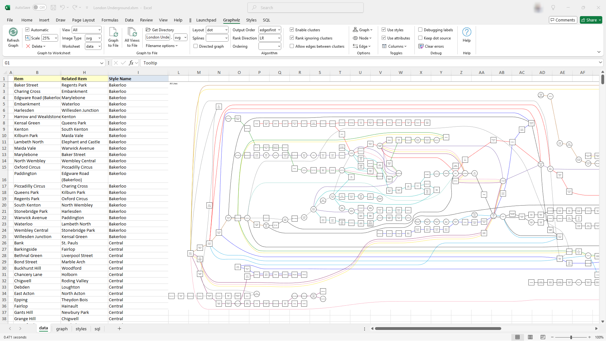

# Excel to Graphviz

The *Relationship Visualizer* is a Microsoft Excel spreadsheet that uses [Graphviz](https://graphviz.org) to generate graph diagrams from Excel data. 



The *Relationship Visualizer* includes tools for creating style elements and saving them to a style sheet, executing SQL queries, displaying the Graphviz DOT Language source, and adding animation code to SVG graphs. It runs on Windows and MacOS operating systems, and supports English, French, German, Italian, and Polish languages using a tabbed, ribbon interface.

## Documentation

### Current Documentation

Extensive on-line documentation for the *Relationship Visualizer* is available at the dedicated website [https://exceltographviz.com](https://exceltographviz.com). 

The [`docs`](https://github.com/jjlong150/ExcelToGraphviz/tree/main/docs) folder in this repository contains the source content of the website. The content is authored in [Markdown](https://www.markdownguide.org/basic-syntax/) format, and published using the [VuePress](https://vuepress.vuejs.org/) static site generator via a [GitHub Action](https://docs.github.com/en/actions).

### Legacy Documentation Archive

The files in the [`legacy_docs`](https://github.com/jjlong150/ExcelToGraphviz/tree/main/legacy_docs) directory are a historical archive of user documentation for the *Relationship Visualizer*. 

These documents, available in Microsoft Word (`.docx`) and PDF (`.pdf`) formats, represent older versions of the project's manuals and guides.

## Download

The *Relationship Visualizer* is distributed as a zip file, hosted on [SourceForge](https://sourceforge.net/projects/relationship-visualizer/). SourceForge is utilized for its reliable virus scanning and the availability of checksums, ensuring the downloaded files are secure and free from tampering.

The `RelationshipVisualizer.zip` file contains the main spreadsheet, license information, and several sample workbooks to help you get started. To download it, simply click the large green `Download Now` button below. 

<center>

[](https://sourceforge.net/projects/relationship-visualizer/files/latest/download)

</center>

## Installation Instructions

The *Relationship Visualizer* operates on both **Microsoft Windows** and **Apple macOS**<sup>1</sup>. 

Installation procedures vary by platform, and you can find detailed, platform-specific instructions by following the links below.

| <center><a href="./docs/install-win/README.md"></a></center> | <center><a href="./docs/install-mac/README.md"></a></center> |
| ------------------- | ------------------------------- |
| <center>[Microsoft Windows Installation Instructions](./docs/install-win/README.md)</center> | <center>[Apple macOS Installation Instructions](./docs/install-mac/README.md)</center> |

<small>[1] SQL and Clipboard features are not available on Apple macOS.</small>

## Repository Structure

This repository contains a Microsoft Excel workbook, its source files, documentation, and distribution package. The workbook is packaged as a ZIP file for distribution on [SourceForge](https://sourceforge.net/projects/relationship-visualizer/), with source files extracted for version control and legacy documentation preserved in its original formats.

Here’s an overview of the directory structure:

```
excel-workbook-repo/
├── dist/                             # Distribution-ready ZIP file
│   ├── Relationship Visualizer/      # Distribution assets
│   │   └── samples/                  # Sample workbooks
│   └── Relationship Visualizer.zip   # Distribution file published on SourceForge
├── docs/                             # https://exceltographviz.com content files
│   ├── .vuepress/                    # VuePress configuration settings
│   ├── topic(s)/                     # Markdown content structured within subdirectories by topic.
│   └── README.md                     # Home page
├── legacy_docs/                      # Legacy user documentation (.docx, .pdf)
├── src/                              # Source files for the workbook
│   ├── applescript/                  # applescript script for running on macOS
│   ├── excel/                        # Excel workbook matching extracted source
│   ├── vba/                          # VBA code extracted from 'Relationship Visualizer.xlsm'
│   │   ├── Class Modules/            # VBA class files (.cls)
│   │   ├── Forms/                    # VBA form files (.frm)
│   │   ├── Microsoft Excel Objects/  # VBA worksheet class files (.cls)
│   │   └── Modules/                  # VBA macro files (.bas)
│   └── xlsm/                         # Supporting files contained in the workbook
│       ├── _rels/                    # Manages ribbon xml for different versions of Excel
│       ├── customUI/                 # VBA worksheet class files (.cls)
│       │   ├── _rels_/               # Manages logical names for ribbon images
│       │   ├── images/               # Images used in the custom ribbon
│       │   ├── customUI.xml          # Ribbon definition compatible with Excel versions prior to 2010.
│       │   └── customUI14.xml        # Ribbon definition compatible with Excel versions 2010 and later.
│       └── docProps/                 # Excel workbook document properties
├── .gitignore                        # Git ignore rules
├── .npmignore                        # NPM ignore rules
├── LICENSE                           # Project license (MIT)
├── README.md                         # This file
├── package-lock.json                 # Detailed snapshot of NPM project dependencies
└── package.json                      # Manifest for Node.js VuePress project
```

## Source Code

The *Relationship Visualizer* is a [Visual Basics for Applications (VBA)](https://en.wikipedia.org/wiki/Visual_Basic_for_Applications) macro-enabled workbook, with its VBA code embedded directly within the Excel file. This code can be accessed and managed through the Visual Basic Editor, available under the `Developer` tab. To facilitate easier review and version control, the embedded VBA content has been exported, organized, and placed in the [`src`](./src/) directory of this repository, allowing for efficient tracking of changes and collaboration.

All development is conducted within the Visual Basic Editor, as a round-trip DevOps workflow between GitHub and the Excel workbook is not feasible. The exported code is shared as a courtesy for those interested in exploring and understanding the mechanics of the spreadsheet.


## License

Excel to Graphviz is Free and Open Source Software (FOSS) licensed under the [MIT License](/LICENSE).

## Copyright

Copyright (c) 2017-2025 Jeffrey J. Long. All rights reserved.

