# Constructing Simple Graphs

## Connect 3 Nodes

Next, lets expand upon the graph we just created to have additional relationships. Assume that:

-   'a' is related to 'b' (already drawn)
-   'b' is related to 'c'
-   'c' is related to 'a'

The Excel data appears as shown on rows 3-5. Press the ```Refresh Graph``` button, and the Excel worksheet now looks like:

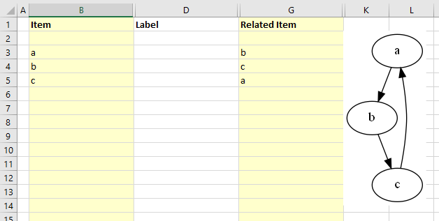


*Graphviz Source*

``` dot
    strict digraph "main" 
    {
        layout="dot";
        rankdir="TB";

        "a" -\> "b";
        "b" -\> "c";
        "c" -\> "a"; 
    } 
```

## Add Edge Labels

Now, let us add data into the ```Label``` column to label the relationships. Fill in Column D as shown below. Press the ```Refresh Graph``` button, and the Excel worksheet now looks like:

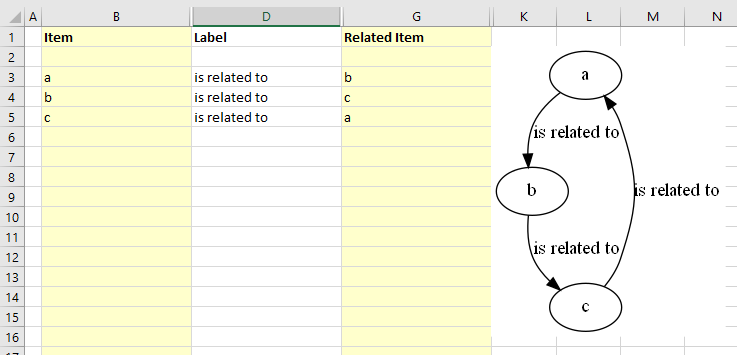

*Graphviz Source*

```dot
    strict digraph "main" 
    { 
        layout="dot"; 
        rankdir="TB";

        "a" -\> "b"[ label="is related to" ]; 
        "b" -\> "c"[ label="is related to" ]; 
        "c" -\> "a"[ label="is related to" ]; 
    }
```

## Add Node Labels

The graph is how we want to see it, but the nodes need to be labeled. We do not want to change all our edges; however, we would like to replace 'a' with 'Alpha', 'b' with 'Bravo', and 'c' with 'Charlie'. The Relationship Visualizer assumes that when there is information in the ```Item``` column, but not in the ```Related Item``` column that the data corresponds to a node.

To label the nodes we will add 3 node definitions to the "data worksheet (rows 6, 7, 8) and press the ```Refresh Graph``` button. The Excel worksheet now looks like:

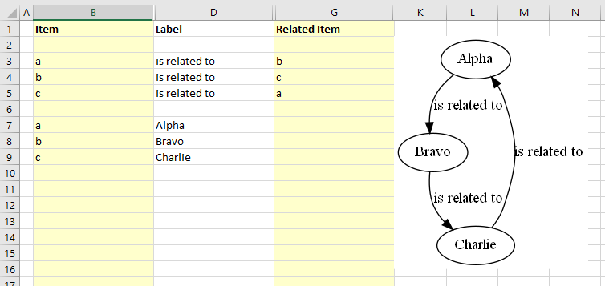

*Graphviz Source*

```dot
    strict digraph "main" 
    { 
        layout="dot"; 
        rankdir="TB";

        "a" -\> "b"[ label="is related to" ]; 
        "b" -\> "c"[ label="is related to" ]; 
        "c" -\> "a"[ label="is related to" ]; 
        "a"[ label="Alpha" ]; 
        "b"[ label="Bravo" ]; 
        "c"[ label="Charlie" ]; 
    }
```

## Specify Ports

Graphviz decides what it thinks is the best placement of the head and tail of an edge to produce a balanced graph.

Sometimes you might want to control where the edges begin or end. You can do that by specifying a port on the ```Item``` or ```Related Item``` ID, in the same manner as a URL. Ports are identified by a colon character ```:``` and then a compass point ```n```, ```s```, ```e```, ```w```, ```ne```, ```nw```, ```se```, ```sw``` or ```c``` for center.

If we change row 5 from the example above to have the edge from "c" to "a" exit from the south port of "c", the ```Item``` is now specified as ```c:s```, and the Excel data is changed slightly as shown in row 5. Press the ```Refresh Graph``` button, and the Excel worksheet now looks like:

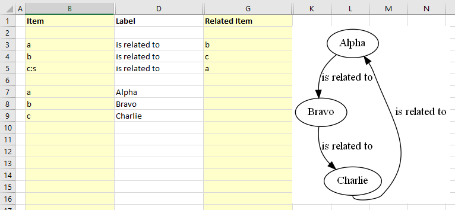


*Graphviz Source*

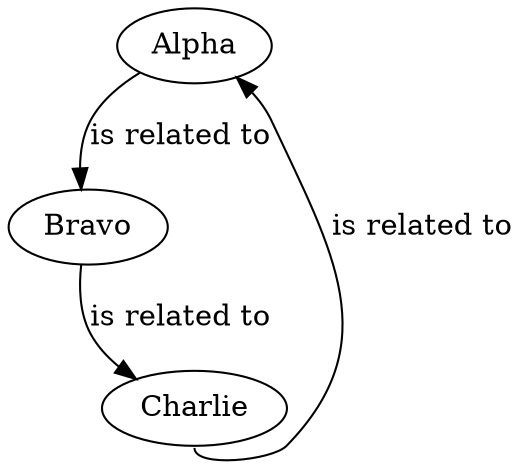

## Specify Clusters

If you wish to cluster some elements of the graph you can do so by adding a row with an open brace "{" in the ```Item``` column above the first row of data to be placed in the group and provide a title for the cluster in the ```Label``` column. Next, add row with a close brace "}" in the ```Item``` column after the last row of data.

For example, this Excel worksheet does not have clusters.

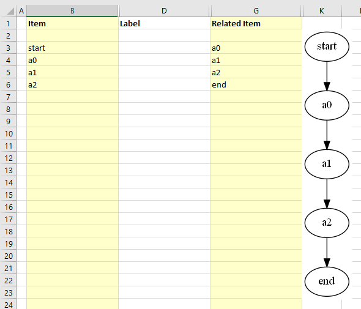

*Graphviz Source*

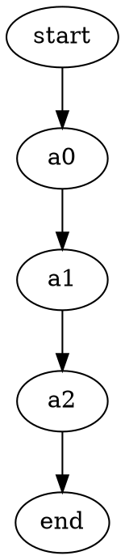

To cluster nodes a0, a1, and a2, calling the cluster "process \#1" the worksheet is revised to add an open brace {with the label "process \#1" on row 3, and a close brace } on rows 6 as follows.

Press the ```Refresh Graph``` button, and the Excel worksheet now looks like:

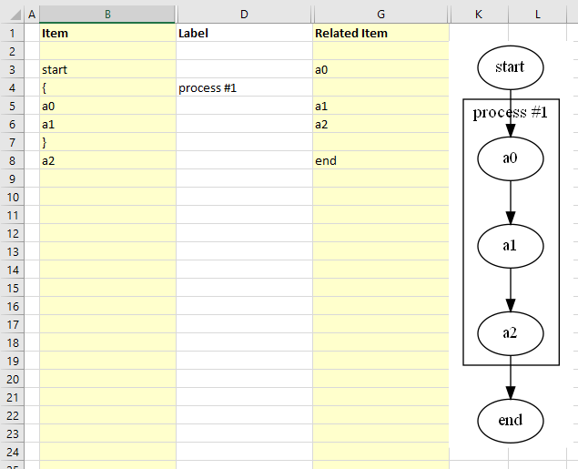

*Graphviz Source*

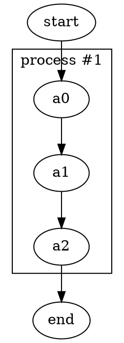
## Specify Clusters Within Clusters

Graphviz permits clusters within clusters. Let us extend the example by adding an additional set of braces to cluster the relationship between a1 and a2. We will insert a new row 5 placing an open brace { in the ```Item``` column with the Label column set to "process \#2", and a new row 7 with a close brace } in the ```Item``` column.

Press the ```Refresh Graph``` button, and the Excel worksheet now looks like:

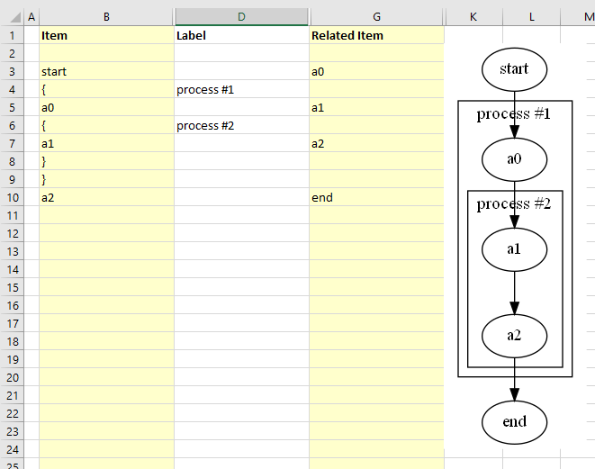

*Graphviz Source*

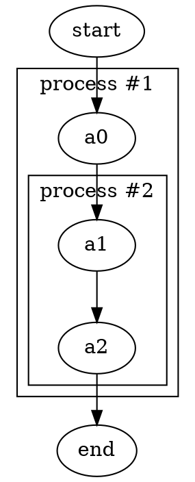

Graphviz does not limit the number of clusters you can have. In this example, we have added rows 10-14 to insert an additional cluster labeled "process \#3".

Press the ```Refresh Graph``` button, and the Excel worksheet now looks like:

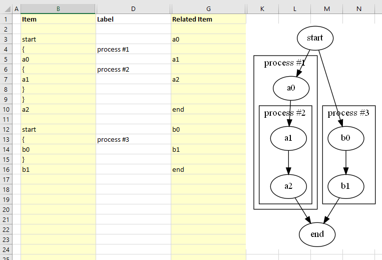

*Graphviz Source*

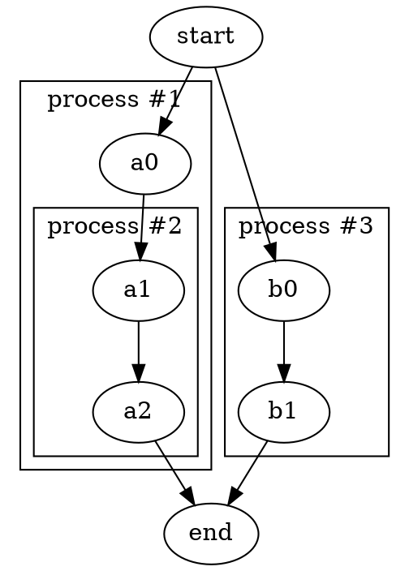

What is important to note is that you must ensure that you have an equal number of open braces as you do close braces. **If you have a mismatch between the number of open and close braces, then Graphviz will not draw the graph.**

## Specify Comma-separated Items

Another feature of the Relationship Visualizer is the ability to specify a comma-separated list of Item names and have a relationship created for each Item. For example, we can say that Mr. Brady is the father of Greg, Peter, and Bobby on one row as follows:

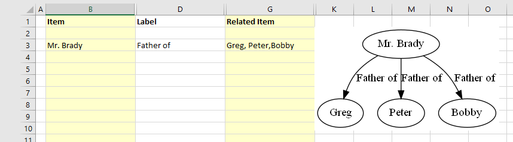

*Graphviz Source*

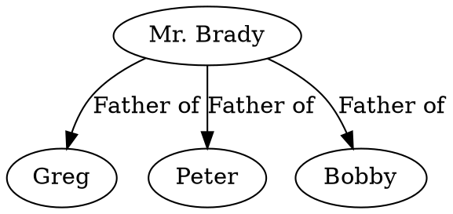

The comma-separated list can also appear in the ```Item``` column, such as:

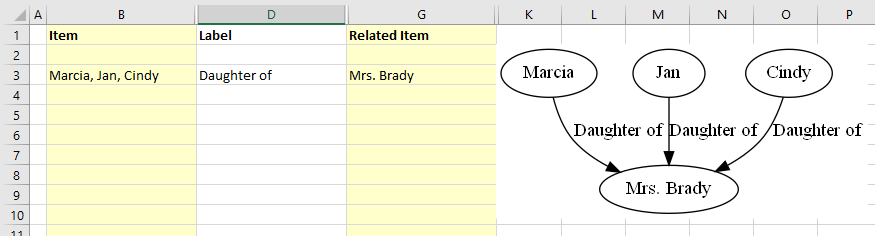

*Graphviz Source*

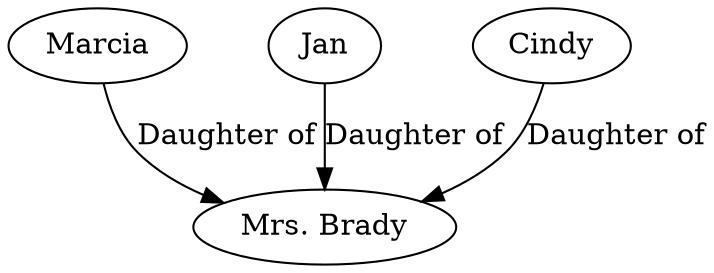


Or a comma-separated list can be used in both the ```Item```, and the ```Related Item``` column such as the parental relationship below:

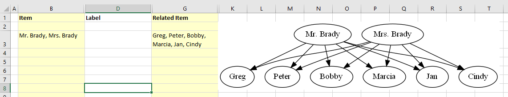

*Graphviz Source*

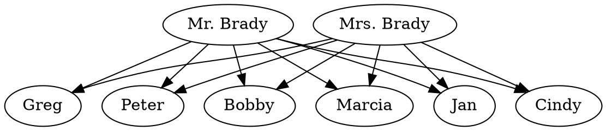
