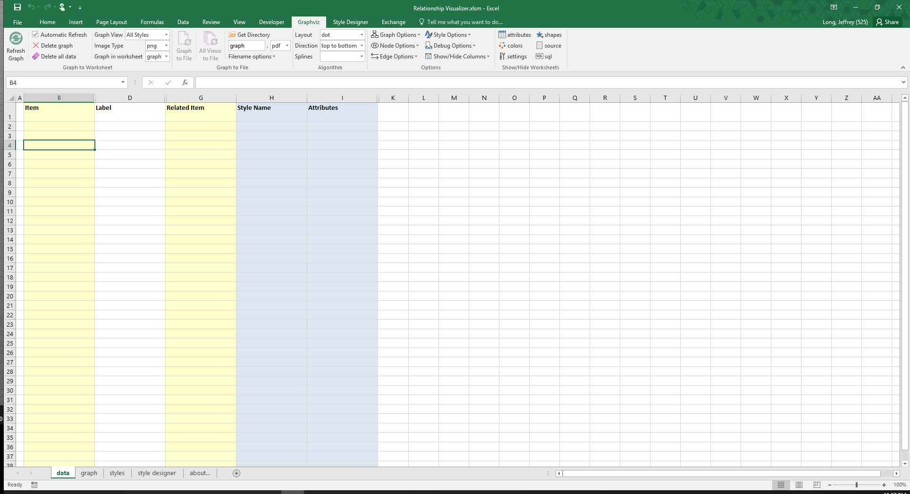
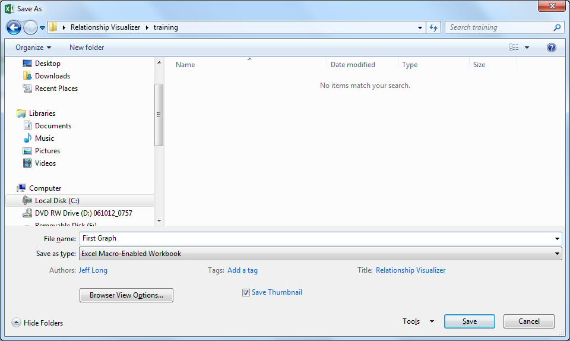

# Creating Graphs

If you have made it this far in this manual, Congratulations. We are past all the software installation steps, graph theory discussions, and definitions. It is time to have some fun and create some simple diagrams.

## Prepare a New Excel Workbook

### Create a New Workbook from the Relationship Visualizer Template

The first action is to launch Excel. When Excel starts, it will suggest sample spreadsheets you can create. This will contain the Relationship Visualizer template which you saved as a template as part of the installation steps. Select this template to create a new workbook. (Note: If you do not see it in the FEATURED list, click on PERSONAL to see your individual list.)


### Save the Workbook as a Macro-Enabled Workbook

The workbook will appear as shown below.



Perform a "**FILE -\> Save As**" action. Choose a directory where you would like to save the file and change the file name from `Relationship Visualizer1 `to something meaningful to you.

The most important step is to set the `Save as type:` dropdown list item as **Excel Macro-Enabled Workbook**. You will not be able to run the macros that create the visualizations unless the workbook is _macro-enabled_.



You may or may not receive a security warning that the workbook contains macros. If you get such a warning, click the "**Enable Content**" button to acknowledge the risk and enable the macros.


The Relationship Visualizer provides macros through seven Excel Fluent UI ribbon tabs named `Graphviz`, `Style Designer`, `SQL`, `Source`, `SVG`, and `Exchange`. The appropriate ribbon tab will appear and/or activate as you change worksheets.


### Close and Reopen the New Workbook

::: warning

There is a known bug in Microsoft Excel pertaining to custom ribbons. The bug occurs whenever a `File` -> `Save As` action changes the Excel workbook file name.

:::

The bug is caused by the ribbon holding a reference to the original file name which breaks the ability to programmatically switch the tab focus. You can manually switch tabs as you move between worksheets, or you can close the file, and reopen it to have the ribbon tabs automatically change according to worksheet selections.

Assuming that you changed the file name from `Relationship Visualizer1 `to something meaningful to you, you should now close the file and reopen it.

::: tip

Any time you save a copy of the spreadsheet using `File` -> `Save As` and change the Excel workbook file name, you should close the workbook and reopen it.

:::

## Graph Construction Basic Concepts

### `'data'` Worksheet Columns

For our first example, we will make the simplest graph possible with the tool. This graph will be a directed graph from a node named 'a' to a node named 'b'. To do so we must enter the edge information into the `data` Worksheet. The `data` Worksheet has 10 columns:

1. **Column A** - The **`Indicator`** column. This column allows you to specify a flag to treat the row as a comment. To do so enter a `#` hash tag character in the column. The row will turn green, and no data in this row will be included in the graph. If errors are detected in your data a `!` exclamation mark character will appear in the column, the row will turn red, and an error message will be displayed in the `Messages` column.

2. **Column B** - The **`Item`** column. This column serves two purposes. For nodes, it is a unique identifier of the node. For edges, it is the unique identifier of the "from" node in a ("from", "to") node pairing.

3. **Column C** - The **`Tail Label`** column. This column is only used when specifying a relationship. It is the text label to be placed near the tail of an edge.

4. **Column D** - The **`Label`** column. This column is optional. When specified for nodes, the value is placed inside the shape; for edges, the value is placed near the spline.

5. **Column E** - The **`External Label`** column. This column is also optional. When specified for nodes, the value is placed outside the shape, typically above and to the left of the shape; for edges, the value is placed away from the spline. If neither a `Label` or `External Label` is specified then the graph will default to showing the `Item` value as the inside label of nodes, and no data for edges.

6. **Column F** - The **`Head Label`** column. This column is only used when specifying a relationship. It is the text label to be placed near the head of an edge.

7. **Column G** - The **`Tooltip`** column. This column is only used when specifying a tooltip in for clusters, nodes, and edges in graphs saved as files in the `SVG` format.

8. **Column H** - The **`Related Item`** column. This column is only used when specifying a relationship. It is the unique identifier of the "to" node in a ("from", "to") node pairing.

9. **Column I** - The **`Style Name`** column. Optional information in this column indicates what kind of data is in the row and relates it back to a style definition in the `styles` worksheet which controls how the node or element should be graphed. For now, we will only use the styles of `edge` and `node` in our graphs. Later chapters will explain how you can create additional styles to introduce shapes, colors, and images into your graphs.

10. **Column J** - The **`Attributes`** column. Optional information in this column provides a means to add extra elements of style which will only apply to a single row. For example, you can place style attributes in this column which would allow you to illustrate the route from Michigan to California as described in the introduction to this manual.

11. **Column K** - The **`Messages`** column. When the graphing macros run they check for common mistakes in the data, such as specifying only one node for an edge. When mistakes are found, they are reported in this column. In addition, and exclamation mark `!` is placed in the `Indicator` column, and the row is highlighted in red to draw your attention to the error.

The columns for `Tail Label`, `External Label`, , `Head Label` `Tooltip`, and `Messages` (columns C, E, F, G, and K) are hidden by default, since they are less frequently used. Display of these columns can be quickly toggled to be visible by selecting the column name on the list of columns in the dropdown list beneath the `Show/Hide Columns` button.


### Creating Your First Graph

The simplest way to draw a graph is to place values in the `Item` and the `Related Item` columns. If the 'Automatic Refresh' checkbox is checked the graph will draw as data is entered into each cell. If unchecked, then press the `Refresh Graph` button.

For our first graph, we will draw an 'a' is related to 'b' relationship.

1. In row 3 type 'a' in the `Item` column, and 'b' in the `Related Item` column.
2. Click on the `Graphviz` ribbon tab to activate it (if it is not the current active tab)
3. Press the `Refresh Graph` button

   

4. See the result beside the data

The results should resemble the following example:


**Congratulations**, you have created your first graph!

The next section will discuss the concepts of creating graphs in Excel. You only need to use the `Refresh Graph` button of the `Graphviz` ribbon tab for these tutorials. We explain `Graphviz` ribbon tab details after the graphing concepts are mastered.

### Connect More Items

Next, lets expand upon the graph we just created to have additional relationships. Assume that:

- 'a' is related to 'b' (already drawn)
- 'b' is related to 'c'
- 'c' is related to 'a'

The Excel data appears as shown on rows 3-5. Press the `Refresh Graph` button, and the Excel worksheet now looks like:


_Graphviz Source_

```dot
    strict digraph "main"
    {
        layout="dot";
        rankdir="TB";

        "a" -\> "b";
        "b" -\> "c";
        "c" -\> "a";
    }
```

### Add Edge Labels

Now, let us add data into the `Label` column to label the relationships. Fill in Column D as shown below. Press the `Refresh Graph` button, and the Excel worksheet now looks like:


_Graphviz Source_

```dot
    strict digraph "main"
    {
        layout="dot";
        rankdir="TB";

        "a" -\> "b"[ label="is related to" ];
        "b" -\> "c"[ label="is related to" ];
        "c" -\> "a"[ label="is related to" ];
    }
```

### Add Node Labels

The graph is how we want to see it, but the nodes need to be labeled. We do not want to change all our edges; however, we would like to replace 'a' with 'Alpha', 'b' with 'Bravo', and 'c' with 'Charlie'. The Relationship Visualizer assumes that when there is information in the `Item` column, but not in the `Related Item` column that the data corresponds to a node.

To label the nodes we will add 3 node definitions to the "data worksheet (rows 6, 7, 8) and press the `Refresh Graph` button. The Excel worksheet now looks like:


_Graphviz Source_

```dot
    strict digraph "main"
    {
        layout="dot";
        rankdir="TB";

        "a" -\> "b"[ label="is related to" ];
        "b" -\> "c"[ label="is related to" ];
        "c" -\> "a"[ label="is related to" ];
        "a"[ label="Alpha" ];
        "b"[ label="Bravo" ];
        "c"[ label="Charlie" ];
    }
```

### Specify Ports

Graphviz decides what it thinks is the best placement of the head and tail of an edge to produce a balanced graph.

Sometimes you might want to control where the edges begin or end. You can do that by specifying a port on the `Item` or `Related Item` ID, in the same manner as a URL. Ports are identified by a colon character `:` and then a compass point `n`, `s`, `e`, `w`, `ne`, `nw`, `se`, `sw` or `c` for center.

If we change row 5 from the example above to have the edge from "c" to "a" exit from the south port of "c", the `Item` is now specified as `c:s`, and the Excel data is changed slightly as shown in row 5. Press the `Refresh Graph` button, and the Excel worksheet now looks like:


_Graphviz Source_


### Specify Clusters

If you wish to cluster some elements of the graph you can do so by adding a row with an open brace "{" in the `Item` column above the first row of data to be placed in the group and provide a title for the cluster in the `Label` column. Next, add row with a close brace "}" in the `Item` column after the last row of data.

For example, this Excel worksheet does not have clusters.


_Graphviz Source_


To cluster nodes a0, a1, and a2, calling the cluster "process \#1" the worksheet is revised to add an open brace {with the label "process \#1" on row 3, and a close brace } on rows 6 as follows.

Press the `Refresh Graph` button, and the Excel worksheet now looks like:


_Graphviz Source_


### Specify Clusters Within Clusters

Graphviz permits clusters within clusters. Let us extend the example by adding an additional set of braces to cluster the relationship between a1 and a2. We will insert a new row 5 placing an open brace { in the `Item` column with the Label column set to "process \#2", and a new row 7 with a close brace } in the `Item` column.

Press the `Refresh Graph` button, and the Excel worksheet now looks like:


_Graphviz Source_


Graphviz does not limit the number of clusters you can have. In this example, we have added rows 10-14 to insert an additional cluster labeled "process \#3".

Press the `Refresh Graph` button, and the Excel worksheet now looks like:


_Graphviz Source_


What is important to note is that you must ensure that you have an equal number of open braces as you do close braces. **If you have a mismatch between the number of open and close braces, then Graphviz will not draw the graph.**

### Specify Comma-separated Items

Another feature of the Relationship Visualizer is the ability to specify a comma-separated list of Item names and have a relationship created for each Item. For example, we can say that Mr. Brady is the father of Greg, Peter, and Bobby on one row as follows:


_Graphviz Source_


The comma-separated list can also appear in the `Item` column, such as:


_Graphviz Source_


Or a comma-separated list can be used in both the `Item`, and the `Related Item` column such as the parental relationship below:


_Graphviz Source_


