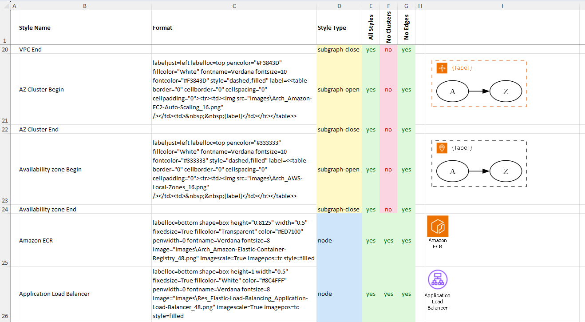
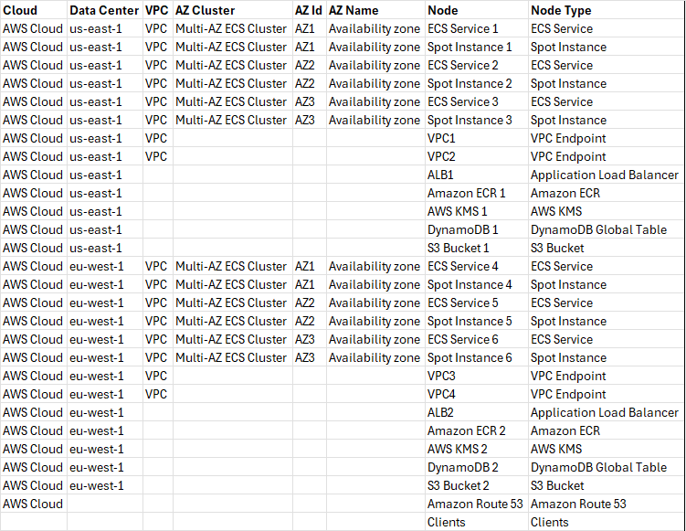
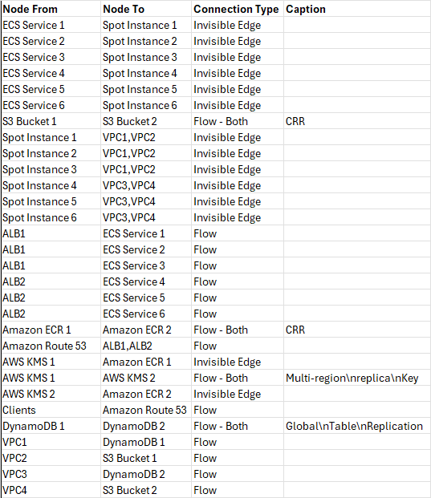
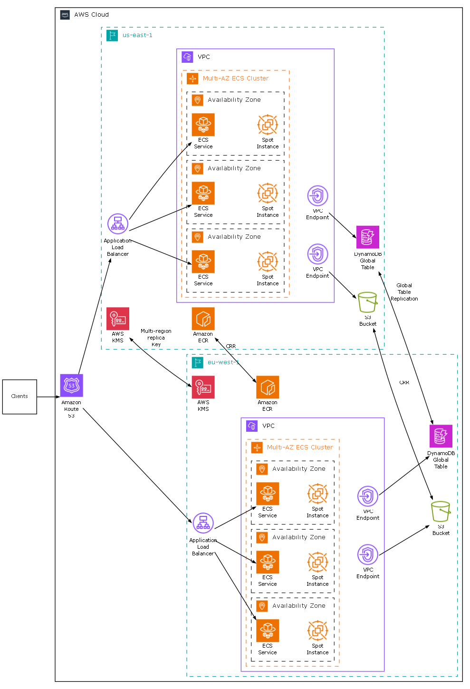

# Multi-Level Clustering

## Introduction

As of version 10.3.0, the **Relationship Visualizer** supports dynamic multi-level clustering. This allows you to create deeply nested Graphviz subgraphs directly from your SQL queries.

### Key Features

- **Unlimited nesting levels** — Easily create complex hierarchies such as:
  - Country > State > County > City > Neighborhood
  - Company > Division > Department > Team > Employee
  - Product Category > Subcategory > Brand > Model

- **Driven by column naming**  
  Use numbered `CLUSTER` columns in your SQL query:
  - `CLUSTER1`, `CLUSTER2`, `CLUSTER3`, … for cluster grouping values
  - `CLUSTER1 LABEL`, `CLUSTER2 LABEL`, … for display labels
  - `CLUSTER1 STYLE NAME`, `CLUSTER2 STYLE NAME`, … for style references
  - `CLUSTER1 ATTRIBUTES`, `CLUSTER2 ATTRIBUTES`, … for additional Graphviz attributes
  - `CLUSTER1 TOOLTIP`, `CLUSTER2 TOOLTIP`, … for tooltips

- **Supports cluster merging**  
  New directive provided which allows you to specify the number of cluster levels permitted. Useful for merging clusters without modifying the Cluster SQL statement.

  `SET CLUSTER LEVEL LIMIT = 10`

- **Smart orphan and partial hierarchy handling**  
  Nodes with missing intermediate or inner cluster levels are automatically placed at the correct nesting depth.

- **Powerful placeholder support**  
  Use the following placeholders in cluster labels, style names, attributes, tooltips, and node fields:

  | Placeholder | Description |
  |-------------|-------------|
  | `{clc}`     | Global absolute cluster number (sequential across all clusters) |
  | `{scc}`     | Relative cluster number within the current parent level |
  | `{rsc}`     | Record number from the SQL result set |
  | `{level}`   | Current nesting level (1 = outermost cluster) |
  | `{label}`   | Uses cluster label formatting in style format string instead of SQL |

- **Full backward compatibility**  
  Existing queries using the old `CLUSTER` and `SUBCLUSTER` columns continue to work unchanged. The new multi-level system is automatically used when `CLUSTER1` (or higher) is present in the result set.

## Example: AWS Infrastructure Diagram

This example demonstrates how to create a professional **AWS infrastructure diagram** using the multi-level clustering feature.

It is modeled after a real-world architecture published by AWS and represents a classic three-tier web application with the following hierarchy:

- AWS Cloud (outermost cluster)
- Region
- VPC
- Availability Zone Clusters
- Availability Zones
- AWS Services (the individual nodes)

**AWS icons** are used directly in the nodes for instant visual recognition of services such as VPC, ECS, Load Balancers, and more. The official **AWS Architecture Icons** are available as a [free download](https://aws.amazon.com/architecture/icons/) from the AWS Architecture Center.

### Style Definitions

Styles are created using the **Style Designer**. Cluster styles use HTML-like labels with `` tags to display AWS icons and `{label}` placeholders. Node styles use Graphviz `image` attributes.

An example of 2 cluster styles, and 2 node styles on the `styles` worksheet is as follows:



### Data

#### Node Data

We build a table of the components in an Excel workbook. The data for the clusters and items is as follows:



#### Node Clustering SQL Query

The following query creates **five levels** of clusters:

```sql
SELECT [Cloud]              AS [CLUSTER1], 
       'AWS Cloud'          AS [CLUSTER1 LABEL],
       'Cloud '             AS [CLUSTER1 STYLE NAME],

       [Data Center]        AS [CLUSTER2], 
       [Data Center]        AS [CLUSTER2 LABEL], 
       'Data Center '       AS [CLUSTER2 STYLE NAME],
 
       [VPC]                AS [CLUSTER3],
       'VPC'                AS [CLUSTER3 LABEL], 
       'VPC '               AS [CLUSTER3 STYLE NAME],

       [AZ Cluster]         AS [CLUSTER4],
       [AZ Cluster]         AS [CLUSTER4 LABEL], 
       'AZ Cluster '        AS [CLUSTER4 STYLE NAME],
 
       [AZ Id]              AS [CLUSTER5],
       'Availability Zone'  AS [CLUSTER5 LABEL], 
       'Availability zone ' AS [CLUSTER5 STYLE NAME],
 
       [Node]               AS [Item],
       [Node Type]          AS [Label],     
       [Node Type]          AS [Style Name],
       1                    AS [Split Length] 
FROM [ComponentList$]
WHERE [Node] IS NOT NULL
```

#### Edge Data

We build another set of columns which contain the From/To connection information. It appears as follows:



#### Edge Query

Nodes are connected with edges using this query:

```sql
SELECT [Node From]       AS [Item], 
       [Node To]         AS [Related Item], 
       [Caption]         AS [Label], 
       [Connection Type] AS [Style Name] 
FROM   [ComponentList$]
WHERE  [Node From] IS NOT NULL
AND    [Node To]   IS NOT NULL
```

That's it, two queries.

### The Result

When both queries are executed, the Relationship Visualizer automatically generates the following nested AWS architecture diagram:



## Summary

This example illustrates the full power of the new multi-level clustering feature. With just **two simple SQL queries**, you can transform raw tabular data into a sophisticated, professionally styled AWS infrastructure diagram complete with proper nesting, AWS icons, and dynamic placeholders.

The combination of flexible clustering, rich placeholder support, and style integration makes it easy to visualize complex hierarchical systems — whether they are cloud architectures, organizational charts, or any other nested dataset.

