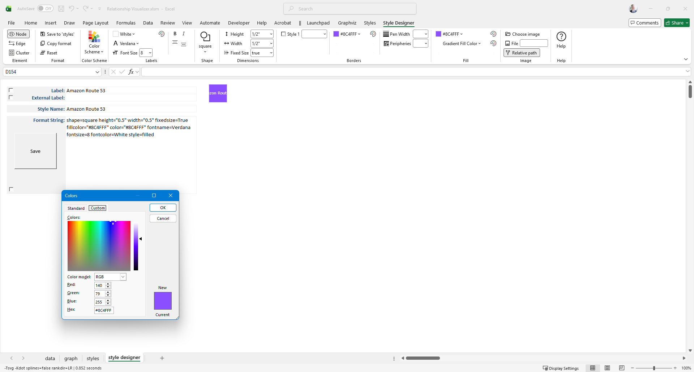
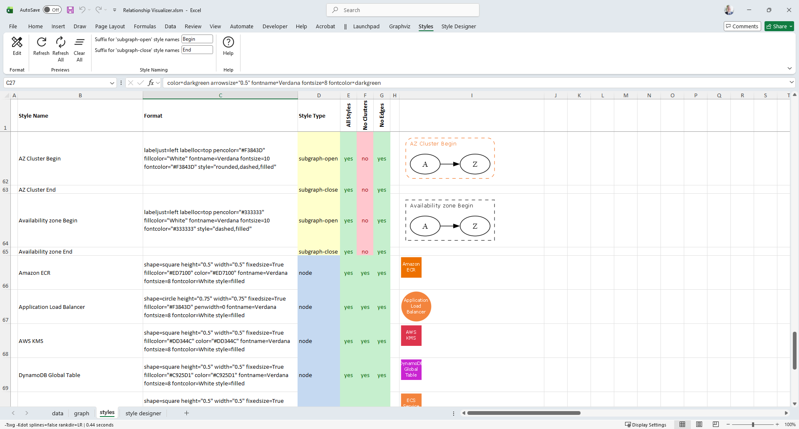

# Adding Style

Styling is where your graphs come alive. Colors, shapes, and layout choices turn raw data into a visual story your audience can understand at a glance. This section introduces the tools that make that possible.

Use the cards below to explore each styling capability in depth.

  <a class="advanced-card" href="../designer/">
    <strong>Style Designer</strong>  
    
    <small><i>Define reusable styles for nodes, edges, and clusters.</i></small>
  </a>

  <a class="advanced-card" href="../styles/">
    <strong>Style Gallery</strong>  
    
    <small><i>Save and organize your custom styles for reuse.</i></small>
  </a>

  <a class="advanced-card" href="../views/">
    <strong>Create Views</strong>  
    
    <small><i>Apply styles selectively to highlight specific data.</i></small>
  </a>

