# Advanced Topics

This section describes several miscellaneous features in the Relationship Visualizer that can be used to create more elaborate graphs.

## HTML-like Labels

Graphviz has a feature where if the value of a label attribute for nodes, edges, clusters, or graphs is given as an HTML string that is delimited by `<`...`>`, the label is interpreted as an HTML description. At their simplest, such labels can describe multiple lines of variously aligned text as provided by ordinary string labels. More generally, the label can specify a table like those provided by HTML, with different graphical attributes at each level.

The features and syntax supported by these labels are modeled on HTML. However, there are many aspects that are relevant to Graphviz labels that are not in HTML and, conversely, HTML allows various constructs which are meaningless in Graphviz. The Graphviz creators generally refer to these labels as `HTML-Like Labels` but the reader is warned that these labels are not HTML.

The grammar which Graphviz will accept is fully described at: [https://www.graphviz.org/doc/info/shapes.html\#html](https://www.graphviz.org/doc/info/shapes.html#html)

A basic HTML label can be constructed as text wrapped in the `<` and `>` delimiters as described above.

For example, a label can be constructed as:

`<This label has <b>Bold</b>, <i>italic</i>, <u>underlined</u>, and <s>strikeout</s> text>`

and entered as a label value for an edge. In this example, we will relate 'a' to 'b' as we are interested in seeing how the edge is drawn. The 'data' worksheet appears as:

| 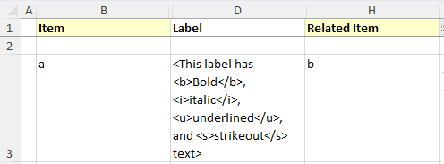 
| ---------------------------------- |


Pressing `Refresh Graph` produces the following graph:

|  |
| ---------------------------------- |

A slightly more complex example is to create a HTML table. In this example, the table contains one row with two cells:

```
<
<table>
  <tr>
    <td>Cell 1</td>
    <td>Cell 2</td>
  </tr>
</table>
>
```

Using it to represent a node named 'c', the 'data' worksheet appears as:

| 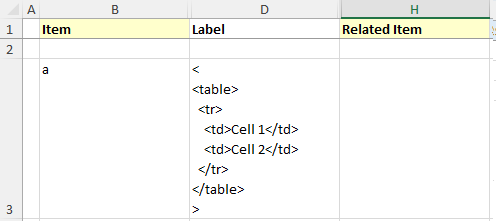 |
| ---------------------------------- |

Pressing `Refresh Graph` produces the following graph:


HTML labels can be used for Clusters, Nodes, and Edges. In the example below there are three Items named 'a', 'b', and 'c'. HTML labels have been added for node 'a', and the edges from 'a' to 'b' and from 'b' to 'c'. The nodes and edges are wrapped with a border via a cluster that also has an HTML label.

The 'data' worksheet appears as:

| 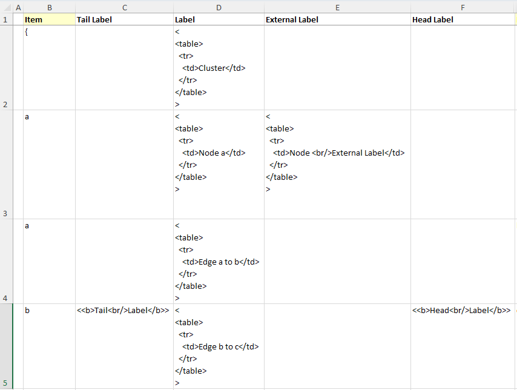 |
| ---------------------------------- |

Pressing `Refresh Graph` produces the following graph:

| 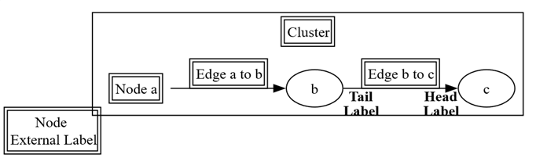 |
| ---------------------------------- |

## Keywords

### `graph`, `node`, and `edge` Keywords

Graphviz supports a cascading default‑attribute mechanism: when a `node`, `edge`, or `graph` statement defines a default attribute, every subsequently defined object of that type automatically inherits the value. The default remains in effect until it is reassigned. Objects created *before* a default is introduced do not retroactively adopt it; instead, Graphviz records an empty string for that attribute on those earlier objects.

The Relationship Visualizer mirrors this behavior by treating the keywords **`graph`**, **`node`**, and **`edge`** as special values in the **Item** column of the **data** worksheet. When these keywords appear, the tool inserts the corresponding default‑attribute statements into the generated DOT source, applying the styles specified in the **Style Name** and **Attributes** columns (when those columns are enabled on the *settings* worksheet).

In the example below, nodes `a` through `h` are listed normally. On row 5, a `node` statement sets the default font color to red. Because this row is visually distinguished through conditional formatting (highlighted background and bold‑italic text), it is easy to spot as a default‑attribute definition. All nodes defined after row 5 inherit the red font. This continues until row 10, where a second `node` statement resets the font color to an empty string, instructing Graphviz to revert to its built‑in default.

| 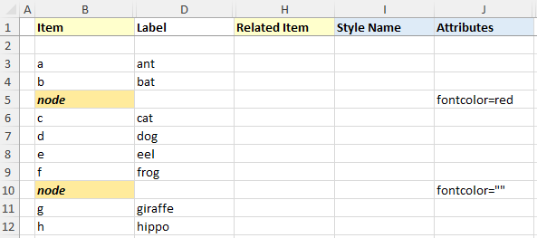 |
| ---------------------------------- |

Pressing `Refresh Graph` produces the following graph:

| 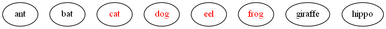 |
| ---------------------------------- |

Likewise, this same capability exists for edges using the `edge` keyword. In the example below an edge keyword on row 13 sets the edge color to blue for the first 3 edges. A second edge keyword on row 17 changes the color to red for all the remaining edges.

| 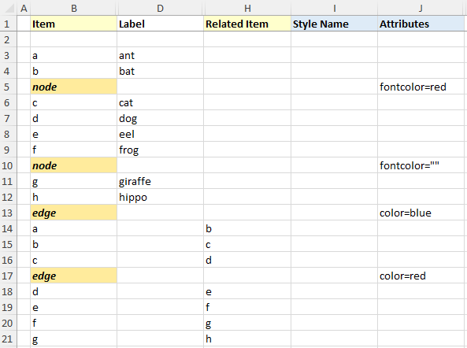 |
| ---------------------------------- |

Produces the following graph:

|  |
| ---------------------------------- |

Note that a subgraph receives the attribute settings of its parent graph at the time of its definition. This can be useful; for example, one can assign a font to the root graph and all subgraphs will also use the font. For some attributes, however, this property is undesirable. If one attaches a label to the root graph, it is probably not the desired effect to have the label used by all subgraphs. Rather than listing the graph attribute at the top of the graph, and the resetting the attribute as needed in the subgraphs, one can simply defer the attribute definition in the graph until the appropriate subgraphs have been defined.

## Clusters

### Depicting a Relationship from or to a Cluster

You may encounter situations where your diagram includes nodes inside clusters, and you need to show dependencies between those nodes and other nodes or clusters. In other words, you want an edge to start or end on the boundary of a cluster rather than on a specific node. The Relationship Visualizer supports this, but it requires a small amount of additional Graphviz knowledge to enable cluster‑to‑cluster or node‑to‑cluster connections.

Let's reproduce the diagram below which can be found at: <http://stackoverflow.com/questions/2012036/graphviz-how-to-connect-subgraphs>

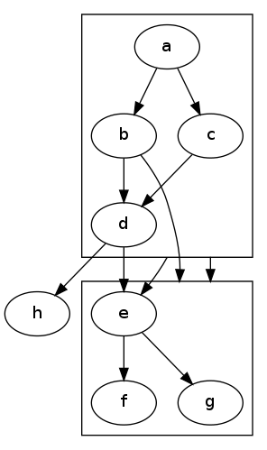

Let’s begin by turning the previously described `graph`, `node`, and `edge` keyword features into a concrete example. In rows 4–6 below, each keyword is listed along with style settings that apply to that object type. These statements are not required for connecting clusters, but they demonstrate how the keyword mechanism works and make the resulting diagram easier to read. For each of the three object types—graph, node, and edge—enter the following formatting information into the corresponding `Attributes` cells:

- _Graph_: `fontname="Arial" fontsize="12" fontcolor="red"`
- _Node_: `fontname="Arial"`
- _Edge_: `fontname="Arial" fontsize="8" decorate="true" color="blue"`

The spreadsheet should look as follows:

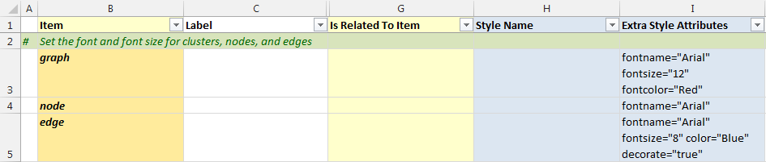

Next, we need to enable the `compound` graph attribute, which Graphviz sets to `false` by default. Setting it to `true` activates support for edges that connect to clusters. The simplest way to do this is to follow the steps described in [Adding Native Graphviz Directives](#adding-native-graphviz-directives) and insert a native Graphviz statement. Place a `>` character in the **Item** column to mark the row as a native command, and enter `compound="true"` in the **Label** column, as shown below.

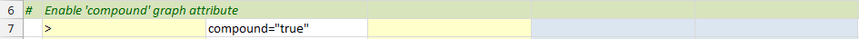

The `compound="true"` statement is then added to the body of the main graph. You can achieve the same result by pressing the **Compound** option button, which sets this attribute automatically.

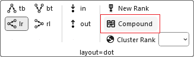

Next, define two clusters. For clarity, we’ll label them `cluster0` and `cluster1`.  
`cluster0` will contain four node relationships using the letters **a**, **b**, **c**, and **d**, all of which will appear inside its cluster boundary.  
Similarly, `cluster1` will contain node relationships using **e**, **f**, and **g**, also enclosed within a cluster border.

Up to this point, we have always started a cluster with an opening brace `{`. When the Relationship Visualizer encounters an opening brace, it automatically generates an internal name for the cluster to simplify authoring. However, if you want to connect edges *to* a cluster, that cluster must have a stable Item name. Relying on the auto‑generated name can be unreliable, because it may change if the cluster’s position in the worksheet changes.

To address this, the Relationship Visualizer allows you to place a name *before* the opening brace (for example, `cluster0`) to explicitly define a named subgraph. If the name begins with **cluster**, Graphviz treats the subgraph as a special cluster subgraph. When supported by the layout engine, nodes in that cluster are grouped together and enclosed within a bounding rectangle. Note that cluster subgraphs are not part of the formal DOT language—they are a syntactic convention recognized by certain Graphviz layout engines. If the name does *not* begin with **cluster**, the subgraph is treated as an ordinary subgraph.

The spreadsheet now appears as follows to define the two clusters. In the illustration, notice how the cluster name appears in both the **Item** and **Label** columns. We will remove the label later in this example, but for now it helps make the demonstration clearer.

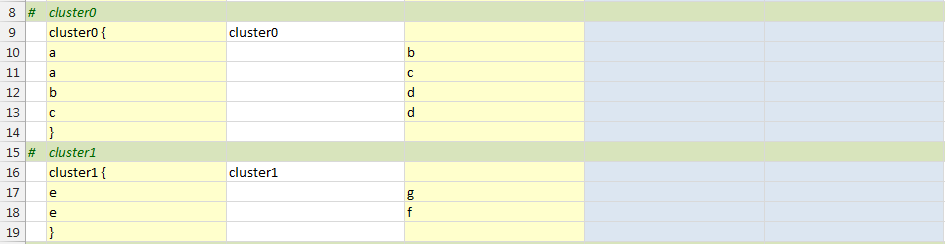

Once the clusters have been defined, we can specify edges that illustrate the relationships between them. The example below demonstrates five scenarios:

1. A relationship from a node inside one cluster to a node inside another cluster (row 21)  
2. A relationship from a node inside a cluster to a node outside any cluster (row 22)  
3. A relationship from a node inside a cluster to the *border* of another cluster (row 23)  
4. A relationship from the *border* of a cluster to a node inside another cluster (row 24)  
5. A relationship from the border of one cluster to the border of another cluster (row 25)

To specify the cluster from which an edge should originate, include an `ltail` attribute in the **Attributes** column. This attribute identifies the cluster whose boundary the edge should start from—for example, `ltail="cluster0"`. The item listed in the **Item Name** column must belong to that cluster.

To make an edge terminate at the boundary of a cluster, include an `lhead` attribute in the **Attributes** column. This identifies the cluster whose border the arrowhead should connect to—for example, `lhead="cluster1"`. The item listed in the **Related Item** column must reside within that cluster.

The spreadsheet below shows all five scenarios, with descriptive text added in the **Label** column to clarify each case. These labels will be hidden later in the example.

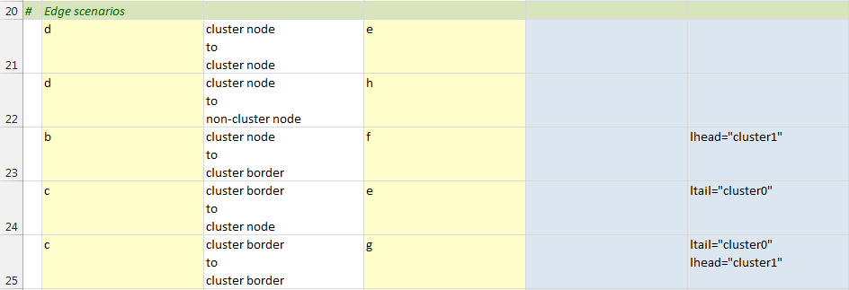

At this point, all the information required to generate the graph has been entered. When you press the **Refresh** button, the graph appears as follows:

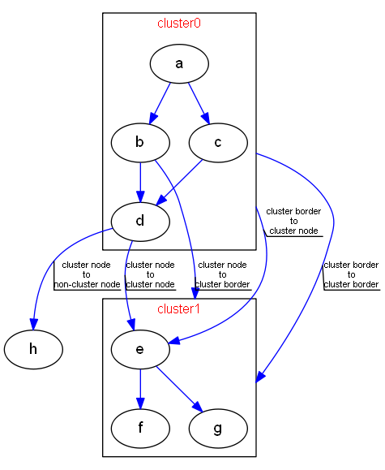

The graph now matches our intended layout. Notice that each blue edge includes a black line beneath its label, visually underlining the text. This callout‑line effect comes from setting `decorate="true"` in the default `edge` keyword earlier in the spreadsheet. It is especially helpful here, since Graphviz sometimes places labels in positions that can be confusing without a visual anchor.

Now that we understand how the edge statements are rendered, we can hide the labels. The easiest way to do this is to open the **Graphviz** ribbon tab and, under **Edge Options**, clear the **Include Label** checkbox.

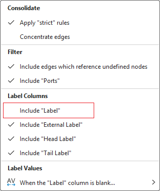

Press the `Refresh Graph` button and the graph now appears as:

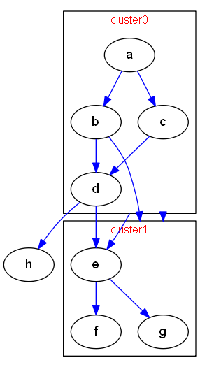

This graph is now almost identical to the example from the Internet that we set out to reproduce. The final step is to remove the cluster labels that were added earlier for demonstration purposes. Since there is no settings option to toggle these labels on or off, we need to return to the *data* worksheet and delete the label entries manually so that the data appears as follows:

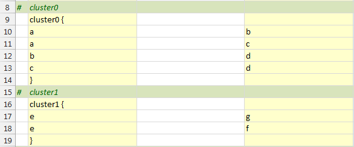

Press the `Refresh Graph` button and the graph now appears as the graph on the left; the graph we are duplicating is on the right:

| 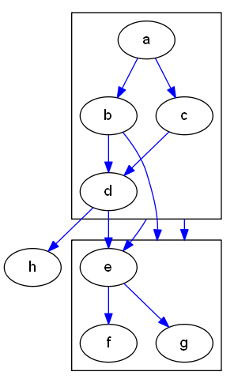 Generated by Relationship Visualizer |  <http://i.stack.imgur.com/Ka0t2.png> |
| --------------------------------------------------------------------------------------- | ------------------------------------------------------------------------------------------------------------------- |

The graph was intentionally left with blue edges and a slightly smaller font size to distinguish it from the target image—different enough to show that it was not the original, yet similar enough to demonstrate that the goal was achieved.

If you want to make the final adjustments so the two graphs are truly identical, edit the style definition for the `edge` keyword on row 5 and remove the `color="blue"` attribute. Press **Refresh**, and the generated graph will match the goal image exactly.

### Aligning Nodes Across Clusters

One of the ways Graphviz saves you time is by automatically choosing an optimal layout for nodes and edges. In many cases this produces a clean, readable diagram with no additional effort. Sometimes, however, you may want more control over placement for aesthetic or organizational reasons. Assume that you have the following graph:


Created by this spreadsheet:

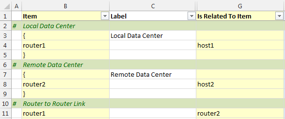

For aesthetic reasons, we want `router1` and `router2` to align horizontally. To accomplish this, two native Graphviz DOT commands must be added to the spreadsheet. The first appears on line 4, where we insert `newrank="true"` into the body of the main graph. This attribute—introduced in Graphviz 2.30 and not formally documented—enables an alternative ranking algorithm that allows `rank="same"` to be applied to nodes even when they belong to clusters.

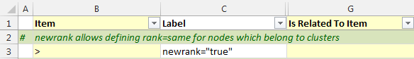

You can also achieve the same result by selection the graph option "New Rank"

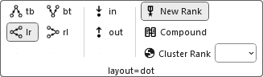

The next step is to add the following native Graphviz command after the cluster definitions:

`{ rank="same"; "router1"; "router2"; }`

as shown on row 13 below:

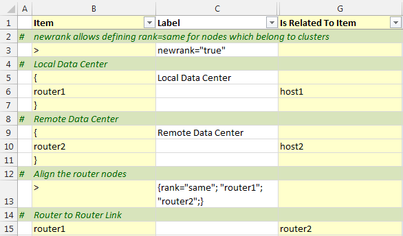

Press the `Refresh Graph` button, and the graph contains router1 and router2 aligned as shown below:


## Nodes

### shape="record"

Visually, a **record** is drawn as a box whose fields are arranged as a series of horizontal or vertical sub‑boxes. The **Mrecord** shape is identical to a record, except that its outer border has rounded corners. You can flip between horizontal and vertical field layouts by nesting fields inside braces `{ ... }`. By default, the top‑level orientation of a record is horizontal. 

For example:

- `A | B | C | D` produces four fields arranged left to right  
- `{A | B | C | D}` produces four fields arranged top to bottom  
- `A | { B | C } | D` places **B** above **C**, with **A** to the left and **D** to the right

The initial orientation of a record node also depends on the value of the `rankdir` attribute.  
- If `rankdir` is **Top to Bottom** or **Bottom to Top** (vertical layouts), the top‑level fields in a record are displayed horizontally.  
- If `rankdir` is **Left to Right** or **Right to Left** (horizontal layouts), the top‑level fields are displayed vertically.

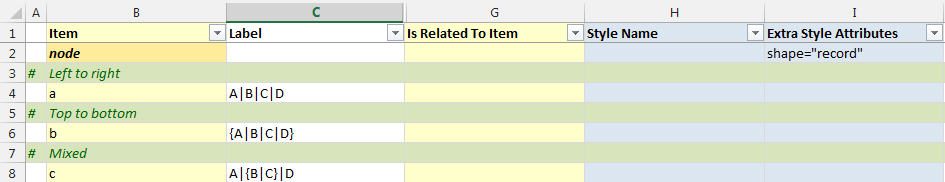

Results in:


### `shape="record"` With Ports Specified

You can specify port identifiers as part of the field values in a record shape. The first string in the field ID assigns a port name to that field, which can then be combined with the node name to control where an edge attaches. The second string provides the visible text for the field and supports the usual escape sequences `\n`, `\l`, and `\r`. 

Therefore, if we specify the following (with color‑coding added here to highlight the ports):

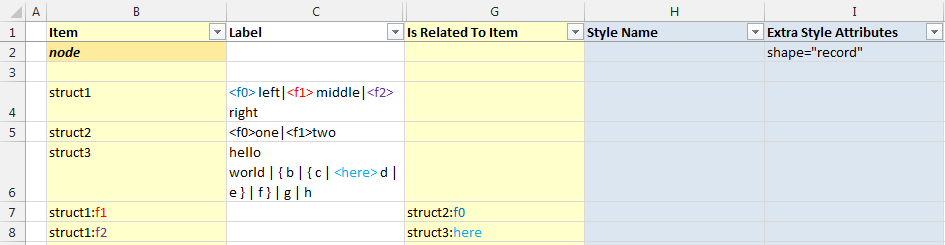

We will generate the following graph:


If we change the graphing direction from **Top to Bottom** to **Left to Right** on the *Settings* worksheet and regenerate the graph, it will appear as follows:


## Edges

### Consolidating Edges Using the 'strict' Option

Some sets of data will naturally produce multiple edges between the same pair of nodes. A good example is the U.S. state border relationships. Every pair of neighboring states has two relationships: for instance, Michigan borders Ohio, and Ohio borders Michigan.

When these relationships are plotted as an undirected graph, the following data:

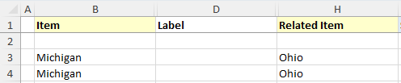

Generates the following graph:

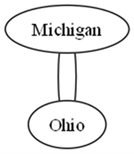

Graphviz can consolidate these duplicate relationships into a single edge. When Graphviz is instructed that the graph is `strict`, multiple edges between the same pair of nodes are not permitted.

To enable this behavior, open the **Graphviz** ribbon tab and, in the **Edge Options** section, set **Apply “strict” rules** to **Yes**, as shown below:

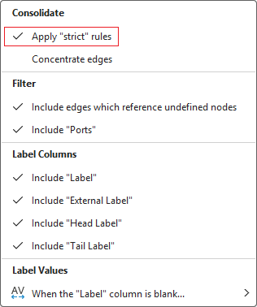

Press the `Refresh Graph` button and the graph appears as:

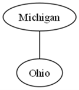

### Changing the Order of Edges

Differences in style can be achieved by altering the edge ordering. If the value of the `ordering` attribute is `"out"`, then the outgoing edges of a node—that is, edges for which the node is the tail—must appear left‑to‑right in the same order in which they are defined in the input. If the value is `"in"`, then the incoming edges of a node must appear left‑to‑right in the order in which they are defined.

Assume you have several edge relationships defined as follows:

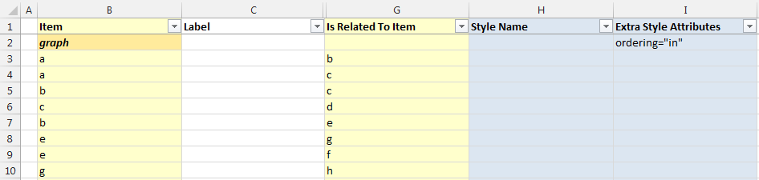

Pressing the `Refresh Graph` button, the graph appears as:

|  ordering="in" |  ordering="out" |
| ---------------------------------------------------------------- | ----------------------------------------------------------------- |

### Placing a Label at the Head or Tail of an Edge

The default view of the Relationship Visualizer provides a **Label** column for assigning a standard edge label. Graphviz also supports placing labels at the tail and/or head of an edge using the `taillabel` and `headlabel` attributes, respectively. The *data* worksheet includes dedicated columns for these attributes, but they are hidden by default. To use them, simply unhide the corresponding columns.

For example, if we have a simple relationship such as:

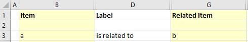

Producing the graph:


We can click the `Show/Hide Columns` dropdown list on the **Graphviz** tab to expose the additional label columns

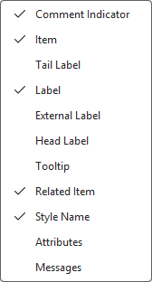  -> 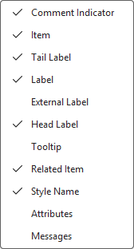

The data worksheet now appears as:

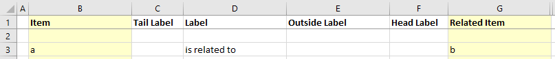

If we place the value `tail` at the tail of an edge, and `head` at the head of an edge, the data in the spreadsheet would look as follows:

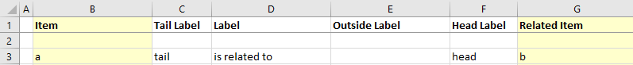

Pressing the `Refresh` button creates the following graph:


### Drawing an Edge from or to the Center of a Node

By default, an edge is clipped to the boundary of a node’s shape. You can override this behavior so that an edge begins and/or ends at the center of the node instead of its perimeter. The `headclip` and `tailclip` attributes control this behavior. When set to `true` (the default), the edge is clipped to the node boundary. When set to `false`, the edge connects to the center of the node—or to the center of a port, if one is specified.

The data below:

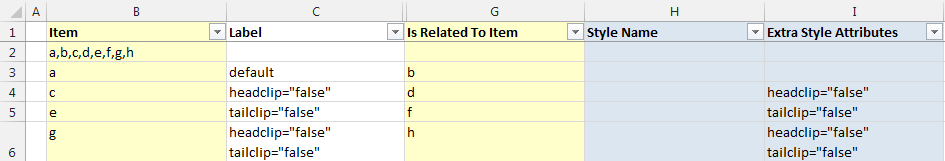

Creates the following graph:


**Note:** _The nodes have blank labels to make the illustration of edges coming from or going to the center of the node easier to see. Enabling the 'Nodes' graph option 'When the `Label` column is blank…' '…use blank for the node label" on the `Graphviz` ribbon tab is required to achieve this effect._

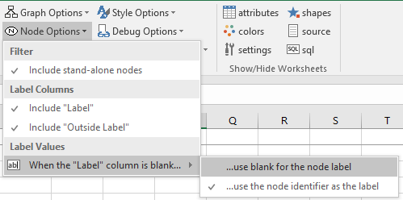

## Graphs

### Rotating Graphs 90 Degrees

Graphs can have their drawing orientation set to landscape by setting the rotate attribute equal to 90. The final output is rotated in the counterclockwise direction. The data below:

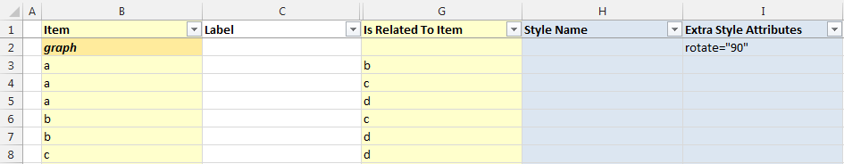

Creates the following graph:


An alternate method is to check the "Rotate 90 counterclockwise" option from the Graph Options on the Graphviz tab.

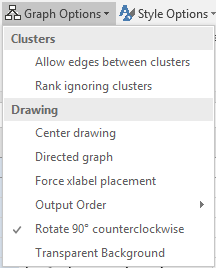

---

<center>

Like this tool? [Buy me a coffee! ☕](https://www.buymeacoffee.com/exceltographviz)

</center>
