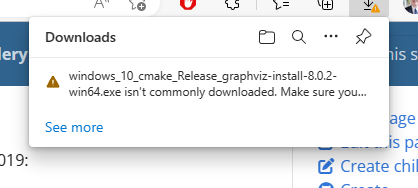
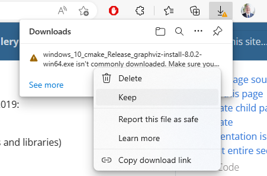
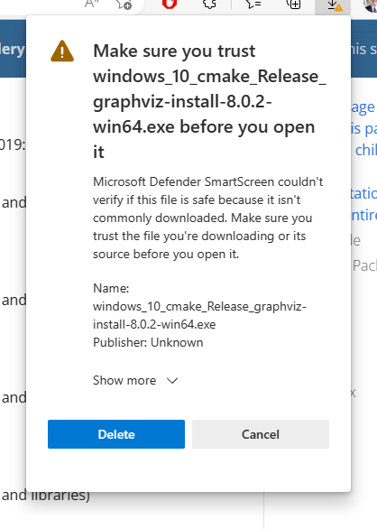
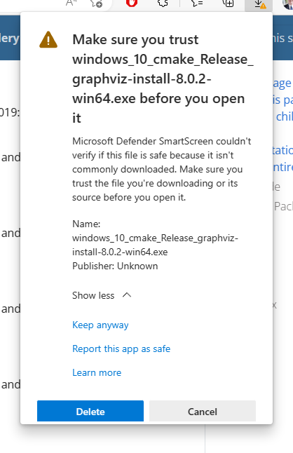
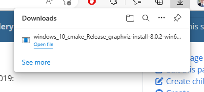

# What to do if Microsoft Edge blocks the Graphviz download

The Microsoft Edge browser may blocked the download of the Graphviz installer file. If blocked, you will see a warning icon in the download symbol. 

## Step 1

Clicking on the button provides the reason the download was blocked.

||
| ------------------------------------- |

## Step 2

Hover your mouse over the message, and a button with three dots will appear, along with a tooltip which says, `More actions`.

||
| ------------------------------------- |

Click on the `[ooo]` button, and a popup menu appears. 

## Step 3

Select `Keep` from the dropdown list.

||
| ------------------------------------- |

## Step 4

Microsoft Edge will again try to dissuade you from downloading the file with a warning such as “**Make sure you trust windows_10_cmake_Release_graphviz-install-8.0.2-win64.exe before you open it**”. 

It will appear that your only choices are `Delete` or `Cancel`. To keep the file you must click the `Show more v` dropdown.

||
| ------------------------------------- |

Three additional choices will now appear:

- `Keep anyway`
- `Report this app as safe`
- `Learn more`

||
| ------------------------------------- |

## Step 5

Click on `Keep anyway`

||
| ------------------------------------- |

## Step 6

Microsoft Edge downloads the file, and the installer file shows up as a download. Click on `Open file` to run the installer.

||
| ------------------------------------- |

## Step 7

Resume the [installation steps](../install-win/)