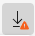
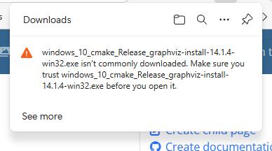
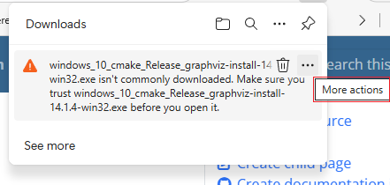
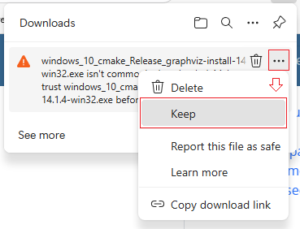
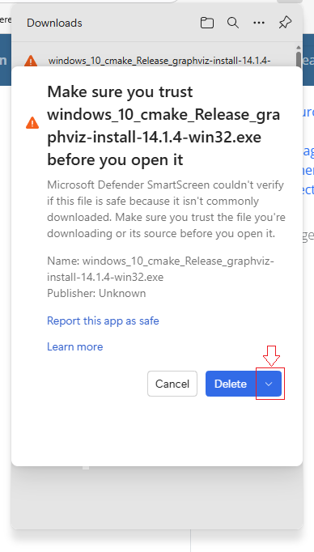
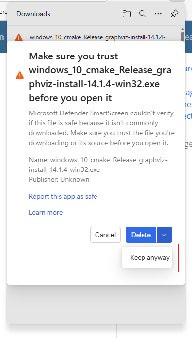
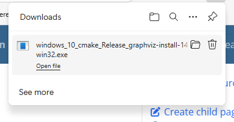

# Microsoft Edge has Blocked the Graphviz Download

The Microsoft Edge browser may blocked the download of the Graphviz installer file. 

If blocked, you will see an orange `/!\` warning icon in the download button.  

## Step 1 - View Warning Message

Clicking on the button provides the reason the download was blocked.

|  |
| ------------------------------------- |

## Step 2 - Make `More Actions` appear

Hover your mouse over the message, and a button with three dots will appear, along with a tooltip which says, `More actions`.

|  |
| ------------------------------------- |

Click on the **`⋯`** button, and a popup menu appears. 

## Step 3 - Select `Keep`

Select `Keep` from the dropdown list.

|  |
| ------------------------------------- |

## Step 4 - Confirm Again

Microsoft Edge will again try to dissuade you from downloading the file with a warning such as “**Make sure you trust windows_10_cmake_Release_graphviz-install-14.1.4-win32.exe before you open it**”. 

It will appear that your only choices are `Cancel` or `Delete`. To keep the file you must click the **`v`** dropdown within the Delete button.

|  |
| ------------------------------------- |

An additional choice appears:

- `Keep anyway`

|  |
| ------------------------------------- |

Click on `Keep anyway`

## Step 5 - Open the File

Microsoft Edge downloads the file, and the installer file shows up as a download. Click on `Open file` to run the installer.

|  |
| ------------------------------------- |

## Step 6 - Resume Installation

Resume the [installation steps](../install-win/)