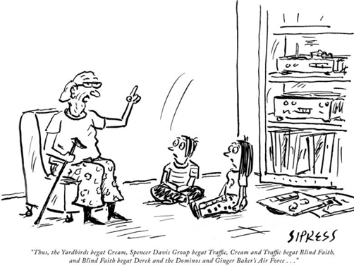
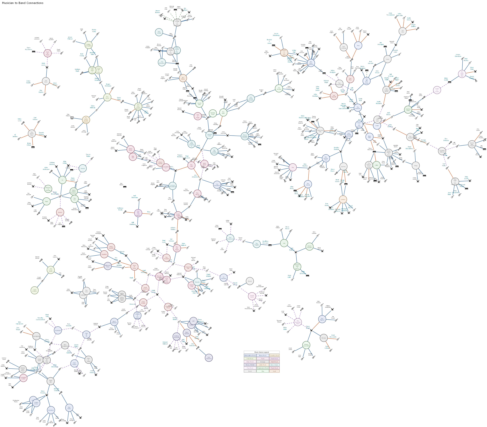

If you've been through the [Musician to Band Connections](/knowledge-graphs/tutorial/) tutorial, you've seen this panel. It's the reason the tutorial exists:

> "Thus, the Yardbirds begat Cream, Spencer Davis Group begat Traffic, Cream and Traffic begat Blind Faith, and Blind Faith begat Derek and the Dominos and Ginger Baker's Air Force..."
> — Cartoonist: David Sipress, The New Yorker, August 7, 2017

I built that tutorial's dataset of 574 nodes, 443 real musicians, 131 bands, and 627 relationship edges around exactly this kind of tangled, real music history. 

| Visual Graph |
|-------------------------------------|
|  |

Once I had it exporting as a [Knowledge Graph](/blog/posts/knowledge-graph-export) instead of just a diagram, I couldn't resist the obvious question: if I handed the raw JSON to an AI, with no hints and no mention of this cartoon, would it find a story like this on its own?

| Knowledge Graph |
|-------------------------------------|
|  |

## The prompt

I opened a brand-new conversation with Claude with no prior context, nothing about this tutorial or the cartoon. I attached the Knowledge Graph JSON I generated, and asked:

| Prompt to Claude AI  |
| -------------------- |
| Without any other context from me, analyze the graph and find the most interesting multi-band lineage you can - a chain of bands connected because one or more members of an earlier band went on to found or join a later one. Tell the story the way someone would explain a family tree. Then tell me which single musician appears in the most bands in this dataset, and what that reveals about the shape of the graph. |

## What came back

It didn't pick the Yardbirds. It found something I'd had not noticed was buried in my own dataset. It found the Pearl Jam and Soundgarden origin story:

| Claude's response  |
| ------------------ |
|It starts with **Deranged Diction**, a scrappy Missoula/Seattle punk outfit (1981–1984) whose members included bassist Jeff Ament and guitarist Bruce Fairweather. When that band folded, Ament, Fairweather, and drummer Alex Shumway teamed up with Stone Gossard and Mark "Arm" McLaughlin to form **Green River** (1984–1988) — the band now generally credited as the first grunge band.  Green River split in two. One half went off to form Mudhoney; the other half — Ament, Gossard, and Fairweather — recruited singer Andrew Wood to form **Mother Love Bone** (1988–1990). Wood died of a heroin overdose days before the album's release, ending the band.  In his memory, Ament and Gossard joined with Soundgarden's Chris Cornell, drummer Matt Cameron, and guitarist Mike McCready to record a tribute album as **Temple of the Dog** (1990–1992) — a one-off side project that, in this dataset, is the hinge connecting two entire family lines. Out of those same sessions, Ament, Gossard, and McCready pulled in a surfer-turned-singer named Eddie Vedder to found **Pearl Jam**, while Cornell went back to **Soundgarden**, the band he'd founded years earlier. |

It laid out the shape of it as a small family tree — Deranged Diction branching through Green River and Mother Love Bone into Temple of the Dog, then splitting again into Pearl Jam and Soundgarden. And it named **Jeff Ament** as the thread running through all four founding bands.

For the second half of the prompt, "who appears in the most bands?", the answer was a tie at six apiece: **Eric Clapton** (The Yardbirds, John Mayall's Bluesbreakers, Cream, Blind Faith, Derek & the Dominos, and the one-off Dirty Mac), and **Peter Brockbanks**, better known by his stage name Peter Banks, the original guitarist of Yes whose six bands trace the tangled pre-history of Yes itself.

Neither of those was the answer I expected, and that's exactly why it's a better demo than if it had just handed the cartoon back to me. It read the graph and told me something true about my own data that I didn't already know.

## But does the cartoon's chain actually hold up?

I still wanted to see the receipts on the original claim, so in a second clean conversation I gave Claude the cartoon's exact sentence and asked it to verify it edge by edge against the graph using nothing but the JSON, no outside knowledge of rock history allowed. It came back not just confirming the claim, but auditing it:

| Second Prompt |
| -------------- |
| Here's a claim: "Thus, the Yardbirds begat Cream, Spencer Davis Group begat Traffic, Cream and Traffic begat Blind Faith, and Blind Faith begat Derek and the Dominos and Ginger Baker's Air Force." Using only the attached JSON knowledge graph, verify or correct this claim edge by edge, citing the specific musicians who connect each pair of bands.| 
| Claude's response  |
| **Yardbirds → Cream — Confirmed.** Shared musician: Eric Clapton — the sole connecting thread.   **Spencer Davis Group → Traffic — Confirmed.** Shared musician: Steve Winwood.  **Cream and Traffic → Blind Faith — Confirmed, and stronger than the claim implies.** From Cream: Eric Clapton and Ginger Baker carried over. Notably, Jack Bruce (Cream's bassist) is *not* connected to Blind Faith in the graph — he did not make this jump, consistent with real history. From Traffic: Steve Winwood carried over.   **Blind Faith → Ginger Baker's Air Force — Confirmed, and richer than stated.** Shared musicians: Ginger Baker, Rick Grech, and Steve Winwood — three overlapping members, not just the band's namesake. A bonus link visible in the graph but not part of the original claim: Chris Wood also bridges Traffic and Air Force directly.|

That's not a model parroting the sentence I fed it back to me. It is tracing actual shared-membership edges, catching a detail that makes the claim *more* accurate than stated (three shared members, not one), and correctly noting where a plausible-sounding connection (Jack Bruce, Rick Grech via Cream/Traffic) isn't actually supported by the data.

## A second AI, for good measure

I ran the first prompt on Grok too, cold, same JSON. It independently converged on the Yardbirds → Cream → Blind Faith chain as its top pick, named Clapton as the most-connected musician, and used almost the same language Claude did to describe the graph's shape: a "small-world / hub-and-spoke" network where a handful of restless musicians bridge otherwise-separate scenes. It even flagged the same runner-up clusters — the Seattle grunge tree, and The Clash splitting into Big Audio Dynamite — without being told either one mattered.

Two different models, no shared context, converging on the same structural read of the graph. That's a decent signal the pattern is really in the data, not an artifact of one model's imagination.

Grok did hit a real limitation on the second prompt, though: the export file got truncated and it couldn't complete the edge-by-edge verification. Worth being upfront about, and worth planning around.

## Best practices if you're trying this yourself

A few things I'd do differently, or recommend, based on running this end to end:

- **Keep style names short.** Every node references its style by name, and long, descriptive style names such as `relationship_founding_member_of` instead of `founder` get repeated once per node or edge that uses them, and that adds up rapidly in a large graph.
- **Filter before you export, not after.** If you only care about one slice of the data such as one genre, one decade, one degree of connection then apply that in the SQL or the View rather than exporting everything and hoping the AI's context window can hold it.
- **Use the token estimator.** The Knowledge Graph visualizer includes one specifically so you can check the cost before you paste something in. Use it, especially before handing a file to a tool with a smaller context window.
- **Scope to a View when the whole graph is too much.** A focused, few-hundred-edge export of exactly the lineage you want to explore will get better, faster, more reliable answers than a monolithic dump every time.

## Try it on your own data

The interesting part isn't that an AI can read JSON. It is that a graph shaped like this lets it *traverse* relationships instead of just summarizing text, and gives you an answer you can go back and check edge by edge. If you've got relationship data of your own sitting in a spreadsheet, the [Musician to Band Connections tutorial](/knowledge-graphs/tutorial/) is a good template to start from, and the [Knowledge Graph export post](/blog/posts/knowledge-graph-export) covers how to turn it on.

I'd genuinely like to see what other people's data tells an AI that they didn't already know.
