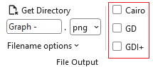
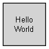
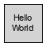
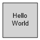

Version 11.0 added a render-engine picker to the File Output options on the Data tab: Cairo, GD, GDI+ (Windows only), and Quartz (Mac only). 

| |
| :--------------: |
|  |
| |

If you've never had a reason to touch it, here's the short version of when you would.

**Cairo** is Graphviz's modern default and the right choice for almost everyone. It handles anti-aliasing, transparency, and font rendering the most consistently across platforms, and it's what I'd recommend leaving selected unless you have a specific reason to change it.

**GD** is the older, simpler renderer. It's faster on very large diagrams and has fewer font-rendering dependencies, which makes it a reasonable fallback if Cairo is producing garbled text or missing glyphs in your environment, something that occasionally happens with unusual font configurations.

**GDI+** (Windows only) draws through Windows' own graphics stack, which can give you output that matches other Windows-native tools more closely, and it's worth trying if you're embedding diagrams into other Windows applications and want visual consistency.

**Quartz** (Mac only) is the macOS equivalent — Apple's native rendering, for the same reason you'd reach for GDI+ on Windows.

Here is an illustration of the same node published with each renderer. The changes are subtle.

| Cairo | GD    | GDI+  | Quartz |
| :---: | :---: | :---: | :---: |
|  |  |  |  |

If you've never changed this setting, you don't need to start now, Cairo is a good default. But if you ever run into odd font spacing, missing characters, or rendering artifacts on a particular machine, this is something I'd try switching.

See the [full changelog](/changelog/) for everything else new in v11.0.
