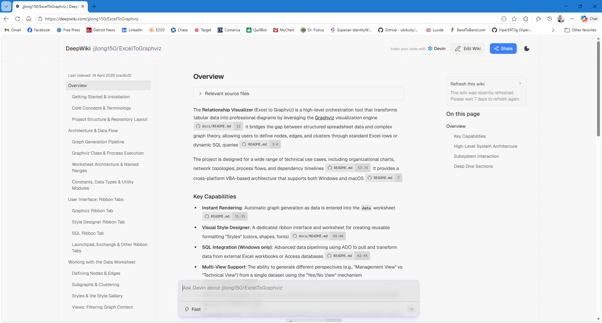
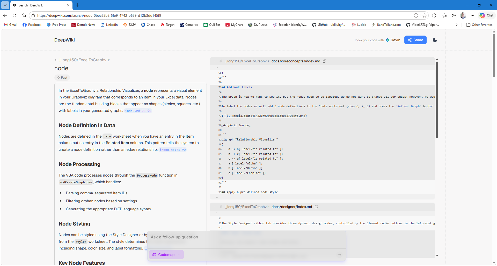

I'm excited to share that I've just created AI-powered [wiki-style documentation for Excel to Graphviz](https://deepwiki.com/jjlong150/ExcelToGraphviz) using DeepWiki (powered by Devin).

**DeepWiki** analyzes the entire codebase and automatically generates clear, interactive documentation which includes architecture overviews, module explanations, code relationships, and more. It's like having an always-up-to-date knowledge base for the project.

If exploring the workbook's VBA code interests you, this wiki makes it much easier to understand how everything fits together. 

One of my favorite features is the built-in AI search. Just type a term like `node`, and DeepWiki instantly creates a contextual summary of what it means in Excel to Graphviz, complete with pointers to related files and statements. With an additonal button click you can view the search results as a codemap.

👉 Check out the full documentation at
[https://deepwiki.com/jjlong150/ExcelToGraphviz](https://deepwiki.com/jjlong150/ExcelToGraphviz)

I'd love to hear your feedback! If you spot anything missing or have suggestions for improvements, drop a comment below.

<Comments />