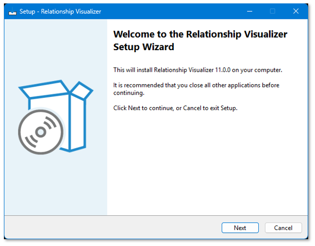

Getting **Relationship Visualizer** running has always meant a handful of manual steps beyond just opening the workbook: install Graphviz, register its plugins from a command line, and on macOS, hand-place an AppleScript file in a folder Microsoft's sandbox rules require. 

None of it is hard, but it's easy to miss a step, and I'd rather you spend that time building diagrams. Both platforms just got a faster path.

## A guided installer for Windows

`RelationshipVisualizerSetup.exe` walks you through setup with a normal installation wizard: accept the license, pick a folder (it defaults to a `Relationship Visualizer` folder under **My Documents**, since you'll likely make copies of it the way you would any other document), and choose whether to include the sample workbooks.



Behind the scenes, it finds Graphviz's `dot.exe` for you, registers its plugins (the `dot -c` step the manual docs have always warned is easy to forget) and marks the install folder as an Excel Trusted Location, so opening the workbook shows no macro-security prompt at all.

## A smarter setup script for macOS

The zip now includes `install.sh`. Unzip as usual, then from a Terminal window:

```bash
cd path/to/Relationship\ Visualizer
bash install.sh
```

It shows the MIT license, finds `dot` wherever Homebrew or MacPorts put it, patches `ExcelToGraphviz.applescript` to that exact path, and copies the script into `~/Library/Application Scripts/com.microsoft.Excel` (the sandbox folder Microsoft's rules require, previously a manual Finder trip). It also asks before installing the sample workbooks, and skips the SQL-based samples automatically either way, since macOS Excel has no ActiveX/ADO support for them.

## The zip still works exactly like before

Neither of these replaces the plain zip download. It is still available for download, and the full manual walkthrough for both platforms is still documented if you'd rather do it step by step yourself.

## Get it

Head to the [download page](/download/) for both platforms, or jump straight to the [Windows](/install-win/) or [macOS](/install-mac/) install guide for the details.
