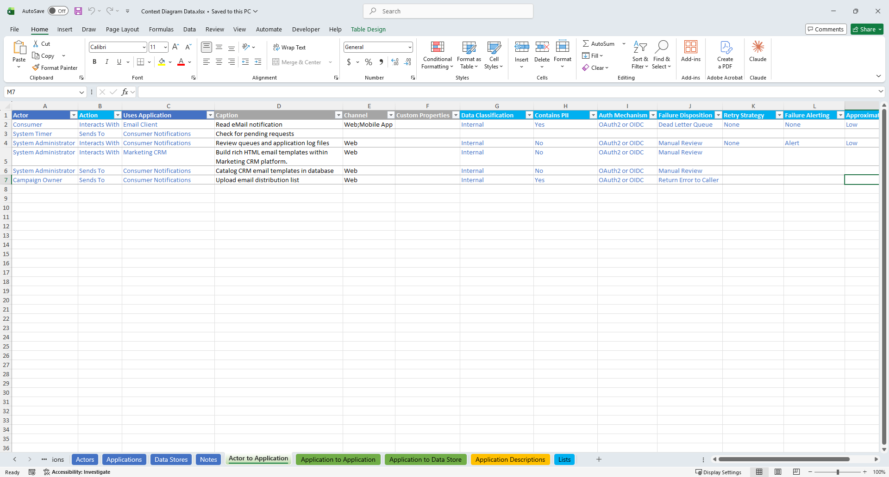
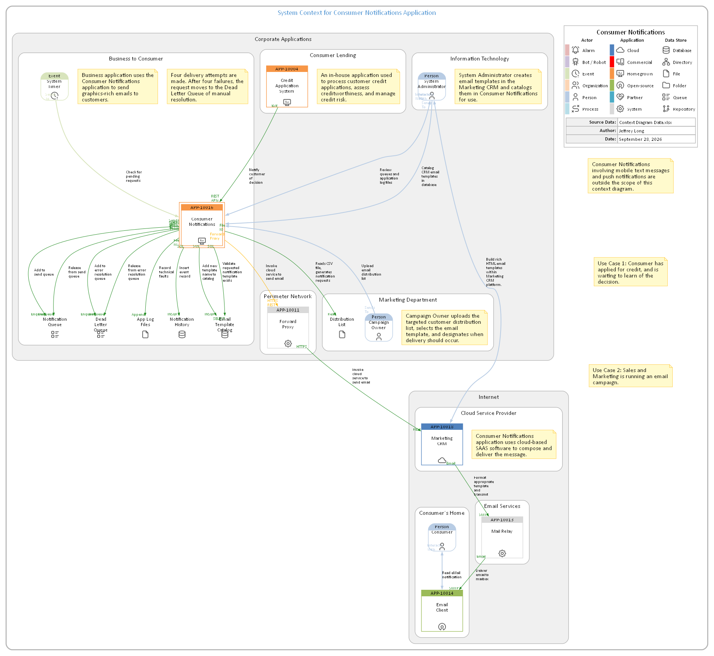
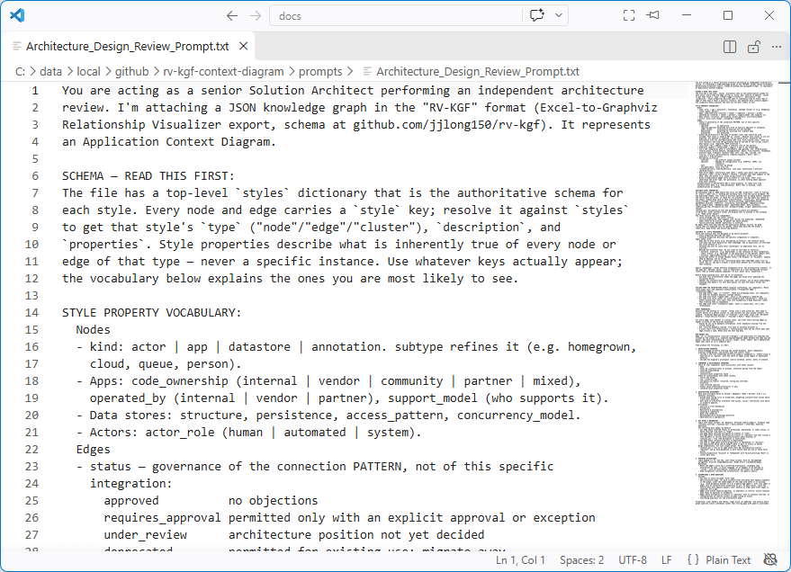
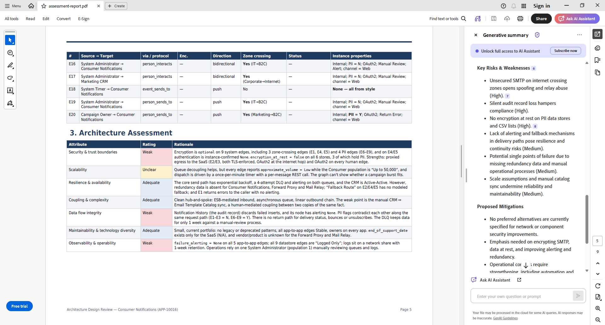
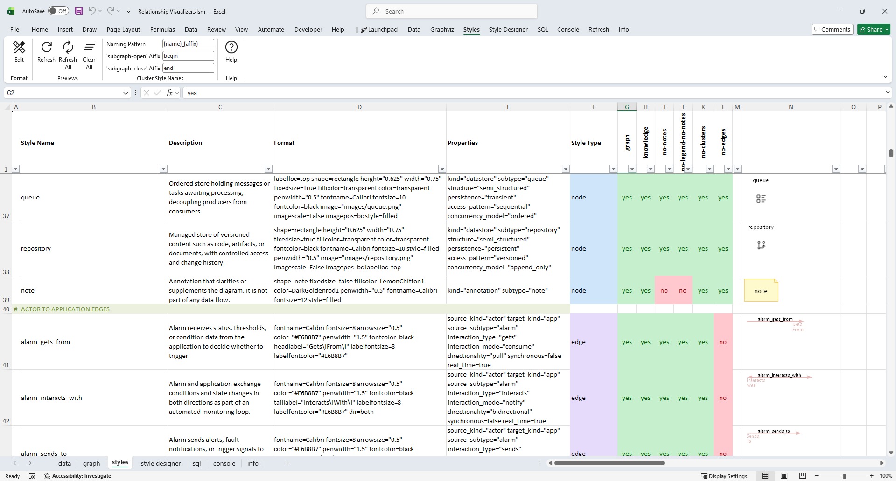
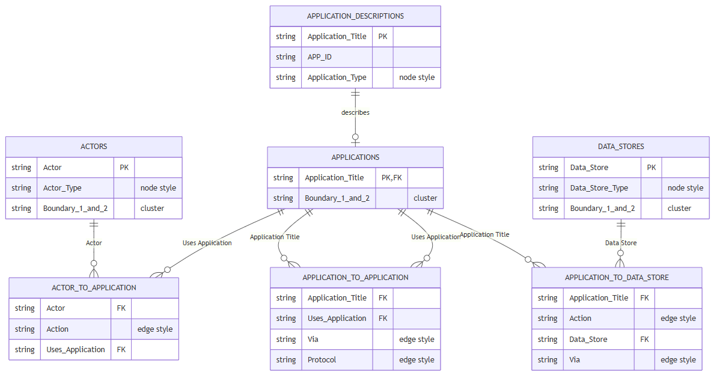
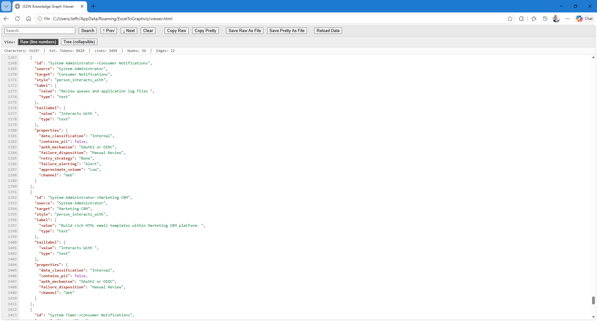

Every IT architecture review I've ever taken part in starts the same way: someone draws a [context diagram](https://en.wikipedia.org/wiki/System_context_diagram), and everyone squints at it. Someone apologizes with the usual line: *"I'm not good at making drawings. I'm not an artist!"*. 

Reviewers immediately start asking what the shapes and colors mean. Which of these connections is encrypted. Does that flow carry customer data. What happens when the queue backs up. The diagram shows the shape of the system, but the facts that matter live in people's heads, in spreadsheets, and in a dozen wiki pages of IT standards.

The [knowledge graph export](https://exceltographviz.com/blog/posts/knowledge-graph-export.html) in Relationship Visualizer changed what that diagram can be. Once the same data that draws the picture can also be exported as a typed, self-describing graph, an AI can read the architecture itself. It no longer has to interpret a picture of it.

Today I'm releasing a free toolkit built on that idea: **[Context Diagram Toolkit for Relationship Visualizer](https://github.com/jjlong150/rv-kgf-context-diagram)**.

## What it does

You describe a system in an Excel workbook:
- its actors, applications, and data stores;
- assign the connections between them;
- specify facts about each one, such as data classification, PII, authentication, failure handling, and lifecycle.

Relationship Visualizer then produces two things from the same data:

- **A context diagram**, where every connection is colored by its governance status. Green means approved, amber means conditional or deprecated, and red means prohibited. A dashed line means a better alternative exists. Shapes and icons are standardized and repeatable.
- **An [RV-KGF](rv-kgf-announcement.md) knowledge graph in JSON**, containing every entity, every relationship and every fact.

Hand that JSON, together with the included review prompt, to the AI of your choice. You get back an architecture assessment report:
- a component and relationship inventory;
- ratings for security, scalability, resilience, coupling, data flow integrity, maintainability, and observability;
- a risk register;
- proposed mitigations.

## How It Looks in Practice

The screenshots below show the full progression from data entry, to visualization, to the architecture review prompt, to the resulting AI‑written assessment.

|  |
| :---: |
| *The Excel workbook containing the data that Relationship Visualizer uses to build the context diagram.* - [(Full-size)](../images/context-diagram-data.png)|

|  |
| :---: |
| *Graphviz‑generated context diagram for a hypothetical Consumer Notifications application. Note: Data was intentionally seeded with errors for review testing.* - [(Full-size)](../images/context-diagram.png) |

|  |
| :---: |
| *The Architecture Review prompt provided to AI.* - [(Full prompt)](https://github.com/jjlong150/rv-kgf-context-diagram/blob/main/prompts/Architecture_Design_Review_Prompt.md) |

|  |
| :---: |
| *An excerpt from the AI-generated assessment report's risk table.* - [(Full report)](https://github.com/jjlong150/rv-kgf-context-diagram/blob/main/examples/consumer-notifications/assessment-report.pdf) |

## Three layers, in plain Excel

While building this toolkit I realized the toolkit had quietly ended up with the same three layers that formal knowledge-graph projects are built on (ontology, semantic model, and a knowledge graph), and a reasoning layer. 

### Ontology

The **ontology** is the `styles` worksheet. It defines the shared vocabulary: what kinds of things exist (people, bots, homegrown and cloud applications, databases, queues) and what kinds of relationships can connect them. It defines more than a hundred connection types, from REST through an API gateway to SFTP to Kafka. Each one has a plain-language definition and typed properties, such as whether the protocol encrypts in transit and whether the pattern is approved, deprecated or prohibited.

|  |
| :---: |
| *The Relationship Visualizer styles worksheet holds the context diagram ontology* - [(Full-size)](../images/context-diagram-styles.png)|

### Semantic Model

The **semantic model** is the `sql` worksheet. Its queries decide how the spreadsheet should be understood:
- which rows become entities and which become relationships;
- how an integration path plus a protocol resolves to a relationship type;
- which columns become typed facts.

|  |
| :---: |
| *The context diagram data model.* - [(Full data model)](https://github.com/jjlong150/rv-kgf-context-diagram/blob/main/docs/user-guide.md#data-model-at-a-glance)|

### Knowledge Graph

The **knowledge graph** is the JSON export: your real applications and the traversable links between them. RV-KGF embeds the definitions of every type it uses, so the file describes itself. The AI doesn't need a separate data dictionary to understand what `encryption_in_transit: "optional"` means on a message broker connection.

|  |
| :---: |
| *The context diagram knowledge graph for the Consumer Notifications example.* - [(Full-size)](../images/context-diagram-knowledge-graph.png)|

### Reasoning Layer

The review prompt sits on top as a **reasoning layer**. It applies rules to the graph, for example: every prohibited or deprecated pattern must be listed as a risk, and a connection that may be unencrypted, crosses a trust boundary and carries PII must be flagged.

## Why a spreadsheet?

This toolkit is not a replacement for an enterprise architecture platform. Those tools do governance, repositories and traceability far better than a workbook ever could. In fact, the toolkit expects your application inventory to come from your EA tool's export.

But a lot of architecture work happens before anything is formal: early design discussions, solution reviews and "can you draw me what this looks like?" In those moments, a spreadsheet that anyone can fill in, and that produces both a diagram and a reviewable knowledge graph, removes a lot of friction.

## What's in the repository

- The preconfigured Relationship Visualizer workbook, with its styles and SQL
- A data workbook template, with a worked example
- The architecture review prompt, in Markdown and plain text
- A user guide and a full catalog of every connection style
- The example's context diagram and AI assessment report as PDFs, so you can see the output before installing anything

Everything is free and MIT licensed. The toolkit needs Relationship Visualizer 11.1 or later, and runs on Windows only, because it relies on the SQL feature.

## Two opposite uses of the same export capability

This toolkit is the governed end of what a knowledge graph export can do. The AI works within a defined ontology and applies explicit rules, and every finding traces back to a property you can check. For the opposite end, see [I Let an AI Read My Knowledge Graph](https://exceltographviz.com/blog/posts/ai-reads-my-knowledge-graph.html). There, I handed a rock-band graph to two AIs with no hints and no rules, and one of them found a story in my own data that I didn't know was there. The same export supports both. Which one you get depends on how much meaning you define up front, and what you ask.

## Get the toolkit

You can [get the Context Diagram Toolkit for Relationship Visualizer](https://github.com/jjlong150/rv-kgf-context-diagram) for free on GitHub.

If you try it, I'd love to hear how it works on your own architecture, and what connection types you think are missing.

<Comments />
