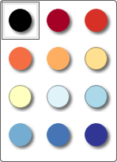
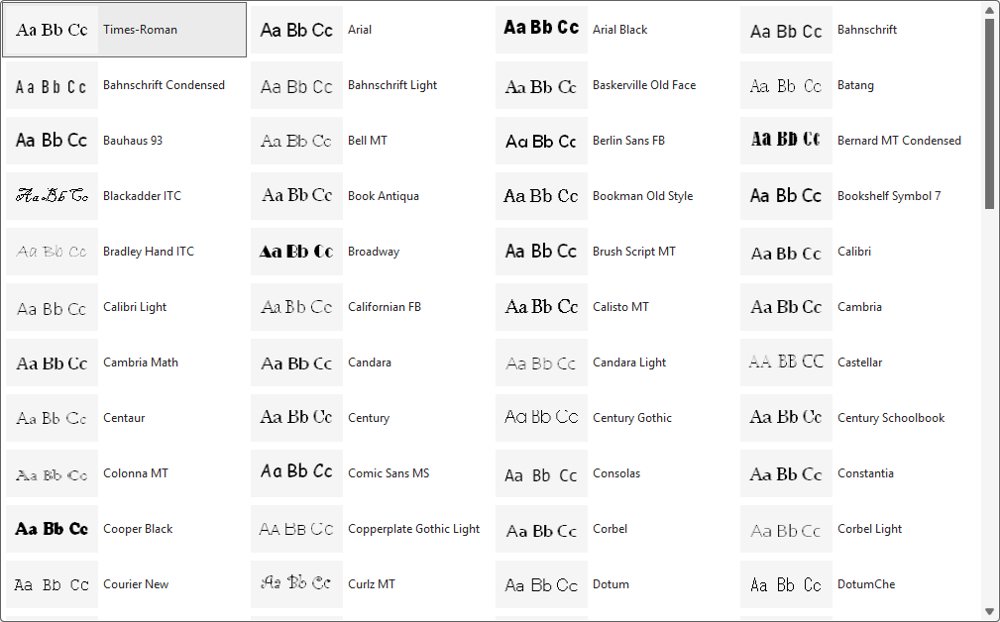
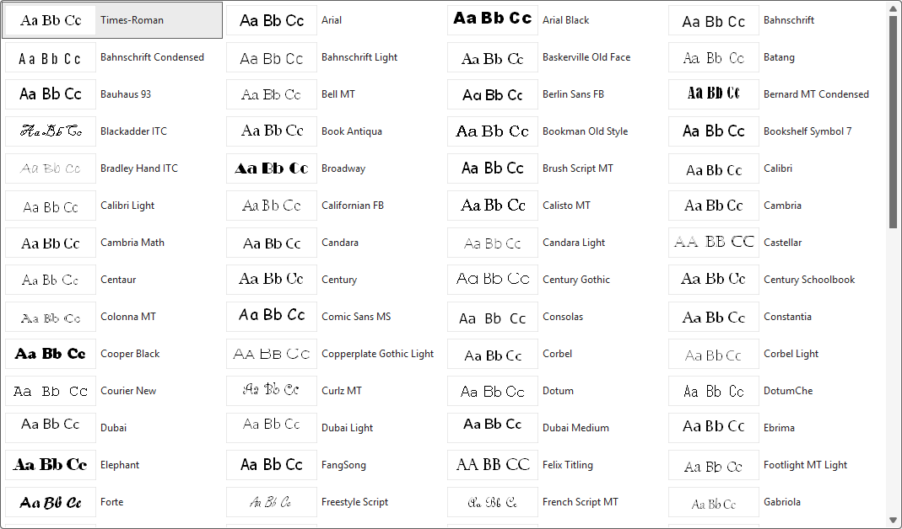

Here's a small one that you won't have to do anything about, but might notice: the first time you open a color or font control in the Style Designer after upgrading to v11.0, the preview galleries will silently rebuild themselves.

The Style Designer caches its color and font preview swatches as images so the gallery scrolls smoothly instead of re-rendering everything on every click. Those cached previews are tied to the version that generated them, and v11.0 changed enough about how they're drawn that the old cached images no longer matched. Rather than ship a mismatch, I added a version marker to each cache folder: if the marker doesn't match the running version, the cache is treated as stale and rebuilt automatically, once, the first time you touch a color or font control.

| Old Color Gallery | New Color Gallery |
| :---------------: | :---------------: |
|  |  |

|  **Old Font Gallery** |
| :---------------: |
|  |

| **New Font Gallery** |
| :---------------: |
|  |

You don't need to clear anything or click a button. The galleries are built the first time you need it, and after that first rebuild your galleries will display responsively.

See the [full changelog](/changelog/) for everything else new in v11.0.
