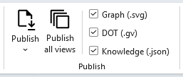

A lot of knowledge graph tooling assumes your data already lives somewhere graph-shaped: a triple store, a property-graph database, an ontology somebody spent months designing. In my experience, an enormous amount of real relationship data such as org charts, system dependencies, vendor networks, and process maps actually lives in legacy backend or SAAS systems that export CSV files, or a spreadsheet maintained by someone who's very good at their job and has zero interest in learning a non-SQL query language to get it back out.

**Relationship Visualizer** has spent over a decade turning that kind of spreadsheet data into Graphviz diagrams. Version 11.0 adds a second, parallel output: the same worksheet, the same rows, exported as a structured Knowledge Graph in JSON, ready to paste directly into an LLM or downstream graph tooling. 

::: tip Does it integrate directly with AI?

Not directly. I didn’t build any native AI integration into the tool. Instead, you can just copy the results to your clipboard or save them as a file. From there, you can paste the JSON into your prompt or attach the file when you’re working with whatever AI client you prefer.

There are already plenty of great AI tools and Excel add‑ins out there (Claude, Copilot, and many others), and I wasn’t trying to reinvent the wheel or box you into a specific workflow. My goal was simply to give you clean, flexible output you can use however you like.
:::

## The same data, two outputs

This isn't a separate tool bolted on the side. It runs from the exact same worksheet data as the diagram pipeline, resolving labels, tooltips, and styles through the same inheritance rules. Set a default at the node, edge, or graph level, or within a cluster, and individual rows only need to specify what's different. Exactly like they do today for diagrams. Because both outputs share one resolution engine, the JSON and the diagram are guaranteed to agree with each other.

Each export includes:

- Metadata: format and version, whether the graph is directed, the source workbook and view name, and an export timestamp.
- A trimmed styles section listing only the styles actually in use, keeping the file lean.
- Automatic fan-out for edges. A single row with a comma-separated list of sources or targets expands into multiple discrete edges.
- Automatic placeholders for nodes referenced before they're formally defined.
- A clear warning, instead of silent data loss, for rows using native DOT syntax that has no JSON equivalent.
- A HTML-based JSON viewer with text and tree views of the Knowledge Graph JSON
- A built-in token estimator, so you can gauge roughly how much LLM context budget your export will eat before you paste it anywhere.

## The diagram isn't going anywhere

One thing I want to be absolutely clear about: exporting a Knowledge Graph doesn’t mean you’re giving up the diagram. Both outputs come from the same worksheet, and you can generate either one independently, or produce both together in a single run.

Version 11 even upgrades the viewing experience with a new SVG viewer that supports Pan, Zoom, Filter, and Animations. If you want a deeper look at the viewer, you can check out the write‑up [here](/blog/posts/interactive-diagrams).

| Version 11.0 SVG Animated Graph Viewer |
| -------------------------------------- |
|           |

The ability to *see* the graph matters more than it might sound, because JSON is genuinely hard to eyeball. A missing edge, a node that slipped into the wrong cluster, a typo that quietly created a duplicate instead of matching an existing node — all of that is easy to miss when you’re scrolling through a few thousand lines of JSON. But it’s instantly obvious in a rendered diagram. And let's be honest: nobody wants to stare at JSON in a PowerPoint deck.

So my workflow, and the one I’d recommend, is to treat the diagram as the sanity check for the graph’s *shape*. Do the nodes and edges look like the relationships I actually meant to describe? I always confirm that before handing the JSON to an AI tool that will take it at face value.

Version 11.0's new publishing checkboxes make this simple in practice: pick `Graph`, `DOT`, and/or `Knowledge Graph`, and one "Publish" button press publishes a matched set of all three from the same run — a rendered diagram to eyeball, the raw DOT if you want it, and the JSON ready to hand off. No choosing between outputs, and no running the generator twice.



## Typed properties, not just labels

Beyond the built‑in label, tooltip, and style fields, every node and edge can now carry its own free‑form properties. Version 11 adds a new **Properties** column where you can write arbitrary key/value pairs in the same way you'd write extra Graphviz attributes. Use space‑, comma‑, or semicolon‑separated `key=value` pairs, quoting any value that contains spaces or punctuation.

```
weight=200 domestic=true opened=2019-03-14 contribution="buy me a coffee"
```

On export, those come through as a real number, a real boolean, and a real date‑valued string. I do not flatten everything  into plain text. (Dates are intentionally kept as ISO‑8601 strings rather than converted into true date objects due to the complexity of time‑zone handling).

Properties follow the same inheritance chain as labels — graph → node/edge → row — so you can set defaults once and only override them where something actually differs.

## Viewing the graph

Excel has no native way to display JSON, so rather than dumping raw text into a cell, the Knowledge Graph opens in your default browser instead. The viewer lives inside the workbook itself as a hidden worksheet — no companion file to lose track of, and it works identically on Windows and macOS.

A new split button on the Data tab sends the current view to the viewer, either refreshing a shared browser tab each time you regenerate the graph, or opening a fresh tab every time.

| Knowledge Graph in JSON Text Format   | 
| ------------------------------------- | 
|  |

| Knowledge Graph in Tree Format        |
| ------------------------------------- |
|  |

## For SQL users

If you drive graph generation with SQL queries, two new `PUBLISH` commands publish straight to a Knowledge Graph: `PUBLISH AS KNOWLEDGE GRAPH` for the current view, and `PUBLISH ALL VIEWS AS KNOWLEDGE GRAPH` to produce one JSON file per view in a single pass.

## Why I built this

A lot of relationship data will never make it into a formal graph database. Not because it isn’t valuable, but because the organizational lift or financial commitment required to get it there is too high. This tool is free, and it lets you start small. Once you’ve built your worksheet and queries, the new feature makes publishing easy: the same rows that produce a diagram today can also produce a portable, typed, AI‑ready Knowledge Graph, all generated together from a single export.

Try it on a worksheet you already have. Check the [full changelog](/changelog/) for every detail of this release, and let me know what you'd want to see next.
