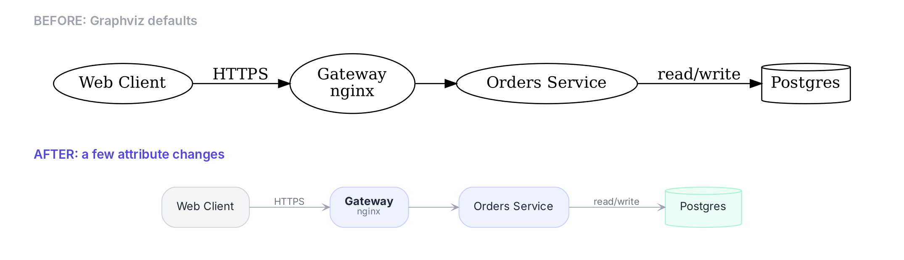
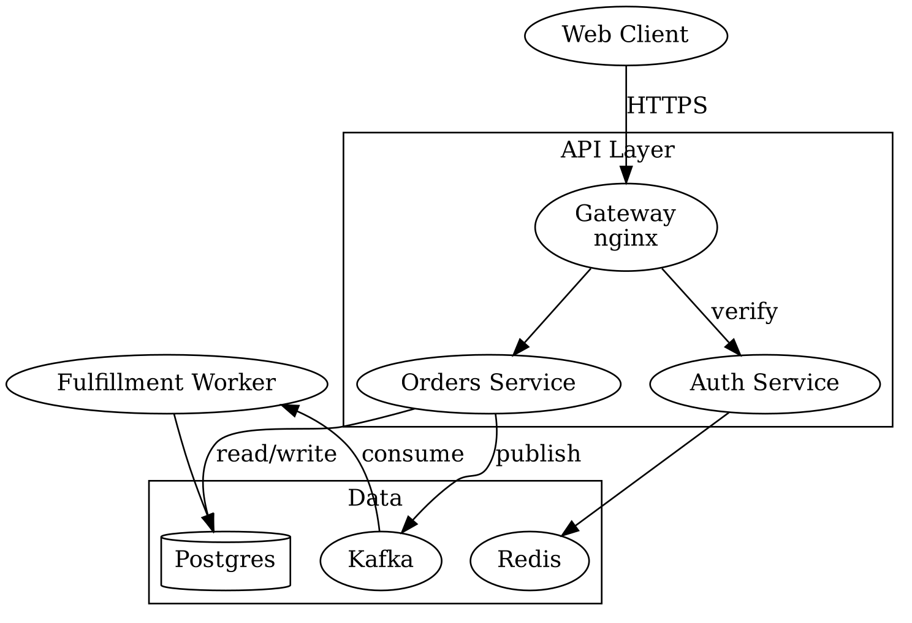
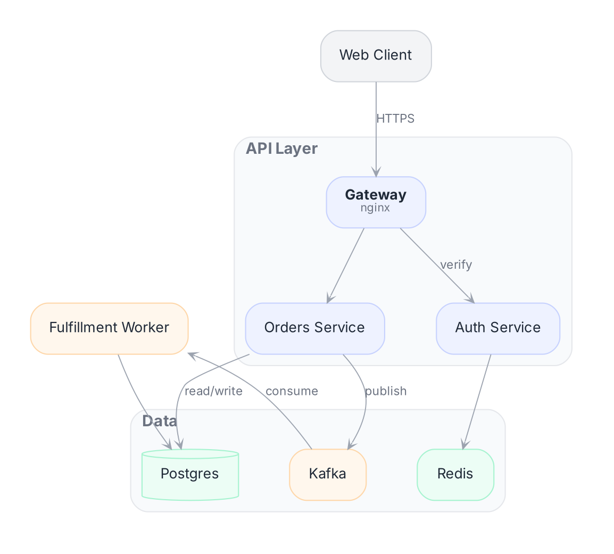
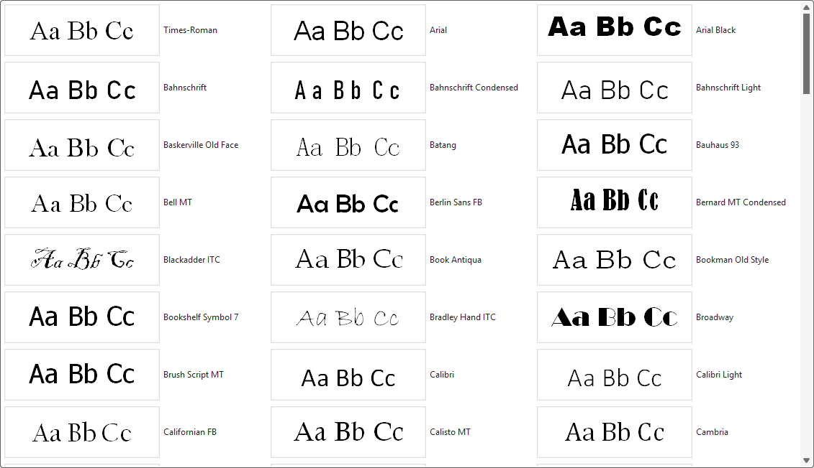
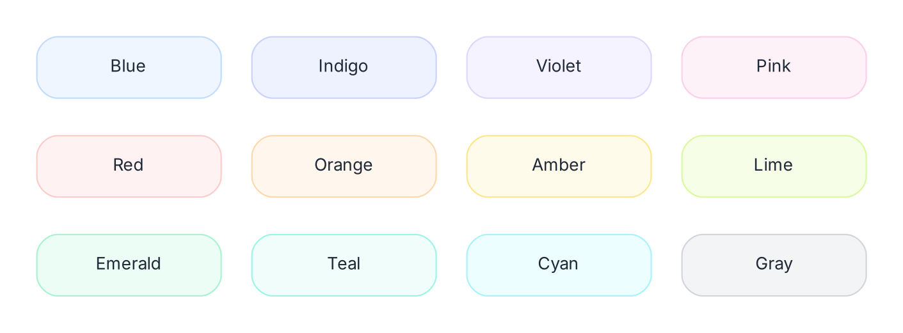
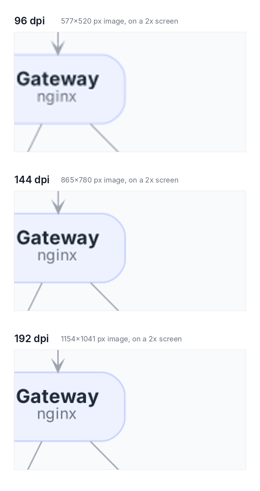
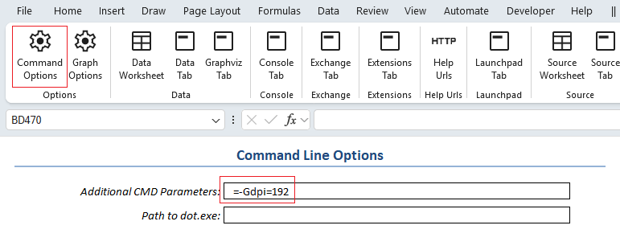
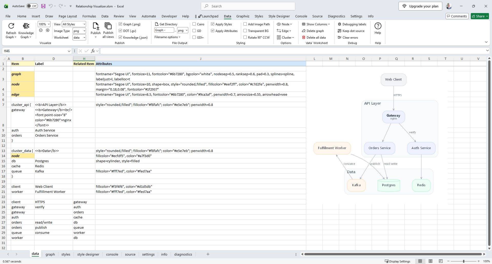
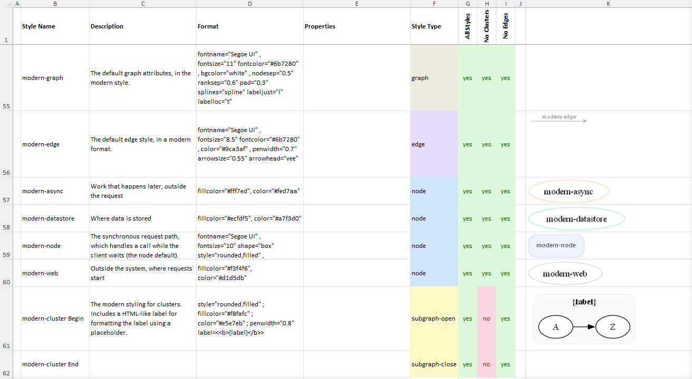
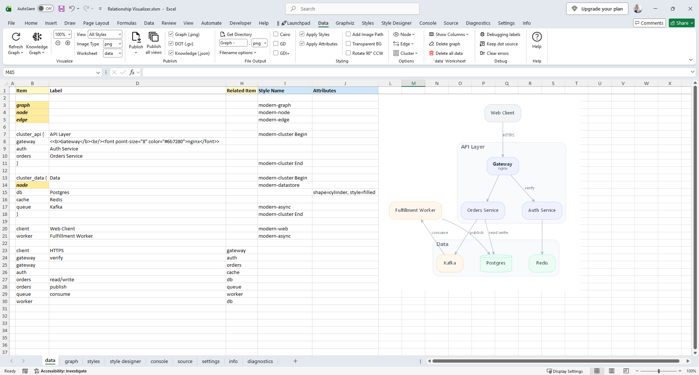

People love to write Graphviz off as dated or ugly. And sure, the defaults look like they’ve been frozen since the 1990s, because they have. But from a young age, my mom taught me that a bad carpenter blames his tools. Graphviz isn't ugly. The styling is just unfinished work waiting for a craftsman.

::: tip The short version
Short on time? These seven changes do most of the work:

1. [Swap Times-Roman for a sans-serif font](#_1-change-the-font) such as Segoe UI.
2. [Use thin gray lines and small arrowheads](#_2-lighten-the-lines-and-arrowheads).
3. [Give nodes soft fills and rounded corners](#_3-use-soft-rounded-nodes).
4. [Add more space between nodes](#_4-give-it-room).
5. [Tone down cluster borders](#_5-quiet-the-clusters).
6. [Make edge labels smaller and gray](#_6-make-edge-labels-recede).
7. [Use HTML-like labels for richer text](#_7-use-html-like-labels-for-richer-nodes).

Then [render PNGs at 192 dpi](#render-pngs-at-a-higher-resolution) so they stay sharp on modern screens.
:::

Graphviz's defaults date from a world of 72-96 dpi monitors, and a handful of attribute changes is enough to make your diagrams look like they were drawn this decade.

Graphviz has been laying out graphs since the early 1990s, and its free layout engines are still among the best available. What has aged is the styling. The defaults pair `Times-Roman` text with solid black ellipses, black lines and large filled arrowheads. That look was normal for technical diagrams thirty years ago. Today it reads as heavy and old-fashioned.

Part of the problem is screen resolution. Graphviz measures sizes in points, a unit borrowed from printing. It's the same unit Excel and Word use for font sizes: one point is 1/72 of an inch, or about a third of a millimeter. The default line width (`penwidth`) is 1 point. The monitors of the 1990s had about 3 to 4 pixels per millimeter, so a 1-point line came out about one pixel wide. Today's high-resolution screens pack in two or three times as many pixels, so the same line now covers 2 to 3 pixels. The lines didn't change; the screens did.

The other part is taste. Modern interface design uses light grays, soft fills and generous white space, and lets color rather than outlines separate the elements. Graphviz can do all of that. It just won't unless you ask.

## Same graph, different attributes

The two diagrams below come from the same DOT file with the same nodes, edges and clusters. Graphviz computed an identical layout for each. The only differences are the styling attributes.



---



The top image depicts what Graphviz produces out of the box: `Times-Roman` text, black ellipses and heavy arrowheads. The bottom image uses the settings described in the rest of this post.

## Seven changes that make the difference

These are listed roughly in order of impact. The first three do most of the work.

### 1. Change the font

`Times-Roman` does more to date a diagram than anything else. Switch `fontname` to a sans-serif and drop `fontsize` to 10 or 11. On Windows, `Segoe UI` is the natural choice. It's the font Windows itself uses, and it's installed on every Windows machine. `Calibri` and `Arial` also work well. On a Mac, use `Helvetica Neue` instead.

One caution: Graphviz measures text using the fonts installed on the machine that runs the layout. If that machine lacks your font, Graphviz sizes the boxes for a substitute, and the labels may overflow when the diagram is viewed elsewhere. Make sure the font is installed wherever your graphs are rendered.

::: tip
Not sure which fonts Graphviz can use on your computer? Open the font gallery in the Relationship Visualizer's Style Designer. Every preview image in it is rendered by Graphviz itself, so it lists only the fonts Graphviz can find on your system and shows exactly how each one will look in your diagrams.


:::

### 2. Lighten the lines and arrowheads

- Set edge [`penwidth`](https://graphviz.org/docs/attrs/penwidth/) to about 0.6–0.8.
- Use a medium gray such as `#9ca3af` for edges instead of black.
- Shrink arrowheads with [`arrowsize=0.5`](https://graphviz.org/docs/attrs/arrowsize/) to `0.7`. The defaults are oversized.
- Try [`arrowhead=vee`](https://graphviz.org/docs/attr-types/arrowType/) or `onormal`. Both look lighter than the filled triangle.

### 3. Use soft, rounded nodes

Set [`shape=box`](https://graphviz.org/doc/info/shapes.html) and [`style="rounded,filled"`](https://graphviz.org/docs/attrs/style/), and give nodes a pale fill. For the outline, either remove it ([`penwidth=0`](https://graphviz.org/docs/attrs/penwidth/)) or use a slightly darker shade of the fill color. Avoid black outlines, double borders ([`peripheries`](https://graphviz.org/docs/attrs/peripheries/)) and the old X11 color names. Hex colors work everywhere and can include transparency, for example `#4f7cff33`.

Picking colors that work together is the hard part, so here are twelve fill and border pairs I like. Each pair uses a very pale tint for the fill and a slightly stronger shade of the same color for the border. All of them work with dark gray text such as `#1f2937`.

 

| Color<br/>Family | `fillcolor=`<br/>(fill color) | `color=`<br/>(border color) |
|---------|:-----------:|:----------------:|
| Blue    | `#eff6ff`   | `#bfdbfe`        |
| Indigo  | `#eef2ff`   | `#c7d2fe`        |
| Violet  | `#f5f3ff`   | `#ddd6fe`        |
| Pink    | `#fdf2f8`   | `#fbcfe8`        |
| Red     | `#fef2f2`   | `#fecaca`        |
| Orange  | `#fff7ed`   | `#fed7aa`        |
| Amber   | `#fffbeb`   | `#fde68a`        |
| Lime    | `#f7fee7`   | `#d9f99d`        |
| Emerald | `#ecfdf5`   | `#a7f3d0`        |
| Teal    | `#f0fdfa`   | `#99f6e4`        |
| Cyan    | `#ecfeff`   | `#a5f3fc`        |
| Gray    | `#f3f4f6`   | `#d1d5db`        |

*Colors based on the Tailwind CSS palette.*

For a diagram, choose three or four colors that are far apart on the list, such as indigo, emerald, orange and gray, and give each one a meaning. Neighbors like blue and indigo are too similar to tell apart at a glance.

### 4. Give it room

The default spacing is cramped. Raise [`nodesep`](https://graphviz.org/docs/attrs/nodesep/) to about 0.5 and [`ranksep`](https://graphviz.org/docs/attrs/ranksep/) to about 0.6, and add a little padding inside nodes with [`margin="0.18,0.08"`](https://graphviz.org/docs/attrs/margin/). 

For processes and pipelines, [`rankdir=LR`](https://graphviz.org/docs/attrs/rankdir/) often reads more naturally than top to bottom.

### 5. Quiet the clusters

Give clusters a very light fill, a faint border or none at all, and rounded corners. Put the label at the top left with [`labeljust=l`](https://graphviz.org/docs/attrs/labeljust/) and [`labelloc=t`](https://graphviz.org/docs/attrs/labelloc/). 

A cluster should group its contents without competing with them.

### 6. Make edge labels recede

Edge labels should be smaller and grayer than node labels, since they are secondary information. [`fontsize=8.5`](https://graphviz.org/docs/attrs/fontsize/) with [`fontcolor="#6b7280"`](https://graphviz.org/docs/attrs/fontcolor/) works well. 

If your graph has many parallel edges, [`concentrate=true`](https://graphviz.org/docs/attrs/concentrate/) merges them and reduces clutter.

### 7. Use HTML-like labels for richer nodes

Graphviz's [HTML-like labels](https://graphviz.org/doc/info/shapes.html#html) let you mix text styles within a node. A bold name with a smaller gray subtitle, like the Gateway node in the example, takes one line:

```
gateway [label=<<b>Gateway</b><br/><font point-size="8" color="#6b7280">nginx</font>>]
```

With `shape=plain` and an HTML table, you can go further and build card-style nodes with header rows and several fields.

## Render PNGs at a higher resolution

If you export PNG files, render them at 144–192 dpi rather than the default 96, or thin lines and small text will look blurry on most modern screens.

The reason is that most laptops and phones now have 2x displays. When a 96 dpi image is shown on one, every image pixel is stretched across four screen pixels. The comparison below shows the same diagram at three resolutions, all displayed at the same size on a 2x screen and magnified so the difference is easy to see.



At 96 dpi, the text is soft and the thin edges are fuzzy. At 144 dpi it is much better. At 192 dpi the image pixels match the screen pixels exactly, and it looks as crisp as a vector image.

To render at higher resolution, add the `dpi` attribute on the command line:

```
dot -Tpng -Gdpi=192 mygraph.dot -o mygraph.png
```

A few things to keep in mind:

- **Display the image at half its pixel size.** A 192 dpi image is twice as wide as a 96 dpi one. In a web page, set the width explicitly (for example, `` for an image 1154 pixels wide). Otherwise it shows up twice as large instead of twice as sharp.
- **Expect larger files.** A 192 dpi PNG has four times as many pixels as a 96 dpi one.
- **Check your renderer.** Most Graphviz builds produce antialiased PNGs through the cairo library. Some minimal installs fall back to the older GD renderer, whose output looks jagged. Running `dot -Tpng:` lists the renderers your installation has.
- **Consider SVG.** SVG output is resolution-independent, so it stays sharp on any screen and at any zoom level.

::: tip
In the Relationship Visualizer, you can set command-line options such as `-Gdpi=192` on the `settings` worksheet, in the *Command Line Options* section:


:::

## Building it in the Relationship Visualizer

Here's how I quickly built the modern diagram in the Relationship Visualizer spreadsheet. Each row of the data worksheet becomes a line of DOT. Rows 3–5 set the graph, node and edge defaults, and the rows below them add the clusters, nodes and edges.


[Full-size](../images/modern-graphviz.png)

And here's the DOT source that Relationship Visualizer generated from those rows. The three attribute lines at the top come from rows 3-5. Because they set the defaults for the whole graph, every node and edge picks up the new look without any per-item styling.

```
strict digraph "Relationship Visualizer"
{
    graph[ fontname="Segoe UI" , fontsize="11" fontcolor="#6b7280" , bgcolor="white" , nodesep="0.5" ranksep="0.6" pad="0.3" splines="spline" labeljust="l" labelloc="t" ];
    node[ fontname="Segoe UI" , fontsize="10" shape="box" style="rounded,filled" , fillcolor="#eef2ff" , color="#c7d2fe" , penwidth="0.8" margin="0.18,0.08" , fontcolor="#1f2937" ];
    edge[ fontname="Segoe UI" , fontsize="8.5" fontcolor="#6b7280" , color="#9ca3af" , penwidth="0.7" arrowsize="0.55" arrowhead="vee" ];
    subgraph "cluster_api" { style="rounded,filled" ; fillcolor="#f8fafc" ; color="#e5e7eb" ; penwidth="0.8" label=<<b>API Layer</b>>
        gateway [ label=<<b>Gateway</b><br/><font point-size="8" color="#6b7280">nginx</font>> ];
        auth [ label="Auth Service" ];
        orders [ label="Orders Service" ];
    }
    subgraph "cluster_data" { style="rounded,filled" ; fillcolor="#f8fafc" ; color="#e5e7eb" ; penwidth="0.8" label=<<b>Data</b>>
        node[ fillcolor="#ecfdf5" , color="#a7f3d0" ];
        db [ shape="cylinder" style="filled" label="Postgres" ];
        cache [ label="Redis" ];
        queue [ fillcolor="#fff7ed" , color="#fed7aa" label="Kafka" ];
    }
    client [ fillcolor="#f3f4f6" , color="#d1d5db" label="Web Client" ];
    worker [ fillcolor="#fff7ed" , color="#fed7aa" label="Fulfillment Worker" ];
    "client" -> "gateway"[ label="HTTPS" ];
    "gateway" -> "auth"[ label="verify" ];
    "gateway" -> "orders";
    "auth" -> "cache";
    "orders" -> "db"[ label="read/write" ];
    "orders" -> "queue"[ label="publish" ];
    "queue" -> "worker"[ label="consume" ];
    "worker" -> "db";
}
```

One detail worth noticing: the Postgres cylinder sets `style="filled"` on its own. The `rounded` style doesn't apply to cylinders, so it can't use the node default.

:::tip NOTE
To keep this example easy to follow, I typed every visual setting directly into the `Attributes` column. That's fine for a one-off diagram, but it isn't the best practice. For styles you'll reuse, design them in the Style Designer, save them to the Styles worksheet, and apply them by name to the rows that need them. I'll show how in the next section.
:::

## Building it "properly" in the Relationship Visualizer

Typing every setting into the `Attributes` column works, but it mixes your data with its presentation. Change your mind about a color and you're editing it row by row. The better approach is to define each look once as a style, then apply it by name, much as a CSS class is applied to elements on a web page. That keeps the data separate from how it's drawn and makes restyling a diagram a one-place change.

In the Relationship Visualizer, you build a style in the `style designer` worksheet and save it to the `styles` worksheet. The `styles` worksheet keeps a gallery of saved styles, so a modern look you create once is ready to reuse across the diagram.

A good rule of thumb is to keep the font, line weights, spacing and edge-label settings the same in every style, and let fill color carry the meaning. Pick a small palette of three or four soft colors and assign each to one kind of thing in your model. In this example, blue marks the services that handle requests, green marks data stores, orange marks the asynchronous path (the Kafka queue and the worker that consumes its messages), and gray marks the client outside the system.

To convert the example, I moved the attributes out of each data row and into style definitions, with style names beginning with the prefix `modern-`. 

Here are the new styles definitions on the `styles` worksheet:


[Full-size](../images/modern-styles.png)

Next I cleared the Attributes column, and assigned the style name in the Style Name column. With the styles applied, the data worksheet is much simpler:


[Full-size](../images/modern-graphviz-properly.png)

Three things to note. The first shows the style approach at work; the other two are exceptions I left in on purpose.

1. **Cluster labels are formatted by the style.** The formatting that makes the cluster labels bold now lives in the style definition, using a [label template](./placeholders.md). Relationship Visualizer substitutes the row's label value for the style format's `{label}` placeholder. The data worksheet holds only the plain label text, and the formatting is defined in one place.
2. **The Gateway node keeps its HTML-like label.** Its bold name and gray subtitle are still written out in full on the data row. I left it that way to show that a row can carry its own formatted label, but the cleaner choice would be a `modern-gateway` style that uses the same label template placeholder technique as the clusters.
3. **Postgres still uses the `Attributes` column.** It overrides the shape to draw the database as a cylinder. A dedicated "database" style with the cylinder shape would be the cleaner choice, but I left the override in place to show that a single row can still override its style when it needs to.

## Your turn

My mom was right: the tool was never the problem. None of these changes touch the layout. Graphviz still places every node and routes every edge exactly as before. It has been capable of clean, modern diagrams all along. It just needed someone to change a few defaults.

These are the settings that work for me, but I know many of you have your own tricks. Maybe a favorite color palette, a font that renders beautifully, or an attribute that tamed a messy layout. Please share them in the comments below. I'd love to see what you've come up with, and the best tips may find their way into a future post.

<Comments />
