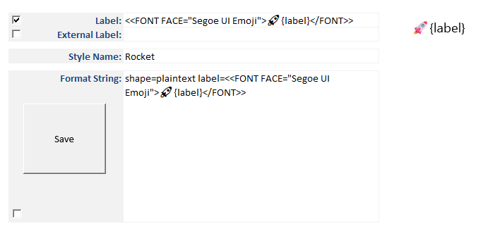
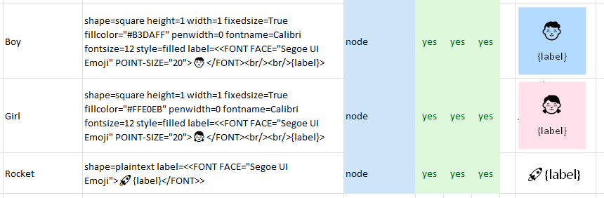
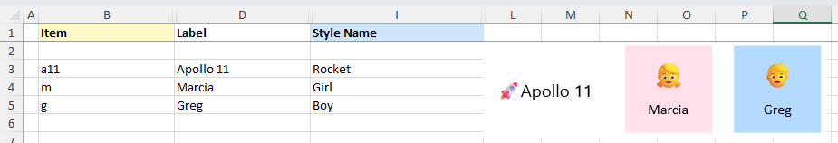

Version 10.4 of the *Relationship Visualizer* spreadsheet introduces a powerful new addition: **label templates with placeholders**. You can now define reusable label formats that automatically substitute values from the 4 label columns of the `data` worksheet. It's a simple idea that unlocks a lot of flexibility.

Here's what's supported:

| Element     | Supported Placeholders                               |
|-------------|--------------------------------------------------------|
| **Nodes**   | `{label}`, `{xlabel}`                                  |
| **Edges**   | `{label}`, `{xlabel}`, `{taillabel}`, `{headlabel}`    |
| **Clusters**| `{label}`                                              |

These placeholders are replaced during graph generation, giving you expressive, consistent labels while also making it easy to add icons, prefixes, suffixes, or other formatting without cluttering your underlying data.

## Where placeholders can be used

Placeholders work **anywhere** a label string can appear:

- HTML-like labels  
- Record shapes  
- Plaintext labels  
- Prefix/suffix patterns such as:  `label="Protocol: {label}"`

## Example: Add an emoji to labels

Let's say your data contains a label like `Apollo 11`, but you want it to appear in the graph as `🚀 Apollo 11`.

Create a style named **Rocket** using `shape=plaintext` and an HTML-like label template:

```
<<FONT FACE="Segoe UI Emoji">🚀 {label}</FONT>>
```

Build this style on the **style designer** tab:

|  |
| :-------------------------------------- |

::: tip
Checking the box next to **Label** tells the Style Designer to include the label text in the **Format String** when saving the style.
:::

::: info Reminder
Emoji fonts are OS‑dependent. Use any emoji‑capable font installed on your system. Windows and macOS include the following emoji fonts:
- Windows: **Segoe UI Emoji**
- macOS: **Apple Color Emoji**
:::

Save the style to the `styles` worksheet:



When the graph is visualized, `{label}` is replaced with the actual value and the result appears on the `data` worksheet like this:



::: info Color vs. Black and White
Emojis show up in full color when you publish SVG and PDF, but image formats like PNG, JPG, GIF, and BMP flatten them into black‑and‑white because those exports rasterize the emoji font.
:::

## What this means for your diagrams

- **Cleaner templates** - Formatting lives in your style definitions, not your data.  
- **More expressive diagrams** - It's now much easier to add emojis, icons, prefixes, suffixes, or even mix fonts in your labels.  
- **Consistent output** - Every node, edge, and cluster gets the same formatting automatically.

This feature opens the door to richer, more flexible styling with almost no extra work. I'm excited to see what you create with it.

If you give it a try, I'd love to hear how it works for you. Your feedback helps shape what comes next.

<Comments />
