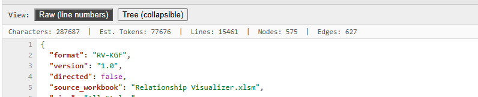
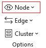
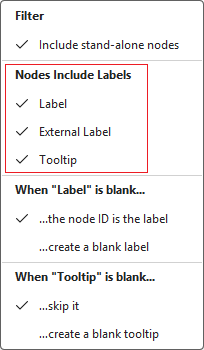
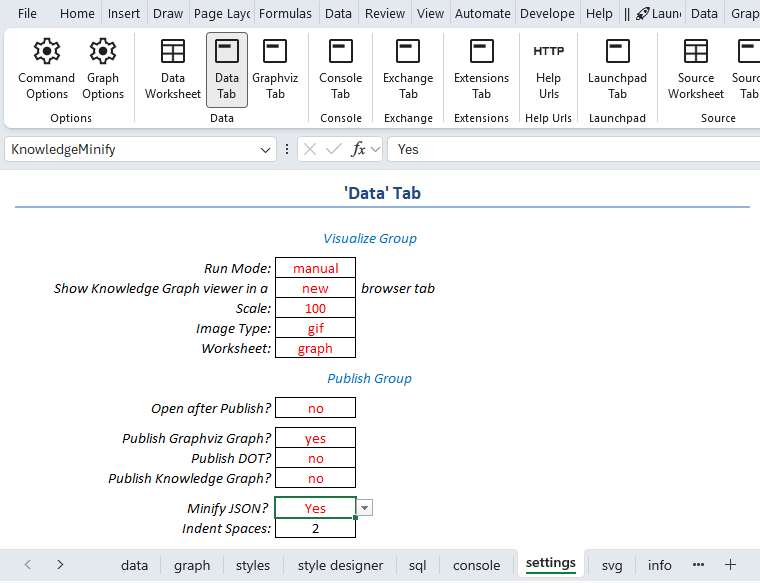

If you have read the blog post [I Let an AI Read My Knowledge Graph](/blog/posts/ai-reads-my-knowledge-graph.html) you saw a large Knowledge Graph in action.

This dataset with 574 nodes and 627 edges was a reasonable stress test, and it exposed file truncation as a real limit worth planning around. 

Using the techniques below, I was able to get the file size down to 190 KB, which an AI could successfully ingest. Here are a few things that help:

## Keep style names short

Every node and edge references its style by name, and that name repeats once per element that uses it. For example, values such as `guest_performer_with` in my source data costs more, at scale, than `guest`. This dataset's style names were on the verbose side, so shortening them trimmed real weight from the export.

I chose not to alter the underlying source data since I wanted the example to reflect a real, unedited dataset. Instead, I aliased the values in the SQL statements, and revised the corresponding style names on the `styles` worksheet. 

```sql
SELECT 
    [Band]      AS [Item],
    [Musician]  AS [Related Item],
    Switch(
      [Relationship] = "founding_member_of",   "founder",
      [Relationship] = "guest_performer_with", "guest",
      [Relationship] = "side_project_with",    "side_project",
      [Relationship] = "member_of",            "member",      
      True, [Relationship]
    )           AS [Style Name]
FROM   
    [musician-to-band$]
```

## Filter before you export, not after

Use a `WHERE` clause to scope the SQL to the slice of the graph you actually want analyzed, rather than exporting everything and hoping the AI's context window can hold it.

You can also take advantage of Relationship Visualizer's [View](/views/) capability to filter out styles. For example, I could have created a view which filtered out music genres such as `Punk Rock`, `Psychedelic Rock`, etc. to shrink the overall graph.

## Check the token estimator before you paste

The Knowledge Graph viewer includes a token estimate specifically so you know the cost up front. Character counts and token estimates are displayed in the status bar with each Knowledge Graph visualization.



::: tip How the token estimate is calculated

The token estimate shown in the status bar isn't an exact count. Getting an exact count would require running the same tokenizer the AI model uses, which varies by vendor and isn't practical to replicate for every export. Instead, the estimate uses a simple rule of thumb: roughly 4 characters per token, which holds up reasonably well for JSON.

The calculation always rounds up rather than truncating, so the estimate never comes in under the real count. On top of that, it adds an 8% safety buffer on top, to account for edge cases in how byte-pair encoding (BPE) tokenizers (the kind most AI models use) sometimes split text less efficiently than the 4-characters-per-token average suggests.

The result is intentionally conservative as it's better to overestimate token usage and have some headroom than to underestimate and get truncated mid-stream. Your mileage may vary. Tokenizers differ by model, and this estimate is meant as a helpful gut check, not a guarantee.
:::

## Prefer tools with larger context windows for large graphs

Not every AI tool handles the same file size equally well. Before assuming your graph needs to shrink further, try a tool with a larger context window as the limit may be the tool, not the data.

## Don't publish redundant data

My **Musician to Band Connections** example produces `xlabel`, `tooltip`, and `properties` elements. `xlabel` and `tooltip` are intended primarily for the visual presentation of the graph, but they can also be used for Knowledge Graph analysis when a `properties` object isn't present. `properties`, on the other hand, is used exclusively by the Knowledge Graph.

There is a single underlying model for the graph, but its output can be tailored uniquely, yet consistently, for each representation using the ribbon options. One set of choices can drive the visual graph while another drives the Knowledge Graph.

To keep your Knowledge Graph as small, output just `properties` when possible. Otherwise, output the label elements (`label`, `xlabel`, `taillabel`, `headlabel`) and/or `tooltip`. **Avoid outputting all of these elements at once if their data overlaps**, as this only adds redundant bulk to the graph.

For example, this node includes `xlabel`, `tooltip`, and `properties` all describing the same information:

```json
    {
      "id": "Eric Clapton",
      "style": "hall_of_famer",
      "xlabel": {
        "value": "Eric Clapton",
        "type": "text"
      },
      "tooltip": {
        "value": "Eric Clapton | guitarist 1945- UK  In the Rock & Roll Hall of Fame with The Yardbirds (1992), Cream (1993), & as a solo artist (2000).",
        "type": "text"
      },
      "properties": {
        "born": 1945,
        "instrument": "guitar",
        "role": "guitarist",
        "years_active": "1960s-present",
        "country": "UK",
        "hall_of_fame": true,
        "hall_of_fame_with": "The Yardbirds (1992), Cream (1993), & as a solo artist (2000)."
      }
    },
```

Since `properties` already covers everything `xlabel` and `tooltip` provide, the node can be condensed to this without losing fidelity:

```json
    {
      "id": "Eric Clapton",
      "style": "hall_of_famer",
      "properties": {
        "born": 1945,
        "instrument": "guitar",
        "role": "guitarist",
        "years_active": "1960s-present",
        "country": "UK",
        "hall_of_fame": true,
        "hall_of_fame_with": "The Yardbirds (1992), Cream (1993), & as a solo artist (2000)."
      }
    },
```

You can easily exclude labels and tooltips using the checkmarks on the `Node`, `Edge`, and `Cluster` dropdown lists in `Options` group on the `Data` ribbon tab. The example below shows the choices for Nodes.


| Options| Node Options |
| :-: | :-: |
| | |
| | |


## Minify your Knowledge Graph

Beyond trimming which elements you output, you can further reduce your Knowledge Graph's size by minifying it.

You can minify the Knowledge Graph in one of two ways: save the raw content directly from the Knowledge Graph viewer, or set the Data tab `Minify JSON?` publishing option to `Yes` on the settings worksheet before pressing **Publish**.

| `settings` worksheet, Data Tab, Minify JSON? |
| -------------- |
|  |

## Beware of Unicode characters

AI-generated or auto-corrected text often substitutes "smart" Unicode characters for their plain ASCII equivalents. For example, an em dash (`—`) instead of a hyphen (`-`), or curly quotes (`’`, `“`, `”`) instead of straight ones (`'`, `"`). These characters look nearly identical to a single character on screen, but they don't always behave that way once exported.

When exported to JSON, Unicode characters are escaped, and what displays as a single character can consume up to 5 characters in the output (e.g., `—` becomes `\u2014`). Multiplied across many rows, this adds up quickly: an em dash used instead of a hyphen across 1,000 rows adds roughly 4,000 extra characters, increasing both file size and token burden.

To keep your Knowledge Graph lean, review your text for Unicode substitutions and replace them with their plain ASCII equivalents where possible.

Use the table below as a quick find-and-replace reference for the most common offenders.

| Unicode Character | Name | ASCII Equivalent | Escaped Value | Chr() Value |
|:-:|:--|:-:|:-:|:-:|
| — | Em dash | `--` or `-` | `\u2014` | `Chr(8212)` |
| – | En dash | `-` | `\u2013` | `Chr(8211)` |
| ‘ | Left single quote | `'` | `\u2018` | `Chr(8216)` |
| ’ | Right single quote / apostrophe | `'` | `\u2019` | `Chr(8217)` |
| “ | Left double quote | `"` | `\u201c` | `Chr(8220)` |
| ” | Right double quote | `"` | `\u201d` | `Chr(8221)` |
| … | Ellipsis | `...` | `\u2026` | `Chr(8230)` |
| • | Bullet | `-` or `*` | `\u2022` | `Chr(8226)` |
| (nbh) | Non-breaking hyphen — invisible in most fonts | `-` | `\u2011` | `Chr(8209)` |
| ×  | Multiplication sign | `x` | `\u00d7` | `Chr(215)` |
| ÷ | Division sign | `/` | `\u00f7` | `Chr(247)` |
| → | Rightwards arrow | `->` | `\u2192` | `Chr(8594)` |
| © | Copyright sign | `(c)` | `\u00a9` | `Chr(169)` |
| ® | Registered sign | `(R)` | `\u00ae` | `Chr(174)` |
| ™ | Trademark sign | `(TM)` | `\u2122` | `Chr(8482)` |
| (nbsp) | Non-breaking space | ` ` | `\u00a0` | `Chr(160)` |

Relationship Visualizer's SQL engine supports nested `Replace()` calls which lets you clean up these substitutions inline as part of your import query rather than editing the source data by hand. Here's an example covering the three most common offenders:

```sql
SELECT 
    [ID]   AS [Item],
    Replace(
      Replace(
        Replace(
          [Description],
          Chr(8212), "-"     -- em dash (—) to hyphen
        ),
        Chr(8217), "'"       -- right single quote (’) to apostrophe
      ),
      Chr(8220), Chr(34)     -- left double quote (“) to straight quote
    )     AS [Tooltip]
FROM
    [musician-to-band$]
```

## What's your tip?

These are the techniques that got my export under the wire, but I doubt they're the only ones out there. If you've found other ways to keep a Knowledge Graph lean without losing fidelity, I'd like to hear about them. What tips would you add?

<Comments />
