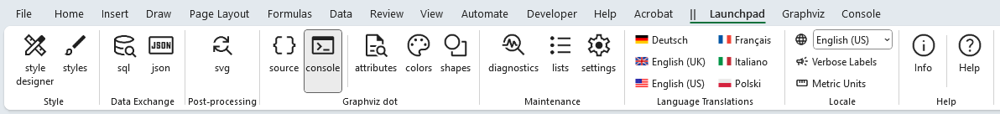
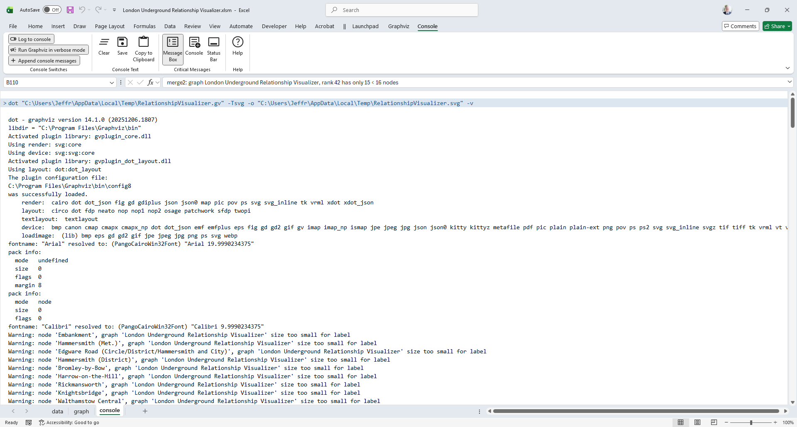
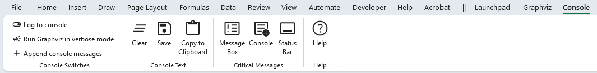
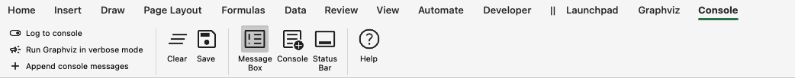
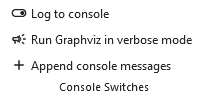
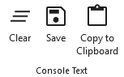
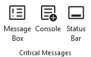
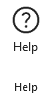

# Console Worksheet

## The `console` Worksheet

The `console` worksheet is reached from the `Graphviz dot` section of the [Launchpad](../launchpad/) ribbon tab.

|  |
| -------------------------------------------------- |

The `console` worksheet shows the messages emitted by the `dot` command when Graphviz runs.

Messages in the shaded rows are the `dot` commands issued when a Graphviz visualization is requested using the `dot` command. The messages emitted by `dot` are displayed against a white background. You have the choice of standard or verbose messages. You can also restrict the messages to the most recent dot invocation or append them in a running log.

|  |
| ---------------------------- |

## The `Console` Ribbon Tab

The **Console** ribbon tab is activated whenever the *console* worksheet is opened from the [Launchpad](../launchpad/). It appears as follows:

*Windows*
|  |
| ----------------------------- |

*macOS*
|  |
| ----------------------------- |

It contains the following groups, each of which is explained in the sections that follow. You may jump directly to any group using the links in this table:

| Group | Controls  |
| :---- | :--- |
| [Console Switches](#console-switches) |  |
| | |
| [Console Text](#console-text) |  |
| | |
| [Critical Messages](#critical-messages) |  |
| | |
| [Help](#help) |  |

### Console Switches

|  |
| -------------------------------------------------- |

| Label       | Control Type  | Description                                                                                                                                                                                                                        |
| ----------- | ------------- | ---------------------------------------------------------------------------------------------------------------------------------------------------------------------------------------------------------------------------------- |
| Log to console | Checkbox        | Turns logging of the Graphviz `dot` messages on/off. |
| Run Graphviz in verbose mode      | Checkbox        | When checked, appends the `-V` flag to the `dot` command which tells Graphviz to emit verbose messages. |
| Append console messages     | Checkbox        | Allows the console to display messages from a single `dot` invocation, or maintain a running log.  |

### Console Text

|  |
| -------------------------------------------------- |

| Name       | Control Type  | Description                                                                                                                                                                                                                        |
| ----------- | ------------- | ---------------------------------------------------------------------------------------------------------------------------------------------------------------------------------------------------------------------------------- |
| Clear | Button        | Resets the contents of the `console` worksheet. |
| Save to File      | Button        | Brings up a file save dialog which lets you save the console messages to a file. |
| Copy to Clipboard   | Button        | Copies the contents of the `console` worksheet to the clipboard (Windows OS only).  |

### Critical Messages

|  |
| -------------------------------------------------- |

| Name                         | Control Type | Description                                                                                           |
| ----------------------------- | ------------ | ----------------------------------------------------------------------------------------------------- |
| Log to console                | Toggle Button     | Enables or disables logging of Graphviz `dot` messages to the console.                               |
| Run Graphviz in verbose mode  | Toggle Button     | Appends the `-V` flag to the `dot` command, causing Graphviz to emit verbose diagnostic messages.     |
| Append console messages       | Toggle Button     | Determines whether the console shows only the current `dot` invocation or maintains a running log.    |

These buttons operate independently. You can deselect all of them to run silently, with no errors reported; select all of them so every reporting channel is used; or choose any combination in between.

### Help

|  |
| -------------------------------------------------- |

Provides a link to the `Help` content for the `console` worksheet (i.e. this web page).

| Name       | Control Type  | Description                                                                                                                                                                                                                        |
| ----------- | ------------- | ---------------------------------------------------------------------------------------------------------------------------------------------------------------------------------------------------------------------------------- |
| Help | Button        | Provides a link to this web page. |