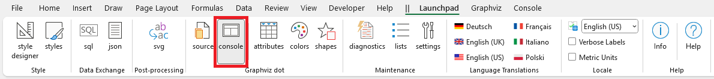
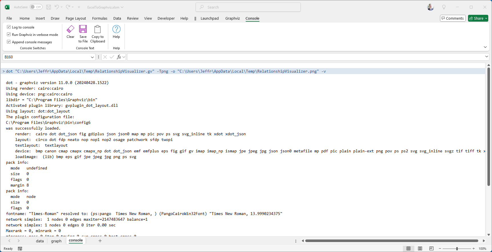
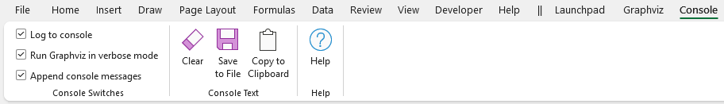
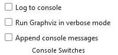
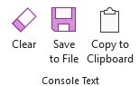
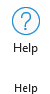

# Console Worksheet

## The `console` Worksheet

The `console` worksheet is reached from the `Graphviz dot` section of the [Launchpad](../launchpad/) ribbon tab.

|  |
| -------------------------------------------------- |

The `console` worksheet shows the messages emitted by the `dot` command when Graphviz runs.

Messages in the shaded rows are the `dot` commands issued when a Graphviz visualization is requested using the `dot` command. The messages emitted by `dot` are displayed against a white background. You have the choice of standard or verbose messages. You can also restrict the messages to the most recent dot invocation or append them in a running log.

## The `Console` Ribbon Tab

The `Console` ribbon tab is activated whenever the `console` worksheet is activated from the [Launchpad](../launchpad/). It appears as follows:

|  |
| -------------------------------------------------- |

It contains the following major groups:

- [Console Switches](./README.md#legal)
- [Console Text](./README.md#repositories)
- [Help](./README.md#lhelp)

### Console Switches

|  |
| -------------------------------------------------- |

| Label       | Control Type  | Description                                                                                                                                                                                                                        |
| ----------- | ------------- | ---------------------------------------------------------------------------------------------------------------------------------------------------------------------------------------------------------------------------------- |
| Log to console | Checkbox        | Turns logging of the Graphviz `dot` messages on/off. |
| Run Graphviz in verbose mode      | Checkbox        | When checked, appends the `-V` flag to the `dot` command which tells Graphviz to emit verbose messages. |
| Append console messages     | Checkbox        | Allows the console to display messages from a single `dot` invocation, or maintain a running log.  |

### Console Text

|  |
| -------------------------------------------------- |

| Label       | Control Type  | Description                                                                                                                                                                                                                        |
| ----------- | ------------- | ---------------------------------------------------------------------------------------------------------------------------------------------------------------------------------------------------------------------------------- |
| Clear | Button        | Resets the contents of the `console` worksheet. |
| Save to File      | Button        | Brings up a file save dialog which lets you save the console messages to a file. |
| Copy to Clipboard   | Button        | Copies the contents of the `console` worksheet to the clipboard (Windows OS only).  |

### Help

|  |
| -------------------------------------------------- |

Provides a link to the `Help` content for the `console` worksheet (i.e. this web page).

| Label       | Control Type  | Description                                                                                                                                                                                                                        |
| ----------- | ------------- | ---------------------------------------------------------------------------------------------------------------------------------------------------------------------------------------------------------------------------------- |
| Help | Button        | Provides a link to this web page. |