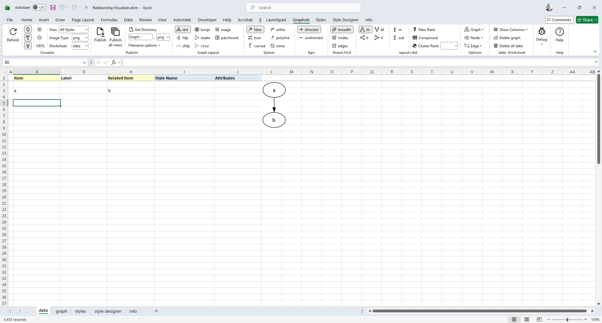
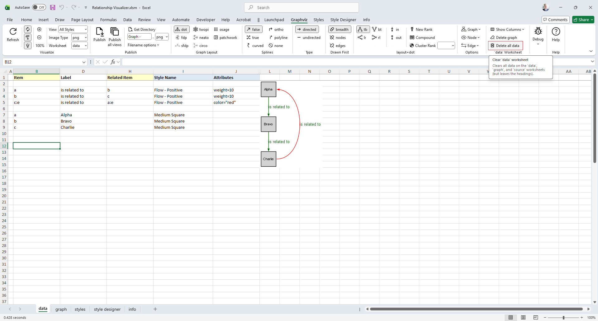

# Core Concepts

The simplest way to draw a graph is to place values in the `Item` and the `Related Item` columns. 

For our first graph, we will draw an _'a' is related to 'b'_ relationship.
1. Click on the `Graphviz` ribbon tab to activate it (if it is not the current active tab)
2. Enable the `Automatic` toggle button (if it is not already checked)
3. Ensure the `Workbook` dropdown is set to `data`, which will cause the graph to be displayed within the data worksheet.
4. In row 3 type 'a' in the `Item` column, and 'b' in the `Related Item` column. The result will be drawn beside the data as you change cells.

The results should resemble the following example:



_Graphviz Source_

```
digraph "Relationship Visualizer"
{
    a -> b;
}
```

**Congratulations**, you have created your first graph!

::: tip
- If the `Automatic` toggle button is enabled the graph will draw as data is entered into each cell. 
- If the `Automatic` toggle button is disabled, pressing the `Refresh Graph` button is necessary to draw the graph. 
:::

## Connect More Items

Next, lets expand upon the graph we just created to have additional relationships. Assume that:

- _'a' is related to 'b'_ (already drawn)
- _'b' is related to 'c'_
- _'c' is related to 'a'_

The Excel data appears as shown on rows 3-5. The Excel worksheet now looks like:


_Graphviz Source_

```
digraph "Relationship Visualizer"
{
    a -> b;
    b -> c;
    c -> a;
}
```

## Add Edge Labels

Now, let us add data into the `Label` column to label the relationships. Fill in Column D as shown below. Press the `Refresh Graph` button, and the Excel worksheet now looks like:


_Graphviz Source_

```
digraph "Relationship Visualizer"
{
    a -> b[ label="is related to" ];
    b -> c[ label="is related to" ];
    c -> a[ label="is related to" ];
}
```

## Add Node Labels

The graph is how we want to see it, but the nodes need to be labeled. We do not want to change all our edges; however, we would like to replace 'a' with 'Alpha', 'b' with 'Bravo', and 'c' with 'Charlie'. The Relationship Visualizer assumes that when there is information in the `Item` column, but not in the `Related Item` column that the data corresponds to a node.

To label the nodes we will add 3 node definitions to the "data worksheet (rows 6, 7, 8) and press the `Refresh Graph` button. The Excel worksheet now looks like:


_Graphviz Source_

```
digraph "Relationship Visualizer"
{
    a -> b[ label="is related to" ];
    b -> c[ label="is related to" ];
    c -> a[ label="is related to" ];
    a [ label="Alpha" ];
    b [ label="Bravo" ];
    c [ label="Charlie" ];
}
```

## Apply a pre-defined node style

Next we will apply a pre-defined style to the nodes. Later on we will learn how to create our own node styles, but for now we will choose one of the default styles provided out of the box.

On rows 7, 8, and 9 tab to the `Style Name` column. A dropdown list will appear. Select the style `Medium Square`. The Excel worksheet now looks like:


_Graphviz Source_

```
strict digraph "main"
digraph "Relationship Visualizer"
{
    a -> b[ label="is related to" ];
    b -> c[ label="is related to" ];
    c -> a[ label="is related to" ];
    a [ shape=square height=0.5 width=0.5 fixedsize=True style=filled penwidth=1 fontname=Arial fontsize=8 label="Alpha" ];
    b [ shape=square height=0.5 width=0.5 fixedsize=True style=filled penwidth=1 fontname=Arial fontsize=8 label="Bravo" ];
    c [ shape=square height=0.5 width=0.5 fixedsize=True style=filled penwidth=1 fontname=Arial fontsize=8 label="Charlie" ];
}
```

## Apply a pre-defined edge style

Next we will apply a pre-defined style to the edges. Later on we will learn how to create our own edge styles, but for now we will choose one of the default styles provided out of the box.

On rows 3, 4, and 5 move to the `Style Name` column. A dropdown list will appear. Select the style `Flow - Positive`. This style uses the color `dark green`.

The Excel worksheet now looks like:


_Graphviz Source_

```
digraph "Relationship Visualizer"
{
    a -> b[ fontname=Arial fontsize=10 color=darkgreen fontcolor=darkgreen arrowsize=0.5 label="is related to" ];
    b -> c[ fontname=Arial fontsize=10 color=darkgreen fontcolor=darkgreen arrowsize=0.5 label="is related to" ];
    c -> a[ fontname=Arial fontsize=10 color=darkgreen fontcolor=darkgreen arrowsize=0.5 label="is related to" ];
    a [ shape=square height=0.5 width=0.5 fixedsize=True style=filled penwidth=1 fontname=Arial fontsize=8 label="Alpha" ];
    b [ shape=square height=0.5 width=0.5 fixedsize=True style=filled penwidth=1 fontname=Arial fontsize=8 label="Bravo" ];
    c [ shape=square height=0.5 width=0.5 fixedsize=True style=filled penwidth=1 fontname=Arial fontsize=8 label="Charlie" ];
}
```

## Apply an attribute to an edge

Next we will override the color on one of the edges. 

On rows 5 move to the `Attributes` column. Enter the value `color="red"`. The edge color will change from `dark green` to `red`. The font color, however will remain dark green.

The Excel worksheet now looks like:


_Graphviz Source_

```
digraph "Relationship Visualizer"
{
    a -> b[ fontname=Arial fontsize=10 color=darkgreen fontcolor=darkgreen arrowsize=0.5 label="is related to" ];
    b -> c[ fontname=Arial fontsize=10 color=darkgreen fontcolor=darkgreen arrowsize=0.5 label="is related to" ];
    c -> a[ fontname=Arial fontsize=10 color=darkgreen fontcolor=darkgreen arrowsize=0.5 color="red" label="is related to" ];
    a [ shape=square height=0.5 width=0.5 fixedsize=True style=filled penwidth=1 fontname=Arial fontsize=8 label="Alpha" ];
    b [ shape=square height=0.5 width=0.5 fixedsize=True style=filled penwidth=1 fontname=Arial fontsize=8 label="Bravo" ];
    c [ shape=square height=0.5 width=0.5 fixedsize=True style=filled penwidth=1 fontname=Arial fontsize=8 label="Charlie" ];
}
```

## Specify Ports

Graphviz decides what it thinks is the best placement of the head and tail of an edge to produce a balanced graph.

Sometimes you might want to control where the edges begin or end. You can do that by specifying a port on the `Item` or `Related Item` ID, in the same manner as a URL. Ports are identified by a colon character `:` and then a compass point `n`, `s`, `e`, `w`, `ne`, `nw`, `se`, `sw` or `c` for center.

Lets change row 5 from the example above to have the edge from "c" to "a" exit from the east port of "c", and enter the east port of "a". The `Item` is now specified as `c:e`, and the Related Item is specified as `a:e` as shown in row 5. Press the `Refresh Graph` button, and the Excel worksheet now looks like:


_Graphviz Source_

```
digraph "Relationship Visualizer"
{
    a -> b[ fontname=Arial fontsize=10 color=darkgreen fontcolor=darkgreen arrowsize=0.5 label="is related to" ];
    b -> c[ fontname=Arial fontsize=10 color=darkgreen fontcolor=darkgreen arrowsize=0.5 label="is related to" ];
    c:e -> a:e[ fontname=Arial fontsize=10 color=darkgreen fontcolor=darkgreen arrowsize=0.5 color="red" label="is related to" ];
    a [ shape=square height=0.5 width=0.5 fixedsize=True style=filled penwidth=1 fontname=Arial fontsize=8 label="Alpha" ];
    b [ shape=square height=0.5 width=0.5 fixedsize=True style=filled penwidth=1 fontname=Arial fontsize=8 label="Bravo" ];
    c [ shape=square height=0.5 width=0.5 fixedsize=True style=filled penwidth=1 fontname=Arial fontsize=8 label="Charlie" ];
}
```

## Straighten Edges

Graphviz has a `weight` attribute which tells it to favor straighter lines. Lets add the attribute on rows 3, and 4 to tidy up the diagram. In the `Attributes` column add the value `weight=10`. The graph now appears as:


_Graphviz Source_

```
digraph "Relationship Visualizer"
{
    a -> b[ fontname=Arial fontsize=10 color=darkgreen fontcolor=darkgreen arrowsize=0.5 weight=10 label="is related to" ];
    b -> c[ fontname=Arial fontsize=10 color=darkgreen fontcolor=darkgreen arrowsize=0.5 weight=10 label="is related to" ];
    c:e -> a:e[ fontname=Arial fontsize=10 color=darkgreen fontcolor=darkgreen arrowsize=0.5 color="red" label="is related to" ];
    a [ shape=square height=0.5 width=0.5 fixedsize=True style=filled penwidth=1 fontname=Arial fontsize=8 label="Alpha" ];
    b [ shape=square height=0.5 width=0.5 fixedsize=True style=filled penwidth=1 fontname=Arial fontsize=8 label="Bravo" ];
    c [ shape=square height=0.5 width=0.5 fixedsize=True style=filled penwidth=1 fontname=Arial fontsize=8 label="Charlie" ];
}
```

## Delete all data

Lets start by clearing the `data` worksheet so that we can create a new graph with clusters. Click on the `Delete all data` button. 

_Notice that if you hover the mouse over a Ribbon control a tooltip of help will appear._ 

Once you click `Delete all data` the `data` worksheet is reset to blank form. 



## Specify Clusters

With the `data` worksheet cleared, lets create a new graph.

If you wish to cluster some elements of the graph you can do so by adding a row with an open brace "{" in the `Item` column above the first row of data to be placed in the group and provide a title for the cluster in the `Label` column. Next, add row with a close brace "}" in the `Item` column after the last row of data.

For example, this Excel worksheet does not have clusters.


_Graphviz Source_

```
digraph "Relationship Visualizer"
{
    start -> a0;
    a0 -> a1;
    a1 -> a2;
    a2 -> end;
}
```

To cluster nodes a0, a1, and a2, calling the cluster "process \#1" the worksheet is revised to add an open brace {with the label "process \#1" on row 3, and a close brace } on rows 6 as follows.

Press the `Refresh Graph` button, and the Excel worksheet now looks like:


_Graphviz Source_

```
digraph "Relationship Visualizer"
{
    start -> a0;
    subgraph "cluster_1" {  label="process #1"
        a0 -> a1;
        a1 -> a2;
    }
    a2 -> end;
}
```

## Specify Clusters Within Clusters

Graphviz permits clusters within clusters. Let us extend the example by adding an additional set of braces to cluster the relationship between a1 and a2. We will insert a new row 5 placing an open brace { in the `Item` column with the Label column set to "process \#2", and a new row 7 with a close brace } in the `Item` column.

Press the `Refresh Graph` button, and the Excel worksheet now looks like:


_Graphviz Source_

```
digraph "Relationship Visualizer"
{
    start -> a0;
    subgraph "cluster_1" {  label="process #1"
        a0 -> a1;
        subgraph "cluster_2" {  label="process #2"
            a1 -> a2;
        }
    }
    a2 -> end;
}
```

Graphviz does not limit the number of clusters you can have. In this example, we have added rows 10-14 to insert an additional cluster labeled "process #3".

Press the `Refresh Graph` button, and the Excel worksheet now looks like:


_Graphviz Source_

```
digraph "Relationship Visualizer"
{
    start -> a0;
    subgraph "cluster_1" {  label="process #1"
        a0 -> a1;
        subgraph "cluster_2" {  label="process #2"
            a1 -> a2;
        }
    }
    a2 -> end;
    start -> b0;
    subgraph "cluster_3" {  label="process #3"
        b0 -> b1;
    }
    b1 -> end;
}
```

What is important to note is that you must ensure that you have an equal number of open braces as you do close braces. 

::: warning
Graphviz will not draw the graph if there is a mismatch between the number of open `{` and close `}` braces.
:::

## Specify Comma-separated Items

Another feature of the Relationship Visualizer is the ability to specify a comma-separated list of Item names and have a relationship created for each Item. For example, we can say that Mr. Brady is the father of Greg, Peter, and Bobby on one row as follows:


_Graphviz Source_

```
digraph "Relationship Visualizer"
{
    "Mr. Brady" -> Greg[ label="Father of" ];
    "Mr. Brady" -> Peter[ label="Father of" ];
    "Mr. Brady" -> Bobby[ label="Father of" ];
}
```

The comma-separated list can also appear in the `Item` column, such as:


_Graphviz Source_

```
digraph "Relationship Visualizer"
{
    Marcia -> "Mrs. Brady"[ label="Daughter of" ];
    Jan -> "Mrs. Brady"[ label="Daughter of" ];
    Cindy -> "Mrs. Brady"[ label="Daughter of" ];
}
```

Or a comma-separated list can be used in both the `Item`, and the `Related Item` column such as the parental relationship below:


_Graphviz Source_

```
digraph "Relationship Visualizer"
{
    "Mr. Brady" -> Greg;
    "Mr. Brady" -> Peter;
    "Mr. Brady" -> Bobby;
    "Mr. Brady" -> Marcia;
    "Mr. Brady" -> Jan;
    "Mr. Brady" -> Cindy;
    "Mrs. Brady" -> Greg;
    "Mrs. Brady" -> Peter;
    "Mrs. Brady" -> Bobby;
    "Mrs. Brady" -> Marcia;
    "Mrs. Brady" -> Jan;
    "Mrs. Brady" -> Cindy;
}
```

