# Creating Graphs

You have installed Graphviz, and extracted the contents of the `Relationship Visualizer` zip file. It is time to create some graphs.

::: tip Shortcuts
- [Graph Construction Basic Concepts](./README.md#graph-construction-basic-concepts). 
- [The `data` Worksheet](./README.md#the-data-worksheet)
- [The `Graphviz` Ribbon Tab](./README.md#the-graphviz-ribbon-tab) 
:::

## Prepare a New Microsoft Excel Workbook

### Create a New Workbook from the `Relationship Visualizer` Template

The first action is to launch Microsoft Excel. When Excel starts, it will suggest sample spreadsheets you can create. This will contain the Relationship Visualizer template which you saved as a template as part of the installation steps. Select this template to create a new workbook.

|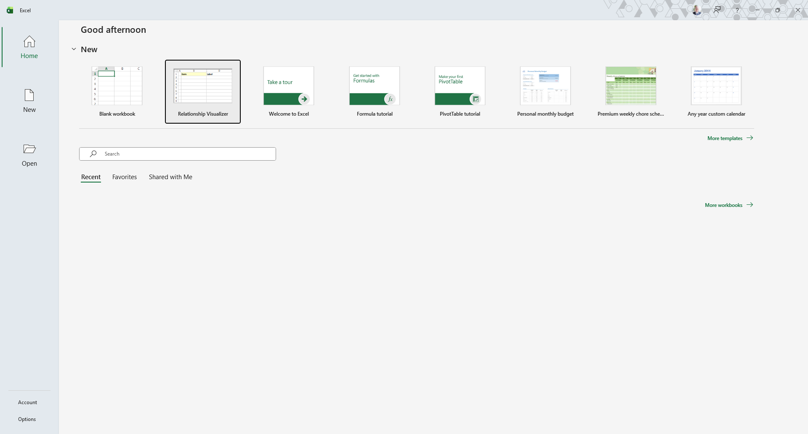|
|--------------------------------------------------|

### Save the Workbook as a Macro-Enabled Workbook

The workbook will appear as shown below.

||
|--------------------------------------------------|

Perform a "**FILE -> Save As**" action. Choose a directory where you would like to save the file and change the file name from `Relationship Visualizer1` to something meaningful to you.

The most important step is to set the `Save as type:` dropdown list item as **Excel Macro-Enabled Workbook (*.xlsm)**. You will not be able to run the macros that create the visualizations unless the workbook is _macro-enabled_.

||
|--------------------------------------------------|

The Relationship Visualizer provides macros through seven Excel Fluent UI ribbon tabs named `Graphviz`, `Style Designer`, `SQL`, `Source`, `SVG`, and `Exchange`. The appropriate ribbon tab will appear and/or activate as you change worksheets.

The workbook you just saved may show a **BLOCKED CONTENT** message. Click the `Trust Center` button.

|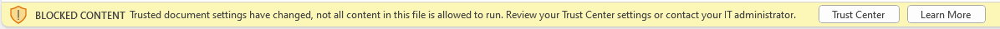|
|--------------------------------------------------|

The security settings for running macros will be displayed. Choose the `Enable VBA macros (not recommended; potentially dangerous code can run)` radio button, and press `OK`.

|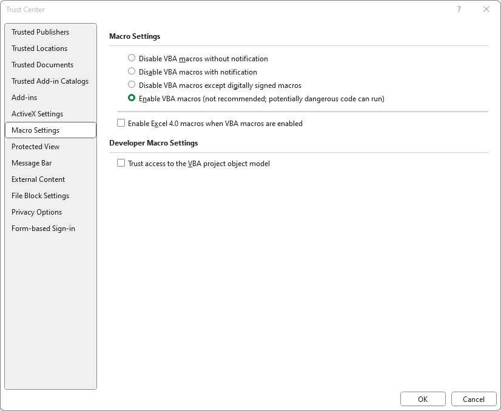|
|--------------------------------------------------|

### Close and Reopen the New Workbook

Assuming that you changed the file name from `Relationship Visualizer1 `to something meaningful to you, you should now close the file and reopen it.

When you reopen the workbook the message stating that macros have been blocked will be gone. The spreadheet will appear as follows, displaying a `data` worksheet and a custom ribbon tab named `Graphviz`.

|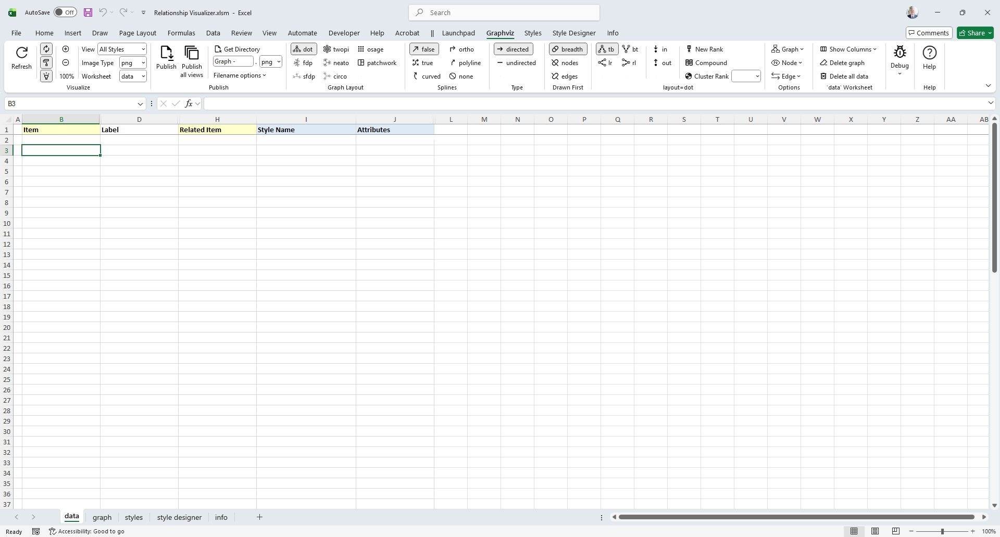|
|--------------------------------------------------|

::: warning WARNING - Ribbon Fails to Update Dynamically After “Save As”
When you use **File → Save As** to change the workbook’s file name, Excel continues to associate the ribbon with the *original* file name. Because of this stale reference, any code that programmatically switches ribbon tabs will stop working.

To work around the issue, you can either manually switch tabs as you move between worksheets, or close and reopen the workbook. Reopening forces Excel to reload the ribbon under the new file name, restoring normal tab‑switching behavior.

This is a known issue in **Microsoft Excel** that affects workbooks using a custom ribbon ([1](https://stackoverflow.com/questions/33673898/macro-button-under-customized-ribbon-tab-tries-to-open-old-excel-file), [2](https://www.mrexcel.com/board/threads/custom-ribbon-macros-point-to-old-workbook.1257482/)). 

:::

::: tip
Any time you save a copy of the spreadsheet using **File → Save As** and change the workbook’s file name, you should close the workbook and reopen it. This forces Excel to reload the custom ribbon under the new file name and restores normal tab‑switching behavior.
:::

## The `data` Worksheet

The `data` worksheet is the core worksheet you will use to create graphs. 

Before we create our first graph, lets gain an understanding of the mandatory and optional columns on this worksheet.

### Worksheet Columns

The `data` Worksheet has 11 columns (A-K):

| A | B | C | D | E | F | G | H | I | J | K |
|---|---|---|---|---|---|---|---|---|---|---|
| [Indicator](./README.md#indicator) | [Item](./README.md#item) | [Tail Label](./README.md#tail-label) | [Label](./README.md#label) | [External Label](./README.md#external-label) | [Head Label](./README.md#head-label) | [Tooltip](./README.md#tooltip) | [Related Item](./README.md#related-item) | [Style Name](./README.md#style-name) | [Attributes](./README.md#attributes) | [Messages](./README.md#messages) |

#### Indicator

The `Indicator` column is used to draw special attention to a row.
- A `#` hash character treats the row as a comment. The text in the row will turn green, and no data in this row will be included in the graph. 
- An `!` exclamation mark character will appear if errors are detected in your data on this row. The row will turn red, and an error message will be displayed in the [Messages](./README.md#messages) column.

#### Item

The `Item` column serves two purposes. 
- For nodes, it is a unique identifier of the node. 
- For edges, it is the unique identifier of the `from` node in a (`from`, `to`) node pairing.
- **Mandatory** column for nodes and edges.

#### Tail Label

The `Tail Label` column contains a text label to be placed near the tail of an edge.
- Only used if an edge relationship has been specified.
- Optional column, hidden by default.
- Inclusion in graph can be toggled on/off. 

#### Label

The `Label` column contains text to use to label a node, edge, or cluster.
- When specified for nodes, the value is placed inside the shape.
- When specified for edges, the value is placed near the spline.
- Optional column.
- Inclusion in graph can be toggled on/off. 

#### External Label

The `External Label` column contains text to use to label a node, or an edge.
- When specified for nodes, the value is placed outside the shape, typically above and to the left of the shape.
- When specified for edges, the value is placed away from the spline. 
- Optional column, hidden by default.
- Inclusion in graph can be toggled on/off. 

If neither a `Label` or `External Label` is specified then the graph will default to showing the `Item` value as the inside label of nodes, and no data for edges.

#### Head Label

The `Head Label` column contains a text label to be placed near the head of an edge. 
- Only used if an edge relationship has been specified.
- Optional column, hidden by default.
- Inclusion in graph can be toggled on/off.

#### Tooltip 

The `Tooltip` column specifies text to be displayed as a tooltip for clusters, nodes, or edges.
- Only applies to graphs saved as files in the `SVG` format.
- Optional column, hidden by default.

#### Related Item 

The `Related Item` column is the unique identifier of the `to` node in a (`from`, `to`) node pairing.
- **Mandatory** column when specifying a relationship (edge).

#### Style Name 

The `Style Name` column indicates which style definition in the `styles` worksheet to use when drawing the graph.
- Optional column.
- Inclusion in graph can be toggled on/off.

#### Attributes 

The `Attributes` column provides a means to add extra elements of style which will only apply to a single row. For example, you can place style attributes in this column to change the color of a key relationship, or the fill color of a key shape you wish to highlight.
- Optional column.
- Inclusion in graph can be toggled on/off.

#### Messages

When the graphing macros run, they check for common data mistakes, such as specifying only one node for an edge.

If mistakes are found, they are reported in this column. Additionally, an exclamation mark (!) is placed in the `Indicator` column, and the row is highlighted in red to draw your attention to the error.

- Column is hidden by default.
- Column is shown if an error is detected.

#### Show Hidden Columns

The columns for `Tail Label` (C), `External Label` (E), `Head Label` (F), `Tooltip` (G), and `Messages` (K) are hidden by default, since they are less frequently used. 

You can quickly toggle the visibility of these columns by selecting the column name from the list in the dropdown menu beneath the `Show Columns` button in the **'data' Worksheet** group' on the right side of the Ribbon.
|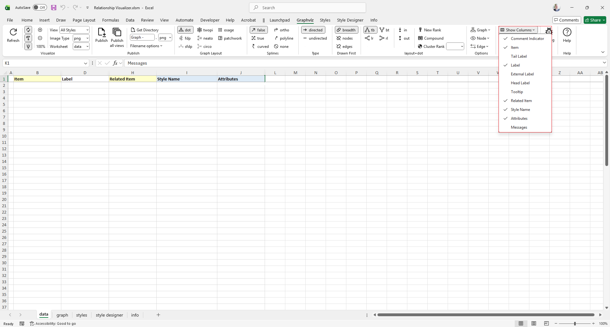|
|--------------------------------------------------|

## Graph Construction Basic Concepts

### Creating Your First Graph

The simplest way to draw a graph is to place values in the `Item` and the `Related Item` columns. 
- If the `Automatic` checkbox is checked the graph will draw as data is entered into each cell. 
- If the `Automatic` checkbox is not checked, press the `Refresh Graph` button is necessary to draw the graph.

For our first graph, we will draw an _'a' is related to 'b'_ relationship.
1. Click on the `Graphviz` ribbon tab to activate it (if it is not the current active tab)
2. Click the `Automatic` checkbox (if it is not already checked)
3. Ensure the `Workbook` dropdown is set to `data`, which will cause the graph to be displayed within the data worksheet.
4. In row 3 type 'a' in the `Item` column, and 'b' in the `Related Item` column. The result will be drawn beside the data as you change cells.

The results should resemble the following example:

||
|--------------------------------------------------|

_Graphviz Source_

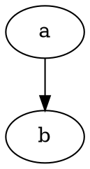
```dot
digraph "Relationship Visualizer"
{
    a -> b;
}
```

**Congratulations**, you have created your first graph!

### Connect More Items

Next, lets expand upon the graph we just created to have additional relationships. Assume that:

- _'a' is related to 'b'_ (already drawn)
- _'b' is related to 'c'_
- _'c' is related to 'a'_

The Excel data appears as shown on rows 3-5. The Excel worksheet now looks like:

|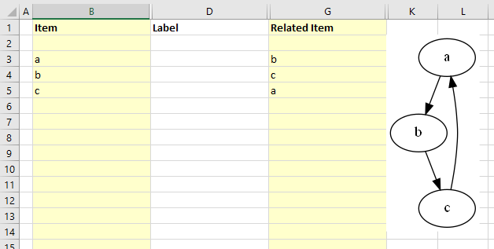|
|--------------------------------------------------|

_Graphviz Source_

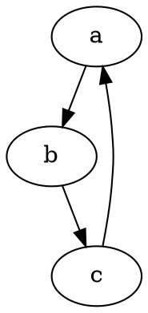
```dot
digraph "Relationship Visualizer"
{
    a -> b;
    b -> c;
    c -> a;
}
```

### Add Edge Labels

Now, let us add data into the `Label` column to label the relationships. Fill in Column D as shown below. Press the `Refresh Graph` button, and the Excel worksheet now looks like:

|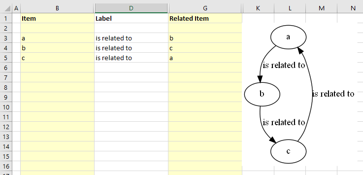|
|--------------------------------------------------|

_Graphviz Source_

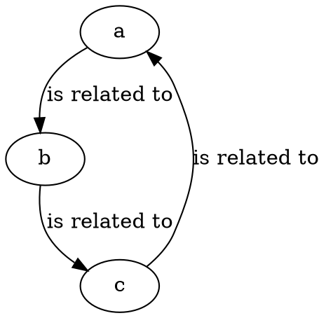
```dot
digraph "Relationship Visualizer"
{
    a -> b[ label="is related to" ];
    b -> c[ label="is related to" ];
    c -> a[ label="is related to" ];
}
```

### Add Node Labels

The graph is how we want to see it, but the nodes need to be labeled. We do not want to change all our edges; however, we would like to replace 'a' with 'Alpha', 'b' with 'Bravo', and 'c' with 'Charlie'. The Relationship Visualizer assumes that when there is information in the `Item` column, but not in the `Related Item` column that the data corresponds to a node.

To label the nodes we will add 3 node definitions to the "data worksheet (rows 6, 7, 8) and press the `Refresh Graph` button. The Excel worksheet now looks like:

|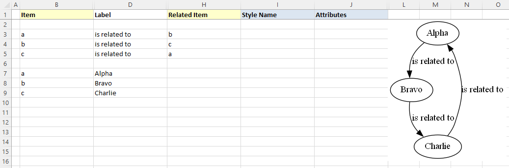|
|--------------------------------------------------|

_Graphviz Source_

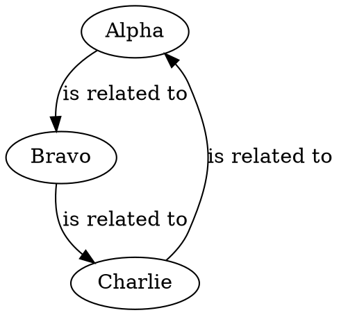
```dot
digraph "Relationship Visualizer"
{
    a -> b[ label="is related to" ];
    b -> c[ label="is related to" ];
    c -> a[ label="is related to" ];
    a [ label="Alpha" ];
    b [ label="Bravo" ];
    c [ label="Charlie" ];
}
```

### Apply a pre-defined node style

Next we will apply a pre-defined style to the nodes. Later on we will learn how to create our own node styles, but for now we will choose one of the default styles provided out of the box.

On rows 7, 8, and 9 tab to the `Style Name` column. A dropdown list will appear. Select the style `Medium Square`. The Excel worksheet now looks like:

|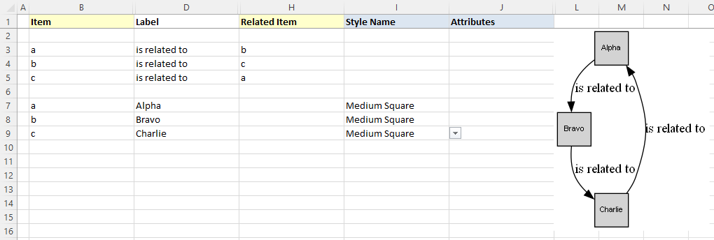|
|--------------------------------------------------|

_Graphviz Source_

```dot
strict digraph "main"
digraph "Relationship Visualizer"
{
    a -> b[ label="is related to" ];
    b -> c[ label="is related to" ];
    c -> a[ label="is related to" ];
    a [ shape=square height=0.5 width=0.5 fixedsize=True style=filled penwidth=1 fontname=Arial fontsize=8 label="Alpha" ];
    b [ shape=square height=0.5 width=0.5 fixedsize=True style=filled penwidth=1 fontname=Arial fontsize=8 label="Bravo" ];
    c [ shape=square height=0.5 width=0.5 fixedsize=True style=filled penwidth=1 fontname=Arial fontsize=8 label="Charlie" ];
}
```

### Apply a pre-defined edge style

Next we will apply a pre-defined style to the edges. Later on we will learn how to create our own edge styles, but for now we will choose one of the default styles provided out of the box.

On rows 3, 4, and 5 move to the `Style Name` column. A dropdown list will appear. Select the style `Flow - Positive`. This style uses the color `dark green`.

The Excel worksheet now looks like:

|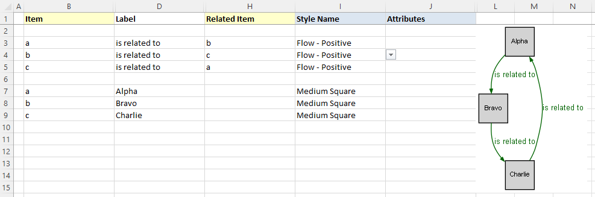|
|--------------------------------------------------|

_Graphviz Source_

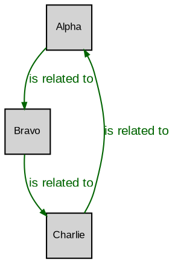
```dot
digraph "Relationship Visualizer"
{
    a -> b[ fontname=Arial fontsize=10 color=darkgreen fontcolor=darkgreen arrowsize=0.5 label="is related to" ];
    b -> c[ fontname=Arial fontsize=10 color=darkgreen fontcolor=darkgreen arrowsize=0.5 label="is related to" ];
    c -> a[ fontname=Arial fontsize=10 color=darkgreen fontcolor=darkgreen arrowsize=0.5 label="is related to" ];
    a [ shape=square height=0.5 width=0.5 fixedsize=True style=filled penwidth=1 fontname=Arial fontsize=8 label="Alpha" ];
    b [ shape=square height=0.5 width=0.5 fixedsize=True style=filled penwidth=1 fontname=Arial fontsize=8 label="Bravo" ];
    c [ shape=square height=0.5 width=0.5 fixedsize=True style=filled penwidth=1 fontname=Arial fontsize=8 label="Charlie" ];
}
```

### Apply an attribute to an edge

Next we will override the color on one of the edges. 

On rows 5 move to the `Attributes` column. Enter the value `color="red"`. The edge color will change from `dark green` to `red`. The font color, however will remain dark green.

The Excel worksheet now looks like:

|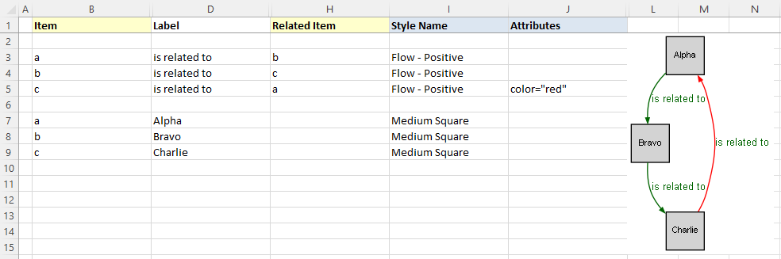|
|--------------------------------------------------|

_Graphviz Source_

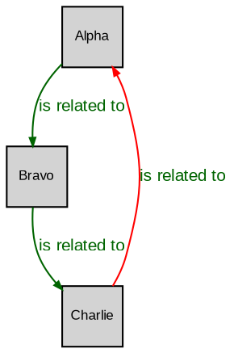
```dot
digraph "Relationship Visualizer"
{
    a -> b[ fontname=Arial fontsize=10 color=darkgreen fontcolor=darkgreen arrowsize=0.5 label="is related to" ];
    b -> c[ fontname=Arial fontsize=10 color=darkgreen fontcolor=darkgreen arrowsize=0.5 label="is related to" ];
    c -> a[ fontname=Arial fontsize=10 color=darkgreen fontcolor=darkgreen arrowsize=0.5 color="red" label="is related to" ];
    a [ shape=square height=0.5 width=0.5 fixedsize=True style=filled penwidth=1 fontname=Arial fontsize=8 label="Alpha" ];
    b [ shape=square height=0.5 width=0.5 fixedsize=True style=filled penwidth=1 fontname=Arial fontsize=8 label="Bravo" ];
    c [ shape=square height=0.5 width=0.5 fixedsize=True style=filled penwidth=1 fontname=Arial fontsize=8 label="Charlie" ];
}
```

### Specify Ports

Graphviz decides what it thinks is the best placement of the head and tail of an edge to produce a balanced graph.

Sometimes you might want to control where the edges begin or end. You can do that by specifying a port on the `Item` or `Related Item` ID, in the same manner as a URL. Ports are identified by a colon character `:` and then a compass point `n`, `s`, `e`, `w`, `ne`, `nw`, `se`, `sw` or `c` for center.

Lets change row 5 from the example above to have the edge from "c" to "a" exit from the east port of "c", and enter the east port of "a". The `Item` is now specified as `c:e`, and the Related Item is specified as `a:e` as shown in row 5. Press the `Refresh Graph` button, and the Excel worksheet now looks like:

|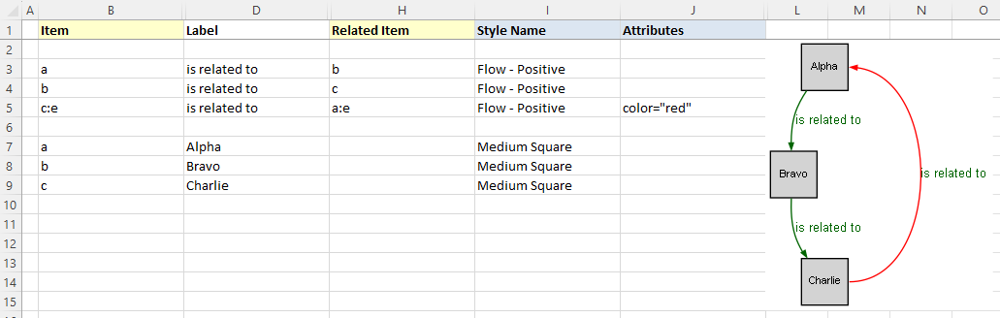|
|--------------------------------------------------|

_Graphviz Source_

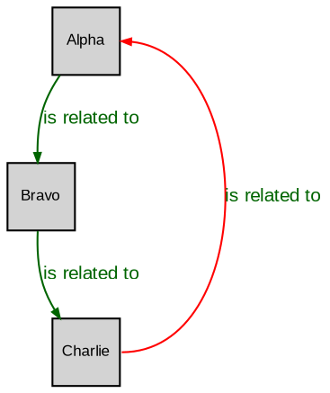
```dot
digraph "Relationship Visualizer"
{
    a -> b[ fontname=Arial fontsize=10 color=darkgreen fontcolor=darkgreen arrowsize=0.5 label="is related to" ];
    b -> c[ fontname=Arial fontsize=10 color=darkgreen fontcolor=darkgreen arrowsize=0.5 label="is related to" ];
    c:e -> a:e[ fontname=Arial fontsize=10 color=darkgreen fontcolor=darkgreen arrowsize=0.5 color="red" label="is related to" ];
    a [ shape=square height=0.5 width=0.5 fixedsize=True style=filled penwidth=1 fontname=Arial fontsize=8 label="Alpha" ];
    b [ shape=square height=0.5 width=0.5 fixedsize=True style=filled penwidth=1 fontname=Arial fontsize=8 label="Bravo" ];
    c [ shape=square height=0.5 width=0.5 fixedsize=True style=filled penwidth=1 fontname=Arial fontsize=8 label="Charlie" ];
}
```

### Straighten Edges

Graphviz has a `weight` attribute which tells it to favor straighter lines. Lets add the attribute on rows 3, and 4 to tidy up the diagram. In the `Attributes` column add the value `weight=10`. The graph now appears as:

|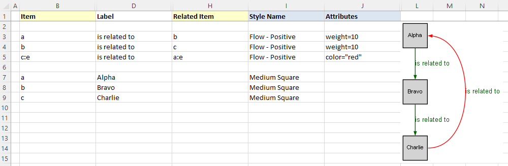|
|----------------------------|

_Graphviz Source_

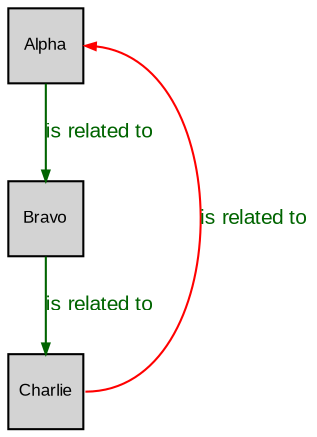
```dot
digraph "Relationship Visualizer"
{
    a -> b[ fontname=Arial fontsize=10 color=darkgreen fontcolor=darkgreen arrowsize=0.5 weight=10 label="is related to" ];
    b -> c[ fontname=Arial fontsize=10 color=darkgreen fontcolor=darkgreen arrowsize=0.5 weight=10 label="is related to" ];
    c:e -> a:e[ fontname=Arial fontsize=10 color=darkgreen fontcolor=darkgreen arrowsize=0.5 color="red" label="is related to" ];
    a [ shape=square height=0.5 width=0.5 fixedsize=True style=filled penwidth=1 fontname=Arial fontsize=8 label="Alpha" ];
    b [ shape=square height=0.5 width=0.5 fixedsize=True style=filled penwidth=1 fontname=Arial fontsize=8 label="Bravo" ];
    c [ shape=square height=0.5 width=0.5 fixedsize=True style=filled penwidth=1 fontname=Arial fontsize=8 label="Charlie" ];
}
```

### Delete all data

Lets start by clearing the `data` worksheet so that we can create a new graph with clusters. Click on the `Delete all data` button. 

_Notice that if you hover the mouse over a Ribbon control a tooltip of help will appear._ 

Once you click `Delete all data` the `data` worksheet is reset to blank form. 

||
|----------------------------|

### Specify Clusters

With the `data` worksheet cleared, lets create a new graph.

If you wish to cluster some elements of the graph you can do so by adding a row with an open brace "{" in the `Item` column above the first row of data to be placed in the group and provide a title for the cluster in the `Label` column. Next, add row with a close brace "}" in the `Item` column after the last row of data.

For example, this Excel worksheet does not have clusters.

|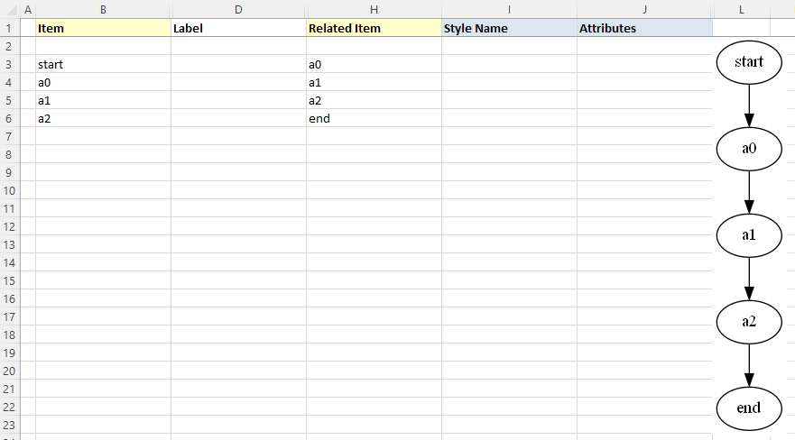|
|--------------------------------------------------|

_Graphviz Source_

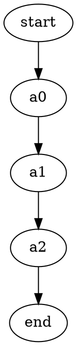
```dot
digraph "Relationship Visualizer"
{
    start -> a0;
    a0 -> a1;
    a1 -> a2;
    a2 -> end;
}
```

To cluster nodes a0, a1, and a2, calling the cluster "process \#1" the worksheet is revised to add an open brace {with the label "process \#1" on row 3, and a close brace } on rows 6 as follows.

Press the `Refresh Graph` button, and the Excel worksheet now looks like:

|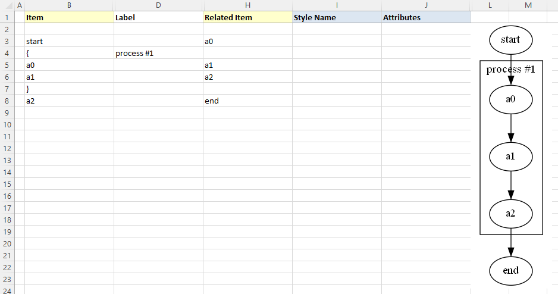|
|--------------------------------------------------|

_Graphviz Source_

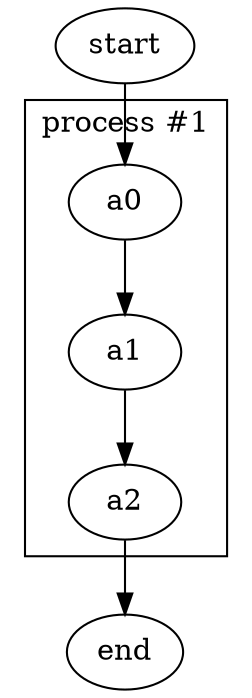
```dot
digraph "Relationship Visualizer"
{
    start -> a0;
    subgraph "cluster_1" {  label="process #1"
        a0 -> a1;
        a1 -> a2;
    }
    a2 -> end;
}
```

### Specify Clusters Within Clusters

Graphviz permits clusters within clusters. Let us extend the example by adding an additional set of braces to cluster the relationship between a1 and a2. We will insert a new row 5 placing an open brace { in the `Item` column with the Label column set to "process \#2", and a new row 7 with a close brace } in the `Item` column.

Press the `Refresh Graph` button, and the Excel worksheet now looks like:

|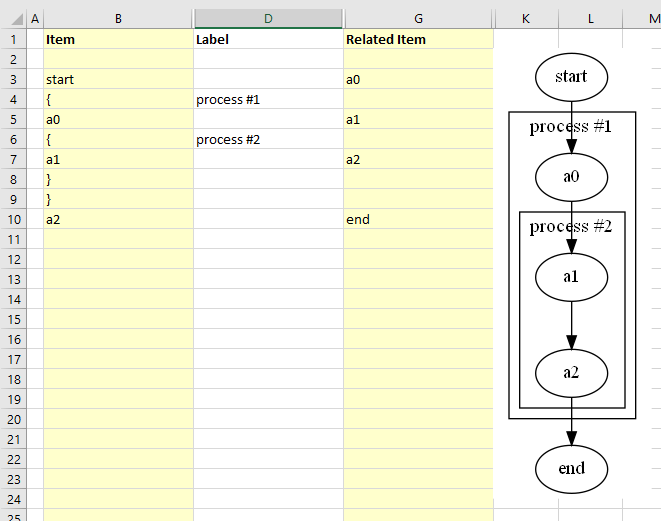|
|--------------------------------------------------|

_Graphviz Source_

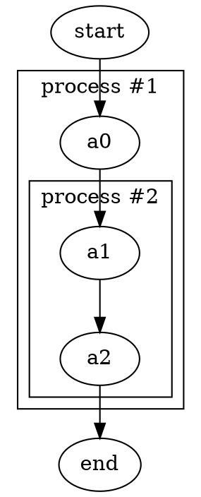
```dot
digraph "Relationship Visualizer"
{
    start -> a0;
    subgraph "cluster_1" {  label="process #1"
        a0 -> a1;
        subgraph "cluster_2" {  label="process #2"
            a1 -> a2;
        }
    }
    a2 -> end;
}
```

Graphviz does not limit the number of clusters you can have. In this example, we have added rows 10-14 to insert an additional cluster labeled "process #3".

Press the `Refresh Graph` button, and the Excel worksheet now looks like:

|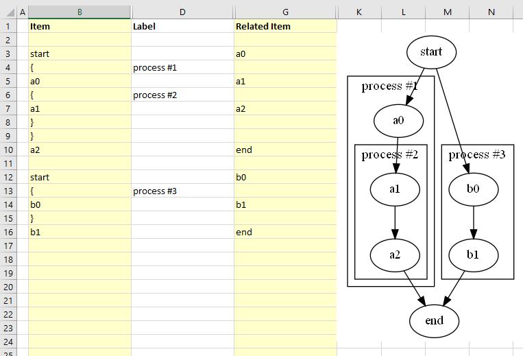|
|--------------------------------------------------|

_Graphviz Source_

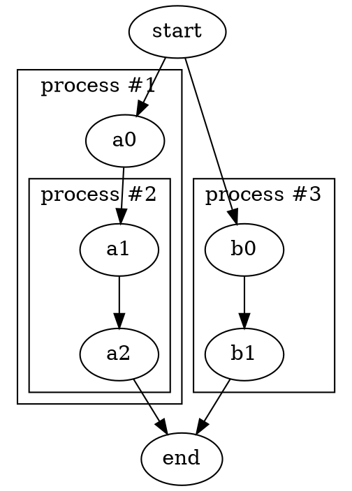
```dot
digraph "Relationship Visualizer"
{
    start -> a0;
    subgraph "cluster_1" {  label="process #1"
        a0 -> a1;
        subgraph "cluster_2" {  label="process #2"
            a1 -> a2;
        }
    }
    a2 -> end;
    start -> b0;
    subgraph "cluster_3" {  label="process #3"
        b0 -> b1;
    }
    b1 -> end;
}
```

What is important to note is that you must ensure that you have an equal number of open braces as you do close braces. 

::: warning
Graphviz will not draw the graph if there is a mismatch between the number of open `{` and close `}` braces.
:::

### Specify Comma-separated Items

Another feature of the Relationship Visualizer is the ability to specify a comma-separated list of Item names and have a relationship created for each Item. For example, we can say that Mr. Brady is the father of Greg, Peter, and Bobby on one row as follows:

|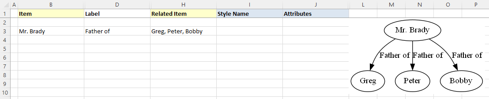|
|--------------------------------------------------|

_Graphviz Source_

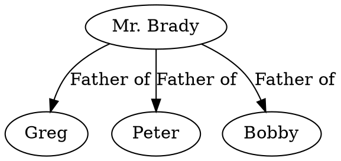
```dot
digraph "Relationship Visualizer"
{
    "Mr. Brady" -> Greg[ label="Father of" ];
    "Mr. Brady" -> Peter[ label="Father of" ];
    "Mr. Brady" -> Bobby[ label="Father of" ];
}
```

The comma-separated list can also appear in the `Item` column, such as:

|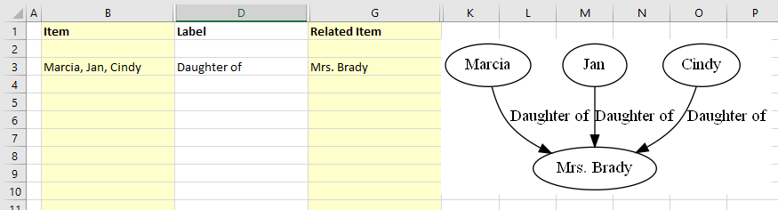|
|--------------------------------------------------|

_Graphviz Source_

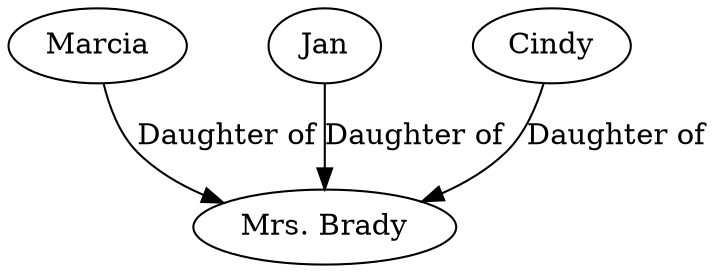
```dot
digraph "Relationship Visualizer"
{
    Marcia -> "Mrs. Brady"[ label="Daughter of" ];
    Jan -> "Mrs. Brady"[ label="Daughter of" ];
    Cindy -> "Mrs. Brady"[ label="Daughter of" ];
}
```

Or a comma-separated list can be used in both the `Item`, and the `Related Item` column such as the parental relationship below:

|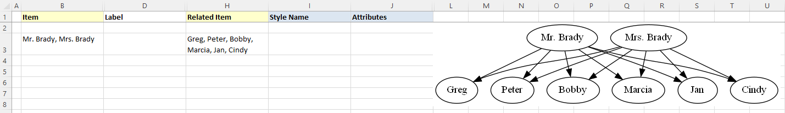|
|--------------------------------------------------|

_Graphviz Source_

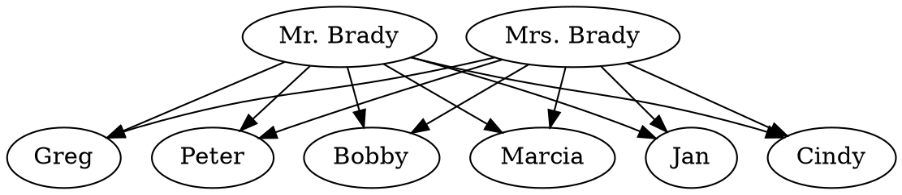
```dot
digraph "Relationship Visualizer"
{
    "Mr. Brady" -> Greg;
    "Mr. Brady" -> Peter;
    "Mr. Brady" -> Bobby;
    "Mr. Brady" -> Marcia;
    "Mr. Brady" -> Jan;
    "Mr. Brady" -> Cindy;
    "Mrs. Brady" -> Greg;
    "Mrs. Brady" -> Peter;
    "Mrs. Brady" -> Bobby;
    "Mrs. Brady" -> Marcia;
    "Mrs. Brady" -> Jan;
    "Mrs. Brady" -> Cindy;
}
```

## The `Graphviz` Ribbon Tab

Now that you understand the basics to create graphs, let us look at the features contained in the `Graphviz` ribbon tab. The `Graphviz` ribbon tab is activated whenever the `data` `graph`, `styles`, `settings` or `about…` worksheet is activated. It appears as follows:

*Windows*
| 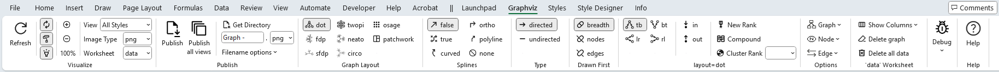 |
| ------------------------------------- |

*macOS*
|  |
| ------------------------------------- |

It contains the following groups, which are each explained in content which follows. You may jump directly to the content using the links in this table:
| Group | Controls  | Description |
| :---- | :--- |  :--- |
| [Visualize](#visualize) |  | Action and option buttons that cause the Excel data to be graphed by Graphviz and then displayed within the Excel workbook. |
| | | |
| [Publish](#publish) |  | Action buttons that cause the Excel data to be graphed by Graphviz and then written to a file. |
| | | |
| [Graph Layout](#graph-layout) | 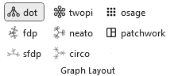 | Provides a set of toggle buttons that control which Graphviz layout engine is applied to your diagram. |
| | | |
| [Splines](#splines) | 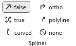 | Provides a set of toggle buttons that control how edges are routed in your diagram.  |
| | | |
| [Type](#graph-type) | 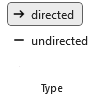 |  Provides a set of toggle buttons that determine whether your diagram is treated as a directed or undirected graph. |
| | | |
| [Drawn First](#drawn-first) |  | Provides a set of toggle buttons thatdetermine the sequence in which Graphviz draws nodes and edges during rendering. |
| | | |
| [Layout Options](#layout-options) |  | The Algorithm group within the Graphviz tab changes dynamically based upon the layout algorithm chosen. The graph options shown are specific to that particular layout algorithm. |
| | | |
| ['data' Worksheet](#data-worksheet) | 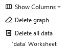 | A set of menu items that control what columns and graphs are displayed on the `data` worksheet. |
| | | |
| [Debug](#debug) |  | An option to display additional information such as the row number and Item identifiers in the labels of nodes, edges, and clusters. |
| | | |
| [Help](#help) | 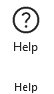 | Provides a link to the `Help` content for the `data` worksheet (i.e. this web page). |

### Visualize

|  |
| --------------------------------------------- |

| Label              | Control Type  | Description                                                                                                                                                                                                                                                                                                                                                                                                                                                                                                                                               |
| ------------------ | ------------- | --------------------------------------------------------------------------------------------------------------------------------------------------------------------------------------------------------------------------------------------------------------------------------------------------------------------------------------------------------------------------------------------------------------------------------------------------------------------------------------------------------------------------------------------------------- |
| Refresh      | Button        | The action button that causes the Excel data to be graphed by Graphviz and then displayed within the Excel workbook.                                                                                                                                                                                                                                                                                                                                                                                                                                      |
| Automatic  | Toggle Button      | When selected, keystrokes are monitored and as cell changes are detected the graph is automatically refreshed (also requires that `Worksheet` is set to `data`).                                                                                                                                                                                                                                                                                                                                                                                  |
| Apply Styles  | Toggle Button      |Specifies if the style attributes associated with the Style Name assigned to a node, edge, or cluster should be applied when the graph is generated.  **Choices:**<ul><li>_Pressed_ - use the style format </li><li>_Unpressed_ - do not use the style format (i.e., use default Graphviz rendering method)</li></ul>                                                                                                                                                                                                                                                                                                                                                                                                                                                                                                                                                                                                                                                                                                                                                                                                                                                                        |
| Apply Attributes  | Toggle Button      |Specifies if the style attributes in the `Attributes` column on the `data` worksheet should be included or omitted when the graph is generated.   **Choices:**<ul><li>_Pressed_ - include the style attributes </li><li>_Unpressed_ - do not include the style attributes</li></ul>|
| Zoom In  | Button      | Magnifies the scale the of image displayed in Excel by 5%.                                                                                                                                                                                                                                                                                                                                                                                  |
| Zoom Out  | Button      | Decreases the scale the image displayed in Excel by 5% so as the graph gets larger, you can see more of it within the workbook without having to scroll.                                                                                                                                                                                                                                                                                                                                                                                  |
| Current Zoom  | Text  | Shows the current magnification level. The magnification can range from 5% to 150% in 5% increments                                                                                                                                                                                                                                                                                                                                                                                  |
| View         | Dropdown list | The name of the column in the `styles` worksheet which controls which set of Yes/No values to use when creating the diagrams. This dropdown list is explained in more detail in the section [Creating Views](#creating-views).                                                                                                                                                                                                                                                                                                                            |
| Image Type         | Dropdown list | Image format to use when displaying the graph on the `data` or `graph` worksheet of the Relationship Visualizer.   **Choices:**<ul><li>`bmp` - Microsoft Windows Bitmap format</li><li>`gif` - Graphics Interchange Format</li><li>`jpg` - Joint Photographic Experts Group format </li><li>`png` - Portable Network Graphics format</li><li>`svg` - Scalable Vector Graphics</li></ul>**Note:** SVG images only display in Office 365; they do not display in older versions of Excel.                                                             |
| Worksheet | Dropdown list | The worksheet in the current workbook where the graph should be displayed   **Choices:**<ul><li>`data` - The graph is displayed in the `data` worksheet to the right of the data columns.</li><li>`graph` - The graph is displayed in the `graph` worksheet, and the `graph` worksheet is activated. This setting is useful for large graphs as it allows you to use Excel's magnification Zoom-In/Zoom-out feature. It is also useful when you want to flip back and forth between the data and the graph to correct errors in the data.</li></ul> |

### Publish

|  |
| ---------------------------------------- |

A tutorial on how to use these ribbon options is contained in the section [Publishing Graphs](#publish).

| Label                                                               | Control Type  | Description                                                                                                                                                                                                                                                                                                                                                                                                                                                                                                     |
| ------------------------------------------------------------------- | ------------- | --------------------------------------------------------------------------------------------------------------------------------------------------------------------------------------------------------------------------------------------------------------------------------------------------------------------------------------------------------------------------------------------------------------------------------------------------------------------------------------------------------------- |
| Publish                                                       | Button        | The action button that causes the Excel data to be graphed by Graphviz and then written to a file.                                                                                                                                                                                                                                                                                                                                                                                                              |
| Publish all views                                                   | Button        | The action button that causes the Excel data to be graphed by Graphviz and then written to a file repeatedly for every view defined in the `Styles` worksheet.                                                                                                                                                                                                                                                                                                                                                  |
| Get Directory                                                       | Button        | Brings up the Directory Selection dialog and stores/displays the directory where the files should be written to. Once a directory is selected the directory path replaces the "Get Directory" button label.                                                                                                                                                                                                                                                                                                     |
| File Prefix                                                         | Edit box      | Base portion of the file name. For example: `Graph`.   You may also build a file name using the following character strings in the file prefix to insert run-time values into the file name.<ul><li>`%D` - Current date</li><li>`%T` - Current time <li>`%E` - Graphviz layout engine </li><li>`%S` - Splines </li><li>`%V` - View name </li><li>`%W` - Worksheet name </li></ul>**NOTE**: You must check the appropriate options in the `Filename options` dropdown list for the substitutions to occur. |
| File Format                                                         | Dropdown List | File format of the output file.  **Choices:**<ul><li> `bmp` - Microsoft Windows Bitmap format</li><li>`gif` - Graphics Interchange Format</li><li>`jpg` - Joint Photographic Experts Group format</li><li>`pdf` - Portable Document Format</li><li>`png` - Portable Network Graphics format</li><li>`ps` - Postscript format</li><li>`svg` - Scalable Vector Graphics format </li><li>`tiff` - Tagged Image File Format </li></ul>                                                                        |
| Filename options 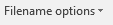 | Dropdown List | A list of options which can be checked which will cause run-time information to be appended or omitted from the file name.                                                                                                                                                                                                                                                                                                                                                                                      |
| Add date/time to the filename                                       | Check box     | Option to add a date and time to the file name.   **Choices:**<ul><li>_Checked_ - Add the date and time</li><li>_Unchecked_ - Omit the date and time</li></ul>                                                                                                                                                                                                                                                                                                                                                                                                |
| Add Layout/Splines to the filename                                  | Check box     | Option to add the layout engine and spline type to the file name.   **Choices:**<ul><li>_Checked_ - Add the options</li><li>_Unchecked_ - Omit the options</li></ul>                                                                                                                                                                                                                                                                                                                                                                                          |

### Graph Layout

The **Graph Layout** section provides a set of toggle buttons that control which Graphviz layout engine is applied to your diagram. These toggles function like radio buttons, ensuring that only one layout is active at a time. This approach gives you a quick, intuitive way to explore how different layout algorithms organize your graph

|  |
| ------------------------------------------ |

### Splines

The **Splines** section provides a set of toggle buttons that control how edges are routed in your diagram. These toggles function like radio buttons, ensuring that only one spline style is active at a time. This design gives you a quick, intuitive way to explore different routing options—straight lines, curves, orthogonal paths, and more—and immediately see how each style affects the readability and structure of your graph

|  |
| ------------------------------------------ |

| Button     | Description |
|-----------|-------------|
| **false** | Edges are drawn as straight lines. |
| **true**  | Edges are drawn using a combination of straight segments and free‑flowing curves.  |
| **curved** | Edges are drawn as smooth, continuous curves between nodes. |
| **ortho** | Edges are routed using horizontal and vertical segments with 90‑degree bends. |
| **polyline** | Edges are drawn as straight segments with angular bends (not restricted to right angles). |
| **none** | Edges (and edge labels) are not drawn, but still influence node placement. |

### Graph Type

The **Graph Type** section provides a set of toggle buttons that determine whether your diagram is treated as a directed or undirected graph. These toggles function like radio buttons, ensuring that only one graph type is active at a time. This setup gives you a quick, intuitive way to switch between directional and non‑directional relationships and immediately see how edge arrows, routing, and layout behavior change in response.

|  |
| ------------------------------------------ |

| Button          | Description |
|----------------|-------------|
| **undirected** | Creates an [Undirected Graph](../terminology/README.md#undirected-graph) graph. Edges have no direction and are drawn without arrowheads. |
| **directed**   | Creates a [Directed Graph](../terminology/README.md#directed-graph) graph (digraph). Edges have a defined direction and are drawn with arrowheads. |

### Drawn First

The **Drawn First** controls (i.e. outputorder) determine the sequence in which Graphviz draws nodes and edges during rendering. These options are presented as toggle buttons that behave like radio buttons, ensuring that only one drawing order is active at a time. This gives you a quick, intuitive way to adjust whether edges appear above or below nodes—useful when fine‑tuning visibility, layering, or stylistic preferences in your diagram.

Output Order Values
| Button          | Description |
|----------------|-------------|
| **breadth** | Draws nodes before edges. Edges appear on top and below nodes. |
| **nodes**   | Nodes are drawn first; edges are drawn afterward. Edges appear on top of nodes. |
| **edges**   | Edges are drawn first; nodes are drawn afterward, causing nodes to appear on top of edges. |

### Layout Options

The Algorithm group within the Graphviz tab changes dynamically based upon the layout algorithm chosen. The graph options shown are specific to that particular layout algorithm.

---

#### layout=circo

There are no additional dynamic options for `layout=circo`.

---

#### layout=dot

|  |
| ---------------------------------------- |

The buttons `[tb]`, `[bt]`, `[lr]`, `[rl]` determine the **Rank Direction**  flow of the graph—whether nodes are arranged top‑to‑bottom, bottom‑to‑top, left‑to‑right, or right‑to‑left. These options are presented as toggle buttons that behave like radio buttons, ensuring that only one direction is active at a time.

| Button | Description |
| :----: |-------------|
| **tb** | Top‑to‑Bottom. Ranks flow downward (the default for most layouts).  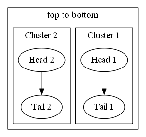|
| **bt** | Bottom‑to‑Top. Ranks flow upward.  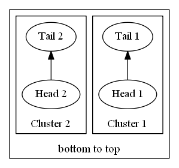
|
| **lr** | Left‑to‑Right. Ranks flow horizontally from left to right.  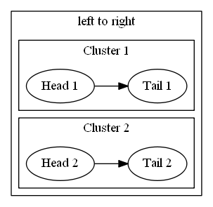 |
| **rl** | Right‑to‑Left. Ranks flow horizontally from right to left. 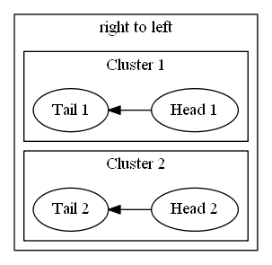 |

The `[in]`, `[out]` Ordering buttons determine how edges are arranged around each node during layout. 

| Button | Description |
|--------|-------------|
| **in**  | Preserves the order of incoming edges around each node. |
| **out** | Preserves the order of outgoing edges around each node. |

The **New Rank** button determines how Graphviz handles ranking when clusters are present in the graph. This option is presented as a toggle that behaves like a radio‑style switch, ensuring the feature is either fully enabled or disabled. Turning it on allows Graphviz to compute a single global ranking across all clusters, while turning it off preserves the traditional recursive ranking inside each cluster. This gives you a quick, intuitive way to influence how tightly or loosely clustered subgraphs interact in the final layout.

The **Compound** button determines whether edges are allowed to connect into and out of clusters when using layout engines that support this feature. This option is presented as a simple toggle that behaves like a radio‑style switch, enabling or disabling compound edge routing. Turning it on allows edges to attach to cluster boundaries using lhead and ltail, giving you a quick, intuitive way to create more expressive diagrams where relationships span across grouped subgraphs.

| Value     | Description |
|-----------|-------------|
| **false** | Disables compound edges. Edges cannot connect into or out of clusters using `lhead` or `ltail`. |
| **true**  | Enables compound edges, allowing edges to enter or leave clusters and attach to cluster boundaries. |

The **Cluster Rank** control determines how Graphviz ranks clusters relative to one another during layout.

| Value       | Description |
|-------------|-------------|
| **local**   | Each cluster is ranked independently. This preserves the traditional recursive ranking behavior and often produces compact cluster layouts. |
| **global**  | All clusters participate in a single, unified ranking. This can create more consistent alignment across clusters but may increase spacing. |

---

#### layout=fdp

|  |
| ---------------------------------------- |

The **Overlap** control is presented as a dropdown list that lets you choose how Graphviz handles node collisions during layout. Each option corresponds to a specific overlap‑removal strategy supported by Graphviz, ranging from allowing overlaps for speed to applying more advanced algorithms for cleaner spacing. 

| Value      | Description |
|------------|-------------|
| **compress** | Reduces whitespace by compressing the layout after overlap removal, producing a tighter diagram. |
| **prism**    | Uses a stress‑based algorithm to separate overlapping nodes while preserving layout structure. |
| **scale**    | Uniformly scales the entire layout until nodes no longer overlap. |
| **scalexy**  | Scales the layout independently in the X and Y directions to eliminate overlaps. |
| **Voronoi**  | Uses a Voronoi‑based algorithm to push nodes apart by expanding their regions until overlaps are resolved. |

The **Layout Dimensions** control (`dim=` attribute) sets the number of dimensions Graphviz uses when computing node positions for certain layout engines (primarily neato, fdp, and sfdp). This option is presented as a dropdown list, allowing you to choose how many dimensions the layout solver operates in. Higher dimensions can help the solver escape local minima and produce cleaner layouts, even though the final output is always projected back into 2D.

The **Rendering Dimensions** control (`dimen=` attribute) specifies how many dimensions are used when interpreting node size attributes such as width, height, and size. This option is presented as a dropdown list, allowing you to choose whether nodes are sized in two dimensions or in higher‑dimensional space. Although the final drawing is always 2D, increasing the dimensionality can influence how Graphviz interprets size constraints during layout, giving you a simple, intuitive way to adjust how strictly node size attributes are applied.

---

#### layout=neato

|  |
| ------------------------------------------ |

The **Overlap** control is presented as a dropdown list that lets you choose how Graphviz handles node collisions during layout. Each option corresponds to a specific overlap‑removal strategy supported by Graphviz, ranging from allowing overlaps for speed to applying more advanced algorithms for cleaner spacing. 

| Value      | Description |
|------------|-------------|
| **compress** | Reduces whitespace by compressing the layout after overlap removal, producing a tighter diagram. |
| **prism**    | Uses a stress‑based algorithm to separate overlapping nodes while preserving layout structure. |
| **scale**    | Uniformly scales the entire layout until nodes no longer overlap. |
| **scalexy**  | Scales the layout independently in the X and Y directions to eliminate overlaps. |
| **Voronoi**  | Uses a Voronoi‑based algorithm to push nodes apart by expanding their regions until overlaps are resolved. |

The **Mode** control selects the algorithm that Neato uses to compute node positions during layout. This option is presented as a dropdown list, allowing you to choose among several solver strategies that influence how distances, forces, and constraints are optimized. Each mode offers a different balance of speed, stability, and layout style, giving you a quick, intuitive way to experiment with how the underlying algorithm shapes the structure of your diagram.

| Value      | Description |
|------------|-------------|
| **major**  | Uses stress majorization to iteratively refine node positions; stable and widely used. |
| **KK**     | Uses the Kamada–Kawai spring model, optimizing ideal edge lengths through gradient descent. |
| **hier**   | Produces a top‑down, hierarchy‑influenced layout similar to dot but using Neato’s solver. |
| **ipsep**  | Applies iterative penalty separation to enforce minimum distances between nodes. |
| **spring** | Uses a classical spring‑embedder approach for force‑directed placement. |
| **maxent** | Uses a maximum‑entropy–inspired solver to spread nodes evenly while respecting constraints. |

The **Model** control selects how Neato interprets edge relationships when computing ideal node distances. This option is presented as a dropdown list, allowing you to choose among several distance‑calculation models that influence clustering, separation, and overall layout behavior. Each model offers a different way of translating graph structure into geometric constraints, giving you a quick, intuitive way to shape how Neato arranges your diagram.

The **Layout Dimensions** control (`dim=` attribute) sets the number of dimensions Graphviz uses when computing node positions for certain layout engines (primarily neato, fdp, and sfdp). This option is presented as a dropdown list, allowing you to choose how many dimensions the layout solver operates in. Higher dimensions can help the solver escape local minima and produce cleaner layouts, even though the final output is always projected back into 2D.

The **Rendering Dimensions** control (`dimen=` attribute) specifies how many dimensions are used when interpreting node size attributes such as width, height, and size. This option is presented as a dropdown list, allowing you to choose whether nodes are sized in two dimensions or in higher‑dimensional space. Although the final drawing is always 2D, increasing the dimensionality can influence how Graphviz interprets size constraints during layout, giving you a simple, intuitive way to adjust how strictly node size attributes are applied.

---

#### layout=osage

There are no additional dynamic options for `layout=osage`.

---

#### layout=patchwork

There are no additional dynamic options for `layout=patchwork`.

---

#### layout=sfdp

|  |
| ----------------------------------------- |

The **Overlap** control is presented as a dropdown list that lets you choose how Graphviz handles node collisions during layout. Each option corresponds to a specific overlap‑removal strategy supported by Graphviz, ranging from allowing overlaps for speed to applying more advanced algorithms for cleaner spacing. 

| Value      | Description |
|------------|-------------|
| **compress** | Reduces whitespace by compressing the layout after overlap removal, producing a tighter diagram. |
| **prism**    | Uses a stress‑based algorithm to separate overlapping nodes while preserving layout structure. |
| **scale**    | Uniformly scales the entire layout until nodes no longer overlap. |
| **scalexy**  | Scales the layout independently in the X and Y directions to eliminate overlaps. |
| **Voronoi**  | Uses a Voronoi‑based algorithm to push nodes apart by expanding their regions until overlaps are resolved. |

The **Mode** control selects the algorithm that Neato uses to compute node positions during layout. This option is presented as a dropdown list, allowing you to choose among several solver strategies that influence how distances, forces, and constraints are optimized. Each mode offers a different balance of speed, stability, and layout style, giving you a quick, intuitive way to experiment with how the underlying algorithm shapes the structure of your diagram.

| Value      | Description |
|------------|-------------|
| **major**  | Uses stress majorization to iteratively refine node positions; stable and widely used. |
| **KK**     | Uses the Kamada–Kawai spring model, optimizing ideal edge lengths through gradient descent. |
| **hier**   | Produces a top‑down, hierarchy‑influenced layout similar to dot but using Neato’s solver. |
| **ipsep**  | Applies iterative penalty separation to enforce minimum distances between nodes. |
| **spring** | Uses a classical spring‑embedder approach for force‑directed placement. |
| **maxent** | Uses a maximum‑entropy–inspired solver to spread nodes evenly while respecting constraints. |

The Smoothing control is presented as a dropdown list that lets you choose how Graphviz refines the raw node positions produced by the layout engine. Each option applies a different post‑processing technique to “smooth out” irregularities, reduce jitter, or improve geometric consistency. This gives you a simple, intuitive way to fine‑tune the visual polish of your diagram without altering the underlying layout structure.

| Value        | Description |
|--------------|-------------|
| **none**       | No smoothing applied. Uses the raw layout positions exactly as computed. |
| **avg_dist**   | Adjusts node positions based on average distances to neighbors, reducing local irregularities. |
| **graph_dist** | Smooths positions using graph‑theoretic distances, improving global consistency. |
| **power_dist** | Applies a power‑law weighting to distances, emphasizing stronger relationships. |
| **rng**        | Uses a Relative Neighborhood Graph–based smoothing to reduce noise while preserving structure. |
| **spring**     | Applies a light spring‑embedder pass to gently relax node positions. |
| **triangle**   | Uses triangle‑based geometric smoothing to even out spacing in dense regions. |

The **Layout Dimensions** control (`dim=` attribute) sets the number of dimensions Graphviz uses when computing node positions for certain layout engines (primarily neato, fdp, and sfdp). This option is presented as a dropdown list, allowing you to choose how many dimensions the layout solver operates in. Higher dimensions can help the solver escape local minima and produce cleaner layouts, even though the final output is always projected back into 2D.

The **Rendering Dimensions** control (`dimen=` attribute) specifies how many dimensions are used when interpreting node size attributes such as width, height, and size. This option is presented as a dropdown list, allowing you to choose whether nodes are sized in two dimensions or in higher‑dimensional space. Although the final drawing is always 2D, increasing the dimensionality can influence how Graphviz interprets size constraints during layout, giving you a simple, intuitive way to adjust how strictly node size attributes are applied.

---

#### Layout = `twopi`

There are no additional dynamic options for `layout=patchwork`.

### Options

| 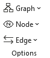 |
| ---------------------------------- |

#### Graph
Optional attributes which can be checked for inclusion in the Graphviz source. These attributes have graph-level scope.

| Label                                                                   | Control Type  | Description                                                                                                                                                                                                                                                                                                                                                                                                                                                                                                                                                                                                                                                                                                                                                                                                   |
| ----------------------------------------------------------------------- | ------------- | ------------------------------------------------------------------------------------------------------------------------------------------------------------------------------------------------------------------------------------------------------------------------------------------------------------------------------------------------------------------------------------------------------------------------------------------------------------------------------------------------------------------------------------------------------------------------------------------------------------------------------------------------------------------------------------------------------------------------------------------------------------------------------------------------------------- |
| **Drawing**                                                             |               |                                                                                                                                                                                                                                                                                                                                                                                                                                                                                                                                                                                                                                                                                                                                                                                               |
| Center Drawing                                                          | Checkbox      | Checking this item will cause the graph to be centered in the page, assuming the graph is smaller than the page size.                                                                                                                                                                                                                                                                                                                                                                                                                                                                                                                                                                                                                                                                                         |
| Force xlabel placement                                                  | Checkbox      | If checked, all `xlabel` attributes are placed, even if there is some overlap with nodes or other labels.                                                                                                                                                                                                                                                                                                                                                                                                                                                                                                                                                                                                                                                                                                     |
| Rotate 90 counterclockwise                                              | Checkbox      | If checked, causes the final layout to be rotated counterclockwise by 90 degrees.                                                                                                                                                                                                                                                                                                                                                                                                                                                                                                                                                                                                                                                                                                                             |
| Transparent Background                                                  | Checkbox      | Toggles the background color between white and transparent.  Transparent backgrounds are useful if you intend to layer the graphs in an image editor or paste them into a Microsoft Word document.  **Choices:** <ul><li>_Checked_ - Background is transparent  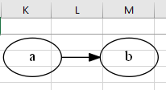</li><li>_Unchecked_ - Graph background is white.  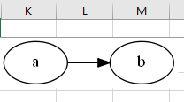</li></ul>**Note:** It is possible to set the graph background color to any valid color by specifying the `bgcolor=` attribute as a graph option on the `settings` worksheet.                                                                                                                                                                               |
| Include image path                                                      | Checkbox      | If checked, adds the `imagepath` attribute to the graph.  **Choices:** <ul><li>_Checked_ - Path to the images is added.</li><li>_Unchecked_ - Path to images is omitted.</li></ul>                                                                                                                                                                               |

#### Node

Choices which control which nodes are included in the Graphviz source, and how the labels should be represented.

| Label                                                                   | Control Type  | Description                                                                                                                                                                                                                                                                                                                                                                                                                                                                                                                                                                                                                                                                                                                                                                                                   |
| ----------------------------------------------------------------------- | ------------- | ------------------------------------------------------------------------------------------------------------------------------------------------------------------------------------------------------------------------------------------------------------------------------------------------------------------------------------------------------------------------------------------------------------------------------------------------------------------------------------------------------------------------------------------------------------------------------------------------------------------------------------------------------------------------------------------------------------------------------------------------------------------------------------------------------------- |
| **Filter**                                                              |               |                                                                                                                                                                                                                                                                                                                                                                                                                                                                                                                                                                                                                                                                                                                                                                                               |
| Include stand-alone nodes                                               | Checkbox      | Include or exclude nodes without relationships (i.e., island nodes). When using views to exclude relationship edges there may be nodes left in the diagram that are not connected to anything. This setting specifies if these island nodes should be included or excluded from the diagram.  **Choices:**<ul><li>_Checked_ - retain the island nodes</li><li>_Unchecked_ - drop the island nodes from the diagram</li></ul>                                                                                                                                                                                                                                                                                                                                                                            |
| **Label Columns**                                                       |               |                                                                                                                                                                                                                                                                                                                                                                                                                                                                                                                                                                                                                                                                                                                                                                                               |
| Include `Label`                                                         | Checkbox      | Include or exclude Labels column data? Allows you to turn labels on/off in the graph.  **Choices:**<ul><li> _Checked_ - Include Label column data </li><li>_Unchecked_ - Drop the Label column data from the graph</li></ul>                                                                                                                                                                                                                                                                                                                                                                                                                                                                                                                                                                            |
| Include `External Label`                                                | Checkbox      | Include or exclude External Labels column data? Allows you to turn outside (xlabel) labels on/off in the graph.  **Choices:**<ul><li>_Checked_ - Include External Label column data </li><li>_Unchecked_ - Drop the External Label column data from the graph</li></ul>                                                                                                                                                                                                                                                                                                                                                                                                                                                                                                                                 |
| **Label Values**                                                        |               |                                                                                                                                                                                                                                                                                                                                                                                                                                                                                                                                                                                                                                                                                                                                                                                               |
| When the `Label` column is blank…                                       | Menu          | Include or exclude blank values in the Label column?  When the `Label` column is blank on the data worksheet on a row which refers to a node it can mean two possible things. One interpretation is to remove the label from the node, as might be useful when using images to represent nodes. The other interpretation is to let the graph default to displaying the value in the `Item` column.  **Choices:**<ul><li>`…use blank for the node label` - use a blank label as the node's label text</li><li>` …use the node identifier as the label` - show the value in the `Item` column as the label text</li></ul>                                                                                                                                                                           |

#### Edge

Choices which control how edges should be specified in the Graphviz source, and how the edge labels should be represented.

| Label                                                                   | Control Type  | Description                                                                                                                                                                                                                                                                                                                                                                                                                                                                                                                                                                                                                                                                                                                                                                                                   |
| ----------------------------------------------------------------------- | ------------- | ------------------------------------------------------------------------------------------------------------------------------------------------------------------------------------------------------------------------------------------------------------------------------------------------------------------------------------------------------------------------------------------------------------------------------------------------------------------------------------------------------------------------------------------------------------------------------------------------------------------------------------------------------------------------------------------------------------------------------------------------------------------------------------------------------------- |
| **Consolidate**                                                         |               |                                                                                                                                                                                                                                                                                                                                                                                                                                                                                                                                                                                                                                                                                                                                                                                                |
| Apply "strict" rules                                                    | Checkbox      | Specifies the strict attribute for the top-level graph. Describing the graph as strict forbids the creation of multi-edges, i.e., there can be at most one edge with a given tail node and head node in the directed case. For undirected graphs, there can be at most one edge connected to the same two nodes. Subsequent edge statements using the same two nodes will identify the edge with the previously defined one and apply any attributes given in the edge statement.  **Choices:**<ul><li>_Checked_ - Includes the strict attribute   Edges have been consolidated.</li><li>_Unchecked_ - Omits the strict attribute  Edges have not been consolidated.</li></ul>          |
| Concentrate edges                                                       | Checkbox      | If checked, use edge concentrators. This merges multi-edges into a single edge and causes partially parallel edges to share part of their paths. This feature is only available if the layout algorithm is **dot**.   **Choices:**<ul><li>_Checked_ - Include the concentrate attribute 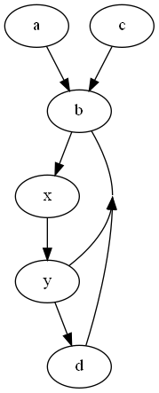 Edges have been concentrated</li><li>_Unchecked_ - Omits the concentrate attribute 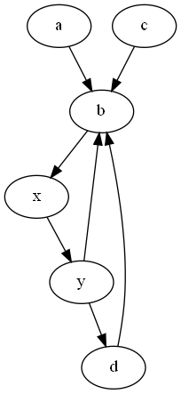 Edges are not concentrated</li></ul>                                                                                                                                                                                                                                                                       |
| **Filter**                                                              |               |                                                                                                                                                                                                                                                                                                                                                                                                                                                                                                                                                                                                                                                                                                                                                                                                |
| Include edges which reference undefined nodes                           | Checkbox      | Include/Exclude relationships Include stand-alone edges (i.e., orphan edges). When using views to exclude nodes there may be un-styled nodes included in the diagram due to edge references. This setting specifies if the edges should be included or excluded from the diagram.  **Choices:**<ul><li>_Checked_ - retain edges which have references to undefined nodes </li><li>_Unchecked_ - drop any edges which do not refer to defined nodes</li></ul>                                                                                                                                                                                                                                                                                                                                            |
| Include Ports                                                           | Checkbox      | Retain/Remove port values from the nodes in an edge relationship. Given: 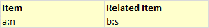   **Choices:**<ul><li>_Checked_ - retain the ports when creating the edge syntax. 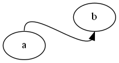 `a:n -> b:s` </li><li>_Unchecked_ - removes the ports specified when creating the edge syntax. 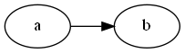 `a -> b`</li></ul>                                                                                                                                                                                                                                                                                                                                                       |
| **Label Columns**                                                       |               |                                                                                                                                                                                                                                                                                                                                                                                                                                                                                                                                                                                                                                                                                                                                                                                                |
| Include `Label`                                                         | Checkbox      | Include or exclude Labels column data? Allows you to turn edge labels on/off in the graph.   **Choices:**<ul><li>_Checked_ - Include Label column data </li><li>_Unchecked_ - Omit the Label column data from the graph</li></ul>                                                                                                                                                                                                                                                                                                                                                                                                                                                                                                                                                                       |
| Include `External Label`                                                |               | Include or exclude External Labels column data? Allows you to turn outside (xlabel) edge labels on/off in the graph.  **Choices:**<ul><li>_Checked_ - Include External Label column data </li><li>_Unchecked_ - Omit the External Label column data from the graph</li></ul>                                                                                                                                                                                                                                                                                                                                                                                                                                                                                                                            |
| Include `Head Label`                                                    | Checkbox      | Include or exclude Head Labels column data? Allows you to turn edge head labels on/off in the graph.  **Choices:**<ul><li>_Checked_ - Include Head Label column data </li><li>_Unchecked_ - Omit the Head Label column data from the graph</li></ul>                                                                                                                                                                                                                                                                                                                                                                                                                                                                                                                                                    |
| Include `Tail Label`                                                    | Checkbox      | Include or exclude Tail Labels column data? Allows you to turn edge tail labels on/off in the graph.  **Choices:**<ul><li>_Checked_ - Include Tail Label column data</li><li>_Unchecked_ - Omit the Table Label column data from the graph</li></ul>                                                                                                                                                                                                                                                                                                                                                                                                                                                                                                                                                    |
| **Label Values**                                                        |               |                                                                                                                                                                                                                                                                                                                                                                                                                                                                                                                                                                                                                                                                                                                                                                                                |
| When the `Label` column is blank…                                       | Menu          | Include or exclude blank values in the Label column?  When the `Label` column is blank on the data worksheet on a row which refers to an edge it can mean two possible things. One interpretation is to remove the label from the edge. The other interpretation is to let the graph default to displaying the value Graphviz assigns to the edge relationship.   **Choices:**<ul><li>`…the label is blank` - use the blank label as the node's label text </li><li>`…use the edge name as the label` - show the value in the `Item` column as the label text 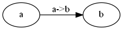</li></ul>                                                                                                                      |

### Toggles

| 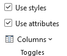 |
| ------- |

| Label          | Control Type  | Description                                                                                                                                                                                                                                                                                                                                                                                                                                                                                                                                                                                                                                                                                                                                                                                                   |
| -------------- | ------------- | ------------------------------------------------------------------------------------------------------------------------------------------------------------------------------------------------------------------------------------------------------------------------------------------------------------------------------------------------------------------------------------------------------------------------------------------------------------------------------------------------------------------------------------------------------------------------------------------------------------------------------------------------------------------------------------------------------------------------------------------------------------------------------------------------------------- |
| Use styles     | Checkbox      | Specifies if the style attributes associated with the Style Name assigned to a node, edge, or cluster should be used when the graph is generated.  **Choices:**<ul><li>_Checked_ - use the style format </li><li>_Unchecked_ - do not use the style format (i.e., use default Graphviz rendering method)</li></ul>                                                                                                                                                                                                                                                                                                                                                                                                                                                                                      |
| Use attributes | Checkbox      | Specifies if the `Attributes` style attributes on the `data` worksheet should be included or omitted when the graph is generated.   **Choices:**<ul><li>_Checked_ - include the style attributes </li><li>_Unchecked_ - do not include the style attributes</li></ul>|
| Columns        | Dropdown List | A list of column names on the `data` worksheet which can be displayed or hidden.  **Choices:**<ul><li>_Checked_ - show the column </li><li>_Unchecked_ - hide the column</li></ul>                                                                            |                                                                              |

### 'data' Worksheet

|  |
| ------- |

| Label              | Control Type  | Description                                                                                                                                                                                                                                                                                                                                                                                                                                                                                                                                               |
| ------------------ | ------------- | --------------------------------------------------------------------------------------------------------------------------------------------------------------------------------------------------------------------------------------------------------------------------------------------------------------------------------------------------------------------------------------------------------------------------------------------------------------------------------------------------------------------------------------------------------- |
| Show Columns      | Menu        | Displays a list of all the columns used by the data worksheet. Allows you to show or hide columns by clicking of the column names. Checked columns are shown, unchecked columns are hidden   |
| Delete Graph       | Button        | Clicking on this button will delete the graph from the worksheet. This is useful when adding rows as new rows will stretch the image. You may also find you want to delete the image before saving the file to reduce the file size.                                                                                                                                                                                                                                                                                                                      |
| Delete all data    | Button        | Resets the `data` worksheet to blank cells, and deletes any graphs if present.                                                                                                                                                                                                                                                                                                                                                                                                                                                                            |

### Debug

|  |
| ------- |

| Label                                                                   | Control Type  | Description                                                                                                                                                                                                                                                                                                                                                                                                                                                                                                                                                                                                                                                                                                                                                                                                   |
| ----------------------------------------------------------------------- | ------------- | ------------------------------------------------------------------------------------------------------------------------------------------------------------------------------------------------------------------------------------------------------------------------------------------------------------------------------------------------------------------------------------------------------------------------------------------------------------------------------------------------------------------------------------------------------------------------------------------------------------------------------------------------------------------------------------------------------------------------------------------------------------------------------------------------------------- |
| Debugging labels                                    | Checkbox      | Turning this option to `on` causes additional information such as the row number and Item identifiers to be included in the labels of nodes, edges, and clusters.  **Choices:**<ul><li>_Unchecked_ - Do not add information to the labels</li><li>_Checked_ - Add information to the labels</li></ul>Unchecked  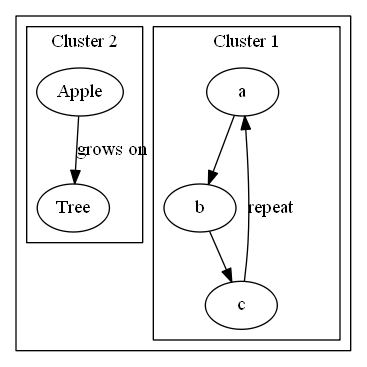  Checked   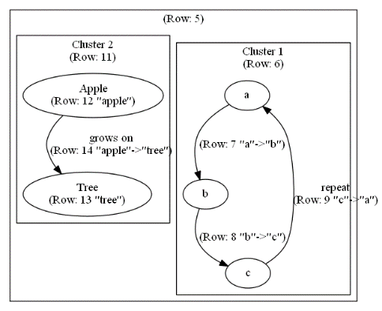                                                                                                                                                                                                                                                                                                                                                            |
| Keep dot source                           | Checkbox      | Specifies what should be done with the text file sent to Graphviz after the graphing step is complete when `Graph to File` is used to create the graph.  **Choices:**<ul><li>_Checked_ - retain the file. It will be in the same directory as the graph file with the same file name except for the file extension (which will be `.gv`).</li><li>_Unchecked_ - delete the file</li></ul>                                                                                                                                                                                                                                                                                                                                                                                                               |
| Clear errors                                                | Button        | Resets the error message column                                                                                                                                                                                                                                                                                                                                                                                                                                                                                                                                                                                                                                                                                                                                                                               |

### Help

|  |
| ------- |

Provides the `Help` content for the `Graphviz` ribbon tab.

| Label | Control Type  | Description |
| ----- | ------------- | --------------------------------- |
| Help  | Button        | Provides a link to this web page. |

---

Like this tool? [Buy me a coffee! ☕](https://www.buymeacoffee.com/exceltographviz)

