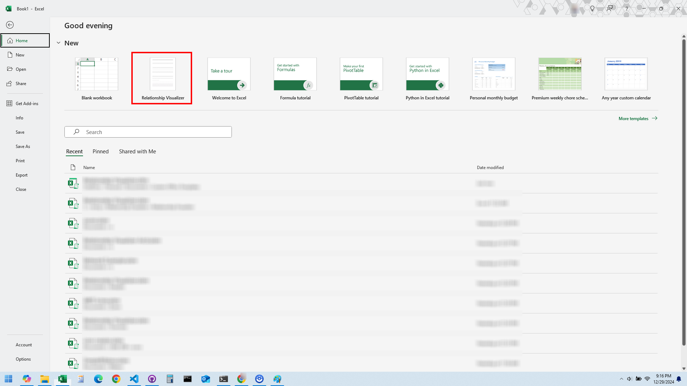
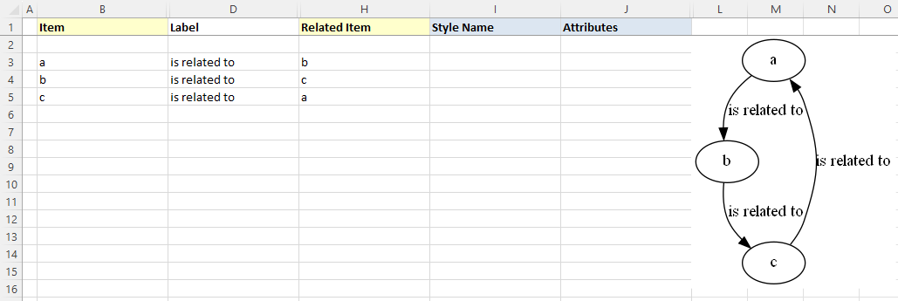
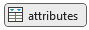
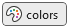
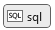

# Creating Graphs

If you have made it this far in this manual, Congratulations. We are past all the software installation steps, graph theory discussions, and definitions. It is time to have some fun and create some simple diagrams.

## Prepare a New Excel Workbook

### Create a New Workbook from the Relationship Visualizer Template

The first action is to launch Excel. When Excel starts, it will suggest sample spreadsheets you can create. This will contain the Relationship Visualizer template which you saved as a template as part of the installation steps. Select this template to create a new workbook. (Note: If you do not see it in the FEATURED list, click on PERSONAL to see your individual list.)

### Save the Workbook as a Macro-Enabled Workbook

The workbook will appear as shown below.

Perform a "**FILE -> Save As**" action. Choose a directory where you would like to save the file and change the file name from `Relationship Visualizer1 `to something meaningful to you.

The most important step is to set the `Save as type:` dropdown list item as **Excel Macro-Enabled Workbook**. You will not be able to run the macros that create the visualizations unless the workbook is _macro-enabled_.

You may or may not receive a security warning that the workbook contains macros. If you get such a warning, click the "**Enable Content**" button to acknowledge the risk and enable the macros.

The Relationship Visualizer provides macros through seven Excel Fluent UI ribbon tabs named `Graphviz`, `Style Designer`, `SQL`, `Source`, `SVG`, and `Exchange`. The appropriate ribbon tab will appear and/or activate as you change worksheets.

### Close and Reopen the New Workbook

::: warning

There is a known bug in Microsoft Excel pertaining to custom ribbons. The bug occurs whenever a `File` -> `Save As` action changes the Excel workbook file name.

:::

The bug is caused by the ribbon holding a reference to the original file name which breaks the ability to programmatically switch the tab focus. You can manually switch tabs as you move between worksheets, or you can close the file, and reopen it to have the ribbon tabs automatically change according to worksheet selections.

Assuming that you changed the file name from `Relationship Visualizer1 `to something meaningful to you, you should now close the file and reopen it.

::: tip

Any time you save a copy of the spreadsheet using `File` -> `Save As` and change the Excel workbook file name, you should close the workbook and reopen it.

:::

## Graph Construction Basic Concepts

### `'data'` Worksheet Columns

For our first example, we will make the simplest graph possible with the tool. This graph will be a directed graph from a node named 'a' to a node named 'b'. To do so we must enter the edge information into the `data` Worksheet. The `data` Worksheet has 10 columns:

1. **Column A** - The **`Indicator`** column. This column allows you to specify a flag to treat the row as a comment. To do so enter a `#` hash tag character in the column. The row will turn green, and no data in this row will be included in the graph. If errors are detected in your data a `!` exclamation mark character will appear in the column, the row will turn red, and an error message will be displayed in the `Messages` column.

2. **Column B** - The **`Item`** column. This column serves two purposes. For nodes, it is a unique identifier of the node. For edges, it is the unique identifier of the "from" node in a ("from", "to") node pairing.

3. **Column C** - The **`Tail Label`** column. This column is only used when specifying a relationship. It is the text label to be placed near the tail of an edge.

4. **Column D** - The **`Label`** column. This column is optional. When specified for nodes, the value is placed inside the shape; for edges, the value is placed near the spline.

5. **Column E** - The **`External Label`** column. This column is also optional. When specified for nodes, the value is placed outside the shape, typically above and to the left of the shape; for edges, the value is placed away from the spline. If neither a `Label` or `External Label` is specified then the graph will default to showing the `Item` value as the inside label of nodes, and no data for edges.

6. **Column F** - The **`Head Label`** column. This column is only used when specifying a relationship. It is the text label to be placed near the head of an edge.

7. **Column G** - The **`Tooltip`** column. This column is only used when specifying a tooltip in for clusters, nodes, and edges in graphs saved as files in the `SVG` format.

8. **Column H** - The **`Related Item`** column. This column is only used when specifying a relationship. It is the unique identifier of the "to" node in a ("from", "to") node pairing.

9. **Column I** - The **`Style Name`** column. Optional information in this column indicates what kind of data is in the row and relates it back to a style definition in the `styles` worksheet which controls how the node or element should be graphed. For now, we will only use the styles of `edge` and `node` in our graphs. Later chapters will explain how you can create additional styles to introduce shapes, colors, and images into your graphs.

10. **Column J** - The **`Attributes`** column. Optional information in this column provides a means to add extra elements of style which will only apply to a single row. For example, you can place style attributes in this column which would allow you to illustrate the route from Michigan to California as described in the introduction to this manual.

11. **Column K** - The **`Messages`** column. When the graphing macros run they check for common mistakes in the data, such as specifying only one node for an edge. When mistakes are found, they are reported in this column. In addition, and exclamation mark `!` is placed in the `Indicator` column, and the row is highlighted in red to draw your attention to the error.

The columns for `Tail Label`, `External Label`, , `Head Label` `Tooltip`, and `Messages` (columns C, E, F, G, and K) are hidden by default, since they are less frequently used. Display of these columns can be quickly toggled to be visible by selecting the column name on the list of columns in the dropdown list beneath the `Show/Hide Columns` button.

### Creating Your First Graph

The simplest way to draw a graph is to place values in the `Item` and the `Related Item` columns. If the 'Automatic Refresh' checkbox is checked the graph will draw as data is entered into each cell. If unchecked, then press the `Refresh Graph` button.

For our first graph, we will draw an 'a' is related to 'b' relationship.

1. In row 3 type 'a' in the `Item` column, and 'b' in the `Related Item` column.
2. Click on the `Graphviz` ribbon tab to activate it (if it is not the current active tab)
3. Press the `Refresh Graph` button

   

4. See the result beside the data

The results should resemble the following example:

**Congratulations**, you have created your first graph!

The next section will discuss the concepts of creating graphs in Excel. You only need to use the `Refresh Graph` button of the `Graphviz` ribbon tab for these tutorials. We explain `Graphviz` ribbon tab details after the graphing concepts are mastered.

### Connect More Items

Next, lets expand upon the graph we just created to have additional relationships. Assume that:

- 'a' is related to 'b' (already drawn)
- 'b' is related to 'c'
- 'c' is related to 'a'

The Excel data appears as shown on rows 3-5. Press the `Refresh Graph` button, and the Excel worksheet now looks like:

_Graphviz Source_

### Add Edge Labels

Now, let us add data into the `Label` column to label the relationships. Fill in Column D as shown below. Press the `Refresh Graph` button, and the Excel worksheet now looks like:

_Graphviz Source_

### Add Node Labels

The graph is how we want to see it, but the nodes need to be labeled. We do not want to change all our edges; however, we would like to replace 'a' with 'Alpha', 'b' with 'Bravo', and 'c' with 'Charlie'. The Relationship Visualizer assumes that when there is information in the `Item` column, but not in the `Related Item` column that the data corresponds to a node.

To label the nodes we will add 3 node definitions to the "data worksheet (rows 6, 7, 8) and press the `Refresh Graph` button. The Excel worksheet now looks like:

_Graphviz Source_

### Specify Ports

Graphviz decides what it thinks is the best placement of the head and tail of an edge to produce a balanced graph.

Sometimes you might want to control where the edges begin or end. You can do that by specifying a port on the `Item` or `Related Item` ID, in the same manner as a URL. Ports are identified by a colon character `:` and then a compass point `n`, `s`, `e`, `w`, `ne`, `nw`, `se`, `sw` or `c` for center.

If we change row 5 from the example above to have the edge from "c" to "a" exit from the south port of "c", the `Item` is now specified as `c:s`, and the Excel data is changed slightly as shown in row 5. Press the `Refresh Graph` button, and the Excel worksheet now looks like:

_Graphviz Source_

### Specify Clusters

If you wish to cluster some elements of the graph you can do so by adding a row with an open brace "{" in the `Item` column above the first row of data to be placed in the group and provide a title for the cluster in the `Label` column. Next, add row with a close brace "}" in the `Item` column after the last row of data.

For example, this Excel worksheet does not have clusters.

_Graphviz Source_

To cluster nodes a0, a1, and a2, calling the cluster "process \#1" the worksheet is revised to add an open brace {with the label "process \#1" on row 3, and a close brace } on rows 6 as follows.

Press the `Refresh Graph` button, and the Excel worksheet now looks like:

_Graphviz Source_

### Specify Clusters Within Clusters

Graphviz permits clusters within clusters. Let us extend the example by adding an additional set of braces to cluster the relationship between a1 and a2. We will insert a new row 5 placing an open brace { in the `Item` column with the Label column set to "process \#2", and a new row 7 with a close brace } in the `Item` column.

Press the `Refresh Graph` button, and the Excel worksheet now looks like:

_Graphviz Source_

Graphviz does not limit the number of clusters you can have. In this example, we have added rows 10-14 to insert an additional cluster labeled "process \#3".

Press the `Refresh Graph` button, and the Excel worksheet now looks like:

_Graphviz Source_

What is important to note is that you must ensure that you have an equal number of open braces as you do close braces. **If you have a mismatch between the number of open and close braces, then Graphviz will not draw the graph.**

### Specify Comma-separated Items

Another feature of the Relationship Visualizer is the ability to specify a comma-separated list of Item names and have a relationship created for each Item. For example, we can say that Mr. Brady is the father of Greg, Peter, and Bobby on one row as follows:

_Graphviz Source_

The comma-separated list can also appear in the `Item` column, such as:

_Graphviz Source_

Or a comma-separated list can be used in both the `Item`, and the `Related Item` column such as the parental relationship below:

_Graphviz Source_

## The `Graphviz` Ribbon Tab

Now that you understand the basics to create graphs, let us look at the features contained in the `Graphviz` ribbon tab. The `Graphviz` ribbon tab is activated whenever the `data` `graph`, `styles`, `settings` or `about…` worksheet is activated. It appears as follows:

||
|----------------------------------------|

It contains the following major groups:

- Graph to Worksheet
- Graph to File
- Algorithm
- Options
- Show/Hide Worksheets
- Language

### Graph to Worksheet

||
|----------------------------------------|

| Label              | Control Type  | Description                                                                                                                                                                                                                                                                                                                                                                                                                                                                                                                                               |
| ------------------ | ------------- | --------------------------------------------------------------------------------------------------------------------------------------------------------------------------------------------------------------------------------------------------------------------------------------------------------------------------------------------------------------------------------------------------------------------------------------------------------------------------------------------------------------------------------------------------------- |
| Refresh Graph      | Button        | The action button that causes the Excel data to be graphed by Graphviz and then displayed within the Excel workbook.                                                                                                                                                                                                                                                                                                                                                                                                                                      |
| Automatic Refresh  | Checkbox      | When checked, keystrokes are monitored and as cell changes are detected the graph is automatically refreshed (also requires that `Graph in worksheet` is set to `data`).                                                                                                                                                                                                                                                                                                                                                                                  |
| Delete Graph       | Button        | Clicking on this button will delete the graph from the worksheet. This is useful when adding rows as new rows will stretch the image. You may also find you want to delete the image before saving the file to reduce the file size.                                                                                                                                                                                                                                                                                                                      |
| Delete all data    | Button        | Resets the `data` worksheet to blank cells, and deletes any graphs if present.                                                                                                                                                                                                                                                                                                                                                                                                                                                                            |
| Graph View         | Dropdown list | The name of the column in the `styles` worksheet which controls which set of Yes/No values to use when creating the diagrams. This dropdown list is explained in more detail in the section [Creating Views](#creating-views).                                                                                                                                                                                                                                                                                                                            |
| Image Type         | Dropdown list | Image format to use when displaying the graph on the `data` or `graph` worksheet of the Relationship Visualizer.   **Choices:**<ul><li>`bmp` - Microsoft Windows Bitmap format</li><li>`gif` - Graphics Interchange Format</li><li>`jpg` - Joint Photographic Experts Group format </li><li>`png` - Portable Network Graphics format</li><li>`svg` - Scalable Vector Graphics</li></ul>**Note:** SVG images only display in Office 365; they do not display in older versions of Excel.                                                                                           |
| Graph in worksheet | Dropdown list | The worksheet in the current workbook where the graph should be displayed   **Choices:**<ul><li>`data` - The graph is displayed in the `data` worksheet to the right of the data columns.</li><li>`graph` - The graph is displayed in the `graph` worksheet, and the `graph` worksheet is activated. This setting is useful for large graphs as it allows you to use Excel's magnification Zoom-In/Zoom-out feature. It is also useful when you want to flip back and forth between the data and the graph to correct errors in the data.</li></ul> |

### Graph to File

||
|----------------------------------------|

A tutorial on how to use these ribbon options is contained in the section [Publishing Graphs](#publishing-graphs).

| Label                                                               | Control Type  | Description                                                                                                                                                                                                                                                                                                                                                                                                                                                                             |
| ------------------------------------------------------------------- | ------------- | --------------------------------------------------------------------------------------------------------------------------------------------------------------------------------------------------------------------------------------------------------------------------------------------------------------------------------------------------------------------------------------------------------------------------------------------------------------------------------------- |
| Graph to File                                                       | Button        | The action button that causes the Excel data to be graphed by Graphviz and then written to a file.                                                                                                                                                                                                                                                                                                                                                                                      |
| All views to File                                                   | Button        | The action button that causes the Excel data to be graphed by Graphviz and then written to a file repeatedly for every view defined in the `Styles` worksheet.                                                                                                                                                                                                                                                                                                                          |
| Get Directory                                                       | Button        | Brings up the Directory Selection dialog and stores/displays the directory where the files should be written to. Once a directory is selected the directory path replaces the "Get Directory" button label.                                                                                                                                                                                                                                                                             |
| File Prefix                                                         | Edit box      | Base portion of the file name. For example: `Graph`.   You may also build a file name using the following character strings in the file prefix to insert run-time values into the file name.<ul><li>`%D` - Current date</li><li>`%T` - Current time <li>`%E` - Graphviz layout engine </li><li>`%S` - Splines </li><li>`%V` - View name </li><li>`%W` - Worksheet name </li></ul>**NOTE**: You must check the appropriate options in the `Filename options` dropdown list for the substitutions to occur. |
| File Format                                                         | Dropdown List | File format of the output file.  **Choices:**<ul><li> `bmp` - Microsoft Windows Bitmap format</li><li>`gif` - Graphics Interchange Format</li><li>`jpg` - Joint Photographic Experts Group format</li><li>`pdf` - Portable Document Format</li><li>`png` - Portable Network Graphics format</li><li>`ps` - Postscript format</li><li>`svg` - Scalable Vector Graphics format </li><li>`tiff` - Tagged Image File Format </li></ul>                                                                                        |
| Filename options  | Dropdown List | A list of options which can be checked which will cause run-time information to be appended or omitted from the file name.                                                                                                                                                                                                                                                                                                                                                              |
| Add date/time to the filename                                       | Check box     | Option to add a date and time to the file name. checked, add the date and time unchecked, omit the date and time                                                                                                                                                                                                                                                                                                                                                                        |
| Add Layout/Splines to the filename                                  | Check box     | Option to add the layout engine and spline type to the file name. checked, add the options unchecked, omit the options                                                                                                                                                                                                                                                                                                                                                                  |

### Algorithm

The Algorithm group within the Graphviz tab changes dynamically based upon the layout algorithm chosen. The graphn options shown are specific to that particular layout algorithm.

#### Layout = `circo`
||
|----------------------------------------|

#### Layout = `dot`
||
|----------------------------------------|

#### Layout = `fdp`
||
|----------------------------------------|

#### Layout = `neato`
||
|----------------------------------------|

#### Layout = `osage`
||
|----------------------------------------|

#### Layout = `patchwork`
||
|----------------------------------------|

#### Layout = `sfdp`
||
|----------------------------------------|

#### Layout = `twopi`
||
|----------------------------------------|

| Label     | Control Type                                                            | Description                                                                                                                                                                                                                                                                                                                                                                                                                                                                                                                                                  |
| --------- | ----------------------------------------------------------------------- | ------------------------------------------------------------------------------------------------------------------------------------------------------------------------------------------------------------------------------------------------------------------------------------------------------------------------------------------------------------------------------------------------------------------------------------------------------------------------------------------------------------------------------------------------------------ |
| Layout    | Dropdown list                                                           | Specifies which Graphviz layout program to use when drawing the graph.  **Choices:**<ul><li>`circo`</li><li>`dot`</li><li>`fdp`</li><li>`neato`</li><li>`osage`</li><li>`patchwork`</li><li>`sfdp`</li><li>`twopi`</li></ul>See [Layout Algorithms](#layout-algorithms) for more information on how the algorithms draw the graphs.                                                                                                                                                                                                                    |
| Direction | Dropdown list   | This setting controls the way that shapes are placed when the `dot` layout engine is used. This option will be hidden from the ribbon if the graphing engine is set to anything other than dot.  **Choices:**<ul><li>`TB` - top to bottom</li><li>`BR` - bottom to top</li><li>`LR` - left to right</li><li>`RL` - right to left</li></ul>     |
| Splines   | Dropdown list         | Specifies how the edges between nodes should be drawn. See the examples in the [Splines](#splines) section.  **Choices:**<ul><li>`curved`</li><li>`line` </li><li>`none`</li><li> `ortho`</li><li>`polyline`</li><li>`spline`</li></ul>                                                                                                                                                                                                                                                                                                                |

### Options

||
|----------------------------------|

| Label                                                                   | Control Type  | Description                                                                                                                                                                                                                                                                                                                                                                                                                                                                                                                                                                                                                                                                                                                                                                                                   |
| ----------------------------------------------------------------------- | ------------- | ------------------------------------------------------------------------------------------------------------------------------------------------------------------------------------------------------------------------------------------------------------------------------------------------------------------------------------------------------------------------------------------------------------------------------------------------------------------------------------------------------------------------------------------------------------------------------------------------------------------------------------------------------------------------------------------------------------------------------------------------------------------------------------------------------------- |
| Graph Options   | Dropdown List | Optional attributes which can be checked for inclusion in the Graphviz source. These attributes have graph-level scope.                                                                                                                                                                                                                                                                                                                                                                                                                                                                                                                                                                                                                                                                                       |
| **Clusters**                                                            | Label         | Section Heading                                                                                                                                                                                                                                                                                                                                                                                                                                                                                                                                                                                                                                                                                                                                                                                               |
| Allow edges between clusters                                            | Checkbox      | Adds a `compound="true"` attribute when checked. If `compound="true"`, allows edges between clusters.   See [Clusters - Depicting a Relationship from or to a Cluster](#clusters---depicting-a-relationship-from-or-to-a-cluster) for more information.                                                                                                                                                                                                                                                                                                                                                                                                                                                                                                                                                 |
| Rank ignoring clusters                                                  | Checkbox      | Adds a `newrank="true"` attribute when checked. This choice will only be present if the layout algorithm is set to `dot`.   See [Clusters - Aligning Nodes across Clusters](#clusters---aligning-nodes-across-clusters) for more information.                                                                                                                                                                                                                                                                                                                                                                                                                                                                                                                                                           |
| **Drawing**                                                             | Label         | Section Heading                                                                                                                                                                                                                                                                                                                                                                                                                                                                                                                                                                                                                                                                                                                                                                                               |
| Center Drawing                                                          | Checkbox      | Checking this item will cause the graph to be centered in the page, assuming the graph is smaller than the page size.                                                                                                                                                                                                                                                                                                                                                                                                                                                                                                                                                                                                                                                                                         |
| Directed graph                                                          | Checkbox      | Specifies if the graph should be a directed graph (i.e., with arrows) or an undirected graph (i.e., no arrows).   See the examples in the [Undirected Graph](#undirected-graph) and [Directed Graph](#directed-graph) sections.  **Choices:**<ul><li>_Checked_ - Graph as a directed graph</li><li>_Unchecked_ - Graph as an undirected graph</li></ul>                                                                                                                                                                                                                                                                                                                                                                                                                                           |
| Force xlabel placement                                                  | Checkbox      | If checked, all `xlabel` attributes are placed, even if there is some overlap with nodes or other labels.                                                                                                                                                                                                                                                                                                                                                                                                                                                                                                                                                                                                                                                                                                     |
| Output Order                                                            | Menu          | A menu of mutually exclusive choices which specify the order in which nodes and edges are drawn.  You may pick from:<ul><li>_Breadth First_ - (the default if nothing is checked) `outputorder="breadthfirst"` is the simplest, but when the graph layout does not avoid edge-node overlap, this mode will sometimes have edges drawn over nodes and sometimes on top of nodes.</li><li>_Nodes First_ - If the mode `outputorder="nodesfirst"` is chosen, all nodes are drawn first, followed by the edges. This guarantees an edge-node overlap will not be mistaken for an edge ending at a node.</li><li>_Edges First_ - It may be desirable that all edges appear beneath nodes, even if the resulting drawing is ambiguous. This can be achieved by choosing `outputorder="edgesfirst"`.</li></ul> |
| Rotate 90 counterclockwise                                              | Checkbox      | If checked, causes the final layout to be rotated counterclockwise by 90 degrees.                                                                                                                                                                                                                                                                                                                                                                                                                                                                                                                                                                                                                                                                                                                             |
| Transparent Background                                                  | Checkbox      | Toggles the background color between white and transparent.  Transparent backgrounds are useful if you intend to layer the graphs in an image editor or paste them into a Microsoft Word document.  **Choices:** <ul><li>_Checked_ - Background is transparent  </li><li>_Unchecked_ - Graph background is white.  </li></ul>**Note:** It is possible to set the graph background color to any valid color by specifying the `bgcolor=` attribute as a graph option on the `settings` worksheet.                                                                                                                                                                               |
| Node Options    | Dropdown list | Choices which control which nodes are included in the Graphviz source, and how the labels should be represented.                                                                                                                                                                                                                                                                                                                                                                                                                                                                                                                                                                                                                                                                                              |
| Drawing                                                                 | Label         | Section Heading                                                                                                                                                                                                                                                                                                                                                                                                                                                                                                                                                                                                                                                                                                                                                                                               |
| Include stand-alone nodes                                               | Checkbox      | Include or exclude nodes without relationships (i.e., island nodes). When using views to exclude relationship edges there may be nodes left in the diagram that are not connected to anything. This setting specifies if these island nodes should be included or excluded from the diagram.  **Choices:**<ul><li>_Checked_ - retain the island nodes</li><li>_Unchecked_ - drop the island nodes from the diagram</li></ul>                                                                                                                                                                                                                                                                                                                                                                                      |
| Label Columns                                                           | Label         | Section Heading                                                                                                                                                                                                                                                                                                                                                                                                                                                                                                                                                                                                                                                                                                                                                                                               |
| Include `Label`                                                         | Checkbox      | Include or exclude Labels column data? Allows you to turn labels on/off in the graph.  **Choices:**<ul><li> _Checked_ - Include Label column data </li><li>_Unchecked_ - Drop the Label column data from the graph</li></ul>                                                                                                                                                                                                                                                                                                                                                                                                                                                                                                                                                                                      |
| Include `External Label`                                                | Checkbox      | Include or exclude External Labels column data? Allows you to turn outside (xlabel) labels on/off in the graph.  **Choices:**<ul><li>_Checked_ - Include External Label column data </li><li>_Unchecked_ - Drop the External Label column data from the graph</li></ul>                                                                                                                                                                                                                                                                                                                                                                                                                                                                                                                                           |
| When the `Label` column is blank…                                       | Menu          | Include or exclude blank values in the Label column?  When the `Label` column is blank on the data worksheet on a row which refers to a node it can mean two possible things. One interpretation is to remove the label from the node, as might be useful when using images to represent nodes. The other interpretation is to let the graph default to displaying the value in the `Item` column.  **Choices:**<ul><li>`…use blank for the node label` - use a blank label as the node's label text</li><li>` …use the node identifier as the label` - show the value in the `Item` column as the label text</li></ul>                                                                                                                                                                                          |
| Edge Options          | Dropdown list | Choices which control how edges should be specified in the Graphviz source, and how the labels should be represented.                                                                                                                                                                                                                                                                                                                                                                                                                                                                                                                                                                                                                                                                                         |
| Consolidate                                                             | Label         | Section Heading                                                                                                                                                                                                                                                                                                                                                                                                                                                                                                                                                                                                                                                                                                                                                                                               |
| Apply "strict" rules                                                    | Checkbox      | Specifies the strict attribute for the top-level graph. Describing the graph as strict forbids the creation of multi-edges, i.e., there can be at most one edge with a given tail node and head node in the directed case. For undirected graphs, there can be at most one edge connected to the same two nodes. Subsequent edge statements using the same two nodes will identify the edge with the previously defined one and apply any attributes given in the edge statement.  **Choices:**<ul><li>_Checked_ - Includes the strict attribute  Edges have been consolidated.</li><li>_Unchecked_ - Omits the strict attribute  Edges have not been consolidated.</li></ul>                                 |
| Concentrate edges                                                       | Checkbox      | If checked, use edge concentrators. This merges multi-edges into a single edge and causes partially parallel edges to share part of their paths. This feature is only available if the layout algorithm is **dot**.   **Choices:**<ul><li>_Checked_ - Include the concentrate attribute  Edges have been concentrated </li><li>_Unchecked_ - Omits the concentrate attribute  Edges are not concentrated</li></ul>                                                                                                                                                                                                                                                                                      |
| Filter                                                                  | Label         | Section Heading                                                                                                                                                                                                                                                                                                                                                                                                                                                                                                                                                                                                                                                                                                                                                                                               |
| Include edges which reference undefined nodes                           | Checkbox      | Include/Exclude relationships Include stand-alone edges (i.e., orphan edges). When using views to exclude nodes there may be un-styled nodes included in the diagram due to edge references. This setting specifies if the edges should be included or excluded from the diagram.  **Choices:**<ul><li>_Checked_ - retain edges which have references to undefined nodes </li><li>_Unchecked_ - drop any edges which do not refer to defined nodes</li></ul>                                                                                                                                                                                                                                                                                                                                                      |
| Include Ports                                                           | Checkbox      | Retain/Remove port values from the nodes in an edge relationship. Given:    **Choices:**<ul><li>_Checked_ - retain the ports when creating the edge syntax.  `a:n -> b:s` </li><li>_Unchecked_ - removes the ports specified when creating the edge syntax.  `a -> b`</li></ul>                                                                                                                                                                                                                                                                                                                                                                 |
| Label Columns                                                           | Label         | Section Heading                                                                                                                                                                                                                                                                                                                                                                                                                                                                                                                                                                                                                                                                                                                                                                                               |
| Include `Label`                                                         | Checkbox      | Include or exclude Labels column data? Allows you to turn edge labels on/off in the graph.   **Choices:**<ul><li>_Checked_ - Include Label column data </li><li>_Unchecked_ - Omit the Label column data from the graph</li></ul>                                                                                                                                                                                                                                                                                                                                                                                                                                                                                                                                                                                 |
| Include `External Label`                                                |               | Include or exclude External Labels column data? Allows you to turn outside (xlabel) edge labels on/off in the graph.  **Choices:**<ul><li>_Checked_ - Include External Label column data </li><li>_Unchecked_ - Omit the External Label column data from the graph</li></ul>                                                                                                                                                                                                                                                                                                                                                                                                                                                                                                                                      |
| Include `Head Label`                                                    | Checkbox      | Include or exclude Head Labels column data? Allows you to turn edge head labels on/off in the graph.  **Choices:**<ul><li>_Checked_ - Include Head Label column data </li><li>_Unchecked_ - Omit the Head Label column data from the graph</li></ul>                                                                                                                                                                                                                                                                                                                                                                                                                                                                                                                                                              |
| Include `Tail Label`                                                    | Checkbox      | Include or exclude Tail Labels column data? Allows you to turn edge tail labels on/off in the graph.  **Choices:**<ul><li>_Checked_ - Include Tail Label column data</li><li>_Unchecked_ - Omit the Table Label column data from the graph</li></ul>                                                                                                                                                                                                                                                                                                                                                                                                                                                                                                                                                                   |
| Label Values                                                            | Label         | Section Heading                                                                                                                                                                                                                                                                                                                                                                                                                                                                                                                                                                                                                                                                                                                                                                                               |
| When the `Label` column is blank…                                       | Menu          | Include or exclude blank values in the Label column?  When the `Label` column is blank on the data worksheet on a row which refers to an edge it can mean two possible things. One interpretation is to remove the label from the edge. The other interpretation is to let the graph default to displaying the value Graphviz assigns to the edge relationship.   **Choices:**<ul><li>`…the label is blank` - use the blank label as the node's label text </li><li>`…use the edge name as the label` - show the value in the `Item` column as the label text </li></ul>                                                                            |
| Style Options         | Dropdown List | Switches which allow you to turn predefined style definitions and ad-hoc row level attributes on or off.                                                                                                                                                                                                                                                                                                                                                                                                                                                                                                                                                                                                                                                                                                      |
| Use style formats                                                       | Dropdown list | Specifies if the style attributes associated with the Style Name assigned to a node, edge, or cluster should be used when the graph is generated.  **Choices:**<ul><li>_Checked_ - use the style format </li><li>_Unchecked_ - do not use the style format (i.e., use default Graphviz rendering method)</li></ul>                                                                                                                                                                                                                                                                                                                                                                                                                                                                                                |
| Use extra attributes                                                    | Dropdown list | Specifies if the `Attributes` style attributes on the `data` worksheet should be included or omitted when the graph is generated.   **Choices:**<ul><li>_Checked_ - include the style attributes </li><li>_Unchecked_ - do not include the style attributes</li></ul>                                                                                                                                                                                                                                                                                                                                                                                                                                                                                                                                             |
| Debug Options         | Dropdown List | Debug Options                                                                                                                                                                                                                                                                                                                                                                                                                                                                                                                                                                                                                                                                                                                                                                                                 |
| Clear all error messages                                                | Button        | Resets the error message column                                                                                                                                                                                                                                                                                                                                                                                                                                                                                                                                                                                                                                                                                                                                                                               |
| Add debugging information to labels                                     | Checkbox      | Turning this option to `on` causes additional information such as the row number and Item identifiers to be included in the labels of nodes, edges, and clusters.  **Choices:**<ul><li>_Unchecked_ - Do not add information to the labels</li><li>_Checked_ - Add information to the labels    Unchecked  Checked</li></ul>                                                                                                                                                                                                                                                                                                                                                                             |
| Retain the DOT .gv source file after graphing                           | Checkbox      | Specifies what should be done with the text file sent to Graphviz after the graphing step is complete when `Graph to File` is used to create the graph.  **Choices:**<ul><li>_Checked_ - retain the file. It will be in the same directory as the graph file with the same file name except for the file extension (which will be `.gv`).</li><li>_Unchecked_ - delete the file</li></ul>                                                                                                                                                                                                                                                                                                                                                                                                                         |
| Show/Hide Columns                                                       | Checkbox      | A list of column names on the 'data' worksheet which can be displayed or hidden.  **Choices:**<ul><li>_Checked_ - show the column </li><li>_Unchecked_ - hide the column</li></ul>                                                                                                                                                                                                                                                                                                                                                                                                                                                                                                                                                                                                                                |

### Show/Hide Worksheets

||
|-----------------------------------------------|

| Label      | Control Type                                                     | Description                                                                                                                                                                                                    |
| ---------- | ---------------------------------------------------------------- | -------------------------------------------------------------------------------------------------------------------------------------------------------------------------------------------------------------- |
| Attributes | Toggle button  | Specifies if the `HELP - attributes` worksheet should be visible.  **Choices:**<ul><li>_selected_ - shows the `HELP - attributes` worksheet </li><li>_not selected_ - hides the `HELP - attributes` worksheet</li></ul> |
| Colors     | Toggle button   | Specifies if the `HELP - colors` worksheet should be visible.  **Choices:**<ul><li>_selected_ - shows the `HELP - colors` worksheet </li><li>_not selected_ - hides the `HELP - colors` worksheet</li></ul>             |
| Settings   | Toggle-button   | Specifies if the `settings` worksheet should be visible.  **Choices:**<ul><li>_selected_ - shows the `settings` worksheet </li><li>_not selected_ - hides the `settings` worksheet</li></ul>                            |
| shapes     | Toggle button   | Specifies if the `HELP - shapes` worksheet should be visible.  **Choices:**<ul><li>_selected_ - shows the `HELP - shapes` worksheet </li><li>_not selected_ - hides the `HELP - shapes` worksheet</li></ul>             |
| source     | Toggle button   | Specifies if the `source` worksheet should be visible.  **Choices:**<ul><li>_selected_ - shows the `source` worksheet </li><li>_not selected_ - hides the `source` worksheet</li></ul>                                  |
| sql        | Toggle button   | Specifies if the `sql` worksheet should be visible.  **Choices:**<ul><li>_selected_ - shows the `sql` worksheet </li><li>_not selected_ - hides the `sql` worksheet</li></ul>                                           |
| svg        | Toggle button   | Specifies if the `svg` worksheet should be visible.  **Choices:**<ul><li>_selected_ - shows the `svg` worksheet </li><li>_not selected_ - hides the `svg` worksheet</li></ul>                                           |

### Language

||
|-----------------------------------------------|

| Label      | Control Type                                                     | Description                                                                                                                                                                                                    |
| ---------- | ---------------------------------------------------------------- | -------------------------------------------------------------------------------------------------------------------------------------------------------------------------------------------------------------- |
| Language | Dropdown List | The list of language translations supported by the Relationship Visualizer. When you select a language the ribbon controls and, worksheet names, and worksheet headings will change from the current language to the selected language. |
| Verbose | Checkbox | The language translations have two versions of every edit control label. A short label, which is the default on Microsoft Windows as it supports groups on the ribbon tabs, and a longer, verbose label which is the default on Mac OS to compensate for the lack of ribbon groups in the Mac version of Excel. This checkbox lets you override the default label and chose between the concise and the verbose labels. |