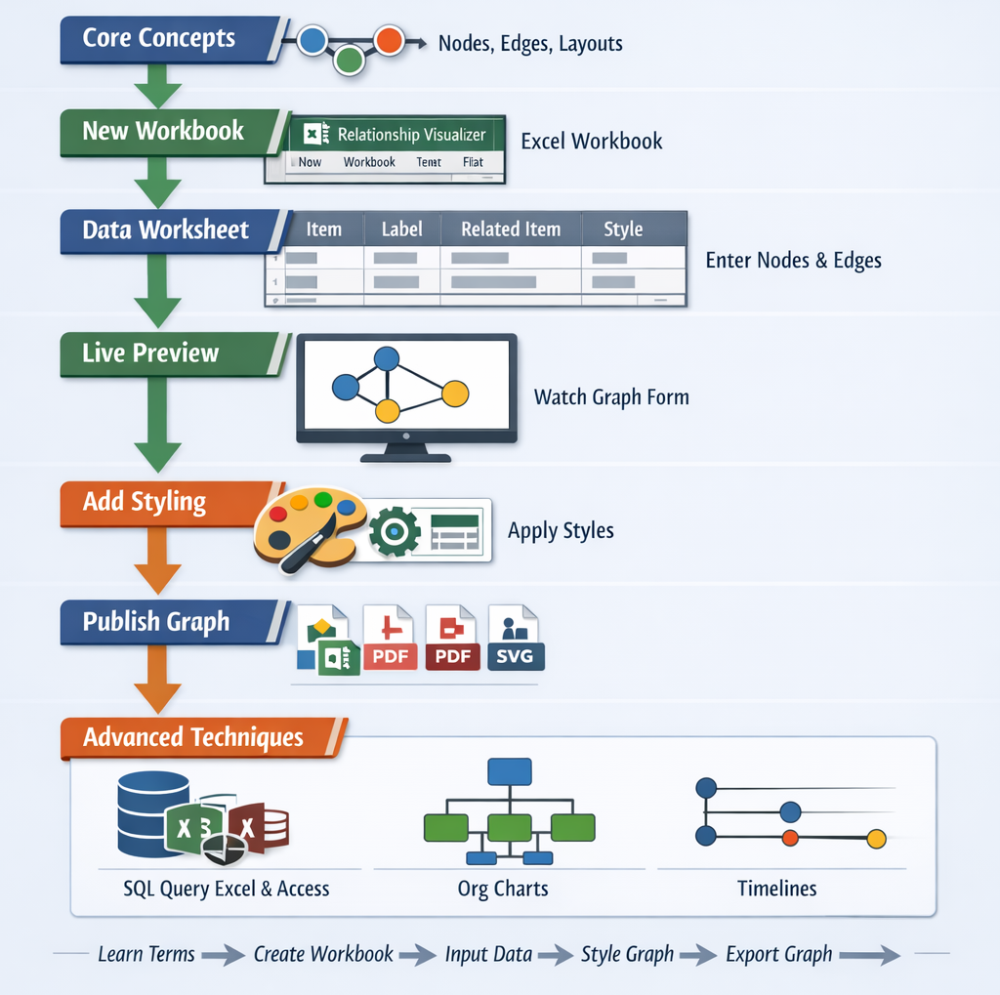

# Creating Graphs

Building a graph with the **Relationship Visualizer** spreadsheet is a simple, structured process. You learn the basic vocabulary, create a workbook, enter your data, apply style, and then publish or refine the output. 

This page walks through the full workflow and links to focused topics that explain each step in detail.

## Learn the Terminology  

Before creating your first graph, it helps to understand the basic terms—nodes, edges, labels, styles, and views, as well as the various Graphviz graph layouts. These concepts shape how your data becomes a diagram.  
- [Terminology](/terminology/)

## Create a New Workbook

Every graph begins with a `Relationship Visualizer.xlsm` workbook. It provides the worksheets, formulas, and macro automation that turn your spreadsheet entries into Graphviz output.  
- [Start Here!](/prepare/)

## Understand the `data` worksheet  

The `data` worksheet is where you define the nodes and edges that make up your graph. Each row represents a relationship, and each column adds meaning—labels, types, styles, and more. This sheet is the foundation of every diagram you build.  
- [`data` Worksheet](/dataworksheet/)
- [The `Graphviz` Ribbon Tab](../dataworksheet/#the-graphviz-ribbon-tab) 
  
## Enter Nodes and Edges

Once the workbook and `data` sheet are ready, you can begin entering your node and edge data. As you type, the tool generates a live preview, making it easy to refine structure and relationships as you go. 
- [Watch the graph form](/coreconcepts/)

## Add styling

With the structure in place, you shape the visual presentation. Styles let you control color, layout, grouping, and emphasis—helping your graph tell a clearer story.  
- [Add style to graph elements](/addstyle/)  
- [Design reusable styles](/designer/)  
- [Save styles in a style gallery](/styles/)  
- [Create style-driven views](/views/)

## Publish your finished graph  

When your graph looks the way you want, export it as an image, PDF, or SVG. Formats ideal for documentation, presentations, and sharing.
- [Publish Graphs](/publish/)

## Enhance your SVG output  

If you choose SVG, you can add animation, interactivity, or additional styling using SVG post‑processing tools. 
- [Post‑process SVG Files](/svg/)

## Explore advanced capabilities

When you're ready to go further, explore advanced features like SQL‑driven graph generation, JSON exchange, DOT source inspection, CLI output capture, and expanded configuration options.

  <a class="advanced-card" href="../sql/">
    
      <svg xmlns="http://www.w3.org/2000/svg" width="20" height="20" viewBox="0 0 24 24" fill="none" stroke="currentColor" stroke-width="1.5" stroke-linecap="round" stroke-linejoin="round">
        <ellipse cx="12" cy="6" rx="8" ry="3" />
        <path d="M4 6v6a8 3 0 0 0 16 0V6" />
        <path d="M4 12v6a8 3 0 0 0 16 0v-6" />
      </svg>
    
    SQL‑driven Graph Generation
  </a>

  <a class="advanced-card" href="../exchange/">
    
        <svg xmlns="http://www.w3.org/2000/svg" width="20" height="20" viewBox="0 0 24 24" fill="none" stroke="currentColor" stroke-width="1.5" stroke-linecap="round" stroke-linejoin="round" >
            <path stroke="none" d="M0 0h24v24H0z" fill="none" />
            <path d="M15 12h.01" />
            <path d="M12 12h.01" />
            <path d="M9 12h.01" />
            <path d="M6 19a2 2 0 0 1 -2 -2v-4l-1 -1l1 -1v-4a2 2 0 0 1 2 -2" />
            <path d="M18 19a2 2 0 0 0 2 -2v-4l1 -1l-1 -1v-4a2 2 0 0 0 -2 -2" />
        </svg>
    
    JSON Data Exchange
  </a>

  <a class="advanced-card" href="../source/">
    
      <svg xmlns="http://www.w3.org/2000/svg" width="20" height="20" viewBox="0 0 24 24" fill="none" stroke="currentColor" stroke-width="1.5" stroke-linecap="round" stroke-linejoin="round">
        <path stroke="none" d="M0 0h24v24H0z" fill="none" />
        <path d="M12 16h-8a1 1 0 0 1 -1 -1v-10a1 1 0 0 1 1 -1h16a1 1 0 0 1 1 1v7" />
        <path d="M7 20h5" />
        <path d="M9 16v4" />
        <path d="M17.001 19a2 2 0 1 0 4 0a2 2 0 1 0 -4 0" />
        <path d="M19.001 15.5v1.5" />
        <path d="M19.001 21v1.5" />
        <path d="M22.032 17.25l-1.299 .75" />
        <path d="M17.27 20l-1.3 .75" />
        <path d="M15.97 17.25l1.3 .75" />
        <path d="M20.733 20l1.3 .75" />
      </svg>
    
    View Graphviz DOT Source
  </a>

  <a class="advanced-card" href="../console/">
    
      <svg xmlns="http://www.w3.org/2000/svg" width="20" height="20" viewBox="0 0 24 24" fill="none" stroke="currentColor" stroke-width="1.5" stroke-linecap="round" stroke-linejoin="round">
        <path d="M4 17l6-6l-6-6" />
        <path d="M13 19h7" />
      </svg>
    
    Capture Graphviz CLI Messages
  </a>

  <a class="advanced-card" href="../settings/">
    
      <svg xmlns="http://www.w3.org/2000/svg" width="20" height="20" viewBox="0 0 24 24" fill="none" stroke="currentColor" stroke-width="1.5" stroke-linecap="round" stroke-linejoin="round">
        <path d="M12 9a3 3 0 1 0 0 6a3 3 0 0 0 0-6" />
        <path d="M19.4 15a1.65 1.65 0 0 0 .33 1.82l.06 .06a2 2 0 1 1-2.83 2.83l-.06 -.06a1.65 1.65 0 0 0-1.82-.33a1.65 1.65 0 0 0-1 1.51V21a2 2 0 1 1-4 0v-.09a1.65 1.65 0 0 0-1-1.51a1.65 1.65 0 0 0-1.82 .33l-.06 .06a2 2 0 1 1-2.83-2.83l.06 -.06a1.65 1.65 0 0 0 .33-1.82a1.65 1.65 0 0 0-1.51-1H3a2 2 0 1 1 0-4h.09a1.65 1.65 0 0 0 1.51-1a1.65 1.65 0 0 0-.33-1.82l-.06 -.06a2 2 0 1 1 2.83-2.83l.06 .06a1.65 1.65 0 0 0 1.82 .33h.09a1.65 1.65 0 0 0 1-1.51V3a2 2 0 1 1 4 0v.09a1.65 1.65 0 0 0 1 1.51a1.65 1.65 0 0 0 1.82-.33l.06 -.06a2 2 0 1 1 2.83 2.83l-.06 .06a1.65 1.65 0 0 0-.33 1.82v.09a1.65 1.65 0 0 0 1.51 1H21a2 2 0 1 1 0 4h-.09a1.65 1.65 0 0 0-1.51 1z" />
      </svg>
    
    Configure Spreadsheet Settings
  </a>

  <a class="advanced-card" href="../advanced/">
    
    <svg xmlns="http://www.w3.org/2000/svg" width="20" height="20"
        viewBox="0 0 24 24" fill="none" stroke="currentColor"
        stroke-width="1.5" stroke-linecap="round" stroke-linejoin="round">
        <path d="M12 3l2 4l4 .5l-3 3l.7 4l-3.7-2l-3.7 2l.7-4l-3-3l4-.5z" />
        <path d="M5 3l1 2l2 .3l-1.5 1.5l.3 2l-1.8-1l-1.8 1l.3-2l-1.5-1.5l2-.3z" />
        <path d="M19 14l1 2l2 .3l-1.5 1.5l.3 2l-1.8-1l-1.8 1l.3-2l-1.5-1.5l2-.3z" />
    </svg>
    
    Advanced Graphviz Capabilities
  </a>

