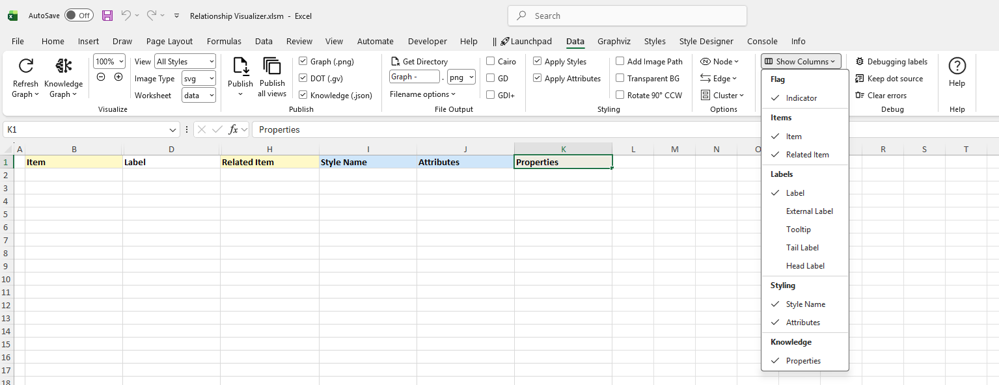

# The `data` Worksheet

The `data` worksheet is the core worksheet you will use to create graphs. 

Before we create our first graph, lets gain an understanding of the mandatory and optional columns on this worksheet.

The `data` Worksheet has 11 columns (A-K):

| A | B | C | D | E | F | G | H | I | J | K |
|---|---|---|---|---|---|---|---|---|---|---|
| [Indicator](./#indicator) | [Item](./#item) | [Tail Label](./#tail-label) | [Label](./#label) | [External Label](./#external-label) | [Head Label](./#head-label) | [Tooltip](./#tooltip) | [Related Item](./#related-item) | [Style Name](./#style-name) | [Attributes](./#attributes) | [Properties](./#properties) |

## Indicator

The `Indicator` column is used to draw special attention to a row.
- A `#` hash character treats the row as a comment. The text in the row will turn green, and no data in this row will be included in the graph. 
- An `!` exclamation mark character will appear if errors are detected in your data on this row. The row will turn red, and an error message will be reported via the `console` worksheet or a message box, depending on your message-routing settings on the [Console](../console/) ribbon tab.

## Item

The `Item` column serves two purposes. 
- For nodes, it is a unique identifier of the node. 
- For edges, it is the unique identifier of the `from` node in a (`from`, `to`) node pairing.
- **Mandatory** column for nodes and edges.

## Tail Label

The `Tail Label` column contains a text label to be placed near the tail of an edge.
- Only used if an edge relationship has been specified.
- Optional column, hidden by default.
- Inclusion in graph can be toggled on/off. 

## Label

The `Label` column contains text to use to label a node, edge, or cluster.
- When specified for nodes, the value is placed inside the shape.
- When specified for edges, the value is placed near the spline.
- Optional column.
- Inclusion in graph can be toggled on/off. 

## External Label

The `External Label` column contains text to use to label a node, or an edge.
- When specified for nodes, the value is placed outside the shape, typically above and to the left of the shape.
- When specified for edges, the value is placed away from the spline. 
- Optional column, hidden by default.
- Inclusion in graph can be toggled on/off. 

If neither a `Label` or `External Label` is specified then the graph will default to showing the `Item` value as the inside label of nodes, and no data for edges.

## Head Label

The `Head Label` column contains a text label to be placed near the head of an edge. 
- Only used if an edge relationship has been specified.
- Optional column, hidden by default.
- Inclusion in graph can be toggled on/off.

## Tooltip 

The `Tooltip` column specifies text to be displayed as a tooltip for clusters, nodes, or edges.
- Only applies to graphs saved as files in the `SVG` format.
- Optional column, hidden by default.

## Related Item 

The `Related Item` column is the unique identifier of the `to` node in a (`from`, `to`) node pairing.
- **Mandatory** column when specifying a relationship (edge).

## Style Name 

The `Style Name` column indicates which style definition in the `styles` worksheet to use when drawing the graph.
- Optional column.
- Inclusion in graph can be toggled on/off.

## Attributes 

The `Attributes` column provides a means to add extra elements of style which will only apply to a single row. For example, you can place style attributes in this column to change the color of a key relationship, or the fill color of a key shape you wish to highlight.
- Optional column.
- Inclusion in graph can be toggled on/off.

## Properties

The `Properties` column lets you attach your own free-form, typed key/value properties to a node or edge, beyond the built-in `Label`, `Tooltip`, and `Style Name` fields. These properties have no effect on the rendered Graphviz diagram; instead they're included in the JSON produced by the [Knowledge Graph](/knowledge-graphs/) export, letting the exported graph carry richer, structured data than the visual diagram alone.

Write properties the same way you'd write extra Graphviz attributes: space-, comma-, or semicolon-separated `key=value` pairs, quoting any value that contains spaces or punctuation.

```
weight=200 domestic=true opened=2019-03-14 contribution="buy me a coffee"
```

On export, each value is typed rather than flattened to plain text — the row above comes out as a real number, a real boolean, a date-valued string, and a quoted string. Properties follow the same graph → node/edge → row inheritance used for labels and tooltips, so you can set a default once at the `node[]` or `edge[]` level and override it only where it needs to differ.

- Optional column.
- Inclusion in the Knowledge Graph export can be toggled on/off.

## Show Hidden Columns

The columns for `Tail Label` (C), `External Label` (E), `Head Label` (F), and `Tooltip` (G) are hidden by default, since they are less frequently used. 

You can quickly toggle the visibility of these (and any other) columns by selecting the column name from the list in the dropdown menu beneath the `Show Columns` button in the **'data' Worksheet** group on the `Data` ribbon tab. The menu is organized into labeled sections — Comment, Item, Label, Style, and Knowledge — to make columns easier to find.



