# Style Designer

## Using the `style designer` worksheet

The Graphviz DOT language includes many attributes that control the appearance of nodes and edges. The `style designer` worksheet helps you compose style specifications without needing to know every detail of the DOT language. 

The worksheet appears as follows:

| 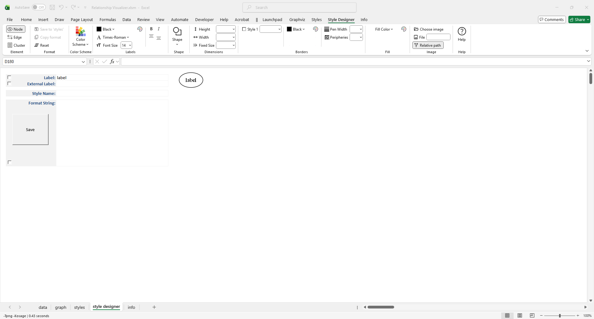 |
| -- |

### Overview

The **Style Designer** worksheet provides an adaptive interface for composing Graphviz style specifications.  It consists of the following constructs:

- **Ribbon** — clickable choices for Graphviz’s visible attributes.  
- **Label Fields** — preview areas where you can enter and view text.  
- **Style Name** — the name of the style on the `styles` worksheet
- **Preview Image** — generated by Graphviz to show exactly how your combination of attributes will be rendered.  
- **Format String** — the underlying style specification containing the Graphviz attributes.  
- **Save Button** — saves the style definition to the **Styles** worksheet, where it can be applied to rows in the **Data** worksheet.

### Ribbon Controls

The Style Designer ribbon tab provides three dynamic design modes, controlled by the Element radio buttons in the left‑most group. These modes let you create **node styles**, **edge styles**, and **cluster styles**. The ribbon controls update automatically as you make selections.

#### `Node` design mode

Displays the Graphviz node-related attributes.

*Windows*
| 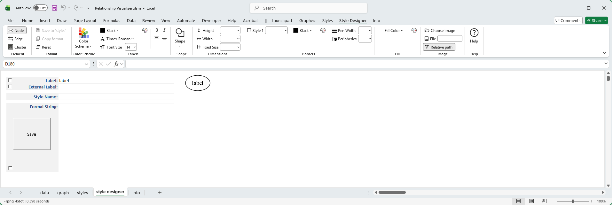 |
| -- |

*macOS*

| 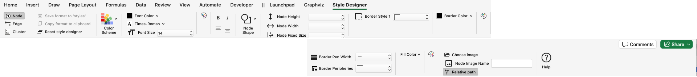 |
| -- |

#### `Edge` design mode

Displays the Graphviz edge-related attributes.

*Windows*
| 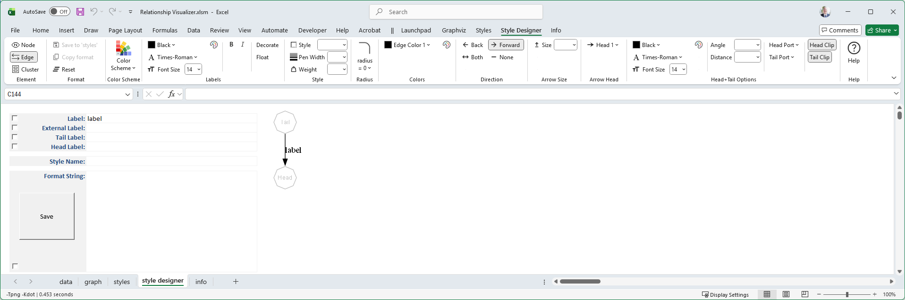 |
| -- |

*macOS*
| 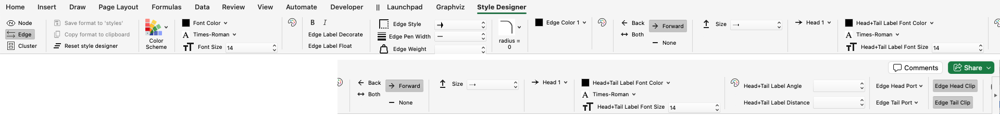 |
| -- |

#### `Cluster` design mode

Displays the Graphviz cluster-related attributes.

*Windows*
| 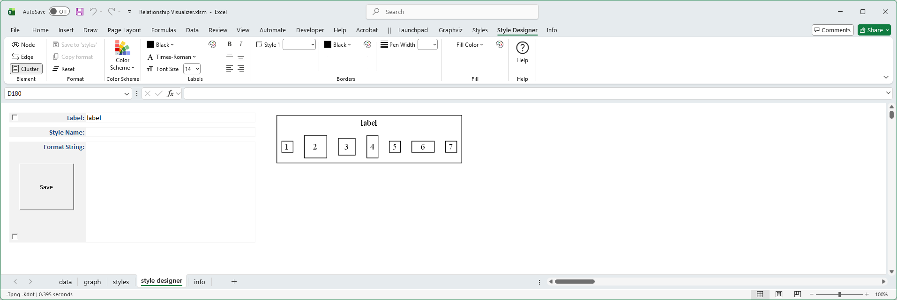 |
| -- |

*macOS*
| 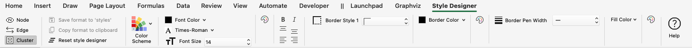 |
| -- |

You define styles by making selections on the **Style Designer** ribbon tab. As you choose options, a format string is generated, and a sample rendering of the node, edge, or cluster is produced using the graphing engine and spline values from the **Graphviz** ribbon tab (explained later).

Use these elements as guides when making selections on the **Style Designer** worksheet, ensuring that appropriate Graphviz attributes are applied in context. For example, when *Element = Edge*, attributes such as `shape` are not offered because they are not valid for edges.

In each design mode, you can experiment with different values until you achieve a visually pleasing result.

### Label Fields

The **Label Fields** let you define text that appears in the preview image on nodes, edges, or clusters. 

| 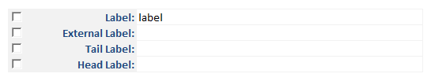 |
| -- |

The fields shown depend on the current **design mode** and what Graphviz supports in that context:

| Design Mode | Label | External Label | Tail Label | Head Label |
| :-:      | :-: | :-: | :-: | :-: |
| **Node**    | ✅   | ✅   |    |    |
| **Edge**    | ✅  | ✅  | ✅   | ✅   |
| **Cluster** | ✅  |    |   |    |

Each label field has an associated **check box**:
- **Checked** → The label is included in the style definition and will appear whenever the style is applied.  
- **Unchecked** → The label is shown only as representational text in the preview image, not part of the saved style.

**Example**

Suppose you are defining an edge style to represent a zero‑to‑one relationship. By entering the caption **“0:1”** in the *Head Label* field and checking its box, the label will be included in the style definition. Whenever this "Zero to One" edge style is used, the “0:1” caption will automatically appear next to the arrowhead.

| 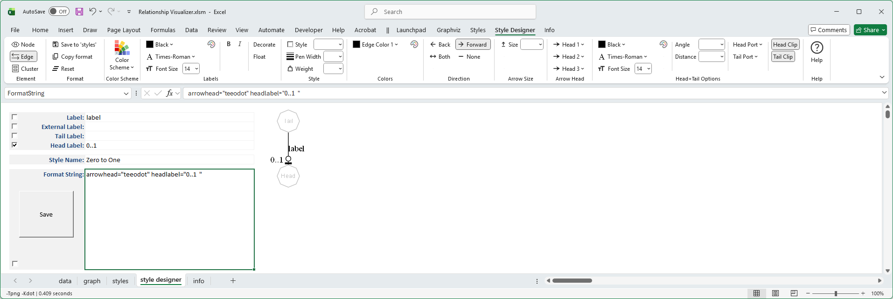 |
| -- |

### Style Name

| 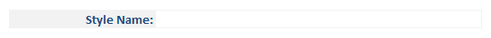 |
| -- |

This cell contains either:
- The name you want to assign to a **new** style definition.
- The **existing** name of the style definition on the `styles` worksheet which is being modified.

### Format String

As you make selections the **Format String** cell builds a list of Graphviz style attributes and writes them to the large cell below:

| 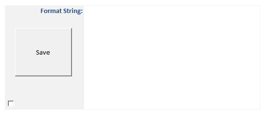 |
| -- |

The **Format String** cell is also an **active cell**, meaning you can edit it directly to fine‑tune settings beyond the options provided in the drop‑down lists.

For example:
- The font size list jumps from 36 to 48.  
- If you want a font size of 40, you may type the value directly into the cell.

⚠️ **Important Notes**
- Any change made in the **Ribbon** will overwrite hand‑made edits in the Format String, since ribbon changes rebuild the specification.  
- Conversely, deleting **all** the contents of the **Format String** cell will reset the Ribbon settings back to their default values.

### Save Button

The large **Save** button, along with the **Save to 'styles'** button in the Ribbon, saves the contents of the **Format String** using the specified **Style Name** on the **Styles** worksheet.

- Each saved style definition is stored as a row in the **Styles** worksheet.  
- These saved styles can then be applied to rows in the **Data** worksheet.  
- This workflow allows you to build a library of reusable node, edge, or cluster styles.

For example, the image below shows three **Node** style definitions created with the **Style Designer** and saved on the **Styles** worksheet:

| 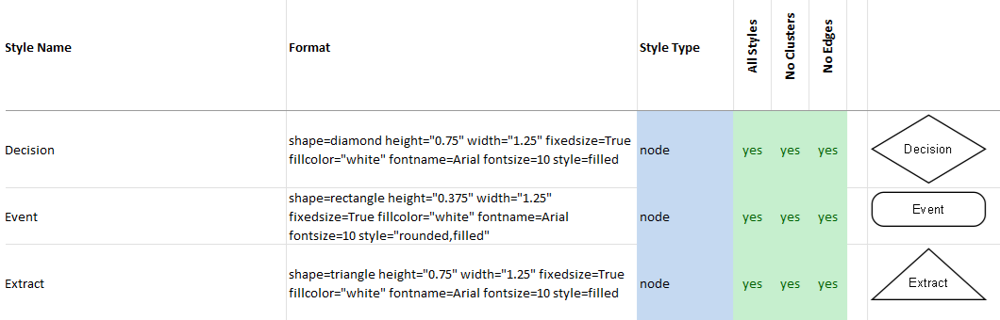 |
| --- |

## Color

### Graphviz Color Schemes

Color is a key aspect of any visualization, and the **Style Designer** provides full support for all Graphviz color schemes.

Graphviz defines a *color scheme* as the context for interpreting color names.

If a color value has the form `"xxx"` or `"/xxx"`, then the color `xxx` is evaluated according to the current color scheme. If no color scheme is set, the standard **X11** naming is used.  

For example, if `colorscheme="bugn9"`, then `color="7"` is interpreted as `/bugn9/7`.

This may sound complicated, so let’s simplify:

- The **Colors** button on the **Launchpad** ribbon shows or hides the **HELP – colors** worksheet.  
- This worksheet lists all supported Graphviz color schemes (267 in total).  
- Each scheme contains between 3 and 656 colors.

| 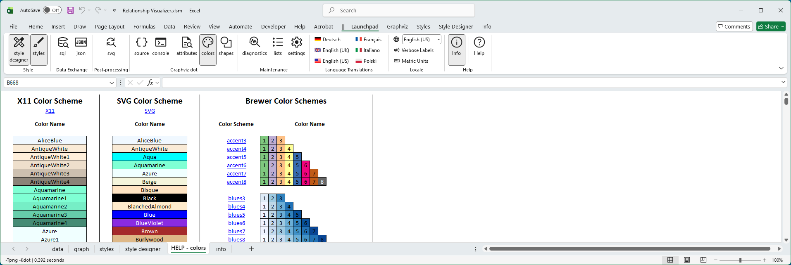 |
| -- |

This worksheet is used behind the scenes to generate preview images for color choices.

### Style Designer Color Schemes

Graphviz supports multiple color scheme families, which define how color names are interpreted. All Graphviz color schemes are supported in the Style Designer.

The **Style Designer** ribbon provides a large **Color Scheme** button and color drop‑down lists to help you select and apply these schemes.

#### Major Color Scheme Families
- **X11**  
  - Graphviz’s default color scheme.  
  - Largest predefined set of colors (656 choices).  
  - Useful for broad, general‑purpose visualization with familiar names like *HotPink1* or *LightSkyBlue*.  

- **SVG**  
  - Matches the standard color set defined by the SVG specification.  
  - Smaller, web‑friendly palette of named colors.  
  - Ideal for consistency with web graphics and cross‑platform rendering.  

- **Brewer**  
  - Based on Cynthia Brewer’s *ColorBrewer* palettes, designed for data visualization.  
  - Provides carefully balanced sequential, diverging, and qualitative color schemes.  
  - Useful for maps, charts, and diagrams where perceptual uniformity and accessibility are important.  

### Choosing a Color Scheme

Clicking the **Color Scheme** button opens a gallery where you can choose a scheme:

| 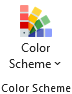 |
| -- |

When you select a scheme, all color‑related drop‑down lists are refreshed to display the colors for that scheme.

For example, choosing **`greens3`** 

| 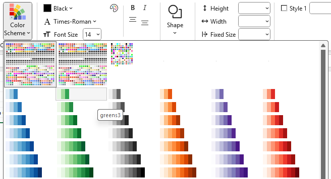 |
| -- |

updates the lists to values `1`, `2`, and `3`, displays color icons, and adds the attribute `colorscheme=greens3` to the **Format String**.

| 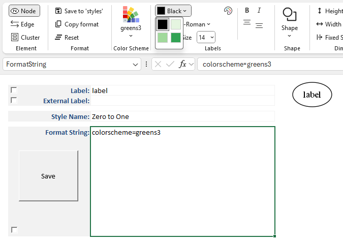 |
| -- |

If you switch to another scheme, the lists refresh again. 

For example, after selecting **`greens3`**, 

| 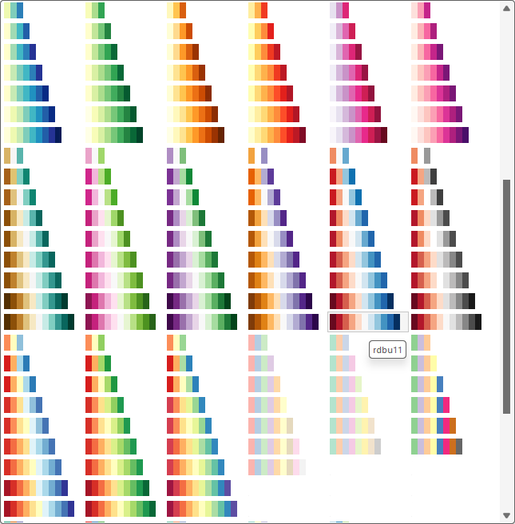 |
| --- |

choosing **`rdbu11`** updates the lists to values `1` through `11`, displays color icons, and adds `colorscheme=rdbu11` to the **Format String**.

| 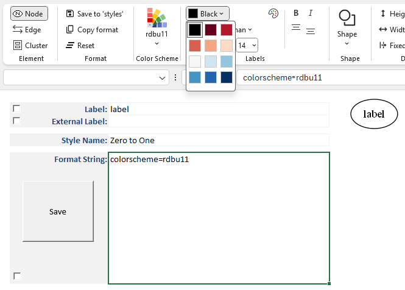 |
| -- |

### Selecting a Pre-defined Color

You choose colors by clicking on any of the color drop‑down arrows to open a gallery of available colors.  

Hovering over a color shows its name, such as *HotPink1* in the example below:

| 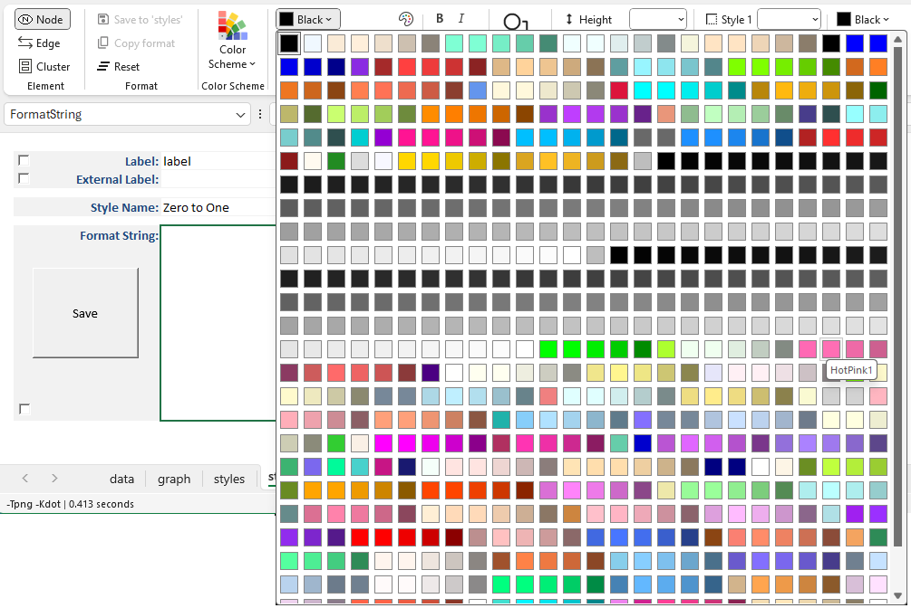 |
| --- |

When you click on a color, the **Style Designer** ribbon updates to show both the color and its name. 

The color name is added as an attribute in the **Format String**, and a preview image is generated to show how the color will appear when rendered by Graphviz.

In the example below, `HotPink1` has been selected as the font color:

| 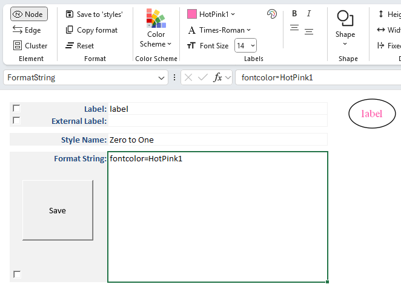 |
| --- |

### Selecting a Color Using RGB (Red Green Blue) Values

In addition to choosing from predefined color schemes, you can specify a custom color using the **Color Dialog**.  To the right of each color choice dropdown is a small button with color icon which appears as:

| 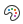 |
| --- |

This dialog provides a native interface for selecting colors on your operating system:

| **Windows 11 Color Dialog** | **macOS Color Dialog** |
| :---: | :---: |
| 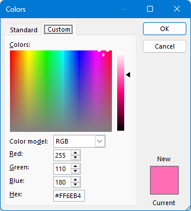 | 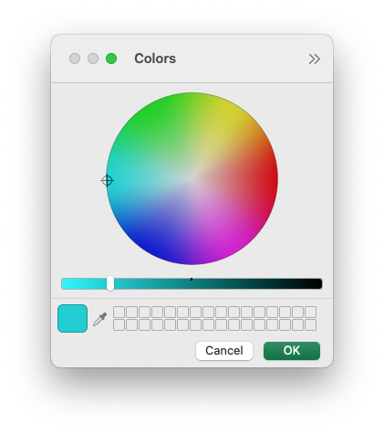  |

The **Color Dialog** is initialized to the currently chosen color.  

If a named color from a color scheme is selected, it is automatically converted to RGB when the Color Dialog is displayed.  

This allows you to first choose a color from a scheme, then refine it as needed using the picker.

For example, you might use the dialog to set a font color to a specific RGB value rather than relying on scheme‑based names.

When you select a color in the dialog:

- The chosen color is displayed as an icon in the **Style Designer** ribbon, and the RGB value of the color is shown as the color name (for example, `#FE0079`).  
- The color name or RGB value is added as an attribute in the **Format String**.  
- A preview image is generated to show how the color will appear when rendered by Graphviz.

In the example below, both the **Font Name** and the **Font Color** have been specified, with the font color defined as an RGB value:

| 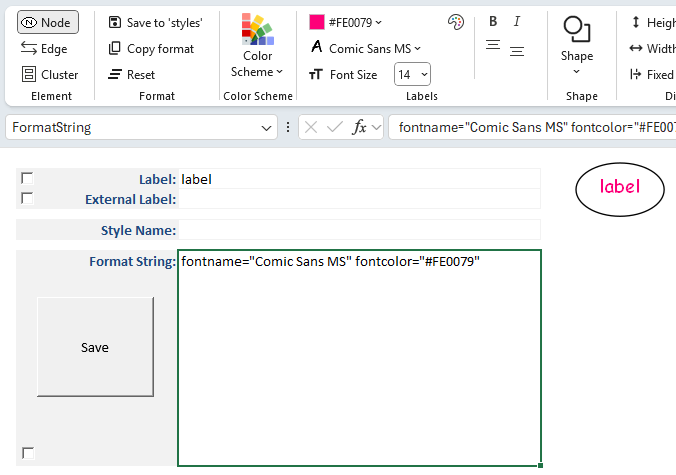 |
| --- |

## Labels

You can design styles which format label text using the following controls:

- Color
- Font
- Font size
- Bold
- Italic
- Label Location

| 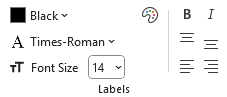 |
| -- |

### Label Fonts

The **Style Designer** font drop‑downs present a gallery of fonts that Graphviz can render on your chosen operating system:

- **Windows** → The list is derived from the fonts installed on your PC, filtered to remove fonts known to be incompatible with Graphviz.  
- **macOS** → A static list of fonts is provided from the **lists** worksheet.

When the **Font Name** drop‑down is selected for the first time, Graphviz generates a preview image of the letter **A** using the chosen font.  

These preview images are cached for future use. You may notice a slight delay the first time as the cache is built, but subsequent displays occur quickly.

An example **Font Name** gallery on Windows 11 appears as follows:

| 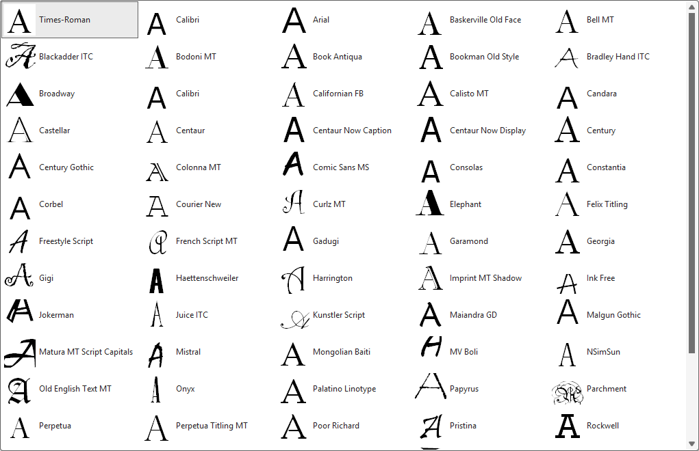 |
| -- |

### Selecting a Font

The currently selected font name is highlighted in the gallery.  

When you choose a font (e.g., `Comic Sans MS`):

- The **Font Name** caption on the drop‑down changes to the selected font.  
- An icon of the font appears in the ribbon to the left of the **Font Name**.  
- The font name is added as an attribute in the **Format String**.  
- A new preview image is generated, showing the associated labels rendered in the chosen font.

For example:

| 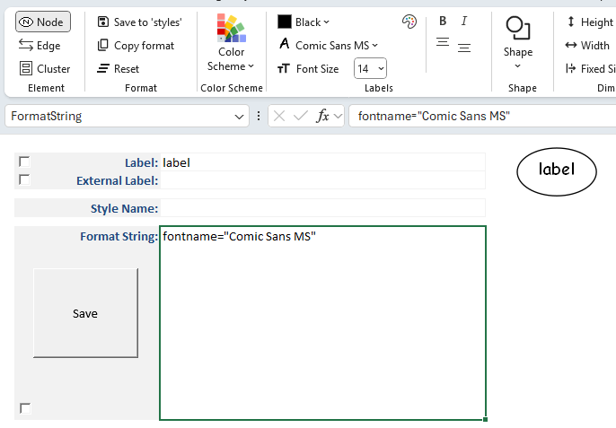 |
| -- |

### Label Location

Text can be aligned relative to the borders of a shape or cluster. Alignment is available as follows via the alignment buttons:

| 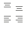 |
| --- |

| Position| Node |  Cluster |
| --- | :--: |  :---: |
| Top     |  ✅ |   ✅     |
| Center  |  ✅ |   ✅     |
| Bottom  |  ✅ |   ✅     |
| Left    |     |   ✅     |
| Middle  |     |   ✅     |
| Right   |     |  ✅      |

## Shapes

Graphviz provides a wide variety of **node shapes** that you can apply in the **Style Designer**.  
Shapes define the overall outline of a node and help visually distinguish different types of elements in your diagram.

Shapes can be used to convey meaning, organize information, or simply improve the readability of your graph. 

For example, rectangles may represent processes, ellipses may represent entities, and diamonds may represent decisions.

### Specifying a shape

Click on the `Shape` drop-down button. 

| 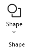 |
| --- |

A gallery of shapes supported by Graphviz is presented showing a sample image of the shape. 

| 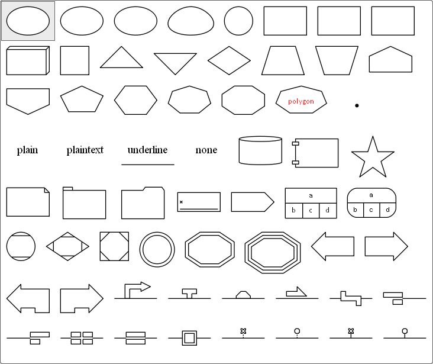 |
| --- |

Here we pick one of the rectangle shapes. When you select a shape:

- The name of the chosen shape is displayed in the **Style Designer** ribbon as the caption of the `Shape` button.  
- The shape name is added as an attribute in the **Format String** (e.g., `shape=rect`).  
- A preview image is generated to show how the node will appear when rendered by Graphviz.

| 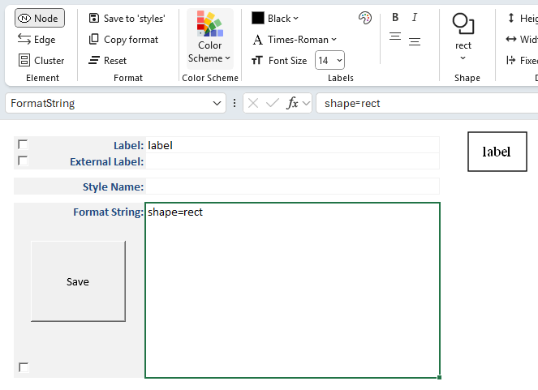 |
| --- |

### Polygon Shapes

Polygon shapes are unique from other shapes in Graphviz and have extra attributes which control how the polygon is created.

If you select 'polygon' as the shape the ribbon will change dynamically to present additional choices as shown below:

| 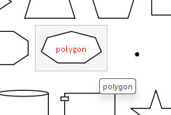 |
| --- |

Selecting `polygon` changes the ribbon to appear as:

| 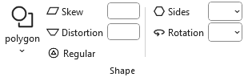 |
| --- |

---

#### Polygon Skew

Positive values skew top of polygon to right; negative values skew the top of the polygon to the left.

#### Positive Skew

|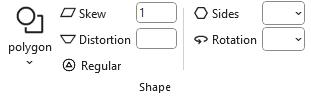|
| --- | 

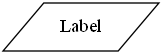

`shape="polygon" skew="1"`

#### Negative Skew

|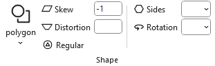|
| --- | 

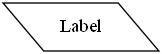

`shape="polygon" skew="-1"`

---

#### Polygon Distortion

Positive values cause top part of the polygon to be larger than bottom; negative values do the opposite.

#### Positive Distortion

||
| --- | 

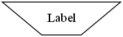

shape="polygon" distortion="1" regular="No"

#### Negative Distortion

|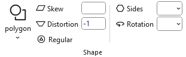|
| --- | 

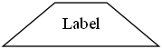

shape="polygon" distortion="-1" regular="No"

---

#### Combining Skew with Distortion

| + | skew="-1" | skew="0" | skew="1" |
| :---: | :--: | :--: | :--: |
| **distortion="1"** | 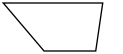 | 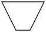 | 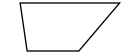 |
| | | |
| **distortion="0"** | 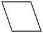 | 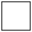 | 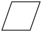 |
| | | |
| **distortion="-1"** | 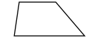 | 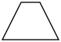 | 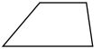 |

---

#### Regular Polygon

If true, forces the polygon to be regular, i.e., the vertices of the polygon will lie on a circle whose center is the center of the node.

| 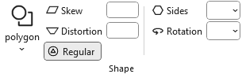 |
| --- | 

`shape="polygon" regular="Yes"`

---

#### Polygon Sides

The **sides** attribute controls the number of polygon sides used when drawing a node shape.

- **Default**: A polygon has **4 sides** (a square).  
- **sides < 4**:  
  - If the polygon is **not regular**, Graphviz substitutes an **ellipse**.  
  - If the polygon is **regular**, Graphviz substitutes a **circle**.  
- **sides ≥ 4**:  
  - The node is drawn as a polygon with the specified number of sides.  
  - For example, `sides=5` produces a pentagon, `sides=8` a hexagon, and so on.

When you set **sides**, the chosen value is displayed in the **Style Designer** ribbon, added to the **Format String** (e.g., `sides=6`), and shown in the preview image.

| | 
| --- |  

#### sides=8

|  | 
| --- | 

 

`shape="polygon" sides="8" regular=yes"`

Elipses/circles can also be skewed and distorted to create unique shapes.

|  | 
| --- | 

#### sides=1, with skew and distortion

 

`shape=polygon sides=1 skew=1 distortion="-1" regular=no`

---

#### Polygon Rotation

The **orientation** attribute controls the rotation angle of a node shape. 
It determines how the shape is drawn relative to its default position.

- **orientation=0** (default)  
  - The shape is drawn in its standard upright position.  

- **orientation=n**  
  - The shape is rotated by *n* degrees, **clockwise**.  
  - For example, `orientation=45` tilts the shape diagonally, while `orientation=90` rotates it a quarter turn.  

- **interaction with regular polygons**  
  - When used with polygon shapes (via the **sides** attribute), orientation rotates the polygon around its center.  
  - For any number of polygon sides, 0 degrees rotation results in a flat base.
  - This is useful for aligning triangles, diamonds, or other polygons to match the desired layout.

When you set **orientation**, the chosen value is displayed in the **Style Designer** ribbon, added to the **Format String** (e.g., `orientation=90`), and shown in the preview image.

| 5-sided regular polygon with no rotation | 5-sided regular polygon rotated 36 degrees clockwise |
| :--: | :--: |
|  |  |
| | |
|  |  |

## Dimensions

In Graphviz, you can control the **height** and **width** of node shapes to adjust their overall size. These attributes ensure that shapes are scaled consistently and remain readable in your diagram.

|  |
| --- |

### Shape Height and Width

When you specify a shape’s dimensions:

- The chosen values are displayed in the **Style Designer** ribbon.  
- The attributes `height` and `width` are added to the **Format String** (e.g., `height=1.0, width=2.0`).  
- A preview image is generated to show how the resized shape will appear when rendered by Graphviz.

By default, Graphviz calculates shape dimensions automatically based upon the computed size of the label and its placement.

Specifying explicit values allows you to emphasize certain nodes, align shapes visually, or ensure uniform sizing across your diagram.

### Units of Measure

Graphviz’s default unit of measure for shape dimensions is **inches**.

However, you can specify metric units by enabling the **Metric Units** checkbox on the **Launchpad** ribbon.

- When metric units are selected, display values are shown in **millimeters (mm)**.  
- These values are automatically converted to **inches** internally to satisfy Graphviz’s requirements.  
- This allows you to work in familiar metric units while ensuring compatibility with Graphviz’s rendering engine.

### Fixed Size

The **fixedsize** attribute controls whether a node’s shape is drawn at a fixed size or allowed to expand to fit its label text.

- **fixedsize=false** (default)  
  - The node’s dimensions are adjusted automatically to fit the label.  
  - The attributes `height` and `width` act as minimum values.  
  - Longer labels will stretch the shape horizontally or vertically as needed.

- **fixedsize=true**  
  - The node’s dimensions are locked to the specified `height` and `width`.  
  - Labels which exceed the width of the shape are truncated down equally from the left and right sides to fit inside the fixed shape.  
  - Useful for ensuring uniform node sizes across a diagram, regardless of label length.

- **fixedsize=shape**  
  - The node’s height and width are locked, but the label is allowed to stretch horizontally.  
  - This ensures consistent vertical sizing while accommodating longer text.  
  - Useful for diagrams where uniform height is desired, but labels vary in length.

When you enable **fixedsize**, the chosen values are displayed in the **Style Designer** ribbon, added to the **Format String** (e.g., `shape=rect height=1 width="1.5" fixedsize=True`), and shown in the preview image.

|  |
| --- |

## Borders 

### Border Styles

Up to 3 border styles are selectable and are additive making it possible to have styles such as bold edge and rounded corners. When you click on any of the 'Border Style' drop-down lists you will be presented with the list of choices along with a sample image of the style.

|  |
| --- |

In this example `Style 1` as `rounded` to give the rectangle rounded corners.

|  |
| --- |

The **Style Designer** provides an adaptive interface for applying multiple border styles.  
As you make selections, additional style options appear dynamically:

- Once a style is chosen, the **Style 2** drop‑down becomes available.  
- Selecting `dashed` as the second choice results in a rounded, dashed border.  
- A **Style 3** drop‑down then appears, allowing you to continue layering styles.

This adaptive behavior makes it easy to combine multiple visual effects without cluttering the interface.

|  |
| --- |

### Border Color

How to choose colors has already been explained.  

The **Border Color** controls allow you to specify the color of a node shape or cluster border.

For example:

|  |
| --- |

### Border Pen Width

The **penwidth** attribute controls the thickness of lines used to draw node borders and edges.

|  |
| --- |

- **penwidth=1.0** (default)  
  - Standard line thickness.  
  - Borders and edges are drawn with a single‑pixel width.  

- **penwidth>1.0**  
  - Increases line thickness proportionally.  
  - For example, `penwidth=2.0` doubles the thickness, while `penwidth=3.0` triples it.  
  - Useful for emphasizing certain nodes or edges in a diagram.  

- **penwidth<1.0**  
  - Decreases line thickness.  
  - For example, `penwidth=0.5` produces a thinner line than the default.  
  - Can be used for subtle or secondary connections.

For example:

|  |
| --- |

### Border Peripheries

The **peripheries** attribute controls how many borders (or outlines) are drawn around a node shape.

|  |
| --- |

- **peripheries=1** (default)  
  - A single border is drawn around the shape.  

- **peripheries=2**  
  - Two concentric borders are drawn, giving the node a “double‑outlined” appearance.  

- **peripheries=n**  
  - Any positive integer value `n` draws that many concentric borders.  
  - Useful for visually emphasizing certain nodes or distinguishing categories.  

For example:

|  |
| --- |

## Fills

### Fill Color

The **fillcolor** attribute controls the interior color of a node shape or cluster.  It determines how the inside of the shape is rendered, providing contrast with the border and improving visual clarity.

Fill colors can be selected from predefined color schemes or refined using the **Color Dialog**.

They are often used to group related nodes, highlight important elements, or improve the overall readability of a diagram.

When you specify a fill color:

- The chosen color is displayed in the **Style Designer** ribbon, and the `Fill Color` caption changes to the name or RGB value of the color chosen.  
- A new dropdown for `Gradient Fill Color` appears below the fill color.
- The color name or RGB value is added as an attribute in the **Format String** (e.g., `fillcolor=DodgerBlue`).  
- A preview image is generated to show how the node will appear when rendered by Graphviz.

For example:

|  |
| --- |

### Gradient Fill Color

Notice that the ribbon dynamically changes once a `Fill Color` is specified to display a new choice for `Gradient Fill Color`.

| |
| --- |

A `Gradient Fill Color` allows you to select a second color which the Fill Color will gradually transition to. If you select `HotPink` as the `Gradient Fill Color` the preview image changes to look like:

|  |
| --- |

Another set of dynamic changes occur as three additional choices `Type`, `Angle`, and `Weight` appear to the right of the fill color selections. These choices allow you to define how the gradient transition occurs. 

### Gradient Type

The **gradienttype** attribute controls how multiple colors blend together inside a node shape or cluster. Instead of filling the shape with a single solid color, you can apply a gradient to create smooth transitions between colors.

Gradient types can be used to highlight relationships, emphasize categories, or simply add visual appeal. For example, a vertical gradient may suggest progression, while a radial gradient can emphasize a central point.

The Gradient Type is either `filled` (i.e., linear) or `radial`.

| |
| --- |

The differences are illustrated below:

| `gradienttype=filled`   | `gradienttype=radial`  |
| :---: | :---: |
|  |  |

### Gradient Angle

The **gradientangle** attribute controls the direction of a gradient fill inside a node shape or cluster.  
It determines how the colors specified in the **fillcolor** attribute are blended across the shape.

Changing the Gradient Angle moves the angle of the gradient fill. 
- For linear fills, the colors transform along a line specified by the angle and the center of the object. 
- For radial fills, a value of zero causes the colors to transform radially from the center; for non-zero values, the colors transform from a point near the object's periphery as specified by the value.

Angles are measured in **degrees**, with `0` representing a left‑to‑right horizontal gradient.  
Other values rotate the gradient clockwise:  
- `90` → top‑to‑bottom vertical gradient  
- `180` → right‑to‑left horizontal gradient  
- `270` → bottom‑to‑top vertical gradient  

By adjusting the gradient angle, you can control the visual flow of color transitions, highlight directionality, or add subtle emphasis to your diagram.

For example, if you change the Gradient Angle to 90 degrees, the preview images now appear as:

| `gradienttype=filled gradientangle=90`  | `gradienttype=radial gradientangle=90`     |
| :---: | :---: |
|  |  |

### Gradient Weight

The **gradient weight** is specified as part of the **fillcolor** attribute, not as a separate attribute. It controls how much influence each color has in a gradient fill.

When you define a gradient:

- The colors are listed in the **fillcolor** string, separated by a colon.  
- A semicolon followed by a numeric value (between 0.0 and 1.0) specifies the weight.  
- The weight determines the balance between the first and second colors.

For example, specifying a gradient weight of 20% for the fill color is specified as:

`style=filled fillcolor="DodgerBlue;0.20:HotPink"`

and the image appears as:

|    | 
| :--: |

By adjusting the gradient weight, you can highlight one color more strongly, create subtle shading effects, or achieve balanced transitions between multiple colors.

#### Gradient Weight + Gradient Angle

Gradient Angle can be combined with the Gradient Weight to rotate the position of the color split, as in these examples where the gradient weight of the blue fillcolor is 20%:

| `gradientangle=0`  | `gradientangle=90`  | `gradientangle=180` | `gradientangle=270` |
| :---: | :---: | :---: | :---: |
|  |  |  |  |
| `gradientangle=45`  | `gradientangle=135`  | `gradientangle=225` | `gradientangle=315` |
|  |  |  |  |

## Images

As you develop more advanced relationship graphs you may want to use images to represent the nodes in combination with, or in place of the node shapes. Graphviz supports an `image=` attribute where you can provide a file name of an image to include in a node.

The Relationship Visualizer by default will look for images in the directory where the spreadsheet is saved. 

### Image Storage and Paths

If you wish to store images in other locations, you must either:

- Make a configuration change on the **Settings** worksheet to specify the location(s).  
  - The image path must be defined before you can use the `image=` attribute in a style definition.  
- Include the path to the image directly, in either **Relative** or **Absolute** form.

#### Relative vs. Absolute Paths

- **Relative Path**  
  - Specifies the image location relative to the workbook directory.  
  - Example: `images/logo.png`  
  - ✅ Easier portability — if the workbook and images are kept together in a folder, cloning or moving the folder preserves the links automatically.  
  - ✅ Ideal for sharing with others or using across multiple devices.  

- **Absolute Path**  
  - Specifies the full location of the image on your system.  
  - Example: `C:/Users/Jeffrey/Documents/Graphviz/images/logo.png`  
  - ✅ Ensures the image is always found, regardless of where the workbook is located.  
  - ✅ Useful when images are stored in a central repository or shared network drive.  
  - ⚠️ Less portable — moving the workbook without the same directory structure will break the link.

By choosing the appropriate path type, you can balance **portability** (relative paths) with **certainty of location** (absolute paths).

### Add an image path

Switch to the `settings` worksheet and locate the "Image Path:" setting in the 'Graph Options' section. To the right of the cell is a button with three dots […]. If you press that button it will bring up the standard directory selection dialog which you can use to choose the directory where the images are stored. Navigate to the directory and press the "OK" button to transfer the path to the cell.

|    | 
| :--: |

Your settings should appear like this:

|    | 
| :--: |

### Specify an image

Image name is an option on the `style designer` worksheet that is useful when you want to create a common style definition where all nodes of a given style use a common icon. For example, it is possible to depict computers with one image, depict databases with another image, and depict computer programmers with yet another image.

**Step 1** - Define a shape. For this example a rectangle will be used.

|    | 
| :--: |

**Step 2** - Look to the far right side of the Ribbon to find the image controls.

|    | 
| :--: |

Press the `Choose Image` button

Navigate to the directory containing the images and choose an image. A small image is selected in order to demonstrate scaling and placement.

|    | 
| :--: |

The image by default is placed in the center of the node. For example:

|    | 
| :--: |

With the image selected, the Ribbon adapts to display additional options which can be used to scale the image, or position the image within the shape.

|    | 
| :--: |

---

### Scale the Image

Adjust the image by clicking the radio buttons in the **Scale** group. Only one button can be selected. If you make a second selection, your first selection is replaced.

| Scale   | Radio Button | Preview | Description |
| :---:   | :---: | :---: | :--- |
| **height**  |  |  | Stretch image to fill node height; width remains unchanged. |
| | | | |
| **width**   |  |  | Stretch image to fill node width; height remains unchanged. |
| | | | |
| **aspect**  |  |  | Uniformly scale image to fit node while preserving aspect ratio. |
| | | | |
| **both**    |  |  |  Stretch image to fill both width and height of node; aspect ratio may distort. |
| | | | |
| **natural** |  |  | Use image’s natural size; node expands to fit (default). |

No scaling (i.e. "natural" scaling) will be used in order to demonstrate how to position images which are smaller than the node.

---

### Adjust the Image Position

The **Position** group contains nine toggle buttons that work in **radio button fashion**.  Selecting any button automatically unselects the previously chosen option.

These buttons correspond to the nine possible locations where images can be placed relative to the cell or shape via the **imagepos** attribute:

| + | Left | Center | Right |
| :--: | :--: | :--: | :--: |
| **Top**    | `tl` | `tc` | `tr` |
| **Middle** | `ml` | `mc` | `mr` |
| **Bottom** | `bl` | `bc` | `br` |

By default, when the **imagepos** attribute is omitted, the image is placed in the middle center.

You can reposition the image within the node by selecting a Position radio button, as shown below.

| Position | Buttons pressed | Preview Image |
| :--: | :--: | :--: |
|Default |      |  | 
| | | |
| Top Left |  |  | 
| | | |
| Bottom Center |  |   | 

## Edges

Edges can have styles just as nodes do.  

To create an edge style definition in the **Style Designer** worksheet:

1. Change the **Design Mode Element** to **Edge**.  
   - This switches the ribbon controls to attributes appropriate for edges (e.g., `color`, `style`, `penwidth`, `arrowhead`).  
   - Node‑specific attributes such as `shape` will no longer be available.  

2. Press the **Reset** button.  
   - This clears all style values carried over from node definitions.  
   - Starting from a clean slate ensures that only edge‑specific attributes are applied.  

3. Use the ribbon, preview image, and format string just as you did for nodes.  
   - The selected attributes are displayed in the ribbon.  
   - The **Format String** is updated with edge attributes (e.g., `color=blue, style=dashed`).  
   - The preview image shows exactly how Graphviz will render the edge.

The style designer worksheet appearance changes to look as follows:

|  |
| :--: |

### Edge Labels

Labels for edges are specified in the same way as labels for nodes, with the same styling options (e.g., font, color, size).  

|  |
| :--: |

However, edge labels include two additional toggle attributes:

- **Decorate** - draws a line from the edge to its label, visually connecting the text to the edge.  
- **Float** - allows the label to float freely near the edge rather than being anchored to a fixed position.

These options are available as toggle buttons in the **Style Designer** ribbon.  
When selected, they are added to the **Format String** (e.g., `decorate=true, float=true`) and shown in the preview image.

### Edge Style

Edges can be styled using several attributes available in the **Style Designer** worksheet.  
These attributes control the visual appearance and relative importance of edges in the graph.

- **Style**  
  - Defines the line pattern or effect applied to the edge.  
  - Common values include `solid`, `dashed`, `dotted`, `bold`, and `tapered`.  
  - For example, `style=dashed` produces a broken line, while `style=bold` thickens the edge for emphasis.  

|  |
| :--: |

- **Penwidth**  
  - Specifies the thickness of the edge line.  
  - Larger values produce heavier lines, useful for highlighting important connections.  
  - Example: `penwidth=2.0` doubles the default line thickness.  

|  |
| :--: |

- **Weight**  
  - Influences how strongly the edge affects the layout.  
  - Higher weights encourage Graphviz to keep connected nodes closer together.  
  - Example: `weight=5` makes the edge act like a stronger “spring” in the layout engine.

### Edge Colors

Edge colors are specified in the same way as node colors, with support for both **color schemes** and the **RGB Color Dialog**.

- **One Color**  
  - Apply one color to the edge line.  
  - Example: `color=Blue`  

- **Multiple Colors (up to 3)**  
  - Specify up to three colors; Graphviz renders the edge as parallel lines in the given colors.  
  - Example: `color="Blue:Red:DarkGreen""`  

- **Color Schemes**  
  - Choose colors from Graphviz’s predefined schemes (e.g., `rdbu11`, `greens3`).  
  - Example: with `colorscheme=rdbu11`, use `color="2:4:6"` to reference indexed colors from that scheme.  

- **RGB Color Dialog**  
  - Select exact RGB values for precise customization beyond scheme defaults.

When you set edge colors, the chosen values are displayed in the **Style Designer** ribbon, added to the **Format String** (e.g., `color="red:yellow"`), and shown in the preview image.

For Example:

| # Colors | Selection | Preview |
| :-: | :-: | :-: |
| 1 |  |  |
| | | | 
| 2 |  |  | 
| | | | 
| 3 |  |  | 

### Edge Direction

The Graphviz **dir** attribute controls the arrowheads drawn on an edge. 

In the **Style Designer** worksheet, this is managed through four toggle buttons in the **Direction** group that act in radio button fashion - selecting one option automatically clears the previous choice.

|  |
| :--: |

Supported values are:

- **forward**  
  - Draws an arrowhead at the **target end** of the edge.  
  - Provides Ribbon options for choosing **arrowhead styles** to be displayed.  
  - Example: `dir=forward`  

- **back**  
  - Draws an arrowtail at the **source end** of the edge.  
  - Provides Ribbon options for choosing **arrowtail styles** to be displayed.  
  - Example: `dir=back`  

- **both**  
  - Draws arrowheads at **both ends** of the edge.  
  - Provides Ribbon options for choosing both **arrowhead** (target end) and **arrowtail** (source end) styles to be displayed.  
  - Example: `dir=both`  

- **none**  
  - Suppresses arrowheads entirely, leaving a plain line.  
  - Removes the arrowhead and arrowtail style options from the ribbon.  
  - Example: `dir=none`  

When you select a direction, the chosen value is displayed in the **Style Designer** ribbon, added to the **Format String** (e.g., `dir=both`), and shown in the preview image.

| Direction | Ribbon | Preview |
| :-- | :-- | :--: |
| `dir=none` |   | |
| | |
| `dir=forward` |  | |
| | |
| `dir=back` |   | |
| | |
| `dir=both` |   | |

> Arrowhead and arrowtail styles will be described in detail in a later section.

### Arrow Size

The **arrowsize** attribute scales the size of an edge’s arrowhead or arrowtail.  

|  |
| :--: |

It acts as a simple multiplier applied to the base size of the selected arrow style.

- **Value**  
  - A numeric scaling factor (default is `1.0`).  
  - Values greater than 1 enlarge the arrow; values less than 1 reduce it.  
  - Example: `arrowsize=1.5` makes the arrowhead 50% larger than normal.

- **Effect on Direction**  
  - When `dir=forward`, the scaling applies to the **arrowhead**.  
  - When `dir=back`, the scaling applies to the **arrowtail**.  
  - When `dir=both`, the scaling applies to **both ends**.  
  - When `dir=none`, the attribute has no visible effect.

The selected value is shown in the **Style Designer** ribbon, added to the **Format String** (e.g., `arrowsize=0.75`), and reflected in the preview image.

### Arrow Heads

Arrowheads are a popular styling option for edges, and Graphviz provides a robust set of shapes to choose from.  

You may stack multiple arrowhead types to create custom designs. For example:

| 1 Arrow Head | 2 Arrow Heads| 3 Arrow Heads |
| :-: | :-: | :-: |
|     |       |       |
|`arrowhead="normal"` | `arrowhead="normalodot"`| `arrowhead="normalodotcurve"` |

The Relationship Visualizer ribbon supports up to **three stacked arrowheads**:

- When you choose the **first** arrowhead, a **second dropdown** automatically appears.  
- After selecting a **second** arrowhead, a **third dropdown** becomes available.  
- Each dropdown represents one position in the stack, allowing you to build compound arrowhead shapes.

These selections apply to the end(s) of the edge based on the `dir` setting (e.g., `forward`, `back`, or `both`).  

Arrowhead and arrowtail styles are added to the **Format String** (e.g., `arrowhead=diamond`, `arrowtail="dotvee"`), and the preview updates accordingly.

Each change updates the **Edge Format String** and renders a sample graph showing how the edge will appear based on the current **Layout Engine** and **Splines** settings on the `settings` worksheet.  

Be aware that the visual result may vary depending on how different layout engines handle splines, head ports, and tail ports.  

For more details on these settings, see the section [Graph Options](#graph-options).

### Arrow Tails

Arrowtails behave the same way as arrowheads: you may stack up to three tail shapes to create compound designs, and each selection reveals the next dropdown in the sequence. The stacked arrowtails apply to the source end of the edge whenever the direction setting (`dir=back` or `dir=both`) enables them.

With both arrowheads and arrowtails available, you can combine these glyphs in a wide variety of ways. The following gallery shows the full set of arrow shapes that Graphviz supports, which you can mix, match, and stack to create custom edge endpoints.

Arrow tails have the same set of choices as arrow heads. Like arrow heads, Relationship Visualizer allows you to choose up to 3 styles for Arrow Tails.

### Arrow Glyphs

Graphviz provides a rich collection of arrowhead and arrowtail glyphs that you can use individually or stack to create custom edge endpoints. Each glyph has its own visual character—ranging from simple geometric shapes to more expressive markers—and stacking them allows you to build complex designs that convey direction, emphasis, or semantic meaning.

The following gallery shows the complete set of arrow glyphs supported by Graphviz. These shapes can be used for both **arrowheads** and **arrowtails**, and up to three may be combined in sequence to form a compound style. Use this reference to explore the available options and choose the combinations that best fit your diagram’s purpose.

|  |
| :-: |

The arrowhead and arrowtail glyphs shown above use the standard Graphviz names.  
From left to right, each glyph is labeled with its corresponding attribute value  

| Left + Right | Left Only | Right Only |
| :-- | :-- | :-- |
| `none`| `dot`| `odot` |
| `normal` | `lnormal` | `rnormal` |
| `onormal` | `olnormal` | `ornormal` |
| `box` | `lbox` | `rbox` |
| `obox` | `olbox` | `orbox` |
| `diamond` | `ldiamond` | `rdiamond` |
| `odiamond` | `oldiamond` | `ordiamond` |
| `inv` | `linv` | `rinv` |
| `oinv` | `olinv` | `orinv` |
| `tee` | `ltee` | `rtee` |
| `crow` | `lcrow` | `rcrow` |
| `vee` | `lvee` | `rvee` |
| `curve` | `lcurve` | `rcurve` |
| `icurve` | `licurve` | `ricurve` |

Use these names when specifying `arrowhead`, `arrowtail`, or stacked combinations such as `arrowhead="dotvee"` or `arrowtail="diamondtee"`.

## Edge Head and Tail Options

These controls provide assistance in defining the head and tail attributes for an edge.

|  |
|----------------------------------------------------|

### Label Font Name, Font Size, and Font Color

These attributes provide a way to differentiate the text at the end of the edges where they meet the node.

|  |
|----------------------------------------------------|

Appears as: 

|  |
|----------------------------------------------------|

With Format string: 

`labelfontname="Arial" labelfontsize="8" labelfontcolor="Blue"`

### Label Angle

`labelangle=` controls the **direction** in which a head label or tail label appears around the point where the edge touches the node.

Imagine standing at the spot where the edge meets the node. Now imagine a line pointing straight back along the edge — that’s the starting direction (0 degrees).  
`labelangle` tells Graphviz how far to rotate from that starting direction:

- **Positive numbers** rotate the label **to the left**
- **Negative numbers** rotate the label **to the right**

By changing the angle, you choose which “side” of the node the label appears on. 

For example, setting the label angle to 90 degrees:

|  |
|----------------------------------------------------|

Appears as: 

|  |
|----------------------------------------------------|

With Format String:

`labelangle=90 labelfontname=Arial labelfontsize=8 labelfontcolor=Blue`

### Label Distance

`labeldistance=` controls **how far away** the head label or tail label appears from the point where the edge touches the node.

Instead of setting the distance directly in points, `labeldistance` acts as a **scaling factor**.  
Graphviz starts from a built‑in base distance (about **10 points**), and your value multiplies that distance:

- A value of **1.0** keeps the default spacing
- A value of **2.0** places the label about twice as far away
- A value of **0.5** moves it to about half the default distance

A **point** is a standard typographic unit: there are **72 points in one inch**, so these changes adjust the label’s distance in small, predictable steps.

In short, `labeldistance` tells Graphviz to move the label **closer or farther** from the node by scaling the default distance.

|  |
|----------------------------------------------------|

For example, `labeldistance=3` appears as: 

|  |
|----------------------------------------------------|

With Format String:

`labelangle=90 labeldistance=3 labelfontname=Arial labelfontsize=8 labelfontcolor=Blue`

### Label Angle & Label Distance

Used together, `labelangle` and `labeldistance` let you control both **where** a label appears around the node and **how far out** it sits. `labelangle` chooses the direction—left, right, above, below, or anywhere in between—while `labeldistance` scales the default spacing to move the label closer or farther away. Adjusting both gives you precise, intuitive control over label placement at the point where the edge meets the node.

This example depicts when `labelangle=` and `labeldistance=` attributes are used together.

|  |
|----------------------------------------------------|

Appears as: 

|  |
|----------------------------------------------------|

With Format String:

`labelangle=90 labeldistance=3 labelfontname=Arial labelfontsize=8 labelfontcolor=Blue`

### Head Port

Indicates where on the head node to attach the head of the edge. In the default case, the edge is aimed towards the center of the node, and then clipped at the node boundary.

If a compass point is used, it must be one of the following: `n`, `ne`, `e`, `se`, `s`, `sw`, `w`, `nw`, `c`, or `_`. A compass point adjusts the edge’s attachment point so that it aims for the specified location on the port—or, if no port name is provided, on the node itself. The compass point `c` targets the center of the node or port. The compass point `_` instructs Graphviz to choose the side of the port that lies on the exterior of the node; if no such side exists, the center is used instead. When a port name is supplied without a compass point, the default value is `_`.

 

Appears As:

|  |
|----------------------------------------------------|

With Format String:

`labelfontname=Arial labelfontsize=8 labelfontcolor=Blue headport=n`

### Tail Port

Indicates where on the tail node to attach the tail of the edge.

If a compass point is used, it must be one of the following: `n`, `ne`, `e`, `se`, `s`, `sw`, `w`, `nw`, `c`, or `_`. A compass point modifies edge placement so that the edge aims for the specified point on the port—or, if no port name is supplied, on the node itself. The compass point `c` targets the center of the node or port. The compass point `_` indicates that Graphviz should choose the side of the port that lies on the exterior of the node; if no such side exists, the center is used instead. When a port name is provided without a compass point, the default compass point is `_`.

 

Appears as: 

|  |
|----------------------------------------------------|

With Format String:

`labelfontname=Arial labelfontsize=8 labelfontcolor=Blue headport=n tailport=s`

### Clipping Behavior

Graphviz uses *clipping* to decide how far an edge (its spline and arrowhead) runs into a node. The attributes `headclip` and `tailclip` control this behavior independently for the head and tail ends of an edge. These settings affect the **edge and arrowhead**, not the label text itself.

### Head Clip

`headclip=` controls how the edge is clipped at the **head** node.

- When `headclip=true` (the default), Graphviz clips the spline at the boundary of the head node. The arrowhead sits at the edge of the node shape, rather than running into the center.
- When `headclip=false`, the edge is not clipped to the node boundary. The spline and arrowhead may extend into the interior of the node, often aiming at its center.

| Buttons | Preview |
| :-----: | :-----: |
|    |                                             |
|                             | Edge head **is** clipped at the node |
|   |                                            |
|                             | Edge head **is not** clipped at the node |

### Tail Clip

`tailclip=` controls how the edge is clipped at the **tail** node.

- When `tailclip=true` (the default), Graphviz clips the spline at the boundary of the tail node. The edge meets the node at its outline.
- When `tailclip=false`, the spline is allowed to extend into the node, so the edge may appear to start from a point inside the node.

| Buttons | Preview |
| :-----: | :-----:|
|    |                                             |
|                             | Edge tail **is** clipped at the node |
|   |                                            |
|                             | Edge tail **is not** clipped at the node      |

## Clusters

Clusters can have styles just as nodes and edges do.  

To create a cluster style definition in the **Style Designer** worksheet:

1. Change the **Design Mode Element** to **Cluster**.  
   - This switches the ribbon controls to attributes appropriate for clusters (e.g., `Labels`, `Borders`, `Fill`, `arrowhead`).  
   - Node‑specific attributes such as `shape` will no longer be available.  
   - Edge‑specific attributes such as `arrowhead`, `arrowtail` will no longer be available.  

2. Press the **Reset** button.  
   - This clears all style values carried over from node definitions.  
   - Starting from a clean slate ensures that only edge‑specific attributes are applied.  

3. Use the ribbon, preview image, and format string just as you did for nodes and edges.  
   - The selected attributes are displayed in the ribbon.  
   - The **Format String** is updated with edge attributes (e.g., `color=blue, style=dashed`).  
   - The preview image shows exactly how Graphviz will render the cluster. There are seven shapes of various sizes to simulate how a cluster might be used.

The style designer worksheet appearance changes to look as follows:

|  |
| :--: |

### Color Scheme

The cluster can specify a [color scheme](#color-scheme). Note that since clusters are subgraphs, you should use care in specifying a color scheme as nodes can inherit this specification.

### Labels

Font color, name, and size are specified for the cluster label the same way they are specified for nodes and edges. See [Labels](#labels) above for more information.

### Label Alignment

Nodes allow you to left‑justify, center, or right‑justify their labels. Clusters extend this by also allowing **top** or **bottom** alignment. These options are additive, so you can combine them to specify positions such as **bottom right**, **top left**, or **top center**.

The following example shows the alignment buttons set to place the cluster label in the bottom right of the cluster:

|  |
| :--: |

### Borders

Border styles, colors, and pen widths for a cluster’s rectangle are defined the same way they are for nodes. This means you can use the same attributes—such as `color`, `penwidth`, and `style`—to control how the cluster’s outline looks. The cluster simply draws a rectangular boundary around its contents, and these attributes determine how that boundary is rendered. For more details on available options, see [Borders](#borders) above.

### Fill Colors

Fill colors and gradient fills for a cluster’s rectangle are defined the same way they are for nodes. You can use the same attributes—such as `fillcolor`, `color`, and `style=filled` or gradient specifications—to control how the cluster’s background is rendered. The cluster simply applies these settings to its rectangular boundary. For details on available options, see [Fill Color](#fill-color) above.

### Packing Options

If the layout on the Graphviz ribbon tab is set to the [osage](../create/README.md#graph-layout) layout, an additional **Packing** group of controls will appear, as shown in the example below:

|  |
| :--: |

These controls let you adjust how nodes within clusters, or clusters within clusters are arranged relative to one another in the final layout.

Two options are provided:

- **Margin** - Using the `pack` attribute, sets the amount of empty space between packed clusters. Values from 1/8" to 1" are available, in increments of 1/8". Larger margins spread clusters farther apart; smaller margins bring them closer together. Distances are converted from inches to points automatically.

- **Packmode** - Determines the strategy Graphviz uses when arranging clusters. Different modes influence whether clusters are packed tightly, aligned in rows or columns, or arranged using more geometric rules. The available modes are:
  - **clust** - Packs clusters based on their natural cluster structure, keeping related groups visually close.
  - **array** - Packs clusters into a grid‑like arrangement. 
  
  When **array** is selected, the Packing group expands to provide additional controls, as shown below:

    |  |
    | :--: |

  Additional choices include:
  - **No. of components** - How many components (nodes or clusters) to place before starting a new row or column.
  - **Node alignment** - How nodes should be aligned within each cluster:  
    - Top  (`packmode=array_t`)
    - Middle (`packmode=array`)
    - Bottom (`packmode=array_b`)
    - Left (`packmode=array_l`)
    - Right (`packmode=array_r`).
  - **Sort using `sortv`** (`packmode=array_u`) - Sorts components based on their `sortv` attribute.
  - **Column‑major order** (`packmode=array_c`) - Lays out components column‑by‑column instead of row‑by‑row.

  `packmode` array flags can be combined to apply multiple effects at once. For example, the selections shown below:

  |  |
  | :--: |

    produce the Format String `pack=9 packmode=array_ctlu4` which breaks down as follows:
  - **`pack=9`** - Sets the margin around the nodes to 1/8".
  - **`packmode=array_ctlu4`** - Applies several array‑mode flags at once:
    - `u` - Sort components by their `sortv` attribute.
    - `c` - Use column‑major order.
    - `l` - Align nodes along the **left** edge within each column.
    - `t` - Align nodes along the **top** edge within each row.
    - `4` - Each column can contain **4** node or cluster objects (this example shows nodes).

  Together, these flags sort the nodes, arrange them column‑by‑column with four rows per column, and align them to the top and left within the grid.

  The preview of the cluster appears as:

  | `pack=9 packmode=array_ctlu4`      |
  | :--------------------------------: |
  |  |

  Here are additional examples:

  | `packmode=clust`                  | `packmode=array_2` | `packmode=array_c2` | `packmode=array_cu2` |
  | :-------------------------------: | :--: | :--: | :--: |
  |  |  |  |  |
  | Best fit distribution | 2 Columns in row major order | 2 Rows in column major order | 2 Rows in column major order, sorted |

---

Like this tool? [Buy me a coffee! ☕](https://www.buymeacoffee.com/exceltographviz)

