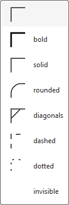
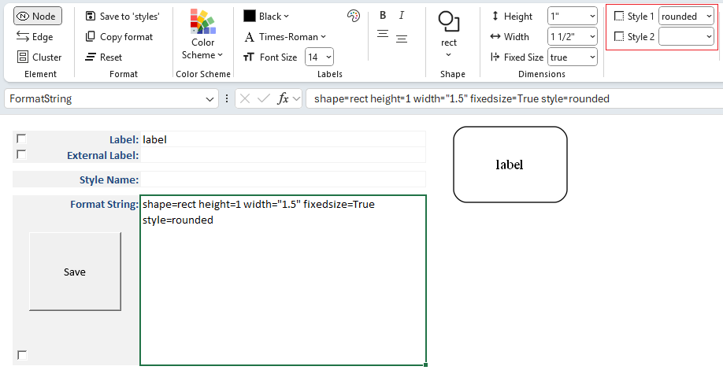
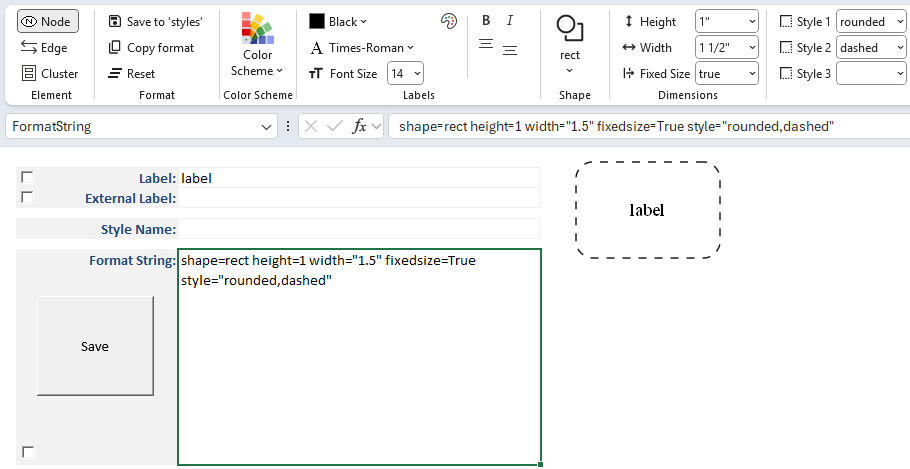
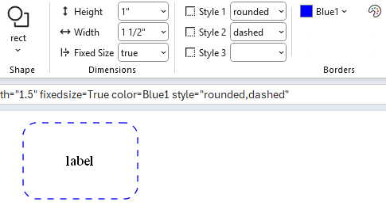
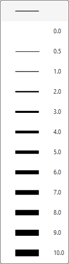
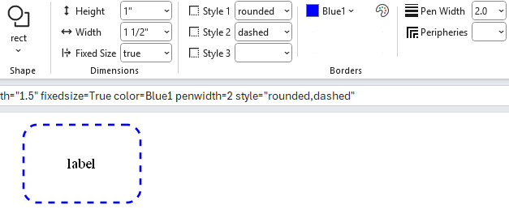
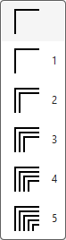
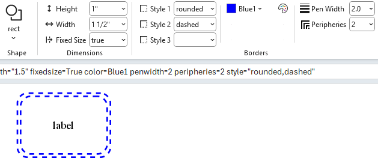

# Borders 

## Border Styles

Up to 3 border styles are selectable and are additive, making it possible to have styles such as bold edge and rounded corners. When you click on any of the **Border Style** drop‑down lists you will be presented with the list of choices along with a sample image of the style.

In this example `Style 1` is set to `rounded` to give the rectangle rounded corners.

The **Style Designer** provides an adaptive interface for applying multiple border styles.  
As you make selections, additional style options appear dynamically:

- Once a style is chosen, the **Style 2** drop‑down becomes available.  
- Selecting `dashed` as the second choice results in a rounded, dashed border.  
- A **Style 3** drop‑down then appears, allowing you to continue layering styles.

This adaptive behavior makes it easy to combine multiple visual effects without cluttering the interface.

## Border Color

How to choose colors has already been explained.  

The **Border Color** controls allow you to specify the color of a node shape or cluster border.

For example:

## Border Pen Width

The **penwidth** attribute controls the thickness of lines used to draw node borders and edges.

- **penwidth=1.0** (default)  
  - Standard line thickness.  
  - Borders and edges are drawn with a single‑pixel width.  

- **penwidth>1.0**  
  - Increases line thickness proportionally.  
  - For example, `penwidth=2.0` doubles the thickness, while `penwidth=3.0` triples it.  
  - Useful for emphasizing certain nodes or edges in a diagram.  

- **penwidth<1.0**  
  - Decreases line thickness.  
  - For example, `penwidth=0.5` produces a thinner line than the default.  
  - Can be used for subtle or secondary connections.

For example:

## Border Peripheries

The **peripheries** attribute controls how many borders (or outlines) are drawn around a node shape.

- **peripheries=1** (default)  
  - A single border is drawn around the shape.  

- **peripheries=2**  
  - Two concentric borders are drawn, giving the node a “double‑outlined” appearance.  

- **peripheries=n**  
  - Any positive integer value `n` draws that many concentric borders.  
  - Useful for visually emphasizing certain nodes or distinguishing categories.  

For example:

