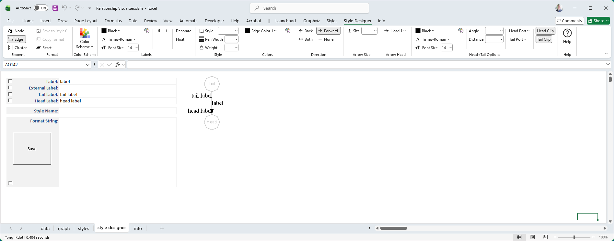
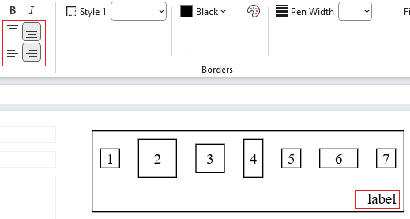
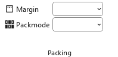
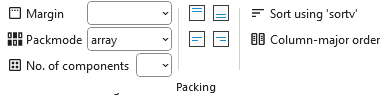
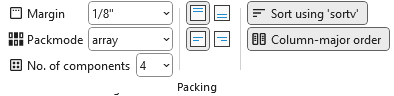
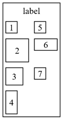
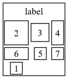
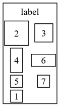
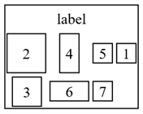
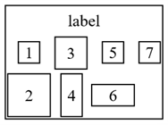

# Clusters

Clusters can have styles just as nodes and edges do.

To create a cluster style definition in the **Style Designer** worksheet:

1. Change the **Design Mode Element** to **Cluster**.  
   - This switches the ribbon controls to attributes appropriate for clusters (e.g., `Labels`, `Borders`, `Fill`).  
   - Node‑specific attributes such as `shape` will no longer be available.  
   - Edge‑specific attributes such as `arrowhead`, `arrowtail` will no longer be available.

2. Press the **Reset** button.  
   - This clears all style values carried over from node definitions.  
   - Starting from a clean slate ensures that only cluster‑specific attributes are applied.

3. Use the ribbon, preview image, and format string just as you did for nodes and edges.  
   - The selected attributes are displayed in the ribbon.  
   - The **Format String** is updated with cluster attributes (e.g., `color=blue, style=dashed`).  
   - The preview image shows exactly how Graphviz will render the cluster. There are seven shapes of various sizes to simulate how a cluster might be used.

The Style Designer worksheet appearance changes to look as follows:

## Color Scheme

The cluster can specify a [color scheme](../color/#graphviz-color-schemes). Note that since clusters are subgraphs, you should use care in specifying a color scheme as nodes can inherit this specification.

## Labels

Font color, name, and size are specified for the cluster label the same way they are specified for nodes and edges. See [Labels](../labels/) for more information.

## Label Alignment

Nodes allow you to left‑justify, center, or right‑justify their labels. Clusters extend this by also allowing **top** or **bottom** alignment. These options are additive, so you can combine them to specify positions such as **bottom right**, **top left**, or **top center**.

The following example shows the alignment buttons set to place the cluster label in the bottom right of the cluster:

## Borders

Border styles, colors, and pen widths for a cluster’s rectangle are defined the same way they are for nodes. This means you can use the same attributes such as `color`, `penwidth`, and `style` to control how the cluster’s outline looks. The cluster simply draws a rectangular boundary around its contents, and these attributes determine how that boundary is rendered. For more details on available options, see the [Borders](../borders/) topic.

## Fill Colors

Fill colors and gradient fills for a cluster’s rectangle are defined the same way they are for nodes. You can use the same attributes such as `fillcolor`, `color`, and `style=filled`, or gradient specifications, to control how the cluster’s background is rendered. The cluster simply applies these settings to its rectangular boundary. For details on available options, see the [Fills](../fills/) topic.

## Packing Options

If the layout on the Graphviz ribbon tab is set to the [osage](../../create/#graph-layout) layout, an additional **Packing** group of controls will appear, as shown in the example below:

|  |
| :--: |

These controls let you adjust how nodes within clusters, or clusters within clusters, are arranged relative to one another in the final layout.

Two options are provided:

- **Margin** - Using the `pack` attribute, sets the amount of empty space between packed clusters. Values from 1/8" to 1" are available, in increments of 1/8". Larger margins spread clusters farther apart; smaller margins bring them closer together. Distances are converted from inches to points automatically.

- **Packmode** - Determines the strategy Graphviz uses when arranging clusters. Different modes influence whether clusters are packed tightly, aligned in rows or columns, or arranged using more geometric rules. The available modes are:
  - **clust** - Packs clusters based on their natural cluster structure, keeping related groups visually close.
  - **array** - Packs clusters into a grid‑like arrangement. 
  
  When **array** is selected, the Packing group expands to provide additional controls, as shown below:

    |  |
    | :--: |

Additional choices include:
- **No. of components** - How many components (nodes or clusters) to place before starting a new row or column.
- **Node alignment** - How nodes should be aligned within each cluster:  
  - Top  -> `packmode=array_t`
  - Middle -> `packmode=array`
  - Bottom -> `packmode=array_b`
  - Left -> `packmode=array_l`
  - Right -> `packmode=array_r`
- **Sort using 'sortv'** -> `packmode=array_u` - Sorts components based on their `sortv` attribute.
- **Column‑major order** -> `packmode=array_c` - Lays out components column‑by‑column instead of row‑by‑row.

`packmode` array flags can be combined to apply multiple effects at once. For example, the selections shown below:

|  |
| :--: |

  produce the Format String `pack=9 packmode=array_ctlu4` which breaks down as follows:
- **`pack=9`** - Sets the margin around the nodes to 1/8".
- **`packmode=array_ctlu4`** - Applies several array‑mode flags at once:
  - `u` - Sort components by their `sortv` attribute.
  - `c` - Use column‑major order.
  - `l` - Align nodes along the **left** edge within each column.
  - `t` - Align nodes along the **top** edge within each row.
  - `4` - Each column can contain **4** node or cluster objects (this example shows nodes).

Together, these flags sort the nodes, arrange them column‑by‑column with four rows per column, and align them to the top and left within the grid.

The preview of the cluster appears as:

| `pack=9 packmode=array_ctlu4` |
| :---------------------------: |
|  |

Here are additional examples:

| `packmode=clust` | `packmode=array_2` | `packmode=array_c2` | `packmode=array_cu2` |
| :---------------: | :----------------: | :------------------: | :-------------------: |
|  |  |  |  |
| Best fit distribution | 2 Columns in row major order | 2 Rows in column major order | 2 Rows in column major order, sorted |

