# Color

## Graphviz Color Schemes

Color is a key aspect of any visualization, and the **Style Designer** provides full support for all Graphviz color schemes.

Graphviz defines a *color scheme* as the context for interpreting color names.

If a color value has the form `"xxx"` or `"/xxx"`, then the color `xxx` is evaluated according to the current color scheme. If no color scheme is set, the standard **X11** naming is used.  

For example, if `colorscheme="bugn9"`, then `color="7"` is interpreted as `/bugn9/7`.

This may sound complicated, so let’s simplify:

- The **Colors** button on the **Launchpad** ribbon shows or hides the **HELP – colors** worksheet.  
- This worksheet lists all supported Graphviz color schemes (267 in total).  
- Each scheme contains between 3 and 656 colors.

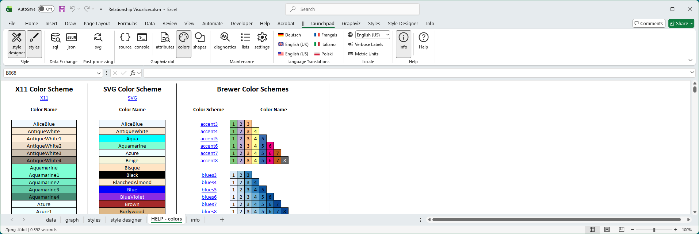

This worksheet is used behind the scenes to generate preview images for color choices.

## Style Designer Color Schemes

Graphviz supports multiple color scheme families, which define how color names are interpreted. All Graphviz color schemes are supported in the Style Designer.

The **Style Designer** ribbon provides a large **Color Scheme** button and color drop‑down lists to help you select and apply these schemes.

## Major Color Scheme Families

### X11  
- Graphviz’s default color scheme.  
- Largest predefined set of colors (656 choices).  
- Useful for broad, general‑purpose visualization with familiar names like *HotPink1* or *LightSkyBlue*.  

### SVG 
- Matches the standard color set defined by the SVG specification.  
- Smaller, web‑friendly palette of named colors.  
- Ideal for consistency with web graphics and cross‑platform rendering.  

### Brewer
- Based on Cynthia Brewer’s *ColorBrewer* palettes, designed for data visualization.  
- Provides carefully balanced sequential, diverging, and qualitative color schemes.  
- Useful for maps, charts, and diagrams where perceptual uniformity and accessibility are important.  

## Choosing a Color Scheme

Clicking the **Color Scheme** button opens a gallery where you can choose a scheme:

| 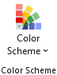 |
|-|

When you select a scheme, all color‑related drop‑down lists are refreshed to display the colors for that scheme.

For example, choosing **`greens3`** 

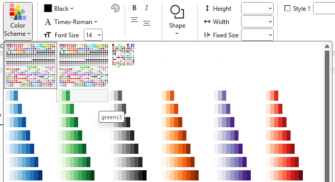

updates the lists to values `1`, `2`, and `3`, displays color icons, and adds the attribute `colorscheme=greens3` to the **Format String**.

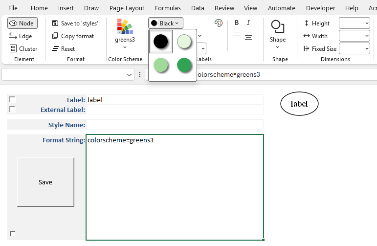

If you switch to another scheme, the lists refresh again. 

For example, after selecting **`greens3`**, 

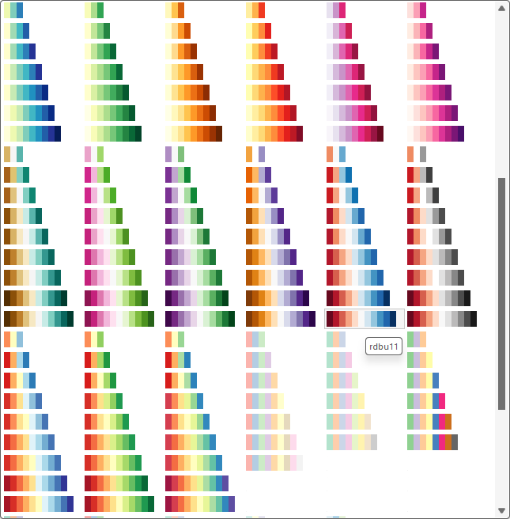

choosing **`rdbu11`** updates the lists to values `1` through `11`, displays color icons, and adds `colorscheme=rdbu11` to the **Format String**.

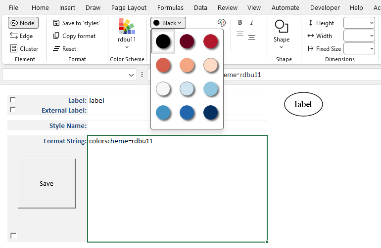

## Selecting a Pre-defined Color

You choose colors by clicking on any of the color drop‑down arrows to open a gallery of available colors.  

Hovering over a color shows its name, such as *HotPink1* in the example below:

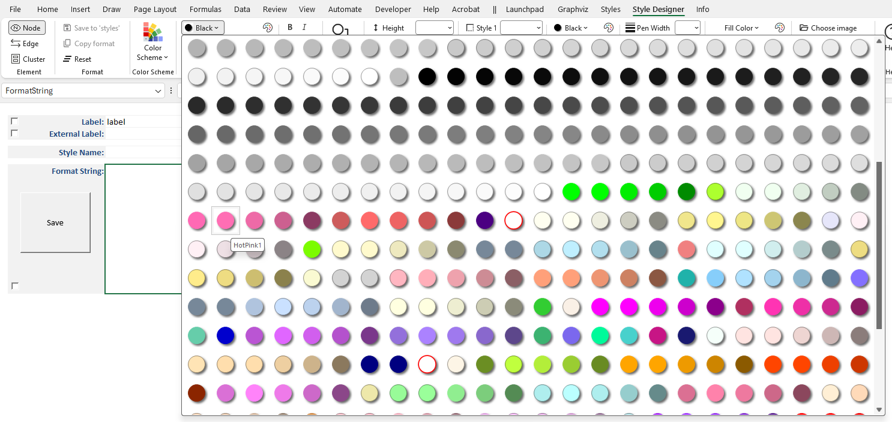

When you click on a color, the **Style Designer** ribbon updates to show both the color and its name. 

The color name is added as an attribute in the **Format String**, and a preview image is generated to show how the color will appear when rendered by Graphviz.

In the example below, `HotPink1` has been selected as the font color:

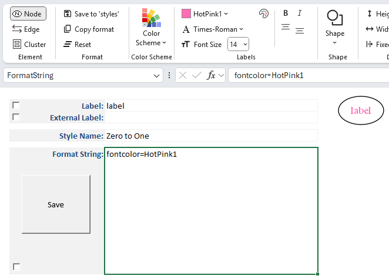

## Selecting a Color Using RGB (Red Green Blue) Values

In addition to choosing from predefined color schemes, you can specify a custom color using the **Color Dialog**. To the right of each color choice dropdown is a small button with a color icon which appears as:

|  |
|-|

This dialog provides a native interface for selecting colors on your operating system:

| **Windows 11 Color Dialog** | **macOS Color Dialog** |
| :---: | :---: |
| 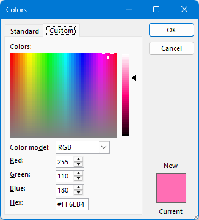 | 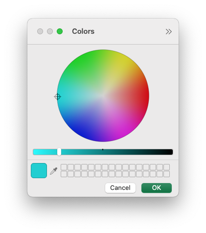 |

The **Color Dialog** is initialized to the currently chosen color.

If a named color from a color scheme is selected, it is automatically converted to RGB when the Color Dialog is displayed.  

This allows you to first choose a color from a scheme, then refine it as needed using the picker.

For example, you might use the dialog to set a font color to a specific RGB value rather than relying on scheme‑based names.

When you select a color in the dialog:

- The chosen color is displayed as an icon in the **Style Designer** ribbon, and the RGB value of the color is shown as the color name (for example, `#FE0079`).  
- The color name or RGB value is added as an attribute in the **Format String**.  
- A preview image is generated to show how the color will appear when rendered by Graphviz.

In the example below, both the **Font Name** and the **Font Color** have been specified, with the font color defined as an RGB value:

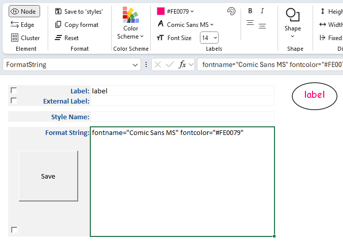

