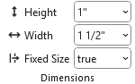
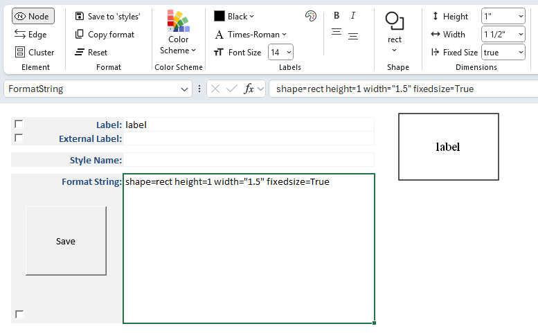

# Dimensions

In Graphviz, you can control the **height** and **width** of node shapes to adjust their overall size. These attributes ensure that shapes are scaled consistently and remain readable in your diagram.

|  |
| --- |

## Shape Height and Width

When you specify a shape’s dimensions:

- The chosen values are displayed in the **Style Designer** ribbon.  
- The attributes `height` and `width` are added to the **Format String** (e.g., `height=1.0, width=2.0`).  
- A preview image is generated to show how the resized shape will appear when rendered by Graphviz.

By default, Graphviz calculates shape dimensions automatically based upon the computed size of the label and its placement.

Specifying explicit values allows you to emphasize certain nodes, align shapes visually, or ensure uniform sizing across your diagram.

## Units of Measure

Graphviz’s default unit of measure for shape dimensions is **inches**.

However, you can specify metric units by enabling the **Metric Units** checkbox on the **Launchpad** ribbon.

- When metric units are selected, display values are shown in **millimeters (mm)**.  
- These values are automatically converted to **inches** internally to satisfy Graphviz’s requirements.  
- This allows you to work in familiar metric units while ensuring compatibility with Graphviz’s rendering engine.

## Fixed Size

The **fixedsize** attribute controls whether a node’s shape is drawn at a fixed size or allowed to expand to fit its label text.

- **fixedsize=false** (default)  
  - The node’s dimensions are adjusted automatically to fit the label.  
  - The attributes `height` and `width` act as minimum values.  
  - Longer labels will stretch the shape horizontally or vertically as needed.

- **fixedsize=true**  
  - The node’s dimensions are locked to the specified `height` and `width`.  
  - Labels which exceed the width of the shape are truncated down equally from the left and right sides to fit inside the fixed shape.  
  - Useful for ensuring uniform node sizes across a diagram, regardless of label length.

- **fixedsize=shape**  
  - The node’s height and width are locked, but the label is allowed to stretch horizontally.  
  - This ensures consistent vertical sizing while accommodating longer text.  
  - Useful for diagrams where uniform height is desired, but labels vary in length.

When you enable **fixedsize**, the chosen values are displayed in the **Style Designer** ribbon, added to the **Format String** (e.g., `shape=rect height=1 width="1.5" fixedsize=True`), and shown in the preview image.

