# Edges

Edges can have styles just as nodes do.  

To create an edge style definition in the **Style Designer** worksheet:

1. Change the **Design Mode Element** to **Edge**.  
   - This switches the ribbon controls to attributes appropriate for edges (e.g., `color`, `style`, `penwidth`, `arrowhead`).  
   - Node‑specific attributes such as `shape` will no longer be available.  

2. Press the **Reset** button.  
   - This clears all style values carried over from node definitions.  
   - Starting from a clean slate ensures that only edge‑specific attributes are applied.  

3. Use the ribbon, preview image, and format string just as you did for nodes.  
   - The selected attributes are displayed in the ribbon.  
   - The **Format String** is updated with edge attributes (e.g., `color=blue, style=dashed`).  
   - The preview image shows exactly how Graphviz will render the edge.

The style designer worksheet appearance changes to look as follows:

## Edge Labels

Labels for edges are specified in the same way as labels for nodes, with the same styling options (e.g., font, color, size).  

| 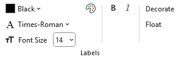 |
| :--: |

However, edge labels include two additional toggle attributes:

- **Decorate** - draws a line from the edge to its label, visually connecting the text to the edge.  
- **Float** - allows the label to float freely near the edge rather than being anchored to a fixed position.

These options are available as toggle buttons in the **Style Designer** ribbon.  
When selected, they are added to the **Format String** (e.g., `decorate=true, float=true`) and shown in the preview image.

## Edge Style

Edges can be styled using several attributes available in the **Style Designer** worksheet.  
These attributes control the visual appearance and relative importance of edges in the graph.

- **Style**  
  - Defines the line pattern or effect applied to the edge.  
  - Common values include `solid`, `dashed`, `dotted`, `bold`, and `tapered`.  
  - For example, `style=dashed` produces a broken line, while `style=bold` thickens the edge for emphasis.  

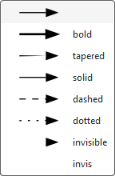

- **Penwidth**  
  - Specifies the thickness of the edge line.  
  - Larger values produce heavier lines, useful for highlighting important connections.  
  - Example: `penwidth=2.0` doubles the default line thickness.  

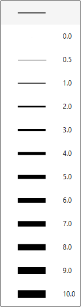

- **Weight**  
  - Influences how strongly the edge affects the layout.  
  - Higher weights encourage Graphviz to keep connected nodes closer together.  
  - Example: `weight=5` makes the edge act like a stronger “spring” in the layout engine.

## Edge Colors

Edge colors are specified in the same way as node colors, with support for both **color schemes** and the **RGB Color Dialog**.

- **One Color**  
  - Apply one color to the edge line.  
  - Example: `color=Blue`  

- **Multiple Colors (up to 3)**  
  - Specify up to three colors; Graphviz renders the edge as parallel lines in the given colors.  
  - Example: `color="Blue:Red:DarkGreen"`  

- **Color Schemes**  
  - Choose colors from Graphviz’s predefined schemes (e.g., `rdbu11`, `greens3`).  
  - Example: with `colorscheme=rdbu11`, use `color="2:4:6"` to reference indexed colors from that scheme.  

- **RGB Color Dialog**  
  - Select exact RGB values for precise customization beyond scheme defaults.

When you set edge colors, the chosen values are displayed in the **Style Designer** ribbon, added to the **Format String** (e.g., `color="red:yellow"`), and shown in the preview image.

For example:

| # Colors | Selection | Preview |
| :-: | :-: | :-: |
| 1 | 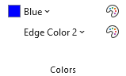 | 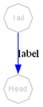 |
| | | |
| 2 | 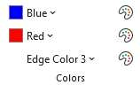 | 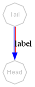 |
| | | |
| 3 | 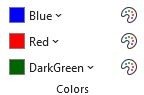 | 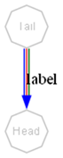 |

## Edge Direction

The Graphviz **dir** attribute controls the arrowheads drawn on an edge.

In the **Style Designer** worksheet, this is managed through four toggle buttons in the **Direction** group that act in radio button fashion. Selecting one option automatically clears the previous choice.

| 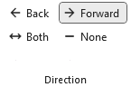 |
| :--: |

Supported values are:

- **forward**  
  - Draws an arrowhead at the **target end** of the edge.  
  - Provides Ribbon options for choosing **arrowhead styles** to be displayed.  
  - Example: `dir=forward`  

- **back**  
  - Draws an arrowtail at the **source end** of the edge.  
  - Provides Ribbon options for choosing **arrowtail styles** to be displayed.  
  - Example: `dir=back`  

- **both**  
  - Draws arrowheads at **both ends** of the edge.  
  - Provides Ribbon options for choosing both **arrowhead** (target end) and **arrowtail** (source end) styles to be displayed.  
  - Example: `dir=both`  

- **none**  
  - Suppresses arrowheads entirely, leaving a plain line.  
  - Removes the arrowhead and arrowtail style options from the ribbon.  
  - Example: `dir=none`  

When you select a direction, the chosen value is displayed in the **Style Designer** ribbon, added to the **Format String** (e.g., `dir=both`), and shown in the preview image.

| Direction | Ribbon | Preview |
| :-- | :-- | :--: |
| `dir=none` | 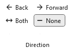 | 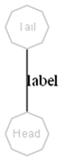 |
| | |
| `dir=forward` | 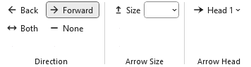 | 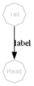 |
| | |
| `dir=back` | 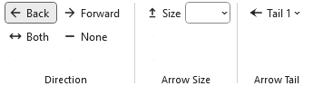 | 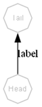 |
| | |
| `dir=both` | 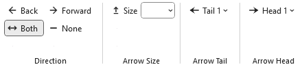 | 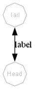 |

> Arrowhead and arrowtail styles will be described in detail in a later section.

## Arrow Size

The **arrowsize** attribute scales the size of an edge’s arrowhead or arrowtail.

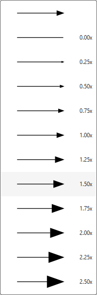

It acts as a simple multiplier applied to the base size of the selected arrow style.

- **Value**  
  - A numeric scaling factor (default is `1.0`).  
  - Values greater than 1 enlarge the arrow; values less than 1 reduce it.  
  - Example: `arrowsize=1.5` makes the arrowhead 50% larger than normal.

- **Effect on Direction**  
  - When `dir=forward`, the scaling applies to the **arrowhead**.  
  - When `dir=back`, the scaling applies to the **arrowtail**.  
  - When `dir=both`, the scaling applies to **both ends**.  
  - When `dir=none`, the attribute has no visible effect.

The selected value is shown in the **Style Designer** ribbon, added to the **Format String** (e.g., `arrowsize=0.75`), and reflected in the preview image.

## Arrow Heads

Arrowheads are a popular styling option for edges, and Graphviz provides a robust set of shapes to choose from.

You may stack multiple arrowhead types to create custom designs. For example:

| 1 Arrow Head | 2 Arrow Heads | 3 Arrow Heads |
| :-: | :-: | :-: |
| 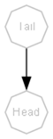 | 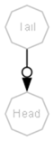 |  |
| `arrowhead="normal"` | `arrowhead="normalodot"` | `arrowhead="normalodotcurve"` |

The Relationship Visualizer ribbon supports up to **three stacked arrowheads**:

- When you choose the **first** arrowhead, a **second dropdown** automatically appears.  
- After selecting a **second** arrowhead, a **third dropdown** becomes available.  
- Each dropdown represents one position in the stack, allowing you to build compound arrowhead shapes.

These selections apply to the end(s) of the edge based on the `dir` setting (e.g., `forward`, `back`, or `both`).

Arrowhead and arrowtail styles are added to the **Format String** (e.g., `arrowhead=diamond`, `arrowtail="dotvee"`), and the preview updates accordingly.

Each change updates the **Edge Format String** and renders a sample graph showing how the edge will appear based on the current **Layout Engine** and **Splines** settings on the `settings` worksheet.

Be aware that the visual result may vary depending on how different layout engines handle splines, head ports, and tail ports.

## Arrow Tails

Arrowtails behave the same way as arrowheads: you may stack up to three tail shapes to create compound designs, and each selection reveals the next dropdown in the sequence. The stacked arrowtails apply to the source end of the edge whenever the direction setting (`dir=back` or `dir=both`) enables them.

With both arrowheads and arrowtails available, you can combine these glyphs in a wide variety of ways. The following gallery shows the full set of arrow shapes that Graphviz supports, which you can mix, match, and stack to create custom edge endpoints.

Arrow tails have the same set of choices as arrow heads. Like arrow heads, Relationship Visualizer allows you to choose up to 3 styles for Arrow Tails.

## Arrow Glyphs

Graphviz provides a rich collection of arrowhead and arrowtail glyphs that you can use individually or stack to create custom edge endpoints. Each glyph has its own visual character, ranging from simple geometric shapes to more expressive markers. Stacking them allows you to build complex designs that convey direction, emphasis, or semantic meaning.

The following gallery shows the complete set of arrow glyphs supported by Graphviz. These shapes can be used for both **arrowheads** and **arrowtails**, and up to three may be combined in sequence to form a compound style. Use this reference to explore the available options and choose the combinations that best fit your diagram’s purpose.

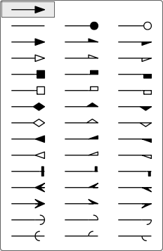

The arrowhead and arrowtail glyphs shown above use the standard Graphviz names.  
From left to right, each glyph is labeled with its corresponding attribute value:

| Left + Right | Left Only | Right Only |
| :-- | :-- | :-- |
| `none` | `dot` | `odot` |
| `normal` | `lnormal` | `rnormal` |
| `onormal` | `olnormal` | `ornormal` |
| `box` | `lbox` | `rbox` |
| `obox` | `olbox` | `orbox` |
| `diamond` | `ldiamond` | `rdiamond` |
| `odiamond` | `oldiamond` | `ordiamond` |
| `inv` | `linv` | `rinv` |
| `oinv` | `olinv` | `orinv` |
| `tee` | `ltee` | `rtee` |
| `crow` | `lcrow` | `rcrow` |
| `vee` | `lvee` | `rvee` |
| `curve` | `lcurve` | `rcurve` |
| `icurve` | `licurve` | `ricurve` |

Use these names when specifying `arrowhead`, `arrowtail`, or stacked combinations such as `arrowhead="dotvee"` or `arrowtail="diamondtee"`.

