# Fills

## Fill Color

The **fillcolor** attribute controls the interior color of a node shape or cluster. It determines how the inside of the shape is rendered, providing contrast with the border and improving visual clarity.

Fill colors can be selected from predefined color schemes or refined using the **Color Dialog**.

They are often used to group related nodes, highlight important elements, or improve the overall readability of a diagram.

When you specify a fill color:

- The chosen color is displayed in the **Style Designer** ribbon, and the `Fill Color` caption changes to the name or RGB value of the color chosen.  
- A new dropdown for `Gradient Fill Color` appears below the fill color.  
- The color name or RGB value is added as an attribute in the **Format String** (e.g., `fillcolor=DodgerBlue`).  
- A preview image is generated to show how the node will appear when rendered by Graphviz.

For example:

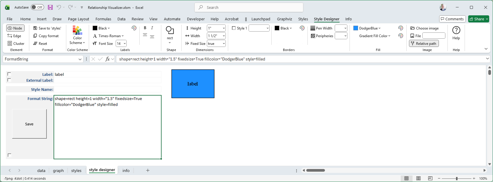

## Gradient Fill Color

Notice that the ribbon dynamically changes once a `Fill Color` is specified to display a new choice for `Gradient Fill Color`.

| 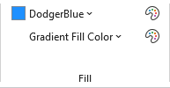 |
| --- |

A `Gradient Fill Color` allows you to select a second color which the Fill Color will gradually transition to. If you select `HotPink` as the `Gradient Fill Color` the preview image changes to look like:

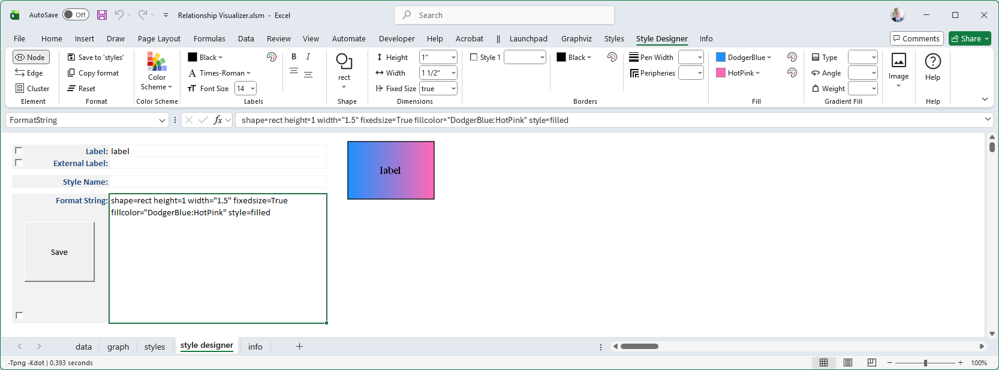

Another set of dynamic changes occur as three additional choices, **Type**, **Angle**, and **Weight** appear to the right of the fill color selections. These choices allow you to define how the gradient transition occurs.

## Gradient Type

The **gradienttype** attribute controls how multiple colors blend together inside a node shape or cluster. Instead of filling the shape with a single solid color, you can apply a gradient to create smooth transitions between colors.

Gradient types can be used to highlight relationships, emphasize categories, or simply add visual appeal. For example, a vertical gradient may suggest progression, while a radial gradient can emphasize a central point.

The Gradient Type is either `filled` (i.e., linear) or `radial`.

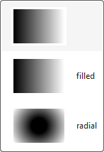

The differences are illustrated below:

| `gradienttype=filled` | `gradienttype=radial` |
| :---: | :---: |
| 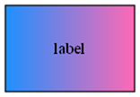 | 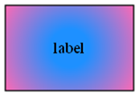 |

## Gradient Angle

The **gradientangle** attribute controls the direction of a gradient fill inside a node shape or cluster.  
It determines how the colors specified in the **fillcolor** attribute are blended across the shape.

Changing the Gradient Angle moves the angle of the gradient fill. 
- For linear fills, the colors transform along a line specified by the angle and the center of the object. 
- For radial fills, a value of zero causes the colors to transform radially from the center; for non-zero values, the colors transform from a point near the object's periphery as specified by the value.

Angles are measured in **degrees**, with `0` representing a left‑to‑right horizontal gradient.  
Other values rotate the gradient clockwise:  
- `90` → top‑to‑bottom vertical gradient  
- `180` → right‑to‑left horizontal gradient  
- `270` → bottom‑to‑top vertical gradient  

By adjusting the gradient angle, you can control the visual flow of color transitions, highlight directionality, or add subtle emphasis to your diagram.

For example, if you change the Gradient Angle to 90 degrees, the preview images now appear as:

| `gradienttype=filled gradientangle=90` | `gradienttype=radial gradientangle=90` |
| :---: | :---: |
| 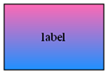 | 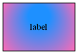 |

## Gradient Weight

The **gradient weight** is specified as part of the **fillcolor** attribute, not as a separate attribute. It controls how much influence each color has in a gradient fill.

When you define a gradient:

- The colors are listed in the **fillcolor** string, separated by a colon.  
- A semicolon followed by a numeric value (between 0.0 and 1.0) specifies the weight.  
- The weight determines the balance between the first and second colors.

For example, specifying a gradient weight of 20% for the fill color is specified as:

`style=filled fillcolor="DodgerBlue;0.20:HotPink"`

and the image appears as:

| 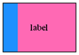 |
| :--: |

By adjusting the gradient weight, you can highlight one color more strongly, create subtle shading effects, or achieve balanced transitions between multiple colors.

## Gradient Weight + Gradient Angle

Gradient Angle can be combined with the Gradient Weight to rotate the position of the color split, as in these examples where the gradient weight of the blue fillcolor is 20%:

| `gradientangle=0` | `gradientangle=90` | `gradientangle=180` | `gradientangle=270` |
| :---: | :---: | :---: | :---: |
|  | 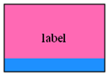 | 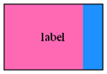 | 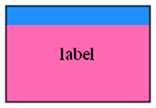 |

| `gradientangle=45` | `gradientangle=135` | `gradientangle=225` | `gradientangle=315` |
| :---: | :---: | :---: | :---: |
| 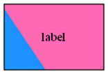 | 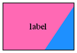 | 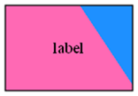 | 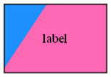 |
