# Head & Tail Options

These controls provide assistance in defining the head and tail attributes for an edge.

| 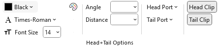 |
|-|

## Label Font Color - Label Font Name - Label Font Size

These attributes provide a way to differentiate the text at the end of the edges where they meet the node.

| 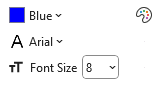 |
|-|

Appears as:

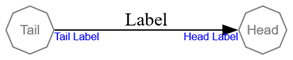

With Format string:

`labelfontname="Arial" labelfontsize="8" labelfontcolor="Blue"`

## Label Angle

`labelangle=` controls the **direction** in which a head label or tail label appears around the point where the edge touches the node.

Imagine standing at the spot where the edge meets the node. Now imagine a line pointing straight back along the edge. That's the starting direction (0 degrees).  
`labelangle` tells Graphviz how far to rotate from that starting direction:

- **Positive numbers** rotate the label **to the left**
- **Negative numbers** rotate the label **to the right**

By changing the angle, you choose which “side” of the node the label appears on.

For example, setting the label angle to 90 degrees:

| 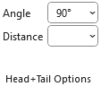 |
|-|

Appears as:

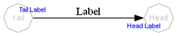

With Format String:

`labelangle=90 labelfontname=Arial labelfontsize=8 labelfontcolor=Blue`

## Label Distance

`labeldistance=` controls **how far away** the head label or tail label appears from the point where the edge touches the node.

Instead of setting the distance directly in points, `labeldistance` acts as a **scaling factor**.  
Graphviz starts from a built‑in base distance (about **10 points**), and your value multiplies that distance:

- A value of **1.0** keeps the default spacing  
- A value of **2.0** places the label about twice as far away  
- A value of **0.5** moves it to about half the default distance  

A **point** is a standard typographic unit: there are **72 points in one inch**, so these changes adjust the label’s distance in small, predictable steps.

In short, `labeldistance` tells Graphviz to move the label **closer or farther** from the node by scaling the default distance.

| 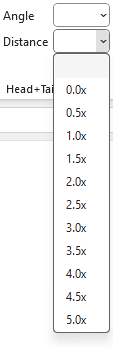 |
|-|

For example, `labeldistance=3` appears as:

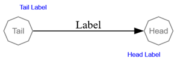

With Format String:

`labelangle=90 labeldistance=3 labelfontname=Arial labelfontsize=8 labelfontcolor=Blue`

## Label Angle & Label Distance

Used together, `labelangle` and `labeldistance` let you control both **where** a label appears around the node and **how far out** it sits. `labelangle` chooses the direction (left, right, above, below, or anywhere in between) while `labeldistance` scales the default spacing to move the label closer or farther away. Adjusting both gives you precise, intuitive control over label placement at the point where the edge meets the node.

This example depicts when `labelangle=` and `labeldistance=` attributes are used together.

| 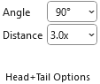 |
|-|

Appears as:

With Format String:

`labelangle=90 labeldistance=3 labelfontname=Arial labelfontsize=8 labelfontcolor=Blue`

## Head Port

Indicates where on the head node to attach the head of the edge. In the default case, the edge is aimed towards the center of the node, and then clipped at the node boundary.

If a compass point is used, it must be one of the following: `n`, `ne`, `e`, `se`, `s`, `sw`, `w`, `nw`, `c`, or `_`. A compass point adjusts the edge’s attachment point so that it aims for the specified location on the port, or, if no port name is provided, on the node itself. The compass point `c` targets the center of the node or port. The compass point `_` instructs Graphviz to choose the side of the port that lies on the exterior of the node; if no such side exists, the center is used instead. When a port name is supplied without a compass point, the default value is `_`.

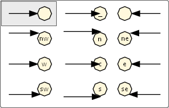

Appears As:

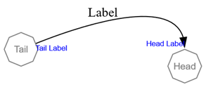

With Format String:

`labelfontname=Arial labelfontsize=8 labelfontcolor=Blue headport=n`

## Tail Port

Indicates where on the tail node to attach the tail of the edge.

If a compass point is used, it must be one of the following: `n`, `ne`, `e`, `se`, `s`, `sw`, `w`, `nw`, `c`, or `_`. A compass point modifies edge placement so that the edge aims for the specified point on the port, or, if no port name is supplied, on the node itself. The compass point `c` targets the center of the node or port. The compass point `_` indicates that Graphviz should choose the side of the port that lies on the exterior of the node; if no such side exists, the center is used instead. When a port name is provided without a compass point, the default compass point is `_`.

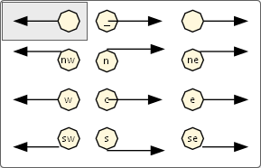

Appears as:

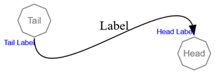

With Format String:

`labelfontname=Arial labelfontsize=8 labelfontcolor=Blue headport=n tailport=s`

## Clipping Behavior

Graphviz uses *clipping* to decide how far an edge (its spline and arrowhead) runs into a node. The attributes `headclip` and `tailclip` control this behavior independently for the head and tail ends of an edge. These settings affect the **edge and arrowhead**, not the label text itself.

## Head Clip

`headclip=` controls how the edge is clipped at the **head** node.

- When `headclip=true` (the default), Graphviz clips the spline at the boundary of the head node. The arrowhead sits at the edge of the node shape, rather than running into the center.
- When `headclip=false`, the edge is not clipped to the node boundary. The spline and arrowhead may extend into the interior of the node, often aiming at its center.

| Buttons | Preview |
| :-----: | :-----: |
| 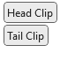 | 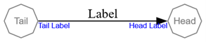 |
|  | Edge head **is** clipped at the node |
| 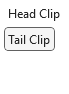 | 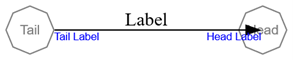 |
|  | Edge head **is not** clipped at the node |

## Tail Clip

`tailclip=` controls how the edge is clipped at the **tail** node.

- When `tailclip=true` (the default), Graphviz clips the spline at the boundary of the tail node. The edge meets the node at its outline.
- When `tailclip=false`, the spline is allowed to extend into the node, so the edge may appear to start from a point inside the node.

| Buttons | Preview |
| :-----: | :-----: |
|  |  |
|  | Edge tail **is** clipped at the node |
| 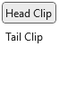 | 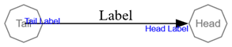 |
|  | Edge tail **is not** clipped at the node |
