# Images

As you develop more advanced relationship graphs you may want to use images to represent the nodes in combination with, or in place of the node shapes. Graphviz supports an `image=` attribute where you can provide a file name of an image to include in a node.

The Relationship Visualizer by default will look for images in the directory where the spreadsheet is saved. 

## Image Storage and Paths

If you wish to store images in other locations, you must either:

- Make a configuration change on the **Settings** worksheet to specify the location(s).  
  - The image path must be defined before you can use the `image=` attribute in a style definition.  
- Include the path to the image directly, in either **Relative** or **Absolute** form.

## Relative vs. Absolute Paths

- **Relative Path**  
  - Specifies the image location relative to the workbook directory.  
  - Example: `images/logo.png`  
  - ✅ Easier portability. If the workbook and images are kept together in a folder, cloning or moving the folder preserves the links automatically.  
  - ✅ Ideal for sharing with others or using across multiple devices.  

- **Absolute Path**  
  - Specifies the full location of the image on your system.  
  - Example: `C:/Users/Jeffrey/Documents/Graphviz/images/logo.png`  
  - ✅ Ensures the image is always found, regardless of where the workbook is located.  
  - ✅ Useful when images are stored in a central repository or shared network drive.  
  - ⚠️ Less portable. Moving the workbook without the same directory structure will break the link.

By choosing the appropriate path type, you can balance **portability** (relative paths) with **certainty of location** (absolute paths).

## Add an image path

Switch to the `settings` worksheet and locate the "Image Path:" setting in the **Graph Options** section. To the right of the cell is a button with three dots […]. If you press that button it will bring up the standard directory selection dialog which you can use to choose the directory where the images are stored. Navigate to the directory and press the "OK" button to transfer the path to the cell.

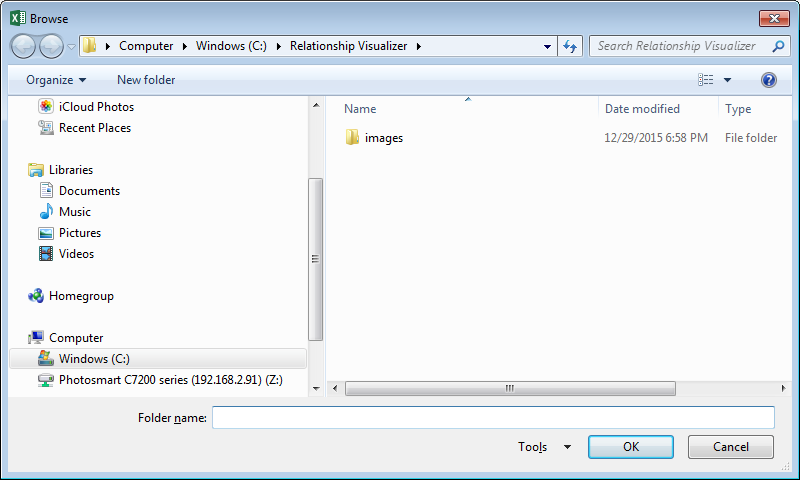

Your settings should appear like this:

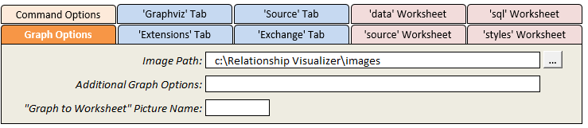

## Specify an image

Image name is an option on the `style designer` worksheet that is useful when you want to create a common style definition where all nodes of a given style use a common icon. For example, it is possible to depict computers with one image, depict databases with another image, and depict computer programmers with yet another image.

**Step 1** – Define a shape. For this example a rectangle will be used.

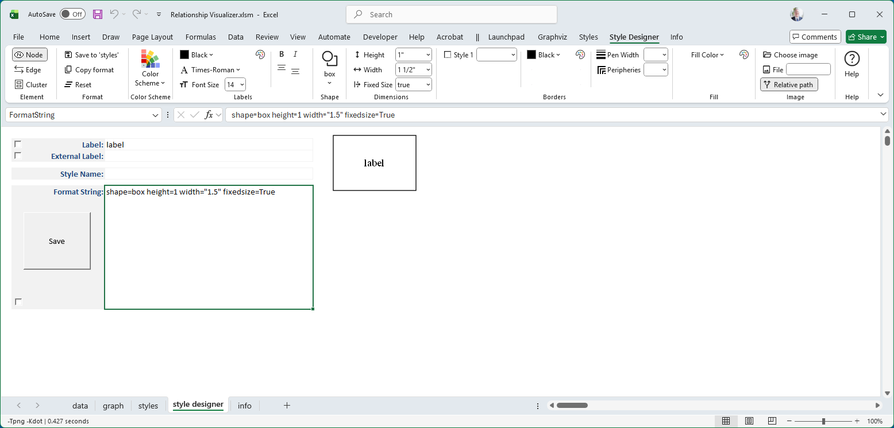

**Step 2** – Look to the far right side of the Ribbon to find the image controls.

| 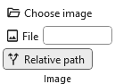 |
| :--: |

Press the `Choose Image` button.

Navigate to the directory containing the images and choose an image. A small image is selected in order to demonstrate scaling and placement.

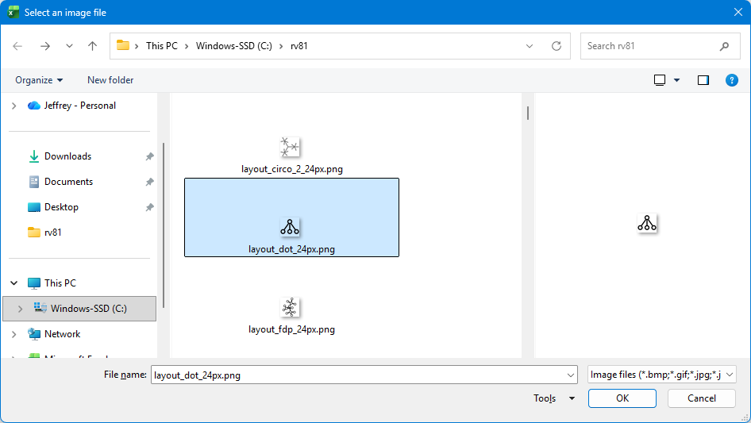

The image by default is placed in the center of the node. For example:

|  |
| :--: |

With the image selected, the Ribbon adapts to display additional options which can be used to scale the image, or position the image within the shape.

| 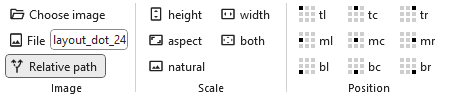 |
| :--: |

## Scale the Image

Adjust the image by clicking the radio buttons in the **Scale** group. Only one button can be selected. If you make a second selection, your first selection is replaced.

| Scale   | Radio Button | Preview | Description |
| :---:   | :---: | :---: | :--- |
| **height**  | 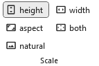 | 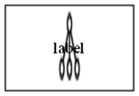 | Stretch image to fill node height; width remains unchanged. |
| | | | |
| **width**   | 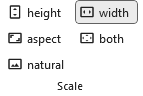 | 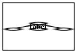 | Stretch image to fill node width; height remains unchanged. |
| | | | |
| **aspect**  | 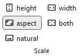 | 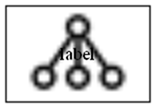 | Uniformly scale image to fit node while preserving aspect ratio. |
| | | | |
| **both**    | 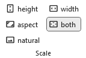 | 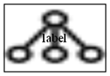 | Stretch image to fill both width and height of node; aspect ratio may distort. |
| | | | |
| **natural** | 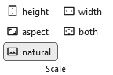 | 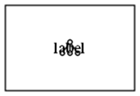 | Use image’s natural size; node expands to fit (default). |

No scaling (i.e., **natural** scaling) will be used in order to demonstrate how to position images which are smaller than the node.

## Adjust the Image Position

The **Position** group contains nine toggle buttons that work in **radio button fashion**. Selecting any button automatically unselects the previously chosen option.

These buttons correspond to the nine possible locations where images can be placed relative to the cell or shape via the **imagepos** attribute:

| + | Left | Center | Right |
| :--: | :--: | :--: | :--: |
| **Top**    | `tl` | `tc` | `tr` |
| **Middle** | `ml` | `mc` | `mr` |
| **Bottom** | `bl` | `bc` | `br` |

By default, when the **imagepos** attribute is omitted, the image is placed in the middle center.

You can reposition the image within the node by selecting a Position radio button, as shown below.

| Position | Buttons pressed | Preview Image |
| :--: | :--: | :--: |
| Default | 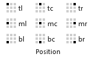 |  |
| | | |
| Top Left | 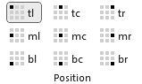 | 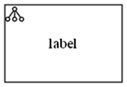 |
| | | |
| Bottom Center | 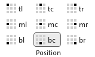 | 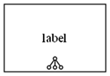 |
