# Style Designer

The Graphviz DOT language includes many attributes that control the appearance of nodes and edges. The `style designer` worksheet helps you compose style specifications without needing to know every detail of the DOT language. 

::: tip Quick Links

  <a class="advanced-card" href="./color/">
    
      <svg xmlns="http://www.w3.org/2000/svg" width="24" height="24" viewBox="0 0 24 24" fill="none" stroke="currentColor" stroke-width="2" stroke-linecap="round" stroke-linejoin="round" class="icon icon-tabler icons-tabler-outline icon-tabler-color-swatch">
        <path stroke="none" d="M0 0h24v24H0z" fill="none" />
        <path d="M19 3h-4a2 2 0 0 0 -2 2v12a4 4 0 0 0 8 0v-12a2 2 0 0 0 -2 -2" />
        <path d="M13 7.35l-2 -2a2 2 0 0 0 -2.828 0l-2.828 2.828a2 2 0 0 0 0 2.828l9 9" />
        <path d="M7.3 13h-2.3a2 2 0 0 0 -2 2v4a2 2 0 0 0 2 2h12" />
        <path d="M17 17l0 .01" />
      </svg>
    
    Color
  </a>
  <a class="advanced-card" href="./labels/">
    
      <svg xmlns="http://www.w3.org/2000/svg" width="24" height="24" viewBox="0 0 24 24" fill="none" stroke="currentColor" stroke-width="2" stroke-linecap="round" stroke-linejoin="round" class="icon icon-tabler icons-tabler-outline icon-tabler-typeface">
        <path stroke="none" d="M0 0h24v24H0z" fill="none" />
        <path d="M3 5a2 2 0 0 1 2 -2h14a2 2 0 0 1 2 2v14a2 2 0 0 1 -2 2h-14a2 2 0 0 1 -2 -2l0 -14" />
        <path d="M17 17a2 2 0 0 1 -2 -2v-8h-5a2 2 0 0 0 -2 2" />
        <path d="M7 17a2.775 2.775 0 0 0 2.632 -1.897l.368 -1.103a13.4 13.4 0 0 1 3.236 -5.236l1.764 -1.764" />
        <path d="M10 14h5" />
      </svg>
    
    Labels
  </a>
  <a class="advanced-card" href="./shapes/">
    
      <svg xmlns="http://www.w3.org/2000/svg" width="24" height="24" viewBox="0 0 24 24" fill="none" stroke="currentColor" stroke-width="2" stroke-linecap="round" stroke-linejoin="round" class="icon icon-tabler icons-tabler-outline icon-tabler-circle-square">
        <path stroke="none" d="M0 0h24v24H0z" fill="none" />
        <path d="M3 9.5a6.5 6.5 0 1 0 13 0a6.5 6.5 0 1 0 -13 0" />
        <path d="M10 12a2 2 0 0 1 2 -2h7a2 2 0 0 1 2 2v7a2 2 0 0 1 -2 2h-7a2 2 0 0 1 -2 -2l0 -7" />
      </svg>
    
    Shapes
  </a>
  <a class="advanced-card" href="./dimensions/">
    
      <svg xmlns="http://www.w3.org/2000/svg" width="24" height="24" viewBox="0 0 24 24" fill="none" stroke="currentColor" stroke-width="2" stroke-linecap="round" stroke-linejoin="round" class="icon icon-tabler icons-tabler-outline icon-tabler-ruler-measure">
        <path stroke="none" d="M0 0h24v24H0z" fill="none" />
        <path d="M19.875 12c.621 0 1.125 .512 1.125 1.143v5.714c0 .631 -.504 1.143 -1.125 1.143h-15.875a1 1 0 0 1 -1 -1v-5.857c0 -.631 .504 -1.143 1.125 -1.143h15.75" />
        <path d="M9 12v2" />
        <path d="M6 12v3" />
        <path d="M12 12v3" />
        <path d="M18 12v3" />
        <path d="M15 12v2" />
        <path d="M3 3v4" />
        <path d="M3 5h18" />
        <path d="M21 3v4" />
      </svg>
    
    Dimensions
  </a>
  <a class="advanced-card" href="./borders/">
    
      <svg xmlns="http://www.w3.org/2000/svg" width="24" height="24" viewBox="0 0 24 24" fill="none" stroke="currentColor" stroke-width="2" stroke-linecap="round" stroke-linejoin="round" class="icon icon-tabler icons-tabler-outline icon-tabler-border-style">
        <path stroke="none" d="M0 0h24v24H0z" fill="none" />
        <path d="M4 20v-14a2 2 0 0 1 2 -2h14" />
        <path d="M20 8v.01" />
        <path d="M20 12v.01" />
        <path d="M20 16v.01" />
        <path d="M8 20v.01" />
        <path d="M12 20v.01" />
        <path d="M16 20v.01" />
        <path d="M20 20v.01" />
      </svg>
    
    Borders
  </a>
  <a class="advanced-card" href="./fills/">
    
      <svg xmlns="http://www.w3.org/2000/svg" width="24" height="24" viewBox="0 0 24 24" fill="currentColor" class="icon icon-tabler icons-tabler-filled icon-tabler-contrast-2">
        <path stroke="none" d="M0 0h24v24H0z" fill="none" />
        <path d="M19 2a3 3 0 0 1 3 3v14a3 3 0 0 1 -3 3h-14a3 3 0 0 1 -3 -3v-14a3 3 0 0 1 3 -3zm0 2h-14a1 1 0 0 0 -1 1v14a1 1 0 0 0 .769 .973c3.499 -.347 7.082 -4.127 7.226 -7.747l.005 -.226c0 -3.687 3.66 -7.619 7.232 -7.974a1 1 0 0 0 -.232 -.026" />
      </svg>
    
    Fills
  </a>
  <a class="advanced-card" href="./images/">
    
      <svg xmlns="http://www.w3.org/2000/svg" width="24" height="24" viewBox="0 0 24 24" fill="none" stroke="currentColor" stroke-width="2" stroke-linecap="round" stroke-linejoin="round" class="icon icon-tabler icons-tabler-outline icon-tabler-photo-alt">
        <path stroke="none" d="M0 0h24v24H0z" fill="none" />
        <path d="M6 18h5" />
        <path d="M14 18h4" />
        <path d="M15 7h.01" />
        <path d="M3 6a3 3 0 0 1 3 -3h12a3 3 0 0 1 3 3v12a3 3 0 0 1 -3 3h-12a3 3 0 0 1 -3 -3v-12" />
        <path d="M3 15l5 -5c.928 -.893 2.072 -.893 3 0l5 5" />
        <path d="M14 13l1 -1c.928 -.893 2.072 -.893 3 0l3 3" />
        <path d="M3 15h18" />
      </svg>
    
    Images
  </a>
  <a class="advanced-card" href="./edges/">
    
      <svg xmlns="http://www.w3.org/2000/svg" width="24" height="24" viewBox="0 0 24 24" fill="none" stroke="currentColor" stroke-width="2" stroke-linecap="round" stroke-linejoin="round" class="icon icon-tabler icons-tabler-outline icon-tabler-arrow-narrow-right">
        <path stroke="none" d="M0 0h24v24H0z" fill="none" />
        <path d="M5 12l14 0" />
        <path d="M15 16l4 -4" />
        <path d="M15 8l4 4" />
      </svg>
    
    Edges
  </a>
  <a class="advanced-card" href="./head-tail/">
    
      <svg xmlns="http://www.w3.org/2000/svg" width="24" height="24" viewBox="0 0 24 24" fill="none" stroke="currentColor" stroke-width="2" stroke-linecap="round" stroke-linejoin="round" class="icon icon-tabler icons-tabler-outline icon-tabler-connection">
        <path stroke="none" d="M0 0h24v24H0z" fill="none" />
        <path d="M15 6.5a2.5 2.5 0 1 0 5 0a2.5 2.5 0 1 0 -5 0" />
        <path d="M4 17.5a2.5 2.5 0 1 0 5 0a2.5 2.5 0 1 0 -5 0" />
        <path d="M8.5 15.5l7 -7" />
      </svg>
    
    Head & Tail
  </a>
  <a class="advanced-card" href="./clusters/">
    
      <svg xmlns="http://www.w3.org/2000/svg" width="20" height="20" viewBox="0 0 24 24" fill="none" stroke="currentColor" stroke-width="1.5" stroke-linecap="round" stroke-linejoin="round">
        <path stroke="none" d="M0 0h24v24H0z" fill="none" />
        <path d="M8 8h8v8h-8l0 -8" />
        <path d="M4 6a2 2 0 0 1 2 -2h12a2 2 0 0 1 2 2v12a2 2 0 0 1 -2 2h-12a2 2 0 0 1 -2 -2l0 -12" />
      </svg>
    
    Clusters
  </a>

:::

## Overview

The **Style Designer** worksheet provides an adaptive interface for composing Graphviz style specifications.  

The worksheet appears as follows:

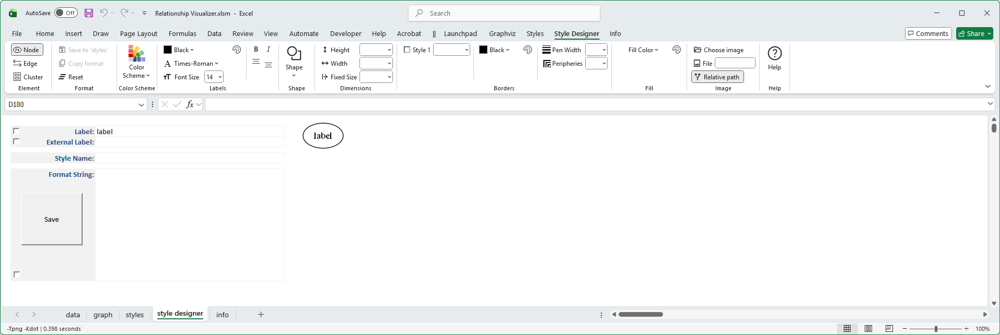

It consists of the following constructs:

- **Ribbon Controls** - clickable choices for Graphviz’s visible attributes.  
- **Label Fields** - preview areas where you can enter and view text.  
- **Style Name** - the name assigned to the style definition on the `styles` worksheet
- **Preview Image** - generated by Graphviz to show exactly how your combination of attributes will be rendered.  
- **Format String** - the underlying style specification containing the Graphviz attributes.  
- **Save Button** - saves the style definition to the **Styles** worksheet, where it can be applied to rows in the **Data** worksheet.

## Ribbon Controls

The Style Designer ribbon tab provides three dynamic design modes, controlled by the Element radio buttons in the left‑most group. These modes let you create **node styles**, **edge styles**, and **cluster styles**. The ribbon controls update automatically as you make selections.

### `Node` design mode

Displays the Graphviz node-related attributes.

*Windows*  

*macOS*  
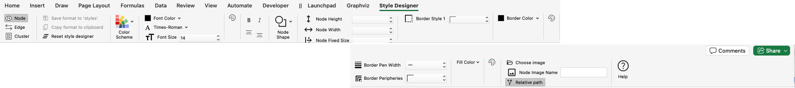

### `Edge` design mode

Displays the Graphviz edge-related attributes.

*Windows*  
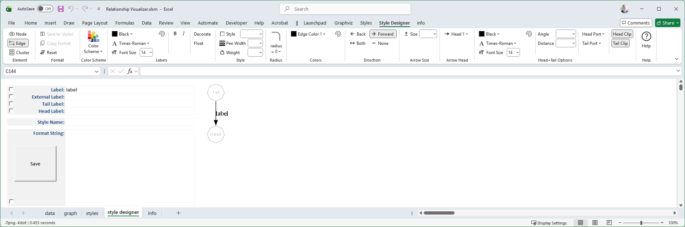

*macOS*  
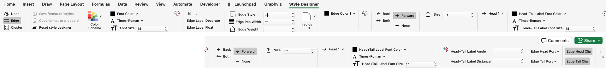

### `Cluster` design mode

Displays the Graphviz cluster-related attributes.

*Windows*  
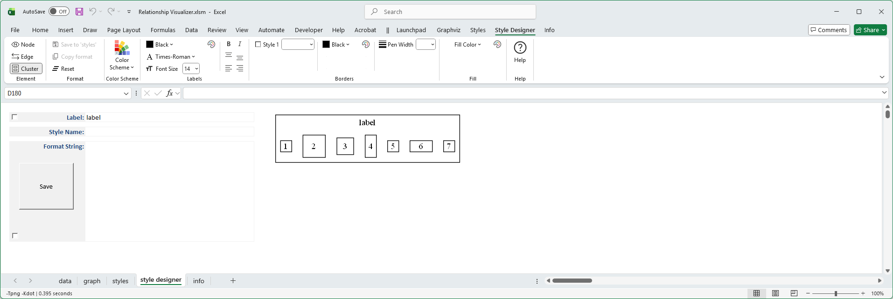

*macOS*  
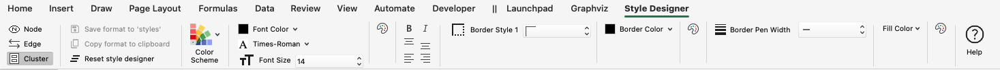

You define styles by making selections on the **Style Designer** ribbon tab. As you choose options, a format string is generated, and a sample rendering of the node, edge, or cluster is produced using the graphing engine and spline values from the **Graphviz** ribbon tab (explained later).

Use these elements as guides when making selections on the **Style Designer** worksheet, ensuring that appropriate Graphviz attributes are applied in context. For example, when *Element = Edge*, attributes such as `shape` are not offered because they are not valid for edges.

In each design mode, you can experiment with different values until you achieve a visually pleasing result.

## Label Fields

The **Label Fields** let you define text that appears in the preview image on nodes, edges, or clusters. 

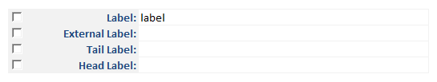

The fields shown depend on the current **design mode** and what Graphviz supports in that context:

| Design Mode | Label | External Label | Tail Label | Head Label |
| :-:      | :-: | :-: | :-: | :-: |
| **Node**    | ✅   | ✅   |    |    |
| **Edge**    | ✅  | ✅  | ✅   | ✅   |
| **Cluster** | ✅  |    |   |    |

Each label field has an associated **check box**:
- **Checked** → The label is included in the style definition and will appear whenever the style is applied.  
- **Unchecked** → The label is shown only as representational text in the preview image, not part of the saved style.

**Example**

Suppose you are defining an edge style to represent a zero‑to‑one relationship. By entering the caption **“0:1”** in the *Head Label* field and checking its box, the label will be included in the style definition. Whenever this "Zero to One" edge style is used, the “0:1” caption will automatically appear next to the arrowhead.

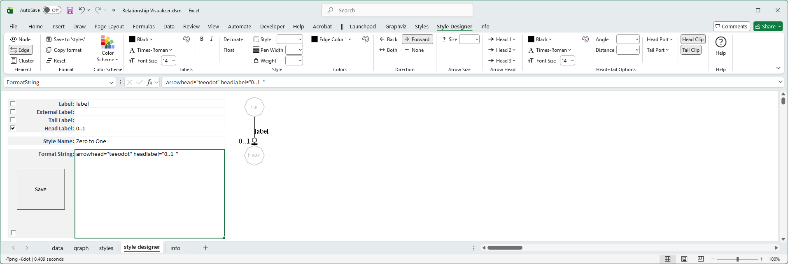

## Style Name

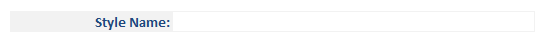

This cell contains either:
- The name you want to assign to a **new** style definition.
- The **existing** name of the style definition on the `styles` worksheet which is being modified.

## Format String

As you make selections the **Format String** cell builds a list of Graphviz style attributes and writes them to the large cell below:

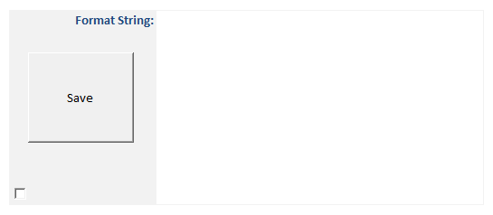

The **Format String** cell is also an **active cell**, meaning you can edit it directly to fine‑tune settings beyond the options provided in the drop‑down lists.

For example:
- The font size list jumps from 36 to 48.  
- If you want a font size of 40, you may type the value directly into the cell.

⚠️ **Important Notes**
- Any change made in the **Ribbon** will overwrite hand‑made edits in the Format String, since ribbon changes rebuild the specification.  
- Conversely, deleting **all** the contents of the **Format String** cell will reset the Ribbon settings back to their default values.

## Save Button

The large **Save** button, along with the **Save to 'styles'** button in the Ribbon, saves the contents of the **Format String** using the specified **Style Name** on the **Styles** worksheet.

- Each saved style definition is stored as a row in the **Styles** worksheet.  
- These saved styles can then be applied to rows in the **Data** worksheet.  
- This workflow allows you to build a library of reusable node, edge, or cluster styles.

For example, the image below shows three **Node** style definitions created with the **Style Designer** and saved on the **Styles** worksheet:

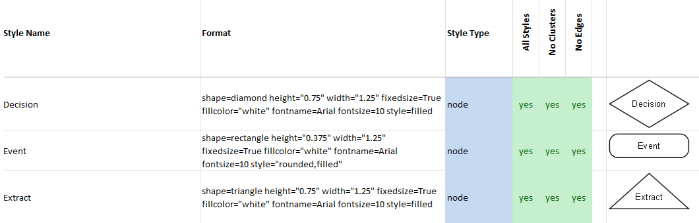

