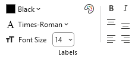
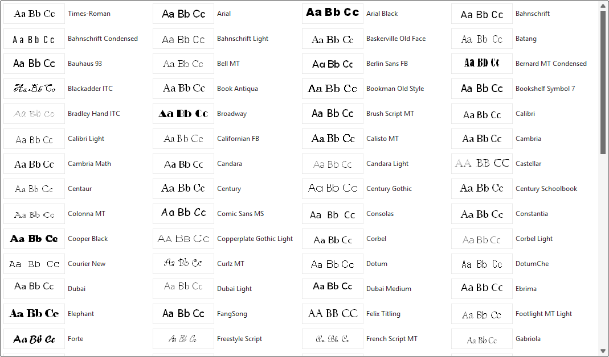
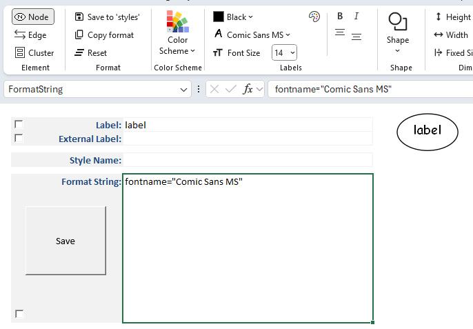
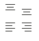

# Labels

You can design styles which format label text using the following controls:

- Color  
- Font  
- Font size  
- Bold  
- Italic  
- Label Location

|  |
| -- |

## Label Fonts

The **Style Designer** font drop‑downs present a gallery of fonts that Graphviz can render on your chosen operating system:

- **Windows** → The list is derived from the fonts installed on your PC, filtered to remove fonts known to be incompatible with Graphviz.  
- **macOS** → A static list of fonts is provided from the **lists** worksheet.

When the **Font Name** drop‑down is selected for the first time, Graphviz generates a preview image of the letters **Aa Bb Cc** for each font.  

These preview images are cached for future use. You may notice a slight delay the first time as the cache is built, but subsequent displays occur quickly.

An example **Font Name** gallery on Windows 11 appears as follows:

## Selecting a Font

The currently selected font name is highlighted in the gallery.  

When you choose a font (e.g., `Comic Sans MS`):

- The **Font Name** caption on the drop‑down changes to the selected font.  
- An icon of the letter **A** in the font appears in the ribbon to the left of the **Font Name**.  
- The font name is added as an attribute in the **Format String**.  
- A new preview image is generated, showing the associated labels rendered in the chosen font.

For example:

## Label Location

Text can be aligned relative to the borders of a shape or cluster. Alignment is available as follows via the alignment buttons:

|  |
| --- |

| Position| Node |  Cluster |
| --- | :--: |  :---: |
| Top     |  ✅ |   ✅     |
| Center  |  ✅ |   ✅     |
| Bottom  |  ✅ |   ✅     |
| Left    |     |   ✅     |
| Middle  |     |   ✅     |
| Right   |     |  ✅      |
