# Shapes

Graphviz provides a wide variety of **node shapes** that you can apply in the **Style Designer**.  
Shapes define the overall outline of a node and help visually distinguish different types of elements in your diagram.

Shapes can be used to convey meaning, organize information, or simply improve the readability of your graph. 

For example, rectangles may represent processes, ellipses may represent entities, and diamonds may represent decisions.

## Specifying a shape

Click on the `Shape` drop‑down button. 

| 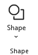 |
| --- |

A gallery of shapes supported by Graphviz is presented showing a sample image of the shape. 

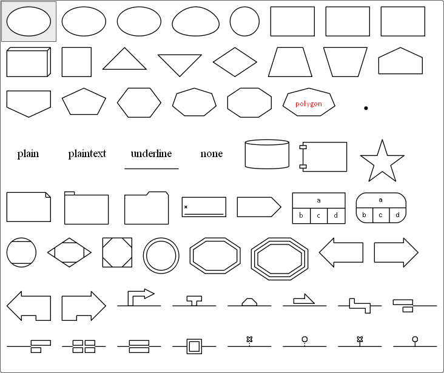

Here we pick one of the rectangle shapes. When you select a shape:

- The name of the chosen shape is displayed in the **Style Designer** ribbon as the caption of the `Shape` button.  
- The shape name is added as an attribute in the **Format String** (e.g., `shape=rect`).  
- A preview image is generated to show how the node will appear when rendered by Graphviz.

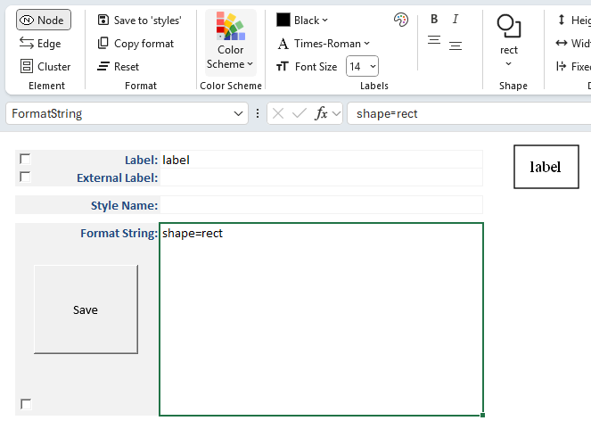

## Polygon Shapes

Polygon shapes are unique from other shapes in Graphviz and have extra attributes which control how the polygon is created.

If you select `polygon` as the shape the ribbon will change dynamically to present additional choices as shown below:

| 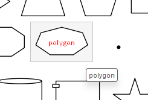 |
| --- |

Selecting `polygon` changes the ribbon to appear as:

| 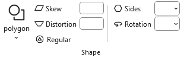 |
| --- |

## Polygon Skew

Positive values skew top of polygon to right; negative values skew the top of the polygon to the left.

### Positive Skew

| 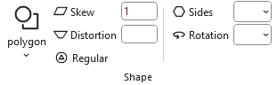 |
| --- | 

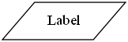

`shape="polygon" skew="1"`

### Negative Skew

|  |
| --- | 

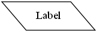

`shape="polygon" skew="-1"`

## Polygon Distortion

Positive values cause top part of the polygon to be larger than bottom; negative values do the opposite.

### Positive Distortion

| 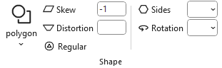 |
| --- | 

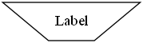

`shape="polygon" distortion="1" regular="No"`

### Negative Distortion

| 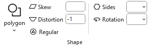 |
| --- | 

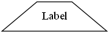

`shape="polygon" distortion="-1" regular="No"`

## Combining Skew with Distortion

| + | skew="-1" | skew="0" | skew="1" |
| :---: | :--: | :--: | :--: |
| **distortion="1"** | 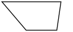 | 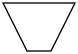 | 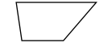 |
| | | |
| **distortion="0"** | 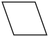 | 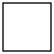 | 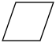 |
| | | |
| **distortion="-1"** | 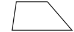 | 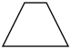 | 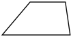 |

## Regular Polygon

If true, forces the polygon to be regular, i.e., the vertices of the polygon will lie on a circle whose center is the center of the node.

| 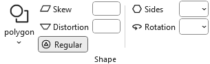 |
| --- |

`shape="polygon" regular="Yes"`

## Polygon Sides

The **sides** attribute controls the number of polygon sides used when drawing a node shape.

- **Default**: A polygon has **4 sides** (a square).  
- **sides < 4**:  
  - If the polygon is **not regular**, Graphviz substitutes an **ellipse**.  
  - If the polygon is **regular**, Graphviz substitutes a **circle**.  
- **sides ≥ 4**:  
  - The node is drawn as a polygon with the specified number of sides.  
  - For example, `sides=5` produces a pentagon, `sides=8` a hexagon, and so on.

When you set **sides**, the chosen value is displayed in the **Style Designer** ribbon, added to the **Format String** (e.g., `sides=6`), and shown in the preview image.

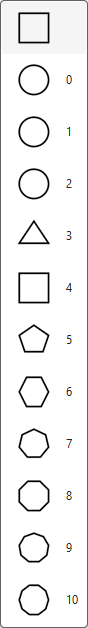

### sides=8

| 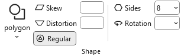 | 
| --- | 

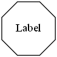 

`shape="polygon" sides="8" regular="yes"`

Ellipses/circles can also be skewed and distorted to create unique shapes.

|  | 
| --- | 

### sides=1, with skew and distortion

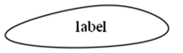 

`shape=polygon sides=1 skew=1 distortion="-1" regular=no`

## Polygon Rotation

The **orientation** attribute controls the rotation angle of a node shape.  
It determines how the shape is drawn relative to its default position.

- **orientation=0** (default)  
  - The shape is drawn in its standard upright position.  

- **orientation=n**  
  - The shape is rotated by *n* degrees, **clockwise**.  
  - For example, `orientation=45` tilts the shape diagonally, while `orientation=90` rotates it a quarter turn.  

- **interaction with regular polygons**  
  - When used with polygon shapes (via the **sides** attribute), orientation rotates the polygon around its center.  
  - For any number of polygon sides, 0 degrees rotation results in a flat base.  
  - This is useful for aligning triangles, diamonds, or other polygons to match the desired layout.

When you set **orientation**, the chosen value is displayed in the **Style Designer** ribbon, added to the **Format String** (e.g., `orientation=90`), and shown in the preview image.

| 5-sided regular polygon with no rotation | 5-sided regular polygon rotated 36 degrees clockwise |
| :--: | :--: |
| 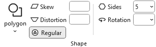 | 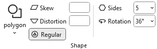 |
| | |
| 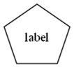 | 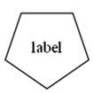 |

