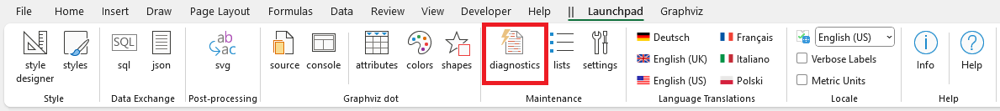
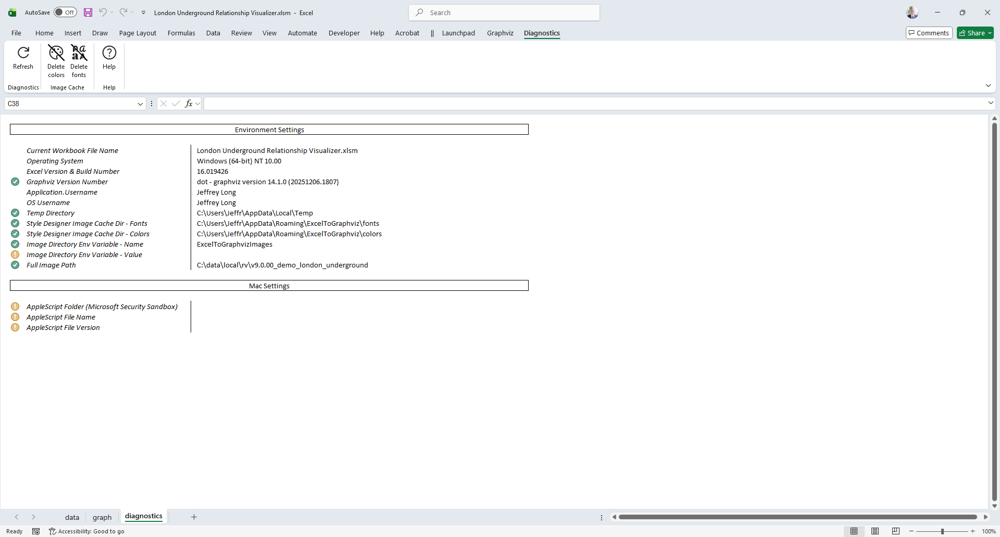
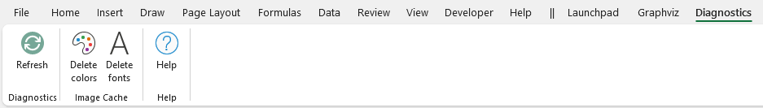
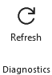
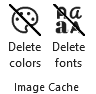

# Diagnostics Worksheet

## The `diagnostics` Worksheet

The `diagnostics` worksheet is reached from the `Maintenance` section of the [Launchpad](../launchpad/) ribbon tab.

|  |
| -------------------------------------------------- |

The `diagnostics` worksheet key information about the workbook and the environment in which it is being run. 

The information displayed on the `diagnostics` worksheet includes:
- The workbook file name
- The Operating System (Windows 64-bit, Windows 32-bit, Mac)
- The version of Graphviz installed
- Directories for temporary files
- Directories containing cached images displayed by the `style designer`

The `diagnostics` worksheet appears as follows (on Windows):

## The `Diagnostics` Ribbon Tab

The `Diagnostics` ribbon tab is activated whenever the `diagnostics` worksheet is activated from the [Launchpad](../launchpad/). It appears as follows:

|  |
| --------------------------------- |

It contains the following major groups:

- [Diagnostics](./README.md#diagnostics)
- [Console Text](./README.md#repositories)
- [Help](./README.md#lhelp)

### Diagnostics

|  |
| -------------------------------------------------- |

| Label       | Control Type  | Description                                                                                                                                                                                                                        |
| ----------- | ------------- | ---------------------------------------------------------------------------------------------------------------------------------------------------------------------------------------------------------------------------------- |
| Refresh | Button        | Forces a refresh of the information on the page to ensure the information was not carried over from a copy of a workbook saved on a different machine. |

### Image Cache

|  |
| -------------------------------------------------- |

Provides an easy method to delete the images created by the `style designer` which it uses to provide previews of fonts and colors.

| Label       | Control Type  | Description                                                                                                                                                                                                                        |
| ----------- | ------------- | ---------------------------------------------------------------------------------------------------------------------------------------------------------------------------------------------------------------------------------- |
| Delete colors | Button        | Deletes the images used to display colors next to the color names |
| Delete fonts | Button        | Deletes the font images which show what the font looks like when rendered using Graphviz |

Note that images files will be cached in memory if you visit the `style designer` worksheet before pressing these buttons. These buttons only delete the files from the disk drive. You will need to close the workbook and reopen it to cause new files to be generated.

### Help

|  |
| -------------------------------------------------- |

Provides a link to the `Help` content for the `diagnostics` worksheet (i.e. this web page).

| Label       | Control Type  | Description                                                                                                                                                                                                                        |
| ----------- | ------------- | ---------------------------------------------------------------------------------------------------------------------------------------------------------------------------------------------------------------------------------- |
| Help | Button        | Provides a link to this web page. |
