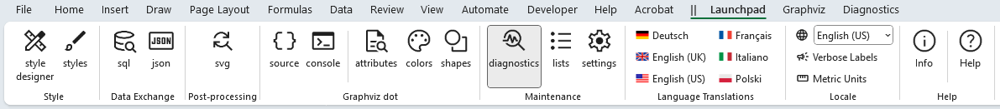
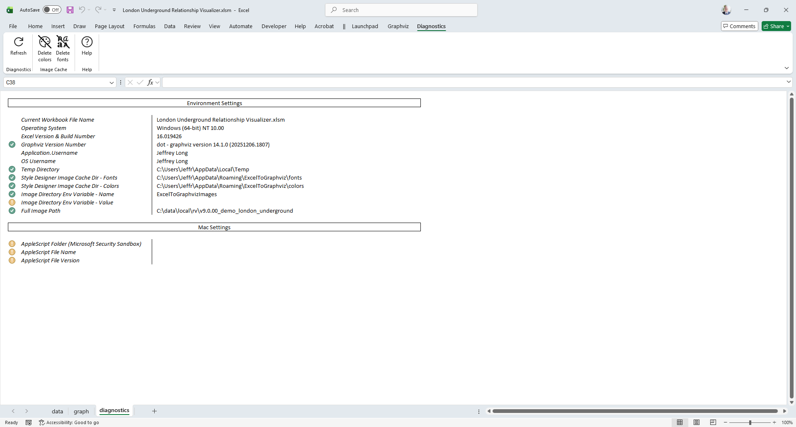
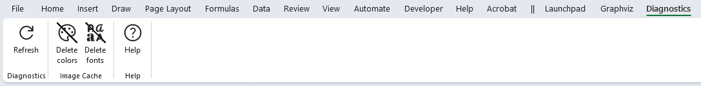
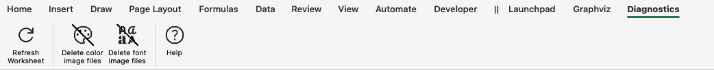
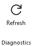
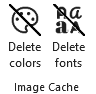
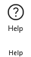

# Diagnostics Worksheet

## The `diagnostics` Worksheet

The `diagnostics` worksheet is reached from the `Maintenance` section of the [Launchpad](../launchpad/) ribbon tab.

|  |
| -------------------------------------------------- |

The `diagnostics` worksheet key information about the workbook and the environment in which it is being run. 

The information displayed on the `diagnostics` worksheet includes:
- The workbook file name
- The Operating System (Windows 64-bit, Windows 32-bit, Mac)
- The version of Graphviz installed
- Directories for temporary files
- Directories containing cached images displayed by the `style designer`

The `diagnostics` worksheet appears as follows (on Windows):

|  |
| -------------------------------- |

## The `Diagnostics` Ribbon Tab

The `Diagnostics` ribbon tab is activated whenever the `diagnostics` worksheet is activated from the [Launchpad](../launchpad/). It appears as follows:

*Windows*
|  |
| --------------------------------- |

*macOS*
|  |
| --------------------------------- |

It contains the following groups, each of which is explained in the sections that follow. You may jump directly to any group using the links in this table:
| Group | Controls  | Description |
| :---: | :-- | :-- |
| [Diagnostics](#diagnostics) |  | Refreshes key information about the workbook and the environment in which it is being run.  |
| | |
| [Image Cache](#image-cache) |  | Provides an easy way to delete the images created by the **Style Designer** which are preview thumbnails for fonts and colors. |
| | |
| [Help](#help) |  | Provides a link to the `Help` content for the `diagnostics` worksheet (i.e. this web page). |

### Diagnostics

|  |
| -------------------------------------------------- |

Refreshes the diagnostics values displayed. Useful if you have changed something on your system such as installing a different version of Graphviz, and you want to confirm what is being used.

| Name   | Control Type | Description                                                                                                      |
| ------- | ------------ | ---------------------------------------------------------------------------------------------------------------- |
| Refresh | Button       | Forces a refresh of the information on the page to ensure no data was carried over from a workbook saved elsewhere. |

### Image Cache

|  |
| -------------------------------------------------- |

Provides an easy way to delete the images created by the **Style Designer** which are preview thumbnails for fonts and colors.

| Name         | Control Type | Description                                                                                     |
| ------------- | ------------ | ----------------------------------------------------------------------------------------------- |
| Delete colors | Button       | Deletes the images used to display color swatches next to the color names.                      |
| Delete fonts  | Button       | Deletes the font preview images generated by Graphviz to show how each font is rendered.        |

Note that image files are cached in memory if you visit the *Style Designer* worksheet before pressing these buttons. These controls delete only the files on disk. To force new preview images to be generated, close and reopen the workbook.

### Help

|  |
| -------------------------------------------------- |

Provides a link to the `Help` content for the `diagnostics` worksheet (i.e. this web page).

| Name       | Control Type  | Description                                                                                                                                                                                                                        |
| ----------- | ------------- | ---------------------------------------------------------------------------------------------------------------------------------------------------------------------------------------------------------------------------------- |
| Help | Button        | Provides a link to this web page. |
