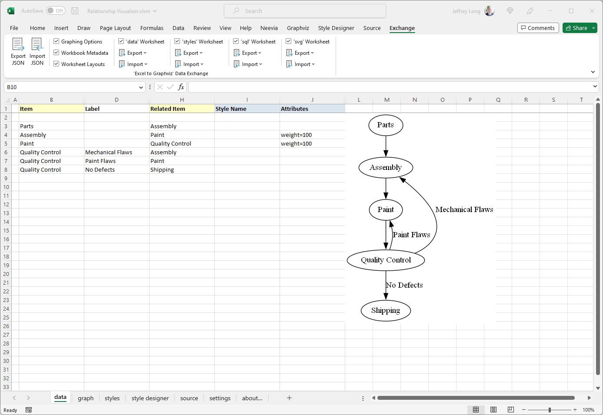
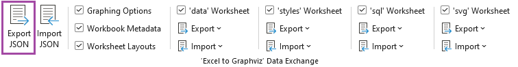
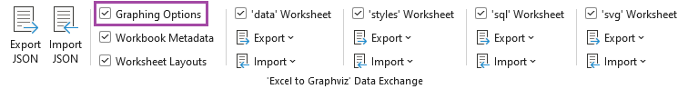
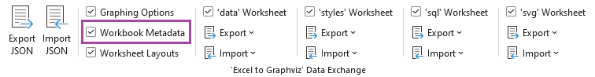
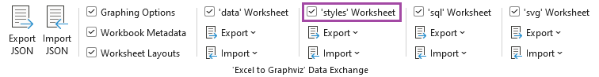
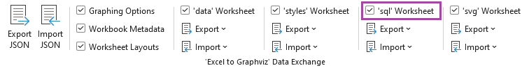
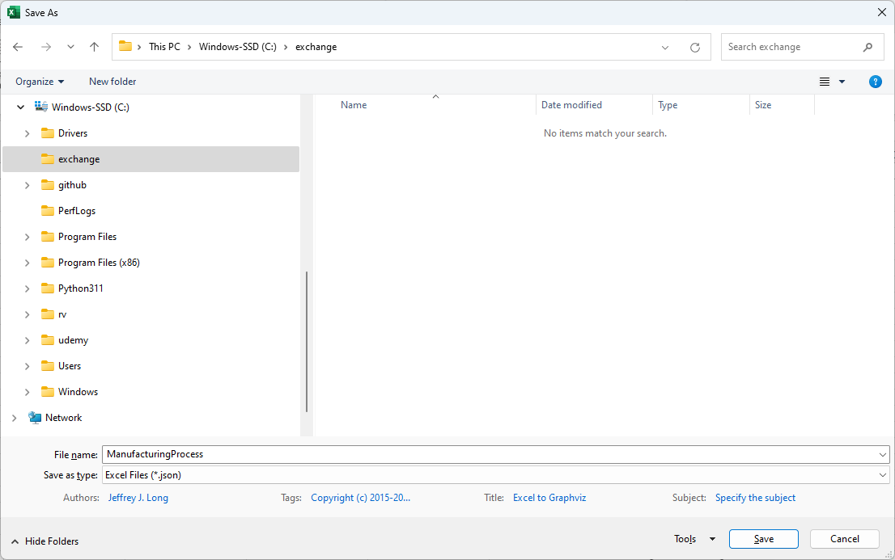
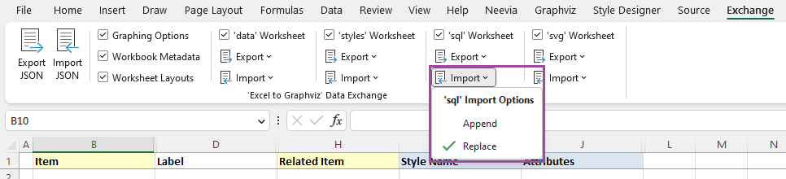
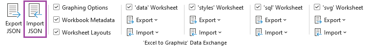

# Exchanging Data

There are several drawbacks of using an Excel workbook with macros as your Graphviz IDE.

-   The primary drawback is that the data and the macro code live together in the same file. As new versions of the spreadsheet get published with new features it has always been a chore to copy existing data spanning several worksheets, and all the ribbon settings from the old version to the new version.
-   Another drawback is that an Excel Workbook is actually a zip file internally. With the file being a binary file, it is not conducive to checking into version control software such as Git, or for performing a diff on to see what has changed between versions.
-   Sharing services such as [Pastebin](https://pastebin.com/) provide an easy mechanism for sharing content and examples, but they require text files.
-   Finally, VBA macro-enabled workbooks are not always trusted by people, or email systems. People trying to share the workbook over email often learn that the email system has stripped the attachment from the email due to the presence of macros.

It became apparent that a text-based representation of the data, styles, and settings was needed. The features to support exporting and importing the spreadsheet data comprise the `Exchange` workbook tab. There is not an associated worksheet since data exchange is focused on the internal contents of the workbook.

Let's look at an existing spreadsheet and see how we can export it from one spreadsheet and import it into another using the exchange logic. The `Exchange` tab is the last tab in the workbook, and appears as follows:



## The `Exchange` Ribbon Tab

The `Exchange` ribbon tab appears as follows, and is organized as illustrated

|  |
| ------------------------------------------- |

-   `Export JSON` - Writes contents out to JSON file
-   `Import JSON` - Reads JSON file, and restores data to workbook
-   `Graphing Options` - Include options chosen in the ribbons and `settings` worksheet
-   `Workbook Metadata` - Include information such as user, Excel version, etc.
-   `Worksheet Layouts` - Include information on how the workbook is organized
-   `'data' Worksheet` - Include the contents of the `data` worksheet
    -   Export
        -   `Include row number` - Include the row number of where the data was located
        -   `Include row height` - Include the height of the row
        -   `Include row visibility` - Include information which tells if the row was visible or hidden
    -   Import
        -   `Append` - When importing, append the data if existing data exists
        -   `Replace` - When importing, ignore any data and replace the contents
-   `'styles' Worksheet` - Include the contents of the `styles` worksheet
    -   Export
        -   `Include row number` - Include the row number of where the data was located
        -   `Include row height` - Include the height of the row
        -   `Include row visibility` - Include information which tells if the row was visible or hidden
    -   Import
        -   `Append` - When importing, append the data if existing data exists
        -   `Replace` - When importing, ignore any data and replace the contents
-   `'sql' - Worksheet` Include the contents of the `sql` worksheet
    -   Export
        -   `Include row number` - Include the row number of where the data was located
        -   `Include row height` - Include the height of the row
        -   `Include row visibility` -Include information which tells if the row was visible or hidden
    -   Import
        -   `Append` - When importing, append the data if existing data exists
        -   `Replace` - When importing, ignore any data and replace the contents
-   `'svg' - Worksheet` Include the contents of the `svg` worksheet
    -   Export
        -   `Include row number` - Include the row number of where the data was located
        -   `Include row height` - Include the height of the row
        -   `Include row visibility` -Include information which tells if the row was visible or hidden
    -   Import
        -   `Append` - When importing, append the data if existing data exists
        -   `Replace` - When importing, ignore any data and replace the contents

## Exporting Relationship Visualizer Data to JSON format

You can export all the data, or portions of the data depending upon how you intend to use it. Exporting portions of the data is useful when working in teams as you can do things such as export the style definitions and share them, or export the data of team members and combine them into a larger workbook using the `Append` option of an import.

You have the flexibility to export the entire contents to a `JSON` file, and selectively import just the sections desired in a new workbook.

Here are example snippets of exported workbook contents:

### Graphing Options

|  |
| ------------------------------------------- |

``` json
{
    "settings": {
        "data": {
            "options": {
                "graph": {
                "center": false,
                "clusterRank": "",
                "compound": false,
                "dim": "",
                "dimen": "",
                "forceLabels": false,
                "graphType": "directed",
                "mode": "",
                "model": "",
                "newrank": false,
                "ordering": "",
                "orientation": false,
                "outputOrder": "",
                "overlap": "",
                "smoothing": "",
                "transparentBackground": false
                },
            --- SNIP ---

```

### Workbook Metadata

|  |
| ------------------------------------------- |

``` json
{
  "metadata": {
    "name": "E2GXF",
    "type": "Excel to Graphviz Exchange Format",
    "version": "1.0",
    "user": "Jeffrey Long",
    "date": "2023-04-09",
    "time": "12:17:35",
    "os": "Windows (64-bit) NT 10.00",
    "excel": "16.0",
    "filename": "Relationship Visualizer.xlsm"
  },
}
```

### Worksheet Layouts

|  |
| ------------------------------------------- |

``` json
{
    "layouts": {
        "data": {
            "rows": [
                {
                    "id": "heading",
                    "row": 1,
                    "height": 15,
                    "hidden": false
                },
                {
                    "id": "first",
                    "row": 2,
                    "height": 15,
                    "hidden": false
                }
            ],
            "columns": [
                {
                    "id": "flag",
                    "column": 1,
                    "heading": "",
                    "width": 1.71,
                    "hidden": false,
                    "wrapText": false
                },
                {
                    "id": `Item`,
                    "column": 2,
                    "heading": `Item`,
                    "width": 20.71,
                    "hidden": false,
                    "wrapText": false
                },
                {
                    "id": "tailLabel",
                    "column": 3,
                    "heading": `Tail Label`,
                    "width": 0,
                    "hidden": true,
                    "wrapText": true
                },
                {
                    "id": `Label`,
                    "column": 4,
                    "heading": `Label`,
                    "width": 0,
                    "hidden": true,
                    "wrapText": true
                }
            ]
        }
    }
    --- SNIP ---
```

### Worksheet Contents

#### 'data' Worksheet

|  |
| ------------------------------------------- |

``` json
  "content": {
    "data": [
      {
        "row": 2,
        "hidden": false,
        "height": 15
      },
      {
        "row": 3,
        "hidden": false,
        "height": 15,
        "item": "Parts",
        "relatedItem": "Assembly"
      },
      {
        "row": 4,
        "hidden": false,
        "height": 15,
        "item": "Assembly",
        "relatedItem": "Paint",
        "extraAttributes": {
          "weight": "100"
        }
      },
      {
        "row": 5,
        "hidden": false,
        "height": 15,
        "item": "Paint",
        "relatedItem": "Quality Control",
        "extraAttributes": {
          "weight": "100"
        }
      },
      {
        "row": 6,
        "hidden": false,
        "height": 15,
        "item": "Quality Control",
        "label": "Mechanical Flaws",
        "relatedItem": "Assembly"
      },
      {
        "row": 7,
        "hidden": false,
        "height": 15,
        "item": "Quality Control",
        "label": "Paint Flaws",
        "relatedItem": "Paint"
      },
      {
        "row": 8,
        "hidden": false,
        "height": 15,
        "item": "Quality Control",
        "label": "No Defects",
        "relatedItem": "Shipping"
      }
    ],
    --- SNIP ---
```

#### 'styles' Worksheet

|  |
| ------------------------------------------- |

``` json
{
  "content": {
    "styles": [
      {
        "row": 20,
        "hidden": false,
        "height": 45,
        "name": "Border 6 Begin",
        "type": "subgraph-open",
        "format": {
          "penwidth": "1",
          "colorscheme": "reds9",
          "fillcolor": "2",
          "fontname": "Arial Bold",
          "fontsize": "12",
          "style": "filled",
          "margin": "18"
        },
        "viewSwitches": [
          "yes",
          "no",
          "yes"
        ]
      },
      {
        "row": 21,
        "hidden": false,
        "height": 15,
        "name": "Border 6 End",
        "type": "subgraph-close",
        "viewSwitches": [
          "yes",
          "no",
          "yes"
        ]
      },
      --- SNIP ---
```

#### 'sql' Worksheet

|  |
| ------------------------------------------- |

``` json
    "content": {
        "sql": [
            {
                "row": 7,
                "hidden": false,
                "height": 310.5,
                "sqlStatement": "SELECT \u000A  [State Code]                      as [item],       \u000A  'Medium Square'                   as [style name],\u000A  'sortv=%rsc%'                     as [attributes],\u000A  [State]                           as [label],\u000A  5                                 as [split length],\u000A  '\\l'                              as [line ending], \u000A  [State Code]                      as [external label],\u000A  [State]                           as [tooltip],\u000A  [Region]                          as [cluster],\u000A  'Border 6 '                       as [cluster style name],\u000A  [Region]                          as [cluster tooltip],\u000A  'sortv=%clc% packmode=array_utr3' as [cluster attributes],\u000A  [Division]                        as [subcluster],\u000A  'Border %scc% '                   as [subcluster style name],\u000A  [Division]                        as [subcluster tooltip],\u000A  'sortv=%scc% packmode=array_utr3' as [subcluster attributes]\u000AFROM \u000A  [census regions$] \u000AORDER BY \u000A  [Region]     ASC, \u000A  [Division]   ASC, \u000A  [State Code] ASC",
                "excelFile": "usa states.xlsx",
                "status": "SUCCESS",
                "filters": [
                "EXAMPLE 01",
                "EXAMPLE 01",
                null,
                null,
                null,
                null,
                null,
                null,
                null,
                null,
                null,
                null,
                null,
                null,
                null,
                null,
                null,
                null,
                null,
                null,
                null,
                null
                ]
            },
            {
                "row": 8,
                "hidden": false,
                "height": 15,
                "filters": [
                null,
                null,
                null,
                null,
                null,
                null,
                null,
                null,
                null,
                null,
                null,
                null,
                null,
                null,
                null,
                null,
                null,
                null,
                null,
                null,
                null,
                null
                ]
            },
            --- SNIP ---
```

#### 'svg' Worksheet

|  |
| ------------------------------------------- |

``` json
{
    "content": {
        "svg": [
            {
                "row": 2,
                "hidden": false,
                "height": 12.75,
                "enabled": false
            },
            {
                "row": 3,
                "hidden": false,
                "height": 15,
                "enabled": false,
                "find": "Modify the <svg> element to add an onload() function"
            },
            {
                "row": 4,
                "hidden": false,
                "height": 15,
                "enabled": false
            },
            {
                "row": 5,
                "hidden": false,
                "height": 45,
                "find": "xmlns:xlink=\"http://www.w3.org/1999/xlink\">",
                "replace": "xmlns:xlink=\"http://www.w3.org/1999/xlink\" onload=\"makeDraggable(evt)\">\u000A  <!-- NOTE: The graphviz-generated content in this file has been modified by Excel to Graphviz %%[Version]%% -->\u000A"
            },
            --- SNIP ---
```


Make the selections of the data you wish to export, and press the `Export JSON` button

|  |
| ------------------------------------------- |


You will be prompted to specify the name of a JSON file that the data should be written to. Enter a file name and press the `Save` button.



Once the data is written to the file you will receive a pop-up message such as:


Press the OK button, and you are done.

## Importing JSON Data into the Relationship Visualizer

The Import function works the opposite of the Export function. It reads a JSON file which has been exported by the Relationship Visualizer to reconstitute the JSON data into a Relationship Visualizer spreadsheet.

To import a JSON file, start by choosing the sections which you want included. Just as you can export an entire workbook, or sections of the workbook, you may also import an entire workbook or just sections of a workbook.

A key difference for importing worksheets comes via the import option dropdown lists.

|  |
| ------------------------------------------- |

`data`, `styles`, `sql`, and `svg` worksheets choices have Import of Append and Replace.

|  |
| ------------------------------------------- |

These are mutually exclusive choices that allow you to specify whether to replace the contents in the worksheet, or append the data in the worksheet. **Replace** is the default, and is intended for loading the data into an empty worksheet. **Append** is useful for consolidating data when multiple people are preparing the data.

For example, assume a husband and wife each prepare a family tree of their ancestors. The husband can export his ancestor's data, and the wife can import the husband's data with Append checked. The import will place the data in the `data` worksheet after the wife's data and the family tree will become complete for this family unit.

Once you have selected your Import, press the `Import JSON` button.

|  |
| ------------------------------------------- |

You will be prompted to **Choose an Excel to Graphviz data exchange file**


Select the file and press the `OK` button. The data will be imported (which may take several seconds). If the `Automatic Refresh` checkbox on the Graphviz tab is checked, the Relationship Visualizer will graph the data to the worksheet, otherwise press the `Refresh Graph` button to see the graph.


