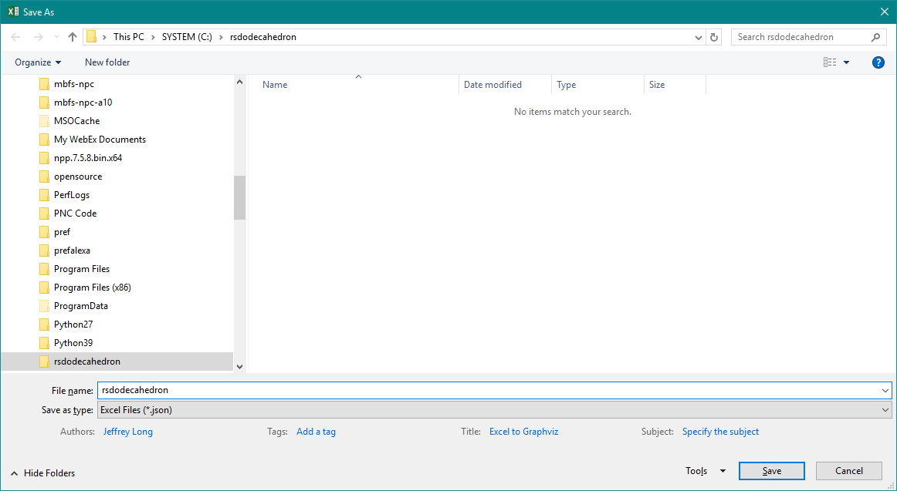
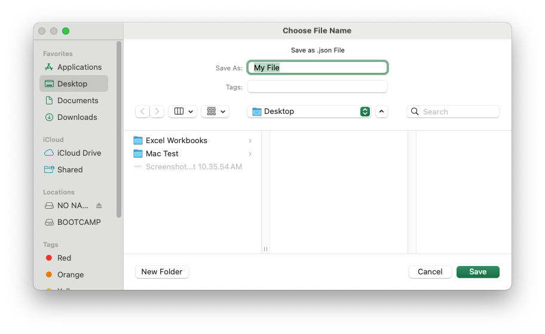
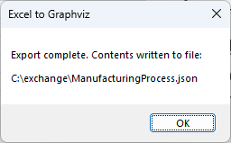
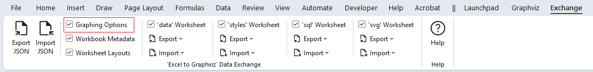
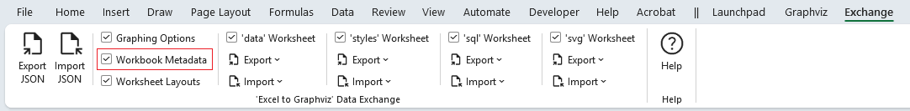
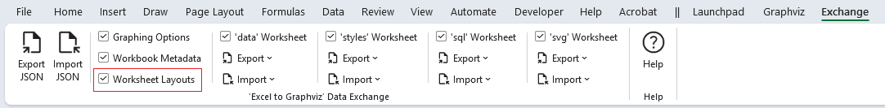

# Exporting Data to JSON format

You can export all of the data, or only selected portions, depending on how you intend to use it. Exporting subsets is especially useful when working in teams—for example, you can export just the style definitions to share with others, or export individual team members’ data and combine it into a larger workbook using the **Append** option during import.

You may export the entire workbook to a `JSON` file and later import only the sections you need into a new workbook.

Here are example snippets of exported workbook contents:

Make the selections of the data you wish to export, and press the `Export JSON` button


You will be prompted to specify the name of a JSON file that the data should be written to. Enter a file name and press the `Save` button.

`Windows`



`macOS`



Once the data is written to the file you will receive a pop-up message such as:



Press the **OK** button, and you are done.

The sections which follow provide samples of the JSON exported.

## Graphing Options



```json
{
    "settings": {
        "data": {
            "options": {
                "graph": {
                "center": false,
                "clusterRank": "",
                "compound": false,
                "dim": "",
                "dimen": "",
                "forceLabels": false,
                "graphType": "directed",
                "mode": "",
                "model": "",
                "newrank": false,
                "ordering": "",
                "orientation": false,
                "outputOrder": "",
                "overlap": "",
                "smoothing": "",
                "transparentBackground": false
                },
            --- SNIP ---

```

## Workbook Metadata



```json
{
  "metadata": {
    "name": "E2GXF",
    "type": "Excel to Graphviz Exchange Format",
    "version": "1.0",
    "user": "Jeffrey Long",
    "date": "2023-04-09",
    "time": "12:17:35",
    "os": "Windows (64-bit) NT 10.00",
    "excel": "16.0",
    "filename": "Relationship Visualizer.xlsm"
  }
}
```

## Worksheet Layouts



```json
{
    "layouts": {
        "data": {
            "rows": [
                {
                    "id": "heading",
                    "row": 1,
                    "height": 15,
                    "hidden": false
                },
                {
                    "id": "first",
                    "row": 2,
                    "height": 15,
                    "hidden": false
                }
            ],
            "columns": [
                {
                    "id": "flag",
                    "column": 1,
                    "heading": "",
                    "width": 1.71,
                    "hidden": false,
                    "wrapText": false
                },
                {
                    "id": `Item`,
                    "column": 2,
                    "heading": `Item`,
                    "width": 20.71,
                    "hidden": false,
                    "wrapText": false
                },
                {
                    "id": "tailLabel",
                    "column": 3,
                    "heading": `Tail Label`,
                    "width": 0,
                    "hidden": true,
                    "wrapText": true
                },
                {
                    "id": `Label`,
                    "column": 4,
                    "heading": `Label`,
                    "width": 0,
                    "hidden": true,
                    "wrapText": true
                }
            ]
        }
    }
    --- SNIP ---
```

## 'data' Worksheet


```json
  "content": {
    "data": [
      {
        "row": 2,
        "hidden": false,
        "height": 15
      },
      {
        "row": 3,
        "hidden": false,
        "height": 15,
        "item": "Parts",
        "relatedItem": "Assembly"
      },
      {
        "row": 4,
        "hidden": false,
        "height": 15,
        "item": "Assembly",
        "relatedItem": "Paint",
        "extraAttributes": {
          "weight": "100"
        }
      },
      {
        "row": 5,
        "hidden": false,
        "height": 15,
        "item": "Paint",
        "relatedItem": "Quality Control",
        "extraAttributes": {
          "weight": "100"
        }
      },
      {
        "row": 6,
        "hidden": false,
        "height": 15,
        "item": "Quality Control",
        "label": "Mechanical Flaws",
        "relatedItem": "Assembly"
      },
      {
        "row": 7,
        "hidden": false,
        "height": 15,
        "item": "Quality Control",
        "label": "Paint Flaws",
        "relatedItem": "Paint"
      },
      {
        "row": 8,
        "hidden": false,
        "height": 15,
        "item": "Quality Control",
        "label": "No Defects",
        "relatedItem": "Shipping"
      }
    ],
    --- SNIP ---
```

## 'styles' Worksheet


```json
{
  "content": {
    "styles": [
      {
        "row": 20,
        "hidden": false,
        "height": 45,
        "name": "Border 6 Begin",
        "type": "subgraph-open",
        "format": {
          "penwidth": "1",
          "colorscheme": "reds9",
          "fillcolor": "2",
          "fontname": "Arial Bold",
          "fontsize": "12",
          "style": "filled",
          "margin": "18"
        },
        "viewSwitches": [
          "yes",
          "no",
          "yes"
        ]
      },
      {
        "row": 21,
        "hidden": false,
        "height": 15,
        "name": "Border 6 End",
        "type": "subgraph-close",
        "viewSwitches": [
          "yes",
          "no",
          "yes"
        ]
      },
      --- SNIP ---
```

## 'sql' Worksheet


```json
    "content": {
        "sql": [
            {
                "row": 7,
                "hidden": false,
                "height": 310.5,
                "sqlStatement": "SELECT \u000A  [State Code]                      as [item],       \u000A  'Medium Square'                   as [style name],\u000A  'sortv=%rsc%'                     as [attributes],\u000A  [State]                           as [label],\u000A  5                                 as [split length],\u000A  '\\l'                              as [line ending], \u000A  [State Code]                      as [external label],\u000A  [State]                           as [tooltip],\u000A  [Region]                          as [cluster],\u000A  'Border 6 '                       as [cluster style name],\u000A  [Region]                          as [cluster tooltip],\u000A  'sortv=%clc% packmode=array_utr3' as [cluster attributes],\u000A  [Division]                        as [subcluster],\u000A  'Border %scc% '                   as [subcluster style name],\u000A  [Division]                        as [subcluster tooltip],\u000A  'sortv=%scc% packmode=array_utr3' as [subcluster attributes]\u000AFROM \u000A  [census regions$] \u000AORDER BY \u000A  [Region]     ASC, \u000A  [Division]   ASC, \u000A  [State Code] ASC",
                "excelFile": "usa states.xlsx",
                "status": "SUCCESS",
                "filters": [
                "EXAMPLE 01",
                "EXAMPLE 01",
                null,
                null,
                null,
                null,
                null,
                null,
                null,
                null,
                null,
                null,
                null,
                null,
                null,
                null,
                null,
                null,
                null,
                null,
                null,
                null
                ]
            },
            {
                "row": 8,
                "hidden": false,
                "height": 15,
                "filters": [
                null,
                null,
                null,
                null,
                null,
                null,
                null,
                null,
                null,
                null,
                null,
                null,
                null,
                null,
                null,
                null,
                null,
                null,
                null,
                null,
                null,
                null
                ]
            },
            --- SNIP ---
```

## 'svg' Worksheet


```json
{
    "content": {
        "svg": [
            {
                "row": 2,
                "hidden": false,
                "height": 12.75,
                "enabled": false
            },
            {
                "row": 3,
                "hidden": false,
                "height": 15,
                "enabled": false,
                "find": "Modify the <svg> element to add an onload() function"
            },
            {
                "row": 4,
                "hidden": false,
                "height": 15,
                "enabled": false
            },
            {
                "row": 5,
                "hidden": false,
                "height": 45,
                "find": "xmlns:xlink=\"http://www.w3.org/1999/xlink\">",
                "replace": "xmlns:xlink=\"http://www.w3.org/1999/xlink\" onload=\"makeDraggable(evt)\">\u000A  <!-- NOTE: The graphviz-generated content in this file has been modified by Excel to Graphviz %%[Version]%% -->\u000A"
            },
            --- SNIP ---
```
