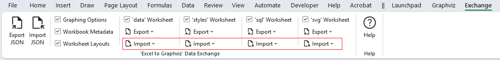
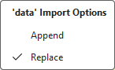
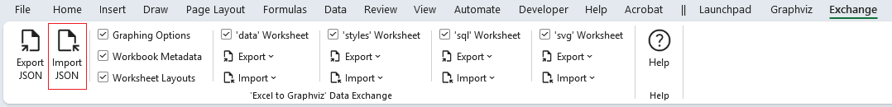
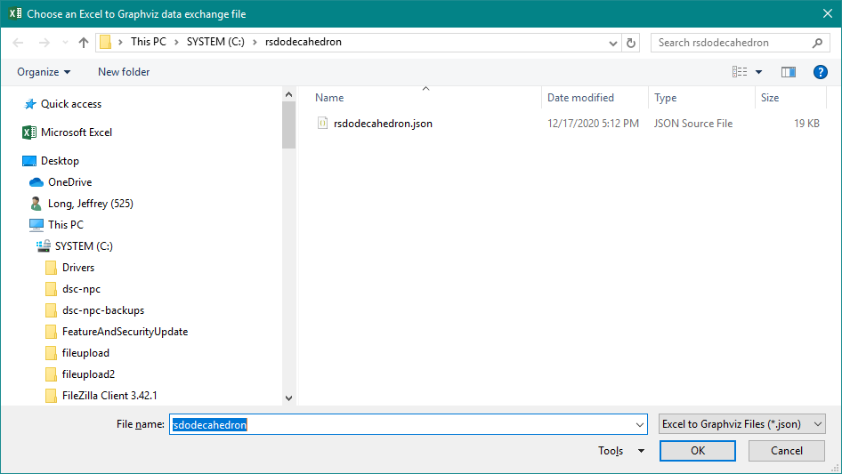
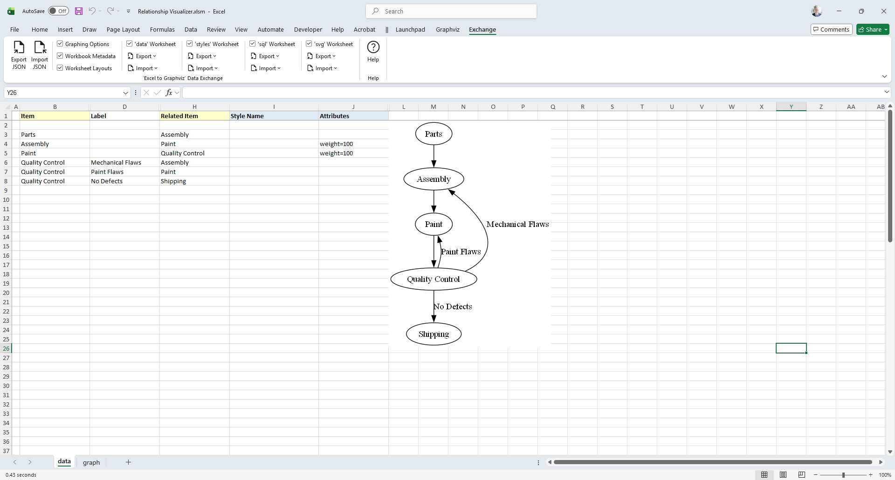

# Importing JSON Data

The Import function works the opposite of the Export function. It reads a JSON file which has been exported by the Relationship Visualizer to reconstitute the JSON data into a Relationship Visualizer spreadsheet.

To import a JSON file, start by choosing the sections which you want included. Just as you can export an entire workbook, or sections of the workbook, you may also import an entire workbook or just sections of a workbook.

A key difference for importing worksheets comes via the import option dropdown lists.

`data`, `styles`, `sql`, and `svg` worksheets choices have Import of Append and Replace.

These are mutually exclusive choices that allow you to specify whether to replace the contents in the worksheet, or append the data in the worksheet. **Replace** is the default, and is intended for loading the data into an empty worksheet. **Append** is useful for consolidating data when multiple people are preparing the data.

For example, assume a husband and wife each prepare a family tree of their ancestors. The husband can export his ancestor's data, and the wife can import the husband's data with Append checked. The import will place the data in the `data` worksheet after the wife's data and the family tree will become complete for this family unit.

Once you have selected your Import, press the `Import JSON` button.

You will be prompted to **Choose an Excel to Graphviz data exchange file**

Select the file and press the `OK` button. The data will be imported (which may take several seconds). If the `Automatic Refresh` checkbox on the Graphviz tab is checked, the Relationship Visualizer will graph the data to the worksheet, otherwise press the `Refresh Graph` button to see the graph.

