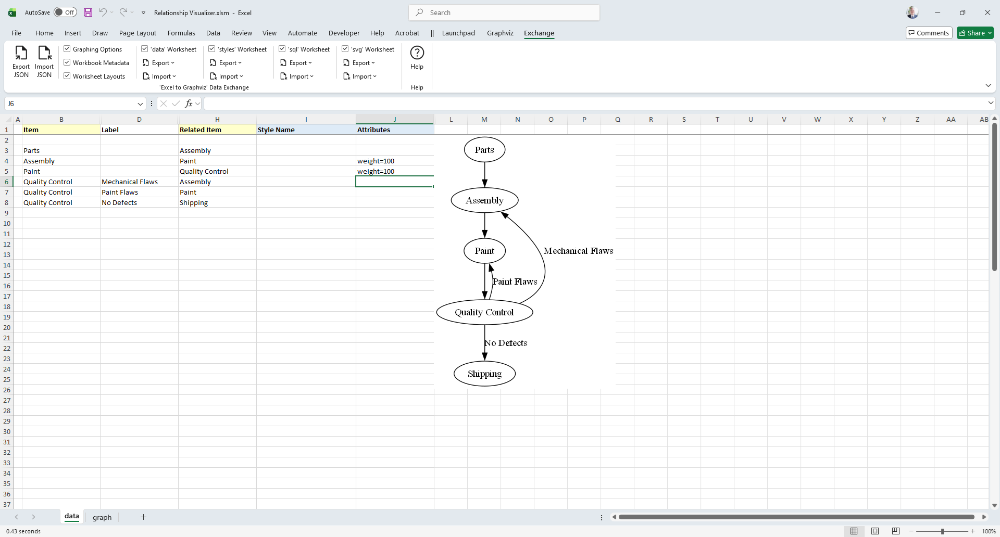
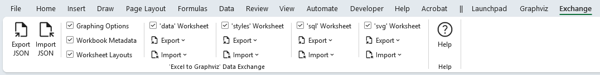
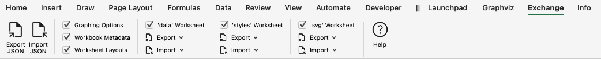

# Exchange Data Using JSON Files

There are several drawbacks to using an Excel workbook as your Graphviz IDE:

- **Data and code live in the same file.** As new versions of the workbook are released with additional features, it becomes tedious to copy existing data across multiple worksheets—and to reapply all ribbon settings—from the old version to the new one.
- **Excel workbooks are binary files.** Internally, an Excel file is a ZIP archive. Because it is not a plain text format, it does not work well with version control systems such as Git, nor does it lend itself to meaningful diffs between versions.
- **Text‑based sharing services are incompatible.** Platforms such as [Pastebin](https://pastebin.com/) make it easy to share examples and snippets, but they require text files rather than binary Excel files.
- **Macro‑enabled workbooks are often distrusted.** Many users—and many email systems—treat VBA‑enabled files as unsafe. It is common for email systems to strip the attachment entirely due to the presence of macros.

These limitations made it clear that a text‑based representation of the workbook’s data, styles, and settings was needed. The features that support exporting and importing this information are provided on the **Exchange** ribbon tab. There is no associated worksheet, as data exchange operates directly on the internal contents of the workbook.

Let’s look at an existing spreadsheet and walk through exporting it from one workbook and importing it into another using the Exchange logic. The **Exchange** tab is not associated with a worksheet, and appears as follows:

## The `Exchange` Ribbon Tab

The `Exchange` ribbon tab appears as follows, and is organized as illustrated

`Windows`

`macOS`

 

### Ribbon Controls

- `Export JSON` - Writes contents out to JSON file
- `Import JSON` - Reads JSON file, and restores data to workbook
- `Graphing Options` - Include options chosen in the ribbons and `settings` worksheet
- `Workbook Metadata` - Include information such as user, Excel version, etc.
- `Worksheet Layouts` - Include information on how the workbook is organized
- `'data' Worksheet` - Include the contents of the `data` worksheet
  - Export
    - `Include row number` - Include the row number of where the data was located
    - `Include row height` - Include the height of the row
    - `Include row visibility` - Include information which tells if the row was visible or hidden
  - Import
    - `Append` - When importing, append the data if existing data exists
    - `Replace` - When importing, ignore any data and replace the contents
- `'styles' Worksheet` - Include the contents of the `styles` worksheet
  - Export
    - `Include row number` - Include the row number of where the data was located
    - `Include row height` - Include the height of the row
    - `Include row visibility` - Include information which tells if the row was visible or hidden
  - Import
    - `Append` - When importing, append the data if existing data exists
    - `Replace` - When importing, ignore any data and replace the contents
- `'sql' - Worksheet` Include the contents of the `sql` worksheet
  - Export
    - `Include row number` - Include the row number of where the data was located
    - `Include row height` - Include the height of the row
    - `Include row visibility` -Include information which tells if the row was visible or hidden
  - Import
    - `Append` - When importing, append the data if existing data exists
    - `Replace` - When importing, ignore any data and replace the contents
- `'svg' - Worksheet` Include the contents of the `svg` worksheet
  - Export
    - `Include row number` - Include the row number of where the data was located
    - `Include row height` - Include the height of the row
    - `Include row visibility` -Include information which tells if the row was visible or hidden
  - Import
    - `Append` - When importing, append the data if existing data exists
    - `Replace` - When importing, ignore any data and replace the contents

