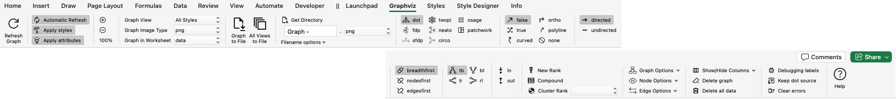
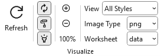
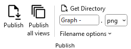
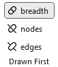
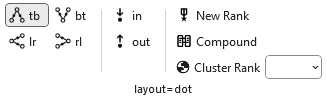
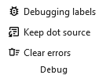
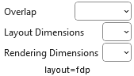
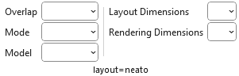
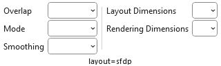

# The `Graphviz` Ribbon Tab

Now that you understand the basics of the `data` worksheet, let's explore the features available in the `Graphviz` ribbon tab. 

The `Graphviz` ribbon tab activates automatically whenever  any of the following worksheets is selected: `data` `graph`, `styles`, `settings` or `about…`. It looks like this:

`Windows`

`macOS`

It contains the following groups, which are each explained in content which follows. You may jump directly to the content using the links in this table:
| Group | Controls  | Description |
| :---- | :--- |  :--- |
| [Visualize](#visualize) |  | Action and option buttons that cause the Excel data to be graphed by Graphviz and then displayed within the Excel workbook. |
| | | |
| [Publish](#publish) |  | Action buttons that cause the Excel data to be graphed by Graphviz and then written to a file. |
| | | |
| [Graph Layout](#graph-layout) |  | Provides a set of toggle buttons that control which Graphviz layout engine is applied to your diagram. |
| | | |
| [Splines](#splines) |  | Provides a set of toggle buttons that control how edges are routed in your diagram.  |
| | | |
| [Type](#graph-type) |  |  Provides a set of toggle buttons that determine whether your diagram is treated as a directed or undirected graph. |
| | | |
| [Drawn First](#drawn-first) |  | Provides a set of toggle buttons thatdetermine the sequence in which Graphviz draws nodes and edges during rendering. |
| | | |
| [Layout Options](#layout-options) |  | The Algorithm group within the Graphviz tab changes dynamically based upon the layout algorithm chosen. The graph options shown are specific to that particular layout algorithm. |
| | | |
| ['data' Worksheet](#data-worksheet) |  | A set of menu items that control what columns and graphs are displayed on the `data` worksheet. |
| | | |
| [Debug](#debug) |  | An option to display additional information such as the row number and Item identifiers in the labels of nodes, edges, and clusters. |
| | | |
| [Help](#help) |  | Provides a link to the `Help` content for the `data` worksheet (i.e. this web page). |

## Visualize

|  |
| --------------------------------------------- |

| Label              | Control Type  | Description                                                                                                                                                                                                                                                                                                                                                                                                                                                                                                                                               |
| ------------------ | ------------- | --------------------------------------------------------------------------------------------------------------------------------------------------------------------------------------------------------------------------------------------------------------------------------------------------------------------------------------------------------------------------------------------------------------------------------------------------------------------------------------------------------------------------------------------------------- |
| Refresh      | Button        | The action button that causes the Excel data to be graphed by Graphviz and then displayed within the Excel workbook.                                                                                                                                                                                                                                                                                                                                                                                                                                      |
| Automatic  | Toggle Button      | When selected, keystrokes are monitored and as cell changes are detected the graph is automatically refreshed (also requires that `Worksheet` is set to `data`).                                                                                                                                                                                                                                                                                                                                                                                  |
| Apply Styles  | Toggle Button      |Specifies if the style attributes associated with the Style Name assigned to a node, edge, or cluster should be applied when the graph is generated.  **Choices:**<ul><li>_Pressed_ - use the style format </li><li>_Unpressed_ - do not use the style format (i.e., use default Graphviz rendering method)</li></ul>                                                                                                                                                                                                                                                                                                                                                                                                                                                                                                                                                                                                                                                                                                                                                                                                                                                                        |
| Apply Attributes  | Toggle Button      |Specifies if the style attributes in the `Attributes` column on the `data` worksheet should be included or omitted when the graph is generated.   **Choices:**<ul><li>_Pressed_ - include the style attributes </li><li>_Unpressed_ - do not include the style attributes</li></ul>|
| Zoom In  | Button      | Magnifies the scale the of image displayed in Excel by 5%.                                                                                                                                                                                                                                                                                                                                                                                  |
| Zoom Out  | Button      | Decreases the scale the image displayed in Excel by 5% so as the graph gets larger, you can see more of it within the workbook without having to scroll.                                                                                                                                                                                                                                                                                                                                                                                  |
| Current Zoom  | Text  | Shows the current magnification level. The magnification can range from 5% to 150% in 5% increments                                                                                                                                                                                                                                                                                                                                                                                  |
| View         | Dropdown list | The name of the column in the `styles` worksheet which controls which set of Yes/No values to use when creating the diagrams. This dropdown list is explained in more detail in the section [Creating Views](#creating-views).                                                                                                                                                                                                                                                                                                                            |
| Image Type         | Dropdown list | Image format to use when displaying the graph on the `data` or `graph` worksheet of the Relationship Visualizer.   **Choices:**<ul><li>`bmp` - Microsoft Windows Bitmap format</li><li>`gif` - Graphics Interchange Format</li><li>`jpg` - Joint Photographic Experts Group format </li><li>`png` - Portable Network Graphics format</li><li>`svg` - Scalable Vector Graphics</li></ul>**Note:** SVG images only display in Office 365; they do not display in older versions of Excel.                                                             |
| Worksheet | Dropdown list | The worksheet in the current workbook where the graph should be displayed   **Choices:**<ul><li>`data` - The graph is displayed in the `data` worksheet to the right of the data columns.</li><li>`graph` - The graph is displayed in the `graph` worksheet, and the `graph` worksheet is activated. This setting is useful for large graphs as it allows you to use Excel's magnification Zoom-In/Zoom-out feature. It is also useful when you want to flip back and forth between the data and the graph to correct errors in the data.</li></ul> |

## Publish

|  |
| ---------------------------------------- |

A tutorial on how to use these ribbon options is contained in the section [Publishing Graphs](#publish).

| Label                                                               | Control Type  | Description                                                                                                                                                                                                                                                                                                                                                                                                                                                                                                     |
| ------------------------------------------------------------------- | ------------- | --------------------------------------------------------------------------------------------------------------------------------------------------------------------------------------------------------------------------------------------------------------------------------------------------------------------------------------------------------------------------------------------------------------------------------------------------------------------------------------------------------------- |
| Publish                                                       | Button        | The action button that causes the Excel data to be graphed by Graphviz and then written to a file.                                                                                                                                                                                                                                                                                                                                                                                                              |
| Publish all views                                                   | Button        | The action button that causes the Excel data to be graphed by Graphviz and then written to a file repeatedly for every view defined in the `Styles` worksheet.                                                                                                                                                                                                                                                                                                                                                  |
| Get Directory                                                       | Button        | Brings up the Directory Selection dialog and stores/displays the directory where the files should be written to. Once a directory is selected the directory path replaces the "Get Directory" button label.                                                                                                                                                                                                                                                                                                     |
| File Prefix                                                         | Edit box      | Base portion of the file name. For example: `Graph`.   You may also build a file name using the following character strings in the file prefix to insert run-time values into the file name.<ul><li>`%D` - Current date</li><li>`%T` - Current time</li> <li>`%E` - Graphviz layout engine </li><li>`%S` - Splines </li><li>`%V` - View name </li><li>`%W` - Worksheet name </li></ul>**NOTE**: You must check the appropriate options in the `Filename options` dropdown list for the substitutions to occur. |
| File Format                                                         | Dropdown List | File format of the output file.  **Choices:**<ul><li> `bmp` - Microsoft Windows Bitmap format</li><li>`gif` - Graphics Interchange Format</li><li>`jpg` - Joint Photographic Experts Group format</li><li>`pdf` - Portable Document Format</li><li>`png` - Portable Network Graphics format</li><li>`ps` - Postscript format</li><li>`svg` - Scalable Vector Graphics format </li><li>`tiff` - Tagged Image File Format </li></ul>                                                                        |
| Filename options  | Dropdown List | A list of options which can be checked which will cause run-time information to be appended or omitted from the file name.                                                                                                                                                                                                                                                                                                                                                                                      |
| Add date/time to the filename                                       | Check box     | Option to add a date and time to the file name.   **Choices:**<ul><li>_Checked_ - Add the date and time</li><li>_Unchecked_ - Omit the date and time</li></ul>                                                                                                                                                                                                                                                                                                                                                                                                |
| Add Layout/Splines to the filename                                  | Check box     | Option to add the layout engine and spline type to the file name.   **Choices:**<ul><li>_Checked_ - Add the options</li><li>_Unchecked_ - Omit the options</li></ul>                                                                                                                                                                                                                                                                                                                                                                                          |

## Graph Layout

The **Graph Layout** section provides a set of toggle buttons that control which Graphviz layout engine is applied to your diagram. These toggles function like radio buttons, ensuring that only one layout is active at a time. This approach gives you a quick, intuitive way to explore how different layout algorithms organize your graph

|  |
| ------------------------------------------ |

## Splines

The **Splines** section provides a set of toggle buttons that control how edges are routed in your diagram. These toggles function like radio buttons, ensuring that only one spline style is active at a time. This design gives you a quick, intuitive way to explore different routing options—straight lines, curves, orthogonal paths, and more—and immediately see how each style affects the readability and structure of your graph

|  |
| ------------------------------------------ |

| Button     | Description |
|-----------|-------------|
| **false** | Edges are drawn as straight lines. |
| **true**  | Edges are drawn using a combination of straight segments and free‑flowing curves.  |
| **curved** | Edges are drawn as smooth, continuous curves between nodes. |
| **ortho** | Edges are routed using horizontal and vertical segments with 90‑degree bends. |
| **polyline** | Edges are drawn as straight segments with angular bends (not restricted to right angles). |
| **none** | Edges (and edge labels) are not drawn, but still influence node placement. |

## Graph Type

The **Graph Type** section provides a set of toggle buttons that determine whether your diagram is treated as a directed or undirected graph. These toggles function like radio buttons, ensuring that only one graph type is active at a time. This setup gives you a quick, intuitive way to switch between directional and non‑directional relationships and immediately see how edge arrows, routing, and layout behavior change in response.

|  |
| ------------------------------------------ |

| Button          | Description |
|----------------|-------------|
| **undirected** | Creates an [Undirected Graph](../terminology/#undirected-graph) graph. Edges have no direction and are drawn without arrowheads. |
| **directed**   | Creates a [Directed Graph](../terminology/#directed-graph) graph (digraph). Edges have a defined direction and are drawn with arrowheads. |

## Drawn First

The **Drawn First** controls (i.e. outputorder) determine the sequence in which Graphviz draws nodes and edges during rendering. These options are presented as toggle buttons that behave like radio buttons, ensuring that only one drawing order is active at a time. This gives you a quick, intuitive way to adjust whether edges appear above or below nodes—useful when fine‑tuning visibility, layering, or stylistic preferences in your diagram.

Output Order Values
| Button          | Description |
|----------------|-------------|
| **breadth** | Draws nodes before edges. Edges appear on top and below nodes. |
| **nodes**   | Nodes are drawn first; edges are drawn afterward. Edges appear on top of nodes. |
| **edges**   | Edges are drawn first; nodes are drawn afterward, causing nodes to appear on top of edges. |

## Layout Options

The Algorithm group within the Graphviz tab changes dynamically based upon the layout algorithm chosen. The graph options shown are specific to that particular layout algorithm.

---

### layout=circo

There are no additional dynamic options for `layout=circo`.

---

### layout=dot

|  |
| ---------------------------------------- |

The buttons `[tb]`, `[bt]`, `[lr]`, `[rl]` determine the **Rank Direction**  flow of the graph—whether nodes are arranged top‑to‑bottom, bottom‑to‑top, left‑to‑right, or right‑to‑left. These options are presented as toggle buttons that behave like radio buttons, ensuring that only one direction is active at a time.

| Button | Description |
| :----: |-------------|
| **tb** | Top‑to‑Bottom. Ranks flow downward (the default for most layouts).  |
|        |             |
| **bt** | Bottom‑to‑Top. Ranks flow upward.  
|        |             |
| **lr** | Left‑to‑Right. Ranks flow horizontally from left to right.   |
|        |             |
| **rl** | Right‑to‑Left. Ranks flow horizontally from right to left.  |

The `[in]`, `[out]` Ordering buttons determine how edges are arranged around each node during layout. 

| Button | Description |
|--------|-------------|
| **in**  | Preserves the order of incoming edges around each node. |
| **out** | Preserves the order of outgoing edges around each node. |

The **New Rank** button determines how Graphviz handles ranking when clusters are present in the graph. This option is presented as a toggle that behaves like a radio‑style switch, ensuring the feature is either fully enabled or disabled. Turning it on allows Graphviz to compute a single global ranking across all clusters, while turning it off preserves the traditional recursive ranking inside each cluster. This gives you a quick, intuitive way to influence how tightly or loosely clustered subgraphs interact in the final layout.

The **Compound** button determines whether edges are allowed to connect into and out of clusters when using layout engines that support this feature. This option is presented as a simple toggle that behaves like a radio‑style switch, enabling or disabling compound edge routing. Turning it on allows edges to attach to cluster boundaries using lhead and ltail, giving you a quick, intuitive way to create more expressive diagrams where relationships span across grouped subgraphs.

| Value     | Description |
|-----------|-------------|
| **false** | Disables compound edges. Edges cannot connect into or out of clusters using `lhead` or `ltail`. |
| **true**  | Enables compound edges, allowing edges to enter or leave clusters and attach to cluster boundaries. |

The **Cluster Rank** control determines how Graphviz ranks clusters relative to one another during layout.

| Value       | Description |
|-------------|-------------|
| **local**   | Each cluster is ranked independently. This preserves the traditional recursive ranking behavior and often produces compact cluster layouts. |
| **global**  | All clusters participate in a single, unified ranking. This can create more consistent alignment across clusters but may increase spacing. |

---

### layout=fdp

|  |
| ---------------------------------------- |

The **Overlap** control is presented as a dropdown list that lets you choose how Graphviz handles node collisions during layout. Each option corresponds to a specific overlap‑removal strategy supported by Graphviz, ranging from allowing overlaps for speed to applying more advanced algorithms for cleaner spacing. 

| Value      | Description |
|------------|-------------|
| **compress** | Reduces whitespace by compressing the layout after overlap removal, producing a tighter diagram. |
| **prism**    | Uses a stress‑based algorithm to separate overlapping nodes while preserving layout structure. |
| **scale**    | Uniformly scales the entire layout until nodes no longer overlap. |
| **scalexy**  | Scales the layout independently in the X and Y directions to eliminate overlaps. |
| **Voronoi**  | Uses a Voronoi‑based algorithm to push nodes apart by expanding their regions until overlaps are resolved. |

The **Layout Dimensions** control (`dim=` attribute) sets the number of dimensions Graphviz uses when computing node positions for certain layout engines (primarily neato, fdp, and sfdp). This option is presented as a dropdown list, allowing you to choose how many dimensions the layout solver operates in. Higher dimensions can help the solver escape local minima and produce cleaner layouts, even though the final output is always projected back into 2D.

The **Rendering Dimensions** control (`dimen=` attribute) specifies how many dimensions are used when interpreting node size attributes such as width, height, and size. This option is presented as a dropdown list, allowing you to choose whether nodes are sized in two dimensions or in higher‑dimensional space. Although the final drawing is always 2D, increasing the dimensionality can influence how Graphviz interprets size constraints during layout, giving you a simple, intuitive way to adjust how strictly node size attributes are applied.

---

### layout=neato

|  |
| ------------------------------------------ |

The **Overlap** control is presented as a dropdown list that lets you choose how Graphviz handles node collisions during layout. Each option corresponds to a specific overlap‑removal strategy supported by Graphviz, ranging from allowing overlaps for speed to applying more advanced algorithms for cleaner spacing. 

| Value      | Description |
|------------|-------------|
| **compress** | Reduces whitespace by compressing the layout after overlap removal, producing a tighter diagram. |
| **prism**    | Uses a stress‑based algorithm to separate overlapping nodes while preserving layout structure. |
| **scale**    | Uniformly scales the entire layout until nodes no longer overlap. |
| **scalexy**  | Scales the layout independently in the X and Y directions to eliminate overlaps. |
| **Voronoi**  | Uses a Voronoi‑based algorithm to push nodes apart by expanding their regions until overlaps are resolved. |

The **Mode** control selects the algorithm that Neato uses to compute node positions during layout. This option is presented as a dropdown list, allowing you to choose among several solver strategies that influence how distances, forces, and constraints are optimized. Each mode offers a different balance of speed, stability, and layout style, giving you a quick, intuitive way to experiment with how the underlying algorithm shapes the structure of your diagram.

| Value      | Description |
| ------------ | ------------- |
| **major**  | Uses stress majorization to iteratively refine node positions; stable and widely used. |
| **KK**     | Uses the Kamada–Kawai spring model, optimizing ideal edge lengths through gradient descent. |
| **hier**   | Produces a top‑down, hierarchy‑influenced layout similar to dot but using Neato's solver. |
| **ipsep**  | Applies iterative penalty separation to enforce minimum distances between nodes. |
| **spring** | Uses a classical spring‑embedder approach for force‑directed placement. |
| **maxent** | Uses a maximum‑entropy–inspired solver to spread nodes evenly while respecting constraints. |

The **Model** control selects how Neato interprets edge relationships when computing ideal node distances. This option is presented as a dropdown list, allowing you to choose among several distance‑calculation models that influence clustering, separation, and overall layout behavior. Each model offers a different way of translating graph structure into geometric constraints, giving you a quick, intuitive way to shape how Neato arranges your diagram.

The **Layout Dimensions** control (`dim=` attribute) sets the number of dimensions Graphviz uses when computing node positions for certain layout engines (primarily neato, fdp, and sfdp). This option is presented as a dropdown list, allowing you to choose how many dimensions the layout solver operates in. Higher dimensions can help the solver escape local minima and produce cleaner layouts, even though the final output is always projected back into 2D.

The **Rendering Dimensions** control (`dimen=` attribute) specifies how many dimensions are used when interpreting node size attributes such as width, height, and size. This option is presented as a dropdown list, allowing you to choose whether nodes are sized in two dimensions or in higher‑dimensional space. Although the final drawing is always 2D, increasing the dimensionality can influence how Graphviz interprets size constraints during layout, giving you a simple, intuitive way to adjust how strictly node size attributes are applied.

---

### layout=osage

There are no additional dynamic options for `layout=osage`.

---

### layout=patchwork

There are no additional dynamic options for `layout=patchwork`.

---

### layout=sfdp

|  |
| ----------------------------------------- |

The **Overlap** control is presented as a dropdown list that lets you choose how Graphviz handles node collisions during layout. Each option corresponds to a specific overlap‑removal strategy supported by Graphviz, ranging from allowing overlaps for speed to applying more advanced algorithms for cleaner spacing. 

| Value      | Description |
|------------|-------------|
| **compress** | Reduces whitespace by compressing the layout after overlap removal, producing a tighter diagram. |
| **prism**    | Uses a stress‑based algorithm to separate overlapping nodes while preserving layout structure. |
| **scale**    | Uniformly scales the entire layout until nodes no longer overlap. |
| **scalexy**  | Scales the layout independently in the X and Y directions to eliminate overlaps. |
| **Voronoi**  | Uses a Voronoi‑based algorithm to push nodes apart by expanding their regions until overlaps are resolved. |

The **Mode** control selects the algorithm that Neato uses to compute node positions during layout. This option is presented as a dropdown list, allowing you to choose among several solver strategies that influence how distances, forces, and constraints are optimized. Each mode offers a different balance of speed, stability, and layout style, giving you a quick, intuitive way to experiment with how the underlying algorithm shapes the structure of your diagram.

| Value      | Description |
|------------|-------------|
| **major**  | Uses stress majorization to iteratively refine node positions; stable and widely used. |
| **KK**     | Uses the Kamada–Kawai spring model, optimizing ideal edge lengths through gradient descent. |
| **hier**   | Produces a top‑down, hierarchy‑influenced layout similar to dot but using Neato’s solver. |
| **ipsep**  | Applies iterative penalty separation to enforce minimum distances between nodes. |
| **spring** | Uses a classical spring‑embedder approach for force‑directed placement. |
| **maxent** | Uses a maximum‑entropy–inspired solver to spread nodes evenly while respecting constraints. |

The Smoothing control is presented as a dropdown list that lets you choose how Graphviz refines the raw node positions produced by the layout engine. Each option applies a different post‑processing technique to “smooth out” irregularities, reduce jitter, or improve geometric consistency. This gives you a simple, intuitive way to fine‑tune the visual polish of your diagram without altering the underlying layout structure.

| Value        | Description |
|--------------|-------------|
| **none**       | No smoothing applied. Uses the raw layout positions exactly as computed. |
| **avg_dist**   | Adjusts node positions based on average distances to neighbors, reducing local irregularities. |
| **graph_dist** | Smooths positions using graph‑theoretic distances, improving global consistency. |
| **power_dist** | Applies a power‑law weighting to distances, emphasizing stronger relationships. |
| **rng**        | Uses a Relative Neighborhood Graph–based smoothing to reduce noise while preserving structure. |
| **spring**     | Applies a light spring‑embedder pass to gently relax node positions. |
| **triangle**   | Uses triangle‑based geometric smoothing to even out spacing in dense regions. |

The **Layout Dimensions** control (`dim=` attribute) sets the number of dimensions Graphviz uses when computing node positions for certain layout engines (primarily neato, fdp, and sfdp). This option is presented as a dropdown list, allowing you to choose how many dimensions the layout solver operates in. Higher dimensions can help the solver escape local minima and produce cleaner layouts, even though the final output is always projected back into 2D.

The **Rendering Dimensions** control (`dimen=` attribute) specifies how many dimensions are used when interpreting node size attributes such as width, height, and size. This option is presented as a dropdown list, allowing you to choose whether nodes are sized in two dimensions or in higher‑dimensional space. Although the final drawing is always 2D, increasing the dimensionality can influence how Graphviz interprets size constraints during layout, giving you a simple, intuitive way to adjust how strictly node size attributes are applied.

---

### Layout = `twopi`

There are no additional dynamic options for `layout=patchwork`.

## Options

|  |
| ---------------------------------- |

### Graph
Optional attributes which can be checked for inclusion in the Graphviz source. These attributes have graph-level scope.

| Label                                                                   | Control Type  | Description                                                                                                                                                                                                                                                                                                                                                                                                                                                                                                                                                                                                                                                                                                                                                                                                   |
| ----------------------------------------------------------------------- | ------------- | ------------------------------------------------------------------------------------------------------------------------------------------------------------------------------------------------------------------------------------------------------------------------------------------------------------------------------------------------------------------------------------------------------------------------------------------------------------------------------------------------------------------------------------------------------------------------------------------------------------------------------------------------------------------------------------------------------------------------------------------------------------------------------------------------------------- |
| **Drawing**                                                             |               |                                                                                                                                                                                                                                                                                                                                                                                                                                                                                                                                                                                                                                                                                                                                                                                               |
| Center Drawing                                                          | Checkbox      | Checking this item will cause the graph to be centered in the page, assuming the graph is smaller than the page size.                                                                                                                                                                                                                                                                                                                                                                                                                                                                                                                                                                                                                                                                                         |
| Force xlabel placement                                                  | Checkbox      | If checked, all `xlabel` attributes are placed, even if there is some overlap with nodes or other labels.                                                                                                                                                                                                                                                                                                                                                                                                                                                                                                                                                                                                                                                                                                     |
| Rotate 90 counterclockwise                                              | Checkbox      | If checked, causes the final layout to be rotated counterclockwise by 90 degrees.                                                                                                                                                                                                                                                                                                                                                                                                                                                                                                                                                                                                                                                                                                                             |
| Transparent Background                                                  | Checkbox      | Toggles the background color between white and transparent.  Transparent backgrounds are useful if you intend to layer the graphs in an image editor or paste them into a Microsoft Word document.  **Choices:** <ul><li>_Checked_ - Background is transparent  </li><li>_Unchecked_ - Graph background is white.  </li></ul>**Note:** It is possible to set the graph background color to any valid color by specifying the `bgcolor=` attribute as a graph option on the `settings` worksheet.                                                                                                                                                                               |
| Include image path                                                      | Checkbox      | If checked, adds the `imagepath` attribute to the graph.  **Choices:** <ul><li>_Checked_ - Path to the images is added.</li><li>_Unchecked_ - Path to images is omitted.</li></ul>                                                                                                                                                                               |

### Node

Choices which control which nodes are included in the Graphviz source, and how the labels should be represented.

| Label                                                                   | Control Type  | Description                                                                                                                                                                                                                                                                                                                                                                                                                                                                                                                                                                                                                                                                                                                                                                                                   |
| ----------------------------------------------------------------------- | ------------- | ------------------------------------------------------------------------------------------------------------------------------------------------------------------------------------------------------------------------------------------------------------------------------------------------------------------------------------------------------------------------------------------------------------------------------------------------------------------------------------------------------------------------------------------------------------------------------------------------------------------------------------------------------------------------------------------------------------------------------------------------------------------------------------------------------------- |
| **Filter**                                                              |               |                                                                                                                                                                                                                                                                                                                                                                                                                                                                                                                                                                                                                                                                                                                                                                                               |
| Include stand-alone nodes                                               | Checkbox      | Include or exclude nodes without relationships (i.e., island nodes). When using views to exclude relationship edges there may be nodes left in the diagram that are not connected to anything. This setting specifies if these island nodes should be included or excluded from the diagram.  **Choices:**<ul><li>_Checked_ - retain the island nodes</li><li>_Unchecked_ - drop the island nodes from the diagram</li></ul>                                                                                                                                                                                                                                                                                                                                                                            |
| **Label Columns**                                                       |               |                                                                                                                                                                                                                                                                                                                                                                                                                                                                                                                                                                                                                                                                                                                                                                                               |
| Include `Label`                                                         | Checkbox      | Include or exclude Labels column data? Allows you to turn labels on/off in the graph.  **Choices:**<ul><li> _Checked_ - Include Label column data </li><li>_Unchecked_ - Drop the Label column data from the graph</li></ul>                                                                                                                                                                                                                                                                                                                                                                                                                                                                                                                                                                            |
| Include `External Label`                                                | Checkbox      | Include or exclude External Labels column data? Allows you to turn outside (xlabel) labels on/off in the graph.  **Choices:**<ul><li>_Checked_ - Include External Label column data </li><li>_Unchecked_ - Drop the External Label column data from the graph</li></ul>                                                                                                                                                                                                                                                                                                                                                                                                                                                                                                                                 |
| **Label Values**                                                        |               |                                                                                                                                                                                                                                                                                                                                                                                                                                                                                                                                                                                                                                                                                                                                                                                               |
| When the `Label` column is blank…                                       | Menu          | Include or exclude blank values in the Label column?  When the `Label` column is blank on the data worksheet on a row which refers to a node it can mean two possible things. One interpretation is to remove the label from the node, as might be useful when using images to represent nodes. The other interpretation is to let the graph default to displaying the value in the `Item` column.  **Choices:**<ul><li>`…use blank for the node label` - use a blank label as the node's label text</li><li>` …use the node identifier as the label` - show the value in the `Item` column as the label text</li></ul>                                                                                                                                                                           |

### Edge

Choices which control how edges should be specified in the Graphviz source, and how the edge labels should be represented.

| Label                                                                   | Control Type  | Description                                                                                                                                                                                                                                                                                                                                                                                                                                                                                                                                                                                                                                                                                                                                                                                                   |
| ----------------------------------------------------------------------- | ------------- | ------------------------------------------------------------------------------------------------------------------------------------------------------------------------------------------------------------------------------------------------------------------------------------------------------------------------------------------------------------------------------------------------------------------------------------------------------------------------------------------------------------------------------------------------------------------------------------------------------------------------------------------------------------------------------------------------------------------------------------------------------------------------------------------------------------- |
| **Consolidate**                                                         |               |                                                                                                                                                                                                                                                                                                                                                                                                                                                                                                                                                                                                                                                                                                                                                                                                |
| Apply "strict" rules                                                    | Checkbox      | Specifies the strict attribute for the top-level graph. Describing the graph as strict forbids the creation of multi-edges, i.e., there can be at most one edge with a given tail node and head node in the directed case. For undirected graphs, there can be at most one edge connected to the same two nodes. Subsequent edge statements using the same two nodes will identify the edge with the previously defined one and apply any attributes given in the edge statement.  **Choices:**<ul><li>_Checked_ - Includes the strict attribute   Edges have been consolidated.</li><li>_Unchecked_ - Omits the strict attribute  Edges have not been consolidated.</li></ul>          |
| Concentrate edges                                                       | Checkbox      | If checked, use edge concentrators. This merges multi-edges into a single edge and causes partially parallel edges to share part of their paths. This feature is only available if the layout algorithm is **dot**.   **Choices:**<ul><li>_Checked_ - Include the concentrate attribute  Edges have been concentrated</li><li>_Unchecked_ - Omits the concentrate attribute  Edges are not concentrated</li></ul>                                                                                                                                                                                                                                                                       |
| **Filter**                                                              |               |                                                                                                                                                                                                                                                                                                                                                                                                                                                                                                                                                                                                                                                                                                                                                                                                |
| Include edges which reference undefined nodes                           | Checkbox      | Include/Exclude relationships Include stand-alone edges (i.e., orphan edges). When using views to exclude nodes there may be un-styled nodes included in the diagram due to edge references. This setting specifies if the edges should be included or excluded from the diagram.  **Choices:**<ul><li>_Checked_ - retain edges which have references to undefined nodes </li><li>_Unchecked_ - drop any edges which do not refer to defined nodes</li></ul>                                                                                                                                                                                                                                                                                                                                            |
| Include Ports                                                           | Checkbox      | Retain/Remove port values from the nodes in an edge relationship. Given:    **Choices:**<ul><li>_Checked_ - retain the ports when creating the edge syntax.  `a:n -> b:s` </li><li>_Unchecked_ - removes the ports specified when creating the edge syntax.  `a -> b`</li></ul>                                                                                                                                                                                                                                                                                                                                                       |
| **Label Columns**                                                       |               |                                                                                                                                                                                                                                                                                                                                                                                                                                                                                                                                                                                                                                                                                                                                                                                                |
| Include `Label`                                                         | Checkbox      | Include or exclude Labels column data? Allows you to turn edge labels on/off in the graph.   **Choices:**<ul><li>_Checked_ - Include Label column data </li><li>_Unchecked_ - Omit the Label column data from the graph</li></ul>                                                                                                                                                                                                                                                                                                                                                                                                                                                                                                                                                                       |
| Include `External Label`                                                |               | Include or exclude External Labels column data? Allows you to turn outside (xlabel) edge labels on/off in the graph.  **Choices:**<ul><li>_Checked_ - Include External Label column data </li><li>_Unchecked_ - Omit the External Label column data from the graph</li></ul>                                                                                                                                                                                                                                                                                                                                                                                                                                                                                                                            |
| Include `Head Label`                                                    | Checkbox      | Include or exclude Head Labels column data? Allows you to turn edge head labels on/off in the graph.  **Choices:**<ul><li>_Checked_ - Include Head Label column data </li><li>_Unchecked_ - Omit the Head Label column data from the graph</li></ul>                                                                                                                                                                                                                                                                                                                                                                                                                                                                                                                                                    |
| Include `Tail Label`                                                    | Checkbox      | Include or exclude Tail Labels column data? Allows you to turn edge tail labels on/off in the graph.  **Choices:**<ul><li>_Checked_ - Include Tail Label column data</li><li>_Unchecked_ - Omit the Table Label column data from the graph</li></ul>                                                                                                                                                                                                                                                                                                                                                                                                                                                                                                                                                    |
| **Label Values**                                                        |               |                                                                                                                                                                                                                                                                                                                                                                                                                                                                                                                                                                                                                                                                                                                                                                                                |
| When the `Label` column is blank…                                       | Menu          | Include or exclude blank values in the Label column?  When the `Label` column is blank on the data worksheet on a row which refers to an edge it can mean two possible things. One interpretation is to remove the label from the edge. The other interpretation is to let the graph default to displaying the value Graphviz assigns to the edge relationship.   **Choices:**<ul><li>`…the label is blank` - use the blank label as the node's label text </li><li>`…use the edge name as the label` - show the value in the `Item` column as the label text </li></ul>                                                                                                                      |

## Toggles

|  |
| ------- |

| Label          | Control Type  | Description                                                                                                                                                                                                                                                                                                                                                                                                                                                                                                                                                                                                                                                                                                                                                                                                   |
| -------------- | ------------- | ------------------------------------------------------------------------------------------------------------------------------------------------------------------------------------------------------------------------------------------------------------------------------------------------------------------------------------------------------------------------------------------------------------------------------------------------------------------------------------------------------------------------------------------------------------------------------------------------------------------------------------------------------------------------------------------------------------------------------------------------------------------------------------------------------------- |
| Use styles     | Checkbox      | Specifies if the style attributes associated with the Style Name assigned to a node, edge, or cluster should be used when the graph is generated.  **Choices:**<ul><li>_Checked_ - use the style format </li><li>_Unchecked_ - do not use the style format (i.e., use default Graphviz rendering method)</li></ul>                                                                                                                                                                                                                                                                                                                                                                                                                                                                                      |
| Use attributes | Checkbox      | Specifies if the `Attributes` style attributes on the `data` worksheet should be included or omitted when the graph is generated.   **Choices:**<ul><li>_Checked_ - include the style attributes </li><li>_Unchecked_ - do not include the style attributes</li></ul>|
| Columns        | Dropdown List | A list of column names on the `data` worksheet which can be displayed or hidden.  **Choices:**<ul><li>_Checked_ - show the column </li><li>_Unchecked_ - hide the column</li></ul>                                                                            |                                                                              |

## 'data' Worksheet

|  |
| ------- |

| Label              | Control Type  | Description                                                                                                                                                                                                                                                                                                                                                                                                                                                                                                                                               |
| ------------------ | ------------- | --------------------------------------------------------------------------------------------------------------------------------------------------------------------------------------------------------------------------------------------------------------------------------------------------------------------------------------------------------------------------------------------------------------------------------------------------------------------------------------------------------------------------------------------------------- |
| Show Columns      | Menu        | Displays a list of all the columns used by the data worksheet. Allows you to show or hide columns by clicking of the column names. Checked columns are shown, unchecked columns are hidden   |
| Delete Graph       | Button        | Clicking on this button will delete the graph from the worksheet. This is useful when adding rows as new rows will stretch the image. You may also find you want to delete the image before saving the file to reduce the file size.                                                                                                                                                                                                                                                                                                                      |
| Delete all data    | Button        | Resets the `data` worksheet to blank cells, and deletes any graphs if present.                                                                                                                                                                                                                                                                                                                                                                                                                                                                            |

## Debug

|  |
| ------- |

| Label                                                                   | Control Type  | Description                                                                                                                                                                                                                                                                                                                                                                                                                                                                                                                                                                                                                                                                                                                                                                                                   |
| ----------------------------------------------------------------------- | ------------- | ------------------------------------------------------------------------------------------------------------------------------------------------------------------------------------------------------------------------------------------------------------------------------------------------------------------------------------------------------------------------------------------------------------------------------------------------------------------------------------------------------------------------------------------------------------------------------------------------------------------------------------------------------------------------------------------------------------------------------------------------------------------------------------------------------------- |
| Debugging labels                                    | Checkbox      | Turning this option to `on` causes additional information such as the row number and Item identifiers to be included in the labels of nodes, edges, and clusters.  **Choices:**<ul><li>_Unchecked_ - Do not add information to the labels</li><li>_Checked_ - Add information to the labels</li></ul>Unchecked    Checked                                                                                                                                                                                                                                                                                                                                                               |
| Keep dot source                           | Checkbox      | Specifies what should be done with the text file sent to Graphviz after the graphing step is complete when `Graph to File` is used to create the graph.  **Choices:**<ul><li>_Checked_ - retain the file. It will be in the same directory as the graph file with the same file name except for the file extension (which will be `.gv`).</li><li>_Unchecked_ - delete the file</li></ul>                                                                                                                                                                                                                                                                                                                                                                                                               |
| Clear errors                                                | Button        | Resets the error message column                                                                                                                                                                                                                                                                                                                                                                                                                                                                                                                                                                                                                                                                                                                                                                               |

## Help

|  |
| ------- |

Provides the `Help` content for the `Graphviz` ribbon tab.

| Label | Control Type  | Description |
| ----- | ------------- | --------------------------------- |
| Help  | Button        | Provides a link to this web page. |

