# The `Data` and `Graphviz` Ribbon Tabs

Now that you understand the basics of the `data` worksheet, let's explore the ribbon tabs used to generate, style, and publish your diagrams.

As of version 11.0, this used to be a single `Graphviz` tab, and is now split in two:

- The **`Data`** tab owns everything related to generating and publishing output — diagrams, raw DOT source, and the new [Knowledge Graph](/knowledge-graphs/) JSON export.
- The **`Graphviz`** tab is scoped down to genuine Graphviz-only options: layout engine, splines, direction, and output order.

::: tip Upgrading from before v11.0?
If you can't find a control you used to know by heart, it most likely moved from the old Graphviz tab to the new `Data` tab. See the [Version 11.0.0 changelog entry](/changelog/) for the complete list of what moved where.
:::

## The `Data` Ribbon Tab

The `Data` ribbon tab activates automatically whenever any of the following worksheets is selected: `data`, `graph`, `styles`, `settings`, or `about...`.

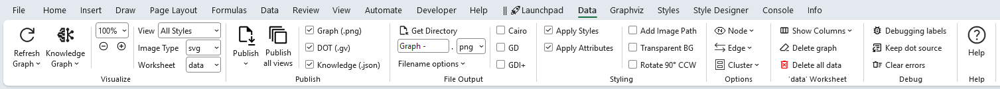 

It contains the following groups, each explained below. You may jump directly to a group using the links in this table:

| Group | Description |
| :---- | :--- |
| [Visualize](#visualize) | Action and option buttons that cause the Excel data to be graphed by Graphviz and then displayed within the Excel workbook, or sent to the Knowledge Graph viewer. |
| [Publish](#publish) | Action buttons that write the graphed data to disk, as a rendered diagram, raw DOT source, and/or a Knowledge Graph JSON export. |
| [File Output](#file-output) | Controls the output directory, filename, file format, and which Graphviz render engine is used. |
| [Styling](#styling) | Style-related switches: whether to apply styles and attributes, plus a handful of drawing options that used to live inside a dropdown menu. |
| [Options](#options) | Menus that control which nodes, edges, and clusters are included in the Graphviz source, and how their labels and tooltips are represented. |
| ['data' Worksheet](#data-worksheet) | A set of menu items that control what columns and graphs are displayed on the `data` worksheet. |
| [Debug](#debug) | An option to display additional information such as the row number and Item identifiers in the labels of nodes, edges, and clusters. |
| [Help](#help) | Provides a link to the `Help` content for the `data` worksheet (i.e. this web page). |

### Visualize

| 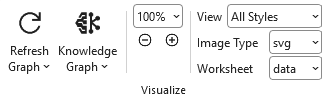 |
|----------------------------------------------------------------------|

| Label | Control Type | Description |
| ------------------------------- | --------------- | ------------------------------------------------------------------------------------------------------------------------------------------------------------------------------------------------------------------------------------------------------------------------------- |
| Refresh Graph | Split Button | The action button that causes the Excel data to be graphed by Graphviz and then displayed within the Excel workbook. Opening its dropdown (the small `v` arrow) reveals **Automatic**, a toggle that keeps the graph refreshed as cell changes are detected (also requires that `Worksheet` is set to `data`). |
| Knowledge Graph | Split Button | Builds the current view as a [Knowledge Graph](/knowledge-graphs/) JSON export and opens it in the built-in browser-based viewer. Opening its dropdown lets you choose whether the viewer refreshes a single shared browser tab each time you regenerate the graph, or opens a fresh tab every time; if you're using shared-tab mode and close the tab by accident, a "reopen" option there brings it back without regenerating anything. |
| Zoom Out / Zoom In (`-` / `+`) | Button | Decreases/magnifies the scale of the image displayed in Excel by 5%. |
| Current Zoom | Dropdown / Text | Shows the current magnification level, from 5% to 150% in 5% increments. **New in v11.0:** the list now runs high to low (150% → 5%) instead of low to high. |
| View | Dropdown list | The name of the column in the `styles` worksheet which controls which set of Yes/No values to use when creating the diagrams. See [Creating Views](/views/) for more detail. |
| Image Type | Dropdown list | Image format to use when displaying the graph on the `data` or `graph` worksheet.   **Choices:**<ul><li>`bmp` - Microsoft Windows Bitmap format</li><li>`gif` - Graphics Interchange Format</li><li>`jpg` - Joint Photographic Experts Group format</li><li>`png` - Portable Network Graphics format</li><li>`svg` - Scalable Vector Graphics</li></ul>**Note:** SVG images only display in Office 365; they do not display in older versions of Excel. |
| Worksheet | Dropdown list | The worksheet in the current workbook where the graph should be displayed.   **Choices:**<ul><li>`data` - The graph is displayed in the `data` worksheet to the right of the data columns.</li><li>`graph` - The graph is displayed in the `graph` worksheet, and the `graph` worksheet is activated. Useful for large graphs, since it allows you to use Excel's Zoom‑In/Zoom‑out feature, and to flip back and forth between the data and the graph to correct errors in the data.</li></ul> |

Apply Styles and Apply Attributes used to live in this group as toggle buttons; in v11.0 they moved to the [Styling](#styling) group below, now as checkboxes.

### Publish

A tutorial on how to use these ribbon options is contained in [Publishing Graphs](/publish/).

| 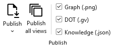 |
|-----------------------------------------------------------------------------------------------------------------|

| Label | Control Type | Description |
| ------------------ | ------------- | ---------------------------------------------------------------------------------------------------------------------------------------------------------------- |
| Publish | Split Button | The action button that causes the Excel data to be graphed by Graphviz and then written to a file. Opening its dropdown (the small `v` arrow) reveals **Open after publishing**, which automatically opens the generated file(s) once they're written. |
| Publish all views | Button | The action button that causes the Excel data to be graphed by Graphviz and then written to a file repeatedly for every view defined on the `styles` worksheet. |
| Graph (`.svg`) | Checkbox | Include the rendered diagram, in the format chosen in [File Output](#file-output), in each publish. |
| DOT (`.gv`) | Checkbox | Include the raw Graphviz `dot` source alongside the rendered diagram in each publish. |
| Knowledge (`.json`) | Checkbox | Include a [Knowledge Graph](/knowledge-graphs/) JSON export alongside the rendered diagram in each publish. |

Check any combination of Graph/DOT/Knowledge to produce exactly the output files you need — for example, a diagram to eyeball and a Knowledge Graph to hand to an AI tool, from a single `Publish` click.

### File Output

**New in v11.0:** this group gathers everything about where and how output files are written — the directory, filename, and format controls that used to live in the old Graphviz tab's Publish group, now joined by a render-engine picker.

| 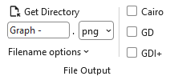 |
|-------------------------------------------------------------------------------------------------------------|

| Label | Control Type | Description |
| -------------------------- | ------------- | ------------------------------------------------------------------------------------------------------------------------------------------------------------------------------------------------------------------------------------------------------------------- |
| Get Directory | Button | Brings up the Directory Selection dialog and stores/displays the directory where files should be written. Once a directory is selected, the directory path replaces the "Get Directory" button label. |
| File Prefix | Edit box | Base portion of the file name. For example: `Graph`. You may also build a file name using the following character strings to insert run-time values into the file name.<ul><li>`%D` - Current date</li><li>`%T` - Current time</li><li>`%E` - Graphviz layout engine</li><li>`%S` - Splines</li><li>`%V` - View name</li><li>`%W` - Worksheet name</li></ul>**NOTE:** You must check the appropriate options in the `Filename options` dropdown list for the substitutions to occur. |
| File Format | Dropdown List | File format of the output file.  **Choices:**<ul><li>`bmp` - Microsoft Windows Bitmap format</li><li>`gif` - Graphics Interchange Format</li><li>`jpg` - Joint Photographic Experts Group format</li><li>`pdf` - Portable Document Format</li><li>`png` - Portable Network Graphics format</li><li>`ps` - Postscript format</li><li>`svg` - Scalable Vector Graphics format</li><li>`tiff` - Tagged Image File Format</li></ul> |
| Filename options | Dropdown List | A list of options which can be checked to cause run-time information (date/time, layout engine and splines) to be appended to, or omitted from, the file name. |
| Cairo / GD / GDI+ / Quartz | Checkbox | **New in v11.0.** Chooses which Graphviz renderer produces the output file. `GDI+` is Windows only; `Quartz` is macOS only. If you notice differences in font rendering, image handling, or output quality between machines, try switching render engines here. |

### Styling

**New in v11.0.** This group collects style-related switches in one place — `Apply Styles` and `Apply Attributes` moved here from the old Visualize group (now checkboxes instead of toggle buttons), alongside `Add Image Path`, `Transparent Background`, and `Rotate 90° CCW`, which used to live inside the old Graph options dropdown menu.

| 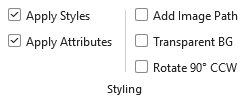 |
|----------------------------------------------------------------------|

| Label | Control Type | Description |
| ----------------------- | ------------- | ---------------------------------------------------------------------------------------------------------------------------------------------------------------------------------------------------------------------------------------------- |
| Apply Styles | Checkbox | Specifies if the style attributes associated with the Style Name assigned to a node, edge, or cluster should be applied when the graph is generated. |
| Apply Attributes | Checkbox | Specifies if the style attributes in the `Attributes` column on the `data` worksheet should be included when the graph is generated. |
| Add Image Path | Checkbox | If checked, adds the `imagepath` attribute to the graph. |
| Transparent Background | Checkbox | Toggles the background color between white and transparent. Useful if you intend to layer the graphs in an image editor or paste them into a Word document. **Note:** you can set the graph background to any valid color via the `bgcolor=` attribute on the `settings` worksheet. |
| Rotate 90° CCW | Checkbox | If checked, causes the final layout to be rotated counterclockwise by 90 degrees. |

### Options

| 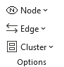 |
|-------------------------------------------------------------------------------------------------------------|

Menus that control which nodes, edges, and clusters are included in the Graphviz source, and how their labels and tooltips are represented. The Node and Edge menus moved here from the old Graphviz tab; the old Graph menu has been removed entirely (its one working option, `Force xlabel Placement`, moved here as a standalone checkbox — its `Center Drawing` option was dropped, since it didn't do anything). Taking the old Graph menu's place is an entirely new **Cluster** menu.

| Label | Control Type | Description |
| ----------------------- | ------------- | -------------------------------------------------------------------------------------------------------- |
| Node | Menu | Controls which nodes are included, and how node labels and tooltips are represented. |
| Edge | Menu | Controls how edges are represented, and how edge labels and tooltips are represented. |
| Cluster | Menu | Controls how clusters are represented, and how cluster labels and tooltips are represented. |

::: tip New in v11.0
Node and Edge each gained tooltip-inclusion controls, plus options for what to show when the tooltip cell is blank. Their blank/default label choices were also flattened — they now appear directly in the menu instead of nested in a submenu.
:::

#### Node

Choices which control which nodes are included in the Graphviz source, and how the labels should be represented.

| Label | Control Type | Description |
| ----------------------------------------------------------------------- | ------------- | ------------------------------------------------------------------------------------------------------------------------------------------------------------------------------------------------------------------------------------------------------------------------------------------------------------------------------------------------------------------------------------------------------------------------------------------------------- |
| **Filter** | | |
| Include stand-alone nodes | Checkbox | Include or exclude nodes without relationships (i.e., island nodes). When using views to exclude relationship edges there may be nodes left in the diagram that are not connected to anything. This setting specifies if these island nodes should be included or excluded from the diagram.  **Choices:**<ul><li>_Checked_ - retain the island nodes</li><li>_Unchecked_ - drop the island nodes from the diagram</li></ul> |
| **Label Columns** | | |
| Include `Label` | Checkbox | Include or exclude Labels column data? Allows you to turn labels on/off in the graph.  **Choices:**<ul><li> _Checked_ - Include Label column data </li><li>_Unchecked_ - Drop the Label column data from the graph</li></ul> |
| Include `External Label` | Checkbox | Include or exclude External Labels column data? Allows you to turn outside (xlabel) labels on/off in the graph.  **Choices:**<ul><li>_Checked_ - Include External Label column data </li><li>_Unchecked_ - Drop the External Label column data from the graph</li></ul> |
| Include `Tooltip` | Checkbox | Include or exclude Tooltip column data? Allows you to turn node tooltips on/off in the graph.  **Choices:**<ul><li>_Checked_ - Include Tooltip column data </li><li>_Unchecked_ - Drop the Tooltip column data from the graph</li></ul> |
| **Label Values** | | |
| When the `Label` column is blank... | Menu | Include or exclude blank values in the Label column?  When the `Label` column is blank on the data worksheet on a row which refers to a node it can mean two possible things. One interpretation is to remove the label from the node, as might be useful when using images to represent nodes. The other interpretation is to let the graph default to displaying the value in the `Item` column.  **Choices:**<ul><li>`...use blank for the node label` - use a blank label as the node's label text</li><li>`...use the node identifier as the label` - show the value in the `Item` column as the label text</li></ul> |
| **Tooltip** | | |
| When the `Tooltip` column is blank... | Menu | Controls what a node's tooltip should show when the `Tooltip` cell is blank. Either omit the tooltip entirely, or use a blank value. |

#### Edge

Choices which control how edges should be specified in the Graphviz source, and how the edge labels should be represented.

| Label | Control Type | Description |
| ----------------------------------------------------------------------- | ------------- | ------------------------------------------------------------------------------------------------------------------------------------------------------------------------------------------------------------------------------------------------------------------------------------------------------------------------------------------------------------------------------------------------------------------------------------------------------- |
| **Consolidate** | | |
| Apply "strict" rules | Checkbox | Specifies the strict attribute for the top-level graph. Describing the graph as strict forbids the creation of multi-edges, i.e., there can be at most one edge with a given tail node and head node in the directed case. For undirected graphs, there can be at most one edge connected to the same two nodes. Subsequent edge statements using the same two nodes will identify the edge with the previously defined one and apply any attributes given in the edge statement. |
| Concentrate edges | Checkbox | If checked, use edge concentrators. This merges multi-edges into a single edge and causes partially parallel edges to share part of their paths. Only available if the layout algorithm is **dot**. |
| Force xlabel Placement | Checkbox | If checked, all `xlabel` attributes are placed, even if there is some overlap with nodes or other labels. |
| **Filter** | | |
| Include edges which reference undefined nodes | Checkbox | Include/Exclude relationships which reference undefined nodes. When using views to exclude nodes there may be un-styled nodes included in the diagram due to edge references. This setting specifies if the edges should be included or excluded from the diagram. |
| Include Ports | Checkbox | Retain/Remove port values from the nodes in an edge relationship. |
| **Label Columns** | | |
| Include `Label` | Checkbox | Include or exclude Labels column data? Allows you to turn edge labels on/off in the graph. |
| Include `External Label` | Checkbox | Include or exclude External Labels column data? Allows you to turn outside (xlabel) edge labels on/off in the graph. |
| Include `Head Label` | Checkbox | Include or exclude Head Labels column data? Allows you to turn edge head labels on/off in the graph. |
| Include `Tail Label` | Checkbox | Include or exclude Tail Labels column data? Allows you to turn edge tail labels on/off in the graph. |
| Include `Tooltip` | Checkbox | Include or exclude Tooltip column data? Allows you to turn node tooltips on/off in the graph. |
| **Label Values** | | |
| When the `Label` column is blank... | Menu | Include or exclude blank values in the Label column? When blank, either leave the edge label blank, or let the graph default to displaying the value Graphviz assigns to the edge relationship. |
| **Tooltip** | | |
| When the `Tooltip` column is blank... | Menu | **New in v11.0.** Controls what an edge's tooltip should show when the `Tooltip` cell is blank — omit the tooltip entirely, or fall back to another value. |

#### Cluster

**New in v11.0.** Offers the same label- and tooltip-inclusion controls available for Node and Edge above, applied to clusters instead.

### 'data' Worksheet

| Label | Control Type | Description |
| ---------------- | ------------- | -------------------------------------------------------------------------------------------------------------------------------------------------------------------------------------------------------------------------------------------------------------------------------------------------- |
| Show Columns | Menu | Displays a list of all the columns used by the `data` worksheet, letting you show or hide columns by clicking their names. **New in v11.0:** the list is now organized into labeled sections (Comment, Item, Label, Style, Knowledge), with a new **Show Properties** toggle; the old **Show Messages** toggle was removed along with the `Messages` column it controlled. See [Entering Data in the Data Worksheet](/dataworksheet/) for the current column layout. |
| Delete graph | Button | Deletes the graph from the worksheet. Useful when adding rows, since new rows stretch the image; you may also want to delete the image before saving the file to reduce its size. |
| Delete all data | Button | Resets the `data` worksheet to blank cells, and deletes any graphs if present. **New in v11.0:** this button's icon is now red, to better signal that it's destructive. |

### Debug

| 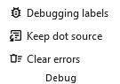 |
| ------- |

| Label | Control Type | Description |
| ---------------- | ------------- | ------------------------------------------------------------------------------------------------------------------------------------------------------------------------------------------------------------------------------------------------------------------------------------------------------- |
| Debugging labels | Checkbox | Turning this option `on` causes additional information such as the row number and Item identifiers to be included in the labels of nodes, edges, and clusters. |
| Keep dot source | Checkbox | Specifies what should be done with the text file sent to Graphviz after the graphing step is complete when `Graph to File` is used to create the graph.  **Choices:**<ul><li>_Checked_ - retain the file. It will be in the same directory as the graph file with the same file name except for the file extension (which will be `.gv`).</li><li>_Unchecked_ - delete the file</li></ul> |
| Clear errors | Button | Resets the row-level `!` error indicators on the `data` worksheet. In versions prior to 11.0 this also cleared a dedicated `Messages` worksheet column; that column has been removed in v11.0 — see [Entering Data in the Data Worksheet](/dataworksheet/) and the [changelog](/changelog/) for details. |

### Help

| 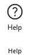 |
| ------- |

Provides the `Help` content for the `data` worksheet.

| Label | Control Type | Description |
| ----- | ------------- | --------------------------------- |
| Help | Button | Provides a link to this web page. |

## The `Graphviz` Ribbon Tab

The `Graphviz` ribbon tab is now scoped to genuine Graphviz-only options: layout engine, splines, direction, and output order. If you're focused purely on Knowledge Graphs and don't need it, a new toggle on the [Launchpad](/launchpad/) tab lets you hide it entirely.

It contains the following groups, which are each explained in the content that follows:

| Group | Description |
| :---- | :--- |
| [Graph Layout](#graph-layout) | A set of toggle buttons that control which Graphviz layout engine is applied to your diagram. |
| [Splines](#splines) | A set of toggle buttons that control how edges are routed in your diagram. |
| [Type](#graph-type) | A set of toggle buttons that determine whether your diagram is treated as a directed or undirected graph. |
| [Output Order](#output-order) | A set of toggle buttons that determine the sequence in which Graphviz draws nodes and edges during rendering. |
| [Layout Options](#layout-options) | Options specific to whichever layout algorithm is currently selected. |
| [Help](#help-1) | Provides a link to the `Help` content for the `Graphviz` ribbon tab. |

### Graph Layout

The **Graph Layout** section provides a set of toggle buttons that control which Graphviz layout engine is applied to your diagram. These toggles function like radio buttons, ensuring that only one layout is active at a time. This approach gives you a quick, intuitive way to explore how different layout algorithms organize your graph.

| 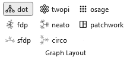 |
| ------------------------------------------ |

### Splines

The **Splines** section provides a set of toggle buttons that control how edges are routed in your diagram. These toggles function like radio buttons, ensuring that only one spline style is active at a time.

| 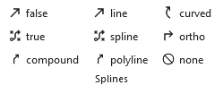 |
| ------------------------------------------ |

| Button | Description |
|-----------|-------------|
| **false** | Edges are drawn as straight lines. |
| **true** | Edges are drawn using a combination of straight segments and free‑flowing curves. |
| **curved** | Edges are drawn as smooth, continuous curves between nodes. |
| **ortho** | Edges are routed using horizontal and vertical segments with 90‑degree bends. |
| **polyline** | Edges are drawn as straight segments with angular bends (not restricted to right angles). |
| **none** | Edges (and edge labels) are not drawn, but still influence node placement. |

::: tip New in v11.0
The `Compound`, `Line`, and `Spline` edge-routing controls are back as live, selectable buttons in this group, after being disabled for some time due to ribbon space constraints. This group also no longer forces a default selection when the underlying `splines` setting is blank — an unset value now shows no button pressed, rather than defaulting to a choice you never made.
:::

### Graph Type

The **Graph Type** section provides a set of toggle buttons that determine whether your diagram is treated as a directed or undirected graph. These toggles function like radio buttons, ensuring that only one graph type is active at a time.

| 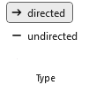 |
| ------------------------------------------ |

| Button | Description |
|----------------|-------------|
| **undirected** | Creates an [Undirected Graph](/terminology/#undirected-graph). Edges have no direction and are drawn without arrowheads. |
| **directed** | Creates a [Directed Graph](/terminology/#directed-graph) (digraph). Edges have a defined direction and are drawn with arrowheads. |

### Output Order

The **Output Order** controls determine the sequence in which Graphviz draws nodes and edges during rendering. These options are presented as toggle buttons that behave like radio buttons, ensuring that only one drawing order is active at a time.

| 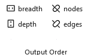 |
| ------------------------------------------ |

Output Order Values

| Button | Description |
|----------------|-------------|
| **breadth** | Draws nodes before edges. Edges appear on top and below nodes. |
| **depth** | Draws nodes in a squence often depicting hierarchal depth, producing a more layered or stacked visual. |
| **nodes** | Nodes are drawn first; edges are drawn afterward. Edges appear on top of nodes. |
| **edges** | Edges are drawn first; nodes are drawn afterward, causing nodes to appear on top of edges. |

::: tip New in v11.0
A new **Depth** option joins the existing **Breadth** option, with updated icons for both. This group also no longer forces a default selection when the underlying setting is blank.
:::

### Layout Options

The Algorithm group within the Graphviz tab changes dynamically based upon the layout algorithm chosen. The graph options shown are specific to that particular layout algorithm.

---

#### layout=circo

There are no additional dynamic options for `layout=circo`.

---

#### layout=dot

| 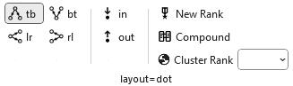 |
| ---------------------------------------- |

The buttons `[tb]`, `[bt]`, `[lr]`, `[rl]` determine the **Rank Direction** flow of the graph—whether nodes are arranged top‑to‑bottom, bottom‑to‑top, left‑to‑right, or right‑to‑left. These options are presented as toggle buttons that behave like radio buttons, ensuring that only one direction is active at a time.

| Button | Description |
| :----: |-------------|
| **tb** | Top‑to‑Bottom. Ranks flow downward (the default for most layouts).  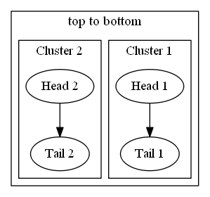|
| | |
| **bt** | Bottom‑to‑Top. Ranks flow upward.  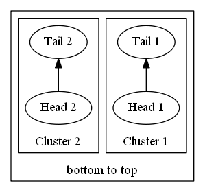 |
| | |
| **lr** | Left‑to‑Right. Ranks flow horizontally from left to right.  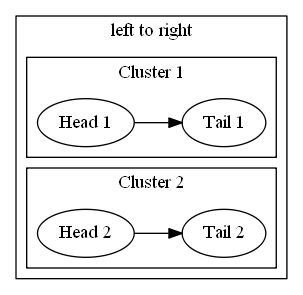 |
| | |
| **rl** | Right‑to‑Left. Ranks flow horizontally from right to left. 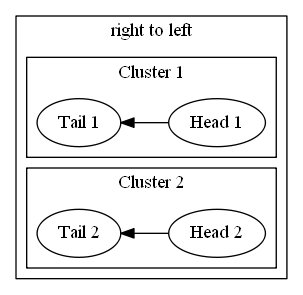 |

The `[in]`, `[out]` Ordering buttons determine how edges are arranged around each node during layout.

| Button | Description |
|--------|-------------|
| **in** | Preserves the order of incoming edges around each node. |
| **out** | Preserves the order of outgoing edges around each node. |

The **New Rank** button determines how Graphviz handles ranking when clusters are present in the graph. This option is presented as a toggle that behaves like a radio‑style switch, ensuring the feature is either fully enabled or disabled. Turning it on allows Graphviz to compute a single global ranking across all clusters, while turning it off preserves the traditional recursive ranking inside each cluster.

The **Compound** button determines whether edges are allowed to connect into and out of clusters when using layout engines that support this feature.

| Value | Description |
|-----------|-------------|
| **false** | Disables compound edges. Edges cannot connect into or out of clusters using `lhead` or `ltail`. |
| **true** | Enables compound edges, allowing edges to enter or leave clusters and attach to cluster boundaries. |

The **Cluster Rank** control determines how Graphviz ranks clusters relative to one another during layout.

| Value | Description |
|-------------|-------------|
| **local** | Each cluster is ranked independently. This preserves the traditional recursive ranking behavior and often produces compact cluster layouts. |
| **global** | All clusters participate in a single, unified ranking. This can create more consistent alignment across clusters but may increase spacing. |

---

#### layout=fdp

| 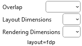 |
| ---------------------------------------- |

The **Overlap** control is presented as a dropdown list that lets you choose how Graphviz handles node collisions during layout.

| Value | Description |
|------------|-------------|
| **compress** | Reduces whitespace by compressing the layout after overlap removal, producing a tighter diagram. |
| **prism** | Uses a stress‑based algorithm to separate overlapping nodes while preserving layout structure. |
| **scale** | Uniformly scales the entire layout until nodes no longer overlap. |
| **scalexy** | Scales the layout independently in the X and Y directions to eliminate overlaps. |
| **Voronoi** | Uses a Voronoi‑based algorithm to push nodes apart by expanding their regions until overlaps are resolved. |

The **Layout Dimensions** control (`dim=` attribute) sets the number of dimensions Graphviz uses when computing node positions for certain layout engines (primarily neato, fdp, and sfdp).

The **Rendering Dimensions** control (`dimen=` attribute) specifies how many dimensions are used when interpreting node size attributes such as width, height, and size.

---

#### layout=neato

| 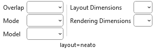 |
| ------------------------------------------ |

The **Overlap** control is the same as described under `layout=fdp` above.

The **Mode** control selects the algorithm that Neato uses to compute node positions during layout.

| Value | Description |
| ------------ | ------------- |
| **major** | Uses stress majorization to iteratively refine node positions; stable and widely used. |
| **KK** | Uses the Kamada–Kawai spring model, optimizing ideal edge lengths through gradient descent. |
| **hier** | Produces a top‑down, hierarchy‑influenced layout similar to dot but using Neato's solver. |
| **ipsep** | Applies iterative penalty separation to enforce minimum distances between nodes. |
| **spring** | Uses a classical spring‑embedder approach for force‑directed placement. |
| **maxent** | Uses a maximum‑entropy–inspired solver to spread nodes evenly while respecting constraints. |

The **Model** control selects how Neato interprets edge relationships when computing ideal node distances.

The **Layout Dimensions** and **Rendering Dimensions** controls are the same as described under `layout=fdp` above.

---

#### layout=osage

There are no additional dynamic options for `layout=osage`.

---

#### layout=patchwork

There are no additional dynamic options for `layout=patchwork`.

---

#### layout=sfdp

| 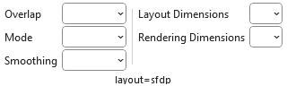 |
| ----------------------------------------- |

The **Overlap** and **Mode** controls are the same as described under `layout=fdp` and `layout=neato` above.

The **Smoothing** control is presented as a dropdown list that lets you choose how Graphviz refines the raw node positions produced by the layout engine.

| Value | Description |
|--------------|-------------|
| **none** | No smoothing applied. Uses the raw layout positions exactly as computed. |
| **avg_dist** | Adjusts node positions based on average distances to neighbors, reducing local irregularities. |
| **graph_dist** | Smooths positions using graph‑theoretic distances, improving global consistency. |
| **power_dist** | Applies a power‑law weighting to distances, emphasizing stronger relationships. |
| **rng** | Uses a Relative Neighborhood Graph–based smoothing to reduce noise while preserving structure. |
| **spring** | Applies a light spring‑embedder pass to gently relax node positions. |
| **triangle** | Uses triangle‑based geometric smoothing to even out spacing in dense regions. |

The **Layout Dimensions** and **Rendering Dimensions** controls are the same as described under `layout=fdp` above.

---

#### Layout = `twopi`

There are no additional dynamic options for `layout=twopi`.

### Help

Provides the `Help` content for the `Graphviz` ribbon tab.

| Label | Control Type | Description |
| ----- | ------------- | --------------------------------- |
| Help | Button | Provides a link to this web page. |
