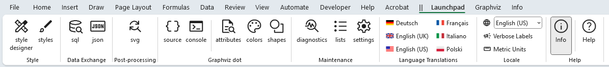
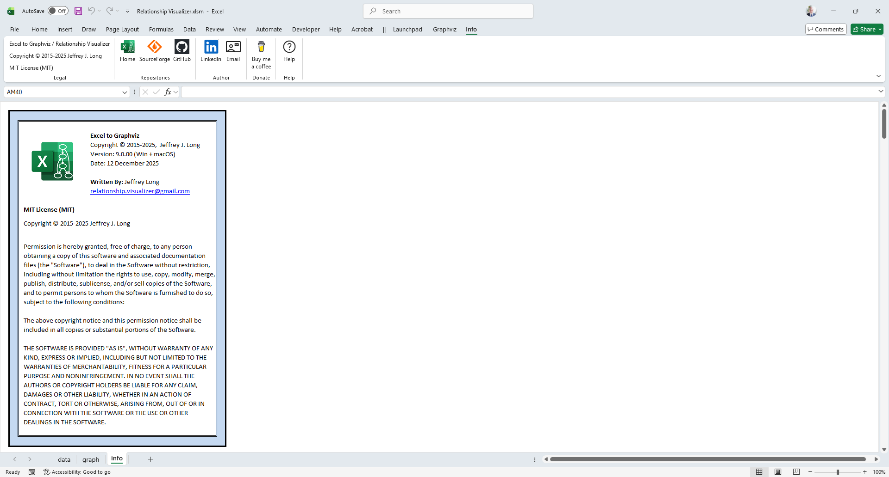
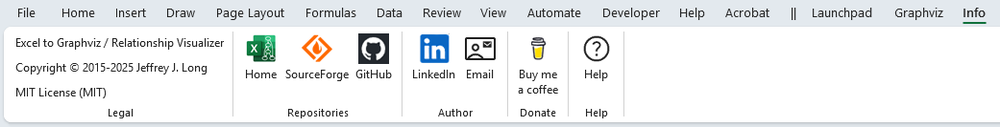
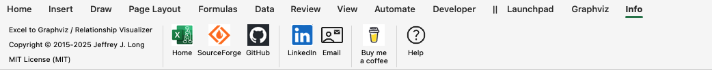
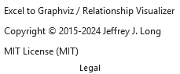
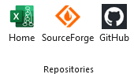
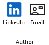
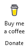
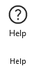

# Info Worksheet

## The `info` Worksheet

The `info` worksheet is reached from the `Help` section of the [Launchpad](../launchpad/) ribbon tab.

|  |
| ------------------------------------------- |

The `info` worksheet provides information about the spreadsheet, the internal technology incorporated into the tool, and the associated Open Source licenses and [acknowledgements](../acknowledge/) required to reuse the Open Source components in a license-compliant manner.

|  |
| ------------------------- |

## The `Info` Ribbon Tab

The `Info` ribbon tab is activated whenever the `Info` worksheet is activated. It appears as follows:

*Windows*
|  |
| -------------------------- |

*macOS*
|  |
| -------------------------- |

It contains the following groups, each of which is explained in the sections that follow. You may jump directly to any group using the links in this table:
| Group | Controls  | Description |
| :---- | :--- | :--- |
| [Legal](#legal) |   | The `Legal` section provides a quick overall summary of the tool's name, copyright, and Open Source license. |
| | |
| [Repositories](#repositories) |  | The `Repositories` section provides web links to the **official** web pages and repositories for the Relationship Visualizer tool. |
| | |
| [Author](#author) |  | Contact information for reaching the author of this tool.
| | |
| [Donate](#donate) |  | If you would like to show your appreciation for this **free** tool, you can buy the author a coffee through the [Buy Me A Coffee](https://buymeacoffee.com/exceltographviz) website. |
| | |
| [Help](#help) |  | Provides a link to the `Help` content for the `Info` worksheet (i.e. this web page). |

### Legal

|  |
| -------------------------------------------------- |

The `Legal` section provides a quick overall summary of the tool's name, copyright, and Open Source license.

### Repositories

|  |
| -------------------------------------------------- |

The `Repositories` section provides web links to the **official** web pages and repositories for the Relationship Visualizer tool.

::: warning Download Only from Official Sources

At this time, there are **no** author‑sanctioned clones of these repositories. However, unofficial copies have been found on the internet. If you obtained your copy of the Relationship Visualizer from anywhere other than the sites linked by these buttons, you may be using an out‑of‑date or potentially security‑compromised version.

:::

| Label       | Control Type  | Description                                                                                                                                                                                                                        |
| ----------- | ------------- | ---------------------------------------------------------------------------------------------------------------------------------------------------------------------------------------------------------------------------------- |
| Home | Button        | Provides a link to the [Excel To Graphviz](https://exceltographviz.com) documentation web site (i.e. this web site).|
| SourceForge      | Button        | Provides a link to the [SourceForge](https://sourceforge.net/projects/relationship-visualizer/) repository where the Relationship Visualizer download files are managed. |
| GitHub       | Button        | Provides a link to the [GitHub](https://github.com/jjlong150/ExcelToGraphviz) repository where the source pages for this website are maintained.   The VBA source code from the Relationship Visualizer workbook is also exported and stored there. Although the workbook cannot be rebuilt from this source code, publishing it in a readable, text‑based format ensures full transparency and allows for inspection. |

### Author

|  |
| -------------------------------------------------- |

If you would like to learn more about the author of this tool and website you may visit his LinkedIn profile. You can also reach him by email.

| Label       | Control Type  | Description                                                                                                                                                                                                                        |
| ----------- | ------------- | ---------------------------------------------------------------------------------------------------------------------------------------------------------------------------------------------------------------------------------- |
| LinkedIn | Button        | Provides a link to the author's LinkedIn profile. |
| Email      | Button        | Launches your email client and creates a draft email which you can send to the author. |

### Donate

|  |
| -------------------------------------------------- |

Excel to Graphviz / Relationship Visualizer is **free** software. However, it does cost the author personal money and time to provide this software for free.

If you would like to show your appreciation for this **free** tool, you can buy the author a coffee through the [Buy Me A Coffee](https://buymeacoffee.com/exceltographviz) website.

FYI - 10 years, 10,000+ downloads, and a grand total of 2 coffees donated 😔

| Label       | Control Type  | Description                                                                                                                                                                                                                        |
| ----------- | ------------- | ---------------------------------------------------------------------------------------------------------------------------------------------------------------------------------------------------------------------------------- |
| Donate | Button        | Provides a link to the [Buy Me A Coffee](https://buymeacoffee.com/exceltographviz) website where you can show your appreciation to the author for this free software and awesome web site. |

### Help

|  |
| -------------------------------------------------- |

Provides a link to the `Help` content for the `Info` worksheet (i.e. this web page).

| Label       | Control Type  | Description                                                                                                                                                                                                                        |
| ----------- | ------------- | ---------------------------------------------------------------------------------------------------------------------------------------------------------------------------------------------------------------------------------- |
| Help | Button        | Provides a link to this web page. |

---

Like this tool? [Buy me a coffee! ☕](https://www.buymeacoffee.com/exceltographviz)

