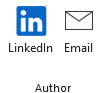
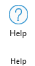

# Info Worksheet

## The `info` Worksheet

The `info` worksheet is reached from the `Help` section of the [Launchpad](../launchpad/) ribbon tab.

|  |
| ------------------------------------------- |

The `info` worksheet provides information about the spreadsheet, the internal technology incorporated into the tool, and the associated Open Source licenses and [acknowledgements](../acknowledge/) required to reuse the Open Source components in a license-compliant manner.

|  |
| ------------------------- |

## The `Info` Ribbon Tab

The `Info` ribbon tab is activated whenever the `Info` worksheet is activated. It appears as follows:

|  |
| -------------------------- |

It contains the following major groups:

- [Legal](./README.md#legal)
- [Repositories](./README.md#repositories)
- [Author](./README.md#author)
- [Donate](./README.md#donate)
- [Help](./README.md#lhelp)

### Legal

|  |
| -------------------------------------------------- |

The `Legal` section provides a quick overall summary of the tool's name, copyright, and Open Source license.

### Repositories

|  |
| -------------------------------------------------- |

The `Repositories` section provides web links to the **official** web pages and repositories for the **Relationship Visualizer** tool.

::: warning

At this time, there are no author-sanctioned clones of these repositories. However, cloned copies have been found on the internet. If you obtained your copy of the Relationship Visualizer from somewhere other than the sites these buttons link to, you may be running an out-of-date or potentially security-compromised version.

:::

| Label       | Control Type  | Description                                                                                                                                                                                                                        |
| ----------- | ------------- | ---------------------------------------------------------------------------------------------------------------------------------------------------------------------------------------------------------------------------------- |
| Home | Button        | Provides a link to the [Excel To Graphviz](https://exceltographviz.com) documentation web site (i.e. this web site).|
| SourceForge      | Button        | Provides a link to the [SourceForge](https://sourceforge.net/projects/relationship-visualizer/) repository where the **Relationship Visualizer** download files are managed. |
| GitHub       | Button        | Provides a link to the [GitHub](https://github.com/jjlong150/ExcelToGraphviz) repository where the source pages for this web site are managed. |

### Author

|  |
| -------------------------------------------------- |

If you would like to learn more about the author of this tool and website you may visit his LinkedIn profile. You can also reach him by email.

| Label       | Control Type  | Description                                                                                                                                                                                                                        |
| ----------- | ------------- | ---------------------------------------------------------------------------------------------------------------------------------------------------------------------------------------------------------------------------------- |
| LinkedIn | Button        | Provides a link to the author's LinkedIn profile. |
| Email      | Button        | Launches your email client and creates a draft email which you can send to the author. |

### Donate

|  |
| -------------------------------------------------- |

Excel to Graphviz / Relationship Visualizer is **free** software. However, it does cost the author personal money and time to provide this software for free.

If you would like to show your appreciation for this **free** tool, you can buy the author a coffee through the [Buy Me A Coffee](https://buymeacoffee.com/exceltographviz) website.

| Label       | Control Type  | Description                                                                                                                                                                                                                        |
| ----------- | ------------- | ---------------------------------------------------------------------------------------------------------------------------------------------------------------------------------------------------------------------------------- |
| Donate | Button        | Provides a link to the [Buy Me A Coffee](https://buymeacoffee.com/exceltographviz) website where you can show your appreciation to the author for this free software and awesome web site. |

### Help

|  |
| -------------------------------------------------- |

Provides a link to the `Help` content for the `Info` worksheet (i.e. this web page).

| Label       | Control Type  | Description                                                                                                                                                                                                                        |
| ----------- | ------------- | ---------------------------------------------------------------------------------------------------------------------------------------------------------------------------------------------------------------------------------- |
| Help | Button        | Provides a link to this web page. |