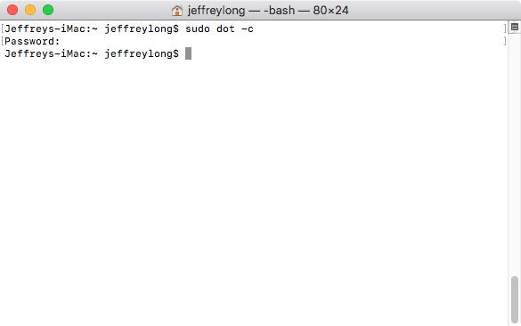
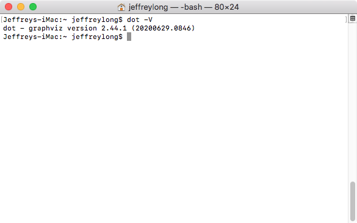
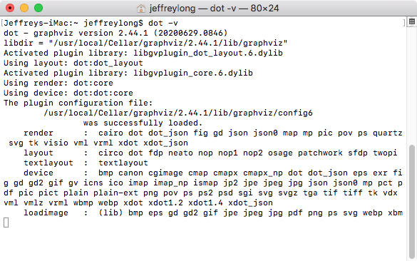
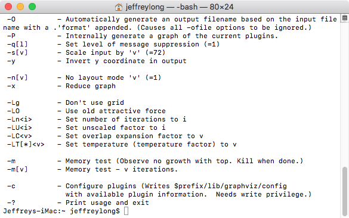
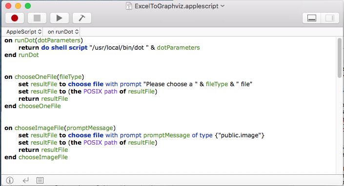
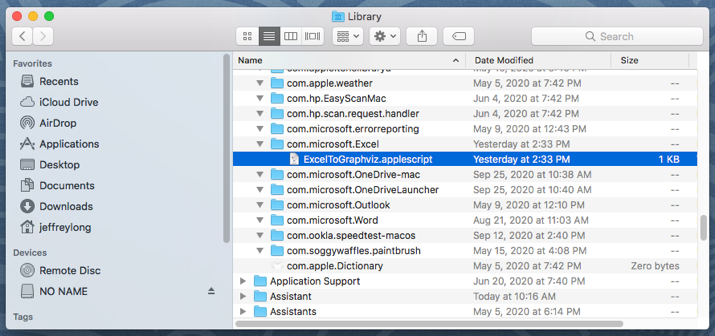
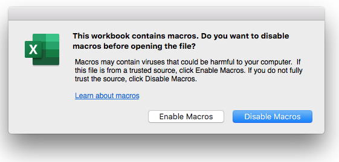
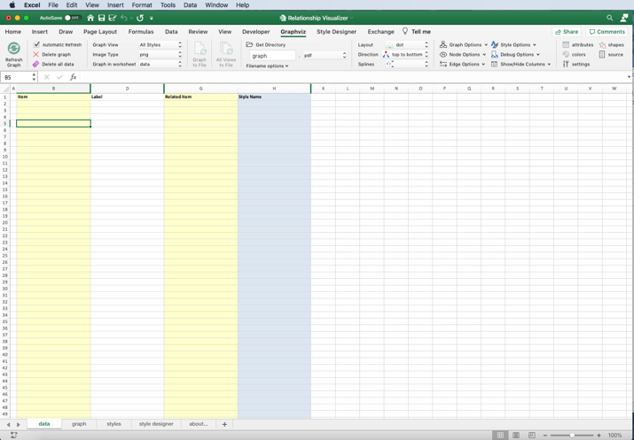
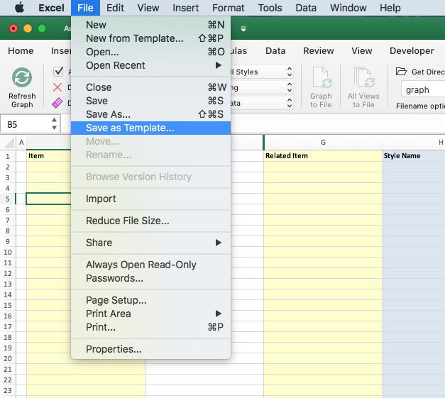
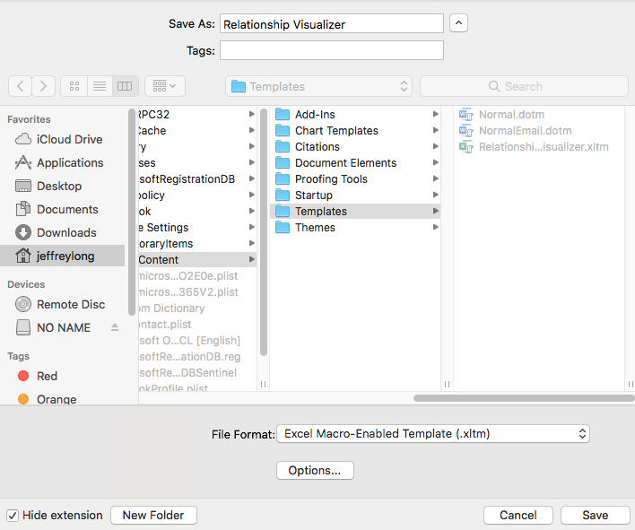

# macOS Installation Instructions

## Brief Instructions

Perform these steps to install **Excel to Graphviz** on **macOS**

1.  Use [Homebrew](https://formulae.brew.sh/formula/graphviz) to download and install **Graphviz** using the Install command:

    `brew install Graphviz`

2.  Open a terminal window.
3.  Run the command:

    `sudo dot -c`

    to register the Graphviz plugins.

4.  Confirm Graphviz is working. Run the command `dot -V` to emit the version of Graphviz

5.  Download file `RelationshipVisualizer.zip` from [SourceForge](https://sourceforge.net/projects/relationship-visualizer/)
   
6.  Unzip file `RelationshipVisualizer.zip`

7.  Determine where the `dot` command is installed. Issue the command:
   
    `which dot`

8.  If `dot` is installed in `/usr/local/bin/dot`, then proceed with the next step, otherwise, edit the file

    `ExcelToGraphviz.applescript`

    and update the path

    `/usr/local/bin/dot`

    at the top of the script to the match the path emitted by the `which dot` command. 

9.  Copy the file

    `ExcelToGraphviz.applescript`

    to folder

    `\~/Library/Application Scripts/com.microsoft.Excel`

10. Start **Excel**, and open the file

    `Relationship Visualizer.xlsm`

11. Enable macros, and grant permissions when prompted
12. Save the file as a template for creating future spreadsheets.

## Detailed Instructions

### Install Graphviz

The [Graphviz Download Page](https://graphviz.org/download/) offers 2 options for installing Graphviz, either by MacPorts or Homebrew. 

I used homebrew to install Graphviz by following the instructions at this site <https://formulae.brew.sh/formula/graphviz> . 

A video capture of a homebrew Graphviz installation can be viewed at <https://www.youtube.com/watch?v=zRiUC82AnCk>

### Configure Graphviz plugins.

*This is an important step which must not be skipped.* No messages are written when the command executes; the screen will look as follows:

You must have installer write privileges to configure the Graphviz plugins.

1.  Open a `Terminal` window
2.  Enter the command `sudo dot -c`
3.  Enter the administrator password when prompted

|  |
| ------- |

### Confirm Graphviz version

While you still have the terminal window open, issue the command `dot -V` (uppercase V). If Graphviz is properly installed, it will emit a version number such as 2.44.1.

|  |
| ------- |

To see the list of configured plugins type the command

`dot -v`

where the -v is lowercase. The screen will appear as follows:

|  |
| ------- |

At this point Graphviz is waiting for more input. Hitting the Command key + .(dot/period) key will break you from the dot program.

To see the list of command line options you can enter the command

`dot -?`

The screen will appear as follows:

|  |
| ------- |

*Congratulations! Graphviz is installed properly.*

### Download file `RelationshipVisualizer.zip` from SourceForge.net

**Excel to Graphviz** is exclusively hosted on SourceForge.net. If you obtained a copy from any source other than direct download from SourceForge.net, then I suggest that you download the latest version from at <https://sourceforge.net/projects/relationship-visualizer/>

### Unzip file `RelationshipVisualizer.zip` 

The contents of “RelationshipVisualizer.zip” may be stored in any location. The zip file contains the macro-enabled spreadsheet “Relationship Visualizer.xlsm”, the corresponding Apple Script file ExcelToGraphviz.applescript, user documentation, samples, and license files.

The file ExcelToGraphviz.applescript must be installed in a specific location per Microsoft’s sandbox rules. This location is explained in future steps.

### Edit file `ExcelToGraphviz.applescript`

Update the path to the Graphviz `dot` command in the file `ExcelToGraphviz.applescript` (if necessary).

Homebrew installs the dot command in the folder `/usr/local/bin`. You can enter the command

`which dot`

in the terminal window to see where dot is installed.

If you get a response other than `/usr/local/bin/dot`, then you must edit the file `ExcelToGraphviz.applescript` and change the path in the command on line 2 from `/usr/local/bin/dot` to the path where dot is installed on your Mac.

|  |
| ------- |

### Copy Applescript script to sandbox folder

Copy file `ExcelToGraphviz.applescript` to folder `~/Library/Application Scripts/com.microsoft.Excel`

Now the script file is ready and tested we must copy it into the correct location. Follow the steps below to copy and paste it into this exact location.

1.  Open a Finder Window
2.  Hold the `Alt` key and click `Go` in the Finder menu bar
3.  Click `Library`
4.  Click `Application Scripts` (if it exists; if not create this folder)
5.  Click `com.microsoft.Excel` if it exists; if not create this folder (note: Capital letter `E`)
6.  Copy the file `ExcelToGraphviz.applescript` to the folder `com.microsoft.Excel`

|  |
| ------- |

::: tip Microsoft Excel Sandboxing Explained

Unlike prior versions of Office apps that support VBA, Office 2016 for Mac apps are sandboxed. Sandboxing restricts the apps from accessing resources outside the app container. This affects any add-ins or macros that involve file access or communication across processes.

Earlier versions of Office for Mac included a command called `MacScript` that supported inline AppleScripts. Although that command still exists in Office 2016 for Mac, `MacScript` is deprecated and its powers have been reduced. The `MacScript` command cannot invoke other applications, such as Finder, in Office 2016 for Mac due to the new sandbox rules.

Microsoft added a new VBA command `AppleScriptTask` that accesses and runs an `AppleScript` file located outside the sandboxed app. This new approach is not as convenient: 
1. With the `MacScript` function the commands needed to run Graphviz’s dot command could reside in the Excel file itself, while with the `AppleScriptTask` method it has become necessary to distribute an `AppleScript` script file. 
2. Furthermore, this `AppleScript` file must be placed in a folder location specified by Microsoft’s sandbox rules on the user’s system to have permission to run. This sandbox requirement requires a user interaction the first time to place the script in the required folder location `~/Library/Application Scripts/com.microsoft.Excel`

:::

### Open the file `Relationship Visualizer.xlsm`

Open the file `Relationship Visualizer.xlsm` in Excel by double clicking on the file `Relationship Visualizer.xlsm` provided in the zip file

### Enable Macros

Excel to Graphviz performs its work using VBA macros. When you launch the file, you will receive warnings of the macros and must give permission for the macros to run.

|  |
| ------- |

### Save `Relationship Visualizer.xlsm` as a template.

Once you enable the macros, the full spreadsheet appears as:

|  |
| ------- |

Perform a "File -\> Save As" operation. Save the workbook as a template so you can use the template to create more workbooks instead of starting from scratch. A template allows you to avoid having to make a copy of a file and clearing out old content.

From the `File` menu, select `Save as Template…`

|  |
| ------- |

When the file save dialog appears, provide a “Save As” name (e.g., Relationship Visualizer) and specify the file format as “Excel Macro-Enabled Template (.xltm)”.

|  |
| ------- |

Note that Excel automatically specifies the Microsoft Office Templates directory.
