# Microsoft Windows Installation Instructions

## Install Graphviz

### Step 1 - Download Graphviz Media

Download the installation media from the Windows section of the Graphviz download page at <http://graphviz.org/download/> which appears as:

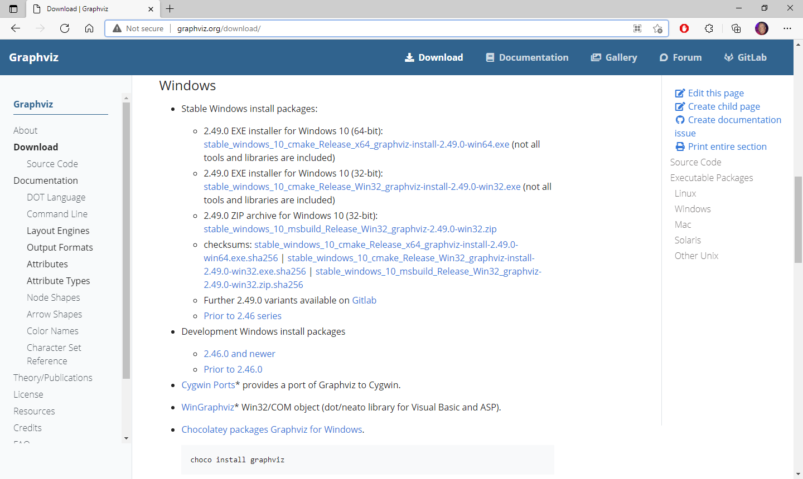

You will be presented with a choice of links. Win32 for the 32-bit installer, and x64 for the 64-bit installer. Choose the link which corresponds with the Windows architecture of your machine.

Download the installer file. At the time of this writing (29-Aug-2021) the files are named:

- **2.49.0 EXE installer for Windows 10 (64-bit):** [stable_windows_10_cmake_Release_x64_graphviz-install-2.49.0-win64.exe](https://gitlab.com/api/v4/projects/4207231/packages/generic/graphviz-releases/2.49.0/stable_windows_10_cmake_Release_x64_graphviz-install-2.49.0-win64.exe)
- **2.49.0 EXE installer for Windows 10 (32-bit):** [stable_windows_10_cmake_Release_Win32_graphviz-install-2.49.0-win32.exe](https://gitlab.com/api/v4/projects/4207231/packages/generic/graphviz-releases/2.49.0/stable_windows_10_cmake_Release_Win32_graphviz-install-2.49.0-win32.exe)

and the links above will download the version 2.49.0 installers.

**If you are using the Microsoft Edge browser the download may get blocked.**

If blocked, you will see a warning icon in the download symbol. Clicking on the button provides the reason the download was blocked.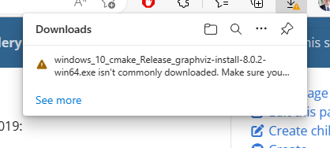

Hover your mouse over the message, and a button with three dots will appear, along with a tooltip which says, “More actions”.

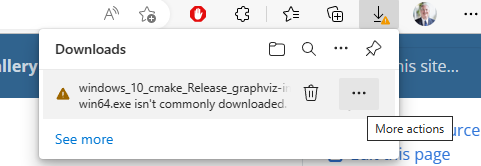

Click on the […] button, and a popup menu appears. Select “Keep” from the dropdown list.

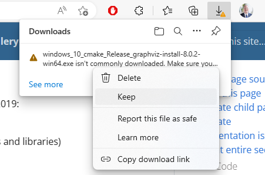

Microsoft Edge will again try to dissuade you from downloading the file with a warning “**This app might harm your device**”. It will appear that your only choices are `Delete` or `Cancel`. To keep the file you must click the `Show more v` dropdown.

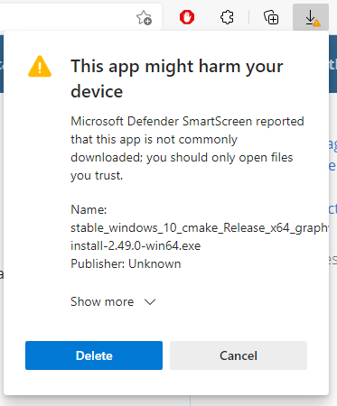

Three additional choices will now appear:

- `Keep anyway`
- `Report this app as safe`
- `Learn more`

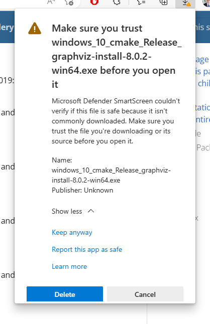

Click on `Keep anyway`

Now the installer file shows up as a download. Click on `Open file` to run the installer.

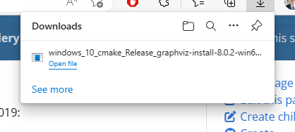

### Step 2 - Launch the installer file.

Once again you will receive a security warning since this file was downloaded over the internet. It will appear that your only choice is `Don’t run`. To run the installer, click on the `More info` link.

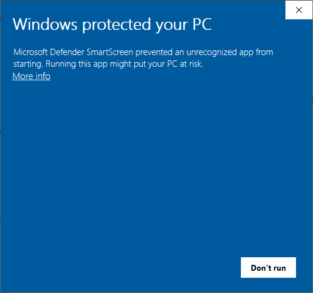

Information showing the name of the installer file is shown, and a `Run anyway` button appears. Click this button

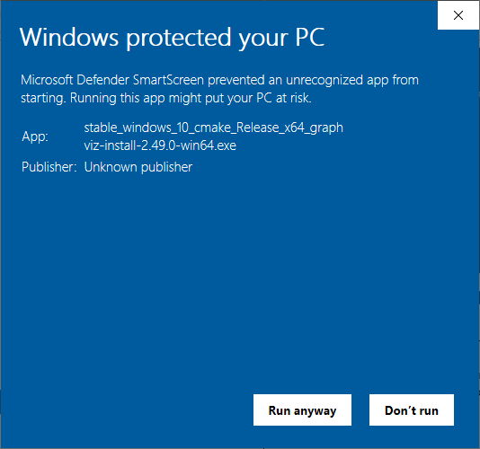

A User Access Control warning will now take over the screen and ask

| User Access Control   Do you want to allow this app from an unknown publisher to make changes to your device?  Stable_windows_10_cmake_Release_x64_graphviz-install-2.49.0-win64.exe  Publisher unknown  File origin: Hard drive on this computer  [Yes] [No] |
| ------------------------------------------------------------------------------------------------------------------------------------------------------------------------------------------------------------------------------------------------------------------------------------------- |

Press the `Yes` button, and the Graphviz installer will begin to run.

### Step 3 - Select `Next >`

Select `Next >` on the **"Welcome to Graphviz Setup"** splash page.

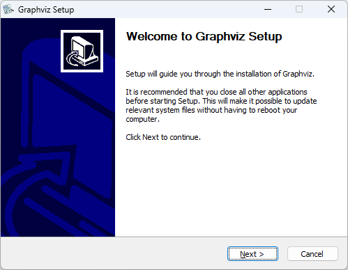

### Step 4 - Accept the License Agreement

Accept the License Agreement by pressing the `I Agree` button.

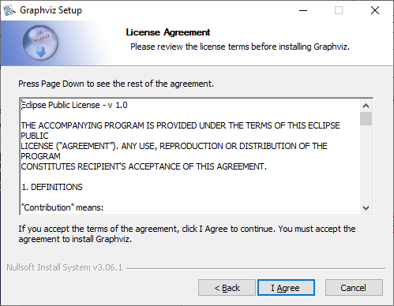

### Step 5 - Modify PATH

The Graphviz `bin` directory needs to be on your path. You can allow the installer to perform this action (easy way), or you can perform it manually (hard way). We will perform this task manually after the install to ensure you know how to do it should the installer encounter any problems.

Select the radio button `Do not add Graphviz to the system PATH`, then click the `Next >` button.

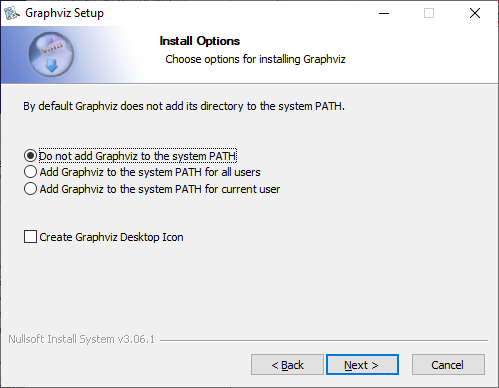

### Step 6 - Specify Installation Folder

Specify the folder where Graphviz should be installed. Select the "Everyone" radio button, and then select the `Next >` button.

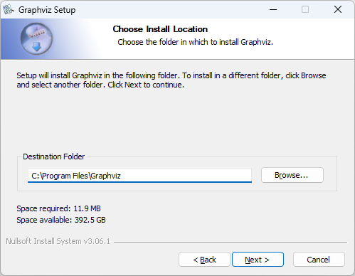

### Step 7 - Press the `Install` button

Choose the Start Menu Folder and press the `Install` button.

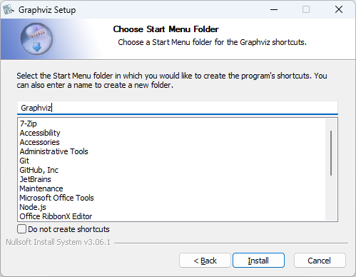

### Step 8 - Monitor Progress

The installer will copy the files and make Windows configuration changes. A status bar will indicate how the installation is progressing.

### Step 9 - Click `Finish`

Once the **Completing Graphviz Setup** screen appears press the "Finish" button. The software is installed.

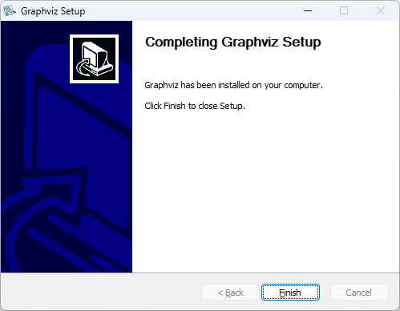

### Step 10 - Confirm Installation

Confirm Graphviz is installed. If you select the Microsoft Windows start button you should see `Graphviz` as a program folder.

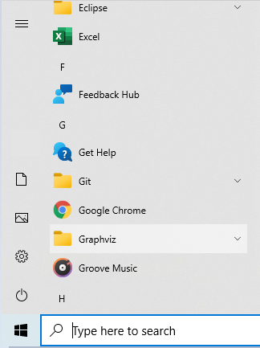

## Edit the System PATH Environment Variable

The Relationship Visualizer utilizes the command line programs provided by Graphviz. The Graphviz installer can modify your PATH environment variable, however if your path is too long the installer may fail. It is your responsibility to perform this task manually when following these instructions.

The detailed steps illustrated using a Microsoft Windows 10 operating system are as follows:

### Step 1 - Launch Control Panel

Click the Start button and begin to type "Control Panel". Select the Control Panel icon when it appears.

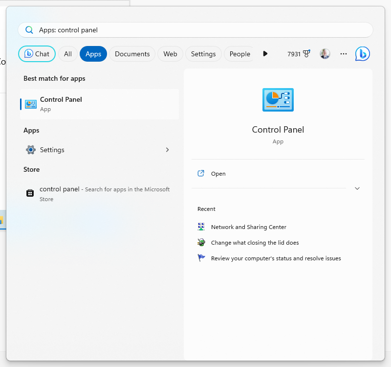

### Step 2 - Click on "System and Security"

Click on "System and Security"

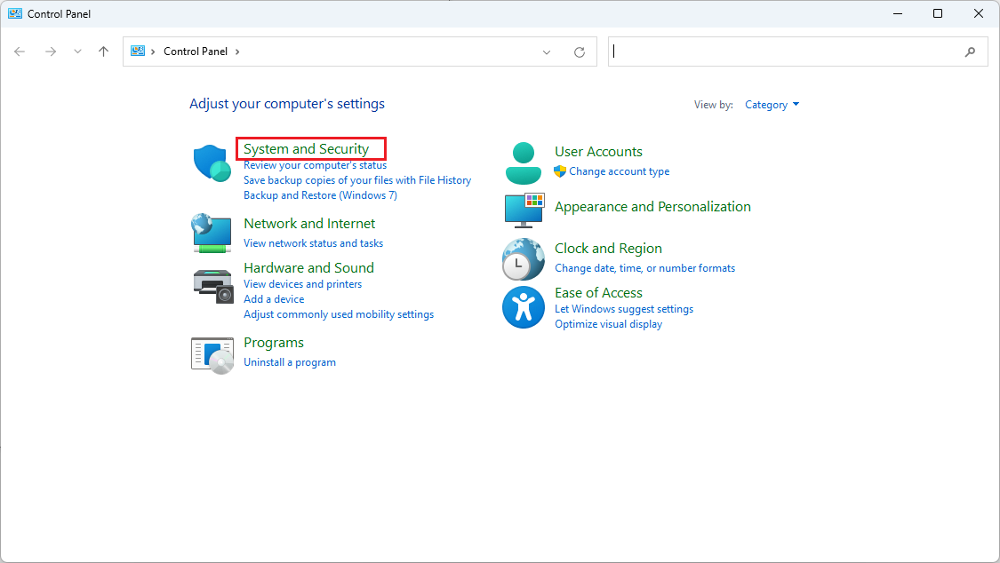

### Step 3 - Click on `System`

Click on `System`

### Step 4 - Find a Setting

Under “Home”, begin to type “Environment Variables” in the search box “find a setting”.

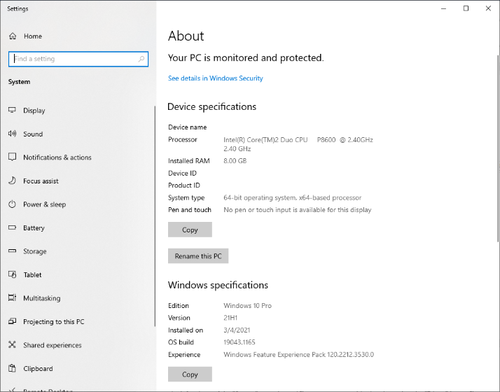

Choices beginning with “Env” will begin to appear. Select “Edit the system environment variables”.

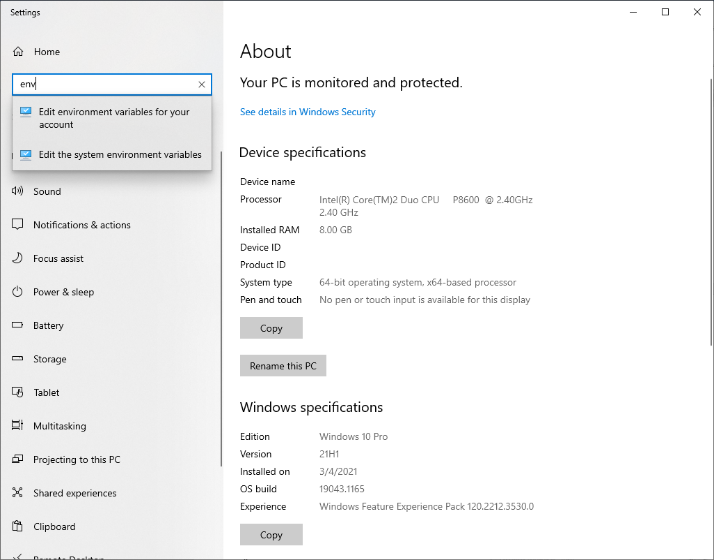

### Step 5 - Select the "Environment Variables…" button.

Select the "Environment Variables…" button.

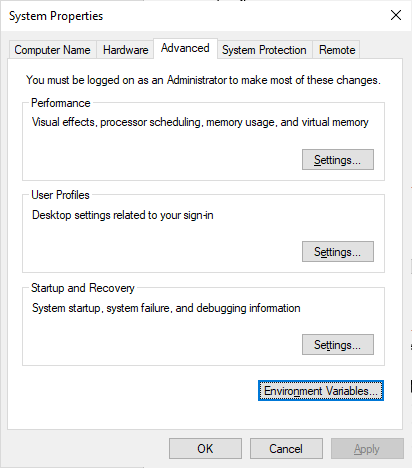

### Step 6 - Edit PATH environment variable

“Path” appears in the “User variables” as well as the “System variables”. Highlight the "Path" line in the “Systems variables” list (the bottom list), then select the "Edit…" button.

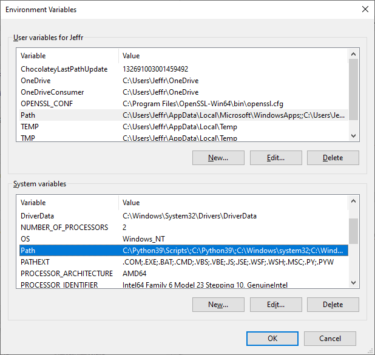

### Step 7 - Press `New`

The "Edit environment variable" dialog appears. Press the "New" button.

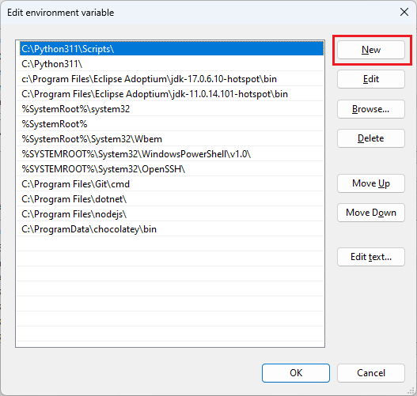

### Step 8 - Press `Browse...`

A new line is added at the bottom of the list. Press the "Browse…" button.

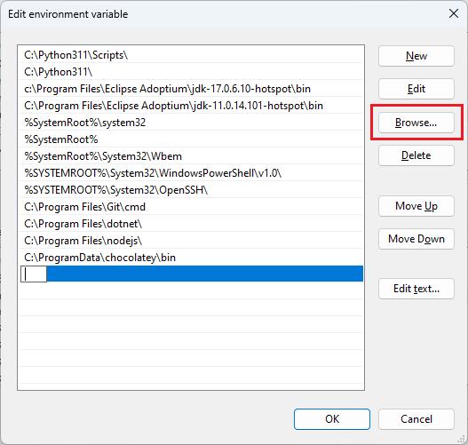

### Step 9 - Navigate to graphviz\bin

The "Browse for Folder" dialog appears. Navigate to the Graphviz bin directory, then press the OK button.

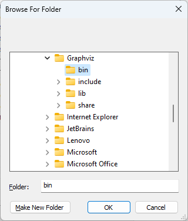

If your list is long you may want to use the "Move Up" button to move the directory up in the PATH. Press the OK button.

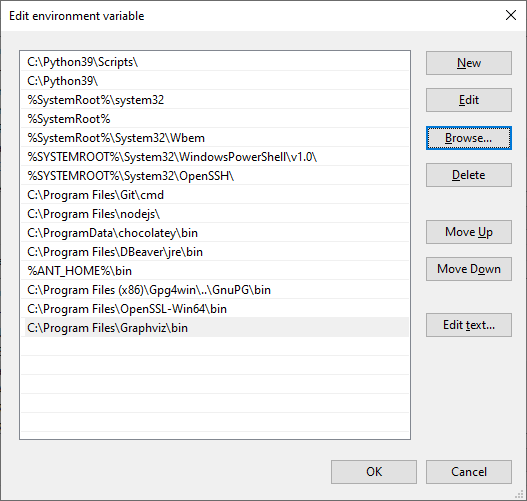

### Step 10 - Commit the change

You are returned to the "Environment Variables" dialog. Press the OK button to commit the environment variable changes and close the dialog.

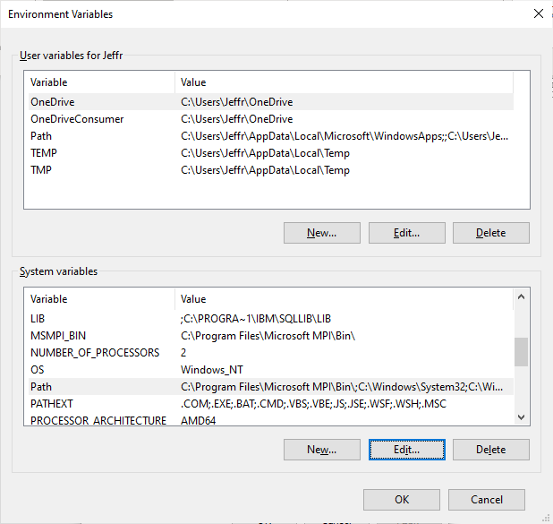

### Step 11 - Restart Windows

(Optional) Restart Microsoft Windows.

Technically this should not be necessary, but if you have already been running Excel there is the possibility that it may be holding an old copy of your environment variables. Restarting Windows will ensure that Excel will reference a current PATH environment variable.

## Perform Graphviz Command Line Configuration and Test

At this point, you have completed the installation steps to install the Graphviz software.

The Relationship Visualizer spreadsheet uses the command line programs to generate the graph visualizations. You must manually execute a command line command to configure the Graphviz plugins before you can use Graphviz properly. **DO NOT SKIP THIS STEP!**

Testing the command line programs prior to using the spreadsheet can help ensure that everything is in place correctly so that the spreadsheet can perform properly.

### Step 1 - Open a Command Prompt

Open a Command Prompt window using the "Run as Administrator" option. Click on the Windows Start Menu icon and begin to type Command Prompt. When the Command Prompt App appears choose the "Run as administrator" option.

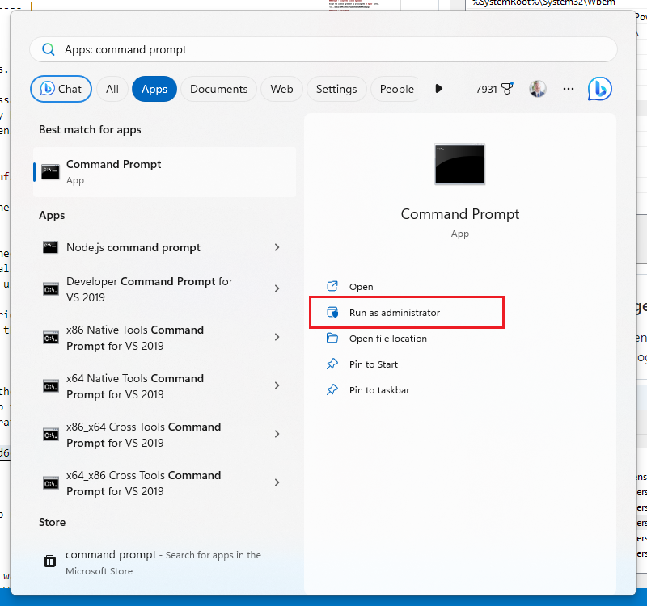

### Step 2 - Run as Administrator

You will get asked for permission to run a command prompt as Administrator.

Press the "Yes" button.

| User Access Control  Do you want to allow this app from an unknown publisher to make changes to your device?  Windows Command Processor Verified Publisher: Microsoft Windows  [Yes] [No] |
| :------------------------------------------------------------------------------------------------------------------------------------------------------------------------------------------------------- |

### Step 3 - Confirm Administrator rights

A command prompt window appears. Confirm that the word “Administrator” appears in the Window title.

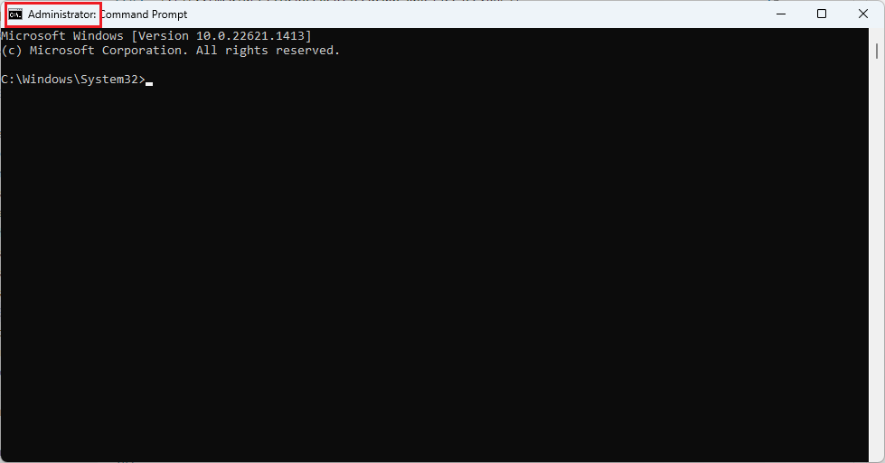

### Step 4 - Display Graphviz Version

Test that Graphviz is configured properly on the PATH by entering the command:

`dot -V`

noting that the `-V` switch (for version) should be in uppercase, not lowercase. The dot program should respond with the message:

`dot - graphviz version 2.49.0 (20210828.1703)`

in similar fashion to the screen print below:

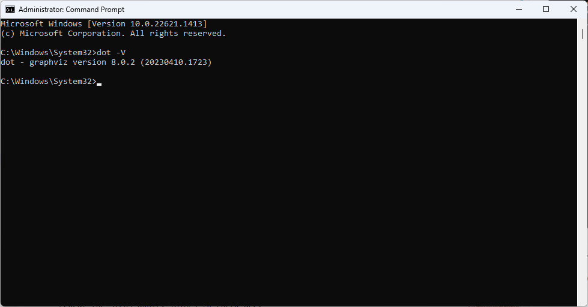

If you receive the message:

`'dot' is not recognized as an internal or external command, operable program or batch file.`

It means one of the following things:

- You have specified the path to the Graphviz executables incorrectly and you should repeat the steps above. Things to check are:
  - Did you remember to add the `bin` subdirectory to the Graphviz directory path?
  - Is the directory placed at the end of the `PATH` such that the length of the `PATH` exceeds the Windows length limit? If so, move the Graphviz bin directory closer to the beginning of the list.
- You opened the Command Prompt window prior to updating the PATH statement. This command window is still recognizing the old path. Close the Command Propt window, open a new one, and repeat the `dot -V` command.

### Step 5 - Configure Graphviz Plugins

::: warning
**This is an important step which must not be skipped.**
:::

Configure the plugins by entering the command

`dot -c`

No messages are written when the command executes; the screen will look as follows:

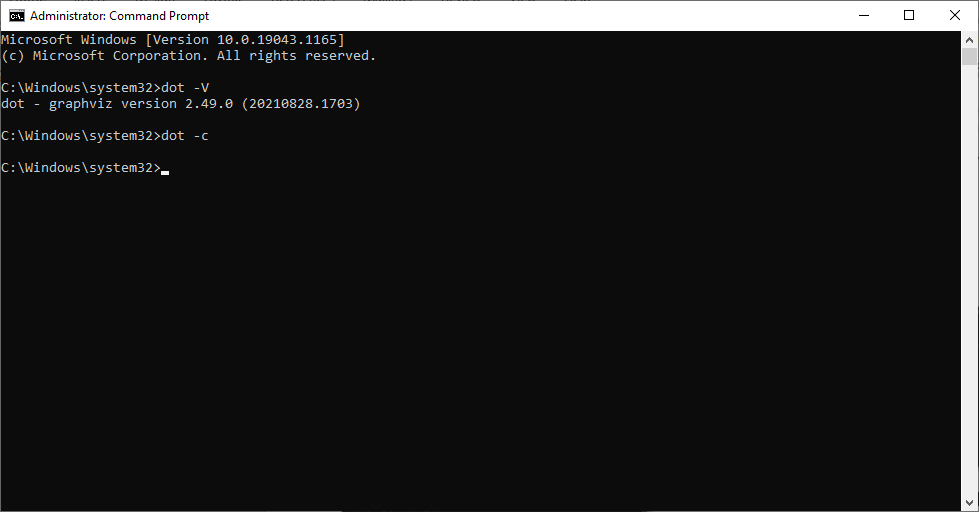

### Step 6 - View the Plugins List

To see the list of configured plugins type the command

`dot -v`

where the `-v` is lowercase. The screen will appear as follows:

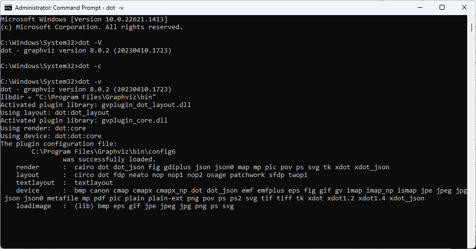

At this point Graphviz is waiting for more input. Hitting the Ctrl key + C key will break you from the dot program.

### Step 7 - View Command Line Options

To see the list of command line options you can enter the command

`dot -?`

The screen will appear as follows:

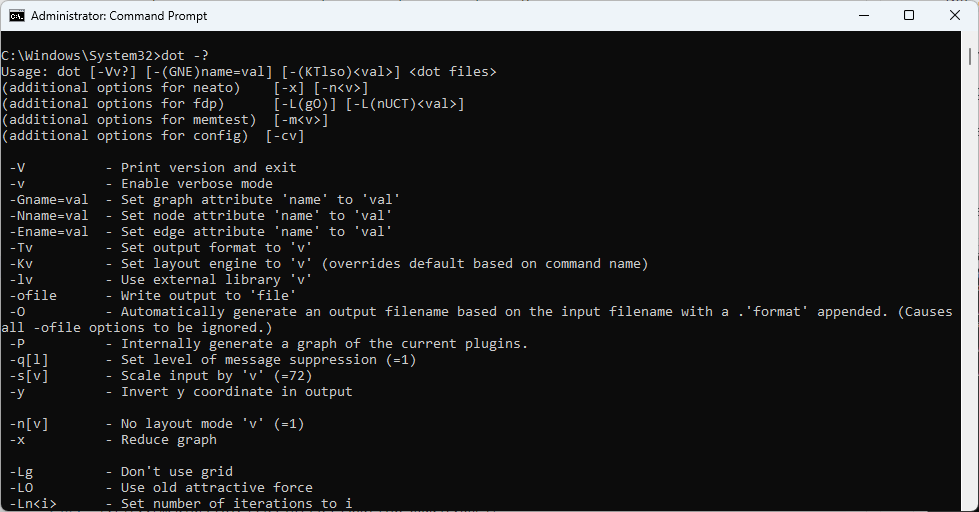

Congratulations! Graphviz is installed properly.

## Install the Relationship Visualizer Excel Spreadsheet Template

### Step 1 - Open Workbook

In the root directory of the Relationship Visualizer distribution there is a macro-enabled Excel spreadsheet named `Relationship Visualizer.xltm`. Double-click the mouse on the file to launch Excel. You will probably get a security warning that the spreadsheet contains macros. You need to enable macro support to use the Relationship Visualizer spreadsheets.

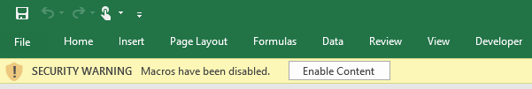

### Step 2 - Perform File Save As

Perform a "File -\> Save As" operation. When it asks you where to store the file, navigate to the directory where you currently have the template file (This PC \> Documents \> Custom Office Templates).

Next, you will see the file name is `Relationship Visualizer1`. Change it back to `Relationship Visualizer`.

Where it says **"Save as type:"** select "**Excel Macro-Enabled Template**" from the dropdown list. You will notice that the save location will change to your personal "Custom Office Templates" directory. Select OK, and Excel will place a copy of the template file into this directory.

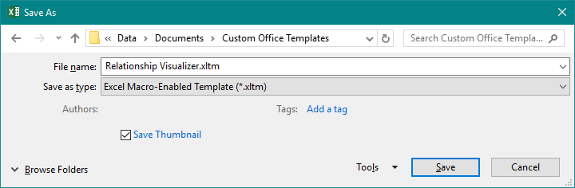

### Step 3 - Close Excel

### Step 4 - Launch Excel

Launch Excel. Excel will offer a selection of built-in spreadsheet templates you can use. Look under the title "FEATURED" for the Relationship Visualizer template.

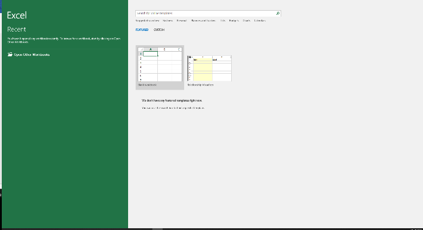

### Step 5 - Launch Excel Template

The Relationship Visualizer template will be listed, along with a thumbnail image. Click on it.

### Step 6 - Enable Macros to Run

Excel will create a file named "Relationship Visualizer1" with a warning that the spreadsheet contains macros. Click on the "Enable Content" button to permit the macros to run.

The SECURITY WARNING bar should disappear.

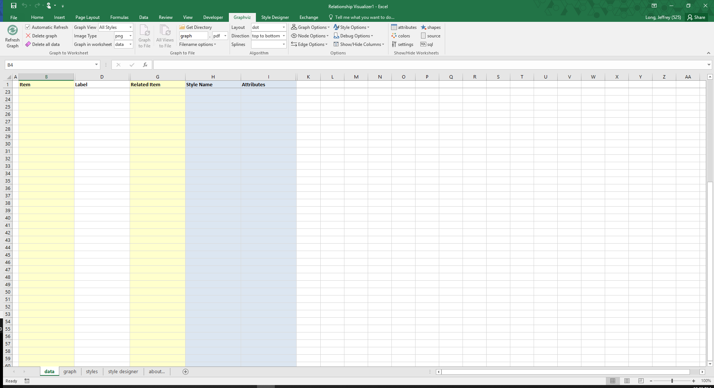

### Step 7 - Save File as Macro-Enabled Workbook

Perform a "FILE -\> Save As" action to save the file as an "**Excel Macro-Enabled Workbook**". Notice that last time we saved it as an "Excel Macro-Enabled Template" but going forward we will create new spreadsheets, populate them with data, and save them as macro-enabled workbooks. You may save the workbook in the location of your choice, and under the name of your choice. The important thing is saving the file with the .xlsm file extension.

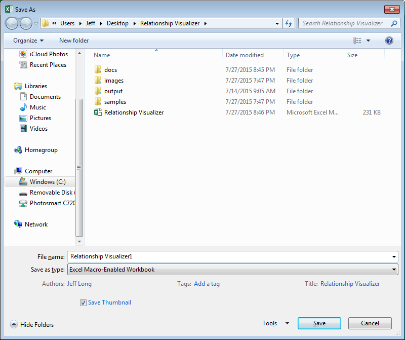
